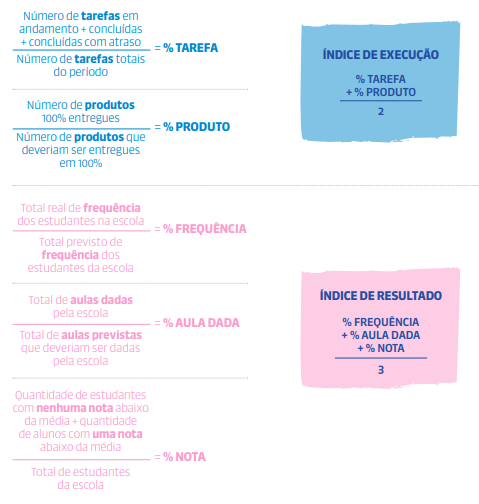

# Circuito de Gestão (CdG)

## 1\. Princípios do Circuito de Gestão Capixaba

O Circuito de Gestão Capixaba é um método adotado pela rede estadual de educação do Espírito Santo com o objetivo de sistematizar programas, projetos e ações voltadas para o alcance das metas pactuadas, assegurando uma educação pública de qualidade. Entre seus princípios, destaca-se o estudante no centro do processo pedagógico, promovendo seu protagonismo e o desenvolvimento de habilidades como criatividade, autonomia, pensamento crítico e trabalho em equipe.

A equidade é fundamental nesse processo, exigindo o reconhecimento da diversidade dos estudantes e a criação de condições reais para garantir oportunidades justas de aprendizagem. A gestão democrática, baseada na participação e na colaboração, favorece decisões mais eficazes, maior transparência e o fortalecimento do diálogo e do engajamento coletivo.

O método também requer corresponsabilização dos profissionais da educação em todas as etapas, com foco nos resultados esperados. Desde sua implantação, o Circuito contribuiu para a profissionalização da gestão escolar, alinhando objetivos estratégicos da Secretaria da Educação aos planos de ação das escolas por meio do planejamento, monitoramento e troca de experiências.

### 1.1. Etapas do Circuito de Gestão

Circuito de Gestão é estruturado nas seguintes etapas: Planejamento, Execução, SMAR (Sistemática de Monitoramento de Avaliação de Resultados), Compartilhamento de Páticas e Correção de Rotas.

## 2\. Quem faz parte do Circuito de Gestão nas Superintendências Regionais

A definição de quem faz parte do Circuito de Gestão Capixaba nas regionais é essencial para garantir que o processo seja bem compreendido e executado de forma eficaz. Identificar esses participantes permite distribuir responsabilidades com clareza, melhorar a comunicação e fortalecer a colaboração, contribuindo para a qualidade do trabalho.

Nas Superintendências Regionais de Educação (SREs), que atuam como elo entre a Secretaria de Educação e as escolas, fazem parte do Circuito de Gestão:

Equipe gestora da regional: formada pelo superintendente, assessor pedagógico e assessor administrativo. Essa equipe orienta e apoia os supervisores escolares na condução das ações do Circuito de Gestão nas escolas sob sua jurisdição.

Supervisores escolares referência: responsáveis por acompanhar, orientar e assessorar as escolas por meio das Visitas Técnicas (VTs), além de sistematizar e encaminhar informações, problemas e demandas das escolas para a regional e a Secretaria.

## 3\. Alinhamento das ações: RGI (Reunião de Gestão Integrada), RT (Reunião de Trabalho) e VT (Visita Técnca)

É o encontro entre Secretaria de Educação, Superintendência Regional e escolas. Pode acontecer tanto no âmbito da Secretaria como no âmbito da regional. Tem caráter informativo, analítico e deliberativo, sendo espaço para pactuação de metas, objetivos, prazos e responsáveis.

**Objetivo**  
Alinhar ações entre regionais e escolas.

**Responsável**  
Superintendente regional.

**Participantes**  
Equipe gestora da regional, supervisores escolares, equipe gestora das escolas e, quando necessário, outros setores da SRE.

**Periodicidade**  
Conforme cronograma do Circuito de Gestão ou por demanda.

**RT (Reunião de Trabalho)**  
É um encontro interno de equipes para tratar de temas específicos, tomar decisões, planejar e resolver problemas.

**Objetivo**  
Promover comunicação eficaz, colaboração e alinhamento das ações para execução dos Planos de Ação e Planos Táticos.

**Responsável**  
Equipe gestora da regional.

**Participantes**  
Equipes de trabalho, conforme a pauta.

**Periodicidade**  
Conforme cronograma do Circuito de Gestão ou por necessidade.

**VT (Visita Técnica)**  
As Visitas Técnicas (VTs) ocorrem nas escolas e promovem o contato direto entre os supervisores escolares e as equipes escolares. São momentos de diálogo, orientação e escuta.

**Objetivo**  
Assessorar e monitorar a execução do Plano de Ação da escola, identificando demandas específicas e antecipando problemas que possam comprometer os resultados.

**Responsável**  
Supervisores escolares referência.

**Participantes**  
Equipe escolar.

**Periodicidade**  
Conforme o cronograma do Circuito de Gestão. Escolas prioritárias recebem mais visitas.

# PLANEJAMENTO

## 1\. A importância do Planejamento

Imagem 1 \- Planejamento Ritualística

O planejamento é a base de todo o trabalho da rede. É nesse momento que a equipe gestora analisa os dados com atenção, reflete sobre os principais desafios e define metas e estratégias para alcançar os objetivos traçados. Mais do que organizar tarefas, planejar significa alinhar toda a equipe em torno de prioridades comuns, garantindo que cada ação tenha sentido dentro de um propósito maior: melhorar a aprendizagem dos estudantes.

Essa etapa também representa uma oportunidade valiosa de escuta — dos dados, da realidade de cada escola, da equipe e da comunidade escolar. Quando conduzido com profundidade e compromisso, o planejamento fortalece vínculos, gera engajamento e favorece tomadas de decisão mais assertivas ao longo do ano.

A etapa de Planejamento da SRE possui três ações principais:

Diagnóstico  
v  
Elaboração do Plano de Ação e Plano Tático  
v  
Pactuação de Metas

As RTs e RGIs estão organizadas da seguinte forma:

<table>
  <tbody>
  	<tr>
      <td rowspan="2"><strong>Diagnóstico</strong></td>
      <td>RT (Pré-Etapa)</td>
      <td>Realização do diagnóstico da regional e de suas escolas</td>
    </tr>
    <tr>
      <td>RG-1</td>
      <td>Orientações para início do ano letivo</td>
    </tr>
    <tr>
      <td rowspan="2"><strong>Plano de Ação e Plano Tático</strong></td>
      <td>RT-1</td>
      <td>Elaboração do Plano de Ação e Plano Tático</td>
    </tr>
    <tr>
      <td>RT-2</td>
      <td>Aprimoramento do Plano de Ação e Plano Tático</td>
    </tr>
    <tr>
      <td><strong>Pactuação de Metas</strong></td>
      <td>RGI-2</td>
      <td>Pactuação de Metas e corresponsabilização entre os envolvidos</td>
    </tr>
  </tbody>
</table>

## 2\. Diagnóstico e análise da realidade das escolas

A etapa de diagnóstico e análise situacional tem como objetivo caracterizar a realidade da regional, mapeando o cenário atual, identificando os problemas enfrentados e os desafios a serem superados. Esse processo gera os insumos necessários para a definição das estratégias do Plano Tático e a elaboração do Plano de Ação.

O diagnóstico e a análise de indicadores educacionais são etapas fundamentais para a avaliação do desempenho das escolas vinculadas à regional. A partir dessas análises, é possível identificar pontos fortes e aspectos que precisam de aprimoramento, subsidiando decisões baseadas em evidências e orientando o desenvolvimento de estratégias de melhoria.

Com base nos desafios identificados para elevar os índices educacionais que compõem o Índice de Desenvolvimento da Educação Básica do Espírito Santo (IDEBES) das escolas, a Superintendência Regional de Educação (SRE) terá acesso aos Painéis de Risco — disponíveis no sistema de referência do Circuito de Gestão (CdG) — de cada uma de suas escolas. Esse recurso contribui para a priorização de problemas e desafios que estejam sob a governabilidade da regional ou que exijam apoio da Secretaria.

A definição de prioridades, por meio da hierarquização dos problemas, possibilita o direcionamento do foco da atuação da SRE, aumentando a efetividade das ações planejadas no Plano Tático e no Plano de Ação.

Além da análise situacional baseada nos indicadores, a regional deve aprofundar a reflexão sobre a promoção da equidade, com o propósito de assegurar a aprendizagem e a permanência dos estudantes.

**Responsáveis:** Equipe gestora da SRE (superintendente, assessor pedagógico, assessor administrativo e assessor do regime de colaboração).  
**Participantes:** Supervisores escolares.

<table>
  <tbody>
    <tr>
      <td>
		É importante considerar indicadores como: 
		<ul>
			<li>Balanço da Execução do ano anterior </li>
			<li>Taxa de aprovação / reprovação </li>
			<li>Taxa de abandono / evasão </li>
			<li>Resultados das Avaliações Externas </li>
			<li>Resultado da Avaliação Diagnóstica </li>
			<li>Resultados de proficiência </li>
			<li>Alcance das metas pactuadas</li>
		</ul>
	  </td>
    </tr>
  </tbody>
</table>

## 3\. RT Pré-etapa: Diagnóstico da regional e de suas escolas

**Objetivo**  
Preparar a primeira etapa do Circuito de Gestão no ano letivo que se iniciará.

**Período**  
Janeiro, antes da realização da primeira Reunião de Gestão Integrada (RGI) com os diretores escolares.

### 3.1. Roteiro para a RT Pré-Etapa

**A) Preparação do Supervisor Escolar para a RT Pré-Etapa:**  
I. Realizar o diagnóstico do conjunto de escolas sob sua responsabilidade, considerando os dados dos 1º, 2º e 3º trimestres, o compilado dos registros do Balanço da Execução do ano anterior, os resultados das avaliações externas, a execução do Plano de Ação e das prioridades do Plano Tático do ano anterior, além de outros dados que considerar pertinentes.  
II. Levantar os principais problemas enfrentados pelas escolas, com base nesse diagnóstico.  
III. Sistematizar todas as informações coletadas, que serão utilizadas durante a RT Pré-etapa.

**B) Preparação da Equipe Gestora da SRE para a RT Pré-Etapa:**  
I. Realizar o diagnóstico da regional e a análise situacional com base nos dados do ano anterior, incluindo os três trimestres, os resultados das avaliações externas, a execução do Plano de Ação, os resultados do Plano Tático e o alcance das metas estabelecidas.  
II. Definir quais escolas serão acompanhadas pelos supervisores escolares referência, conforme determinado em Portaria. Recomenda-se que um mesmo supervisor não acompanhe uma escola por mais de dois anos consecutivos.

**Justificativa**  
Ao atuar em diferentes contextos e comunidades, os supervisores escolares têm a oportunidade de trocar experiências e identificar melhores práticas. Essa diversidade de perspectivas enriquece suas competências profissionais e estimula a inovação nas abordagens de liderança escolar.

**C) Realização da RT (Pré-Etapa)**  
**I. Apresentação do Diagnóstico e da Análise Situacional da Regional**  
Durante a reunião, a equipe gestora da SRE deverá apresentar aos supervisores escolares o diagnóstico construído com base nos dados educacionais do ano anterior, incluindo a análise situacional da regional.

**II. Levantamento e Priorização dos Problemas da Regional**  
Com base na análise feita pelos supervisores e nos dados da regional, a equipe deve identificar os principais problemas enfrentados, destacando os que são comuns às escolas. Em seguida, será feita a priorização dos problemas que exigem maior atenção no planejamento.

**III. Definição de Desafios sob Governabilidade**  
A equipe deverá diferenciar os desafios que estão sob a governabilidade da própria regional e aqueles que demandam apoio da Secretaria. Essas informações também servirão de base para o preenchimento do Painel de Risco no sistema de referência do Circuito de Gestão (CdG).

**IV. Alinhamento sobre o Exercício Prévio nas Escolas**  
Deverá ser alinhado como os supervisores orientarão as escolas na realização do Exercício Prévio, utilizando como base os dados dos três trimestres dos anos anteriores, os registros do Balanço da Execução, os resultados das avaliações externas, a análise da execução do Plano de Ação e das prioridades do Plano Tático, além das orientações das diretrizes pedagógicas da Secretaria – com ênfase no diagnóstico do perfil dos estudantes e nos programas e projetos em andamento.

**V. Definição do Material de Apoio às Escolas**  
Será definido o conjunto de materiais que será enviado às escolas para subsidiar a realização do Exercício Prévio com suas equipes.

**VI. Construção da Pauta da 1ª VT do Planejamento**  
Com base no diagnóstico elaborado na Jornada Pedagógica Preliminar (JPP) e no Exercício Prévio das escolas, será estruturada a pauta da primeira Visita Técnica (VT) do Planejamento.

**VII. Preparação da Reunião de Gestão Integrada (RGI)**  
A equipe gestora da SRE deverá organizar a primeira RGI com os diretores escolares, com o objetivo de orientar sobre o início do ano letivo e garantir o alinhamento das ações planejadas.

**VIII. Registro da RT Pré-etapa**  
Por fim, todos os encaminhamentos e decisões da RT Pré-etapa deverão ser registrados em ata e inseridos no sistema de referência do CdG, garantindo a formalização e o acompanhamento das ações.

## 4\. RGI-1: Orientações para o início do ano letivo

**Objetivo**  
Alinhar com os diretores escolares o planejamento e as diretrizes pedagógicas que nortearão o ano letivo vigente.

**Período**  
Janeiro, após a realização da RT Pré-etapa.

### 4.1. Preparação do Supervisor Escolar para a RGI-1

**A) Preparação do Supervisor Escolar para A RGI-1**

**I. Apropriação do Diagnóstico e das Diretrizes**  
O supervisor escolar deve se apropriar do diagnóstico da regional e das escolas sob sua responsabilidade, bem como das diretrizes pedagógicas da Secretaria e das orientações definidas na RT Pré-etapa.

**B) Preparação da Equipe Gestora da SRE para a RGI-1**

**I. Orientações sobre o Exercício Prévio**  
A equipe gestora deverá preparar as orientações para a realização do Exercício Prévio nas escolas, conforme definido coletivamente na RT Pré-etapa.

**II. Apresentação do Planejamento da Rede**  
Também é responsabilidade da equipe preparar a apresentação do planejamento da rede, incluindo o Plano Tático da Secretaria, diretrizes pedagógicas, calendário escolar, cronograma do Circuito de Gestão (CdG), resultados e metas educacionais.

**C) Realização da RGI-1**

**I. Orientações sobre o Diagnóstico Escolar**  
Durante a reunião, os diretores escolares devem ser orientados sobre como conduzir o diagnóstico com suas equipes, com base no Exercício Prévio, durante a Jornada Pedagógica Preliminar (JPP).

**II. Apresentação dos Desafios da Regional**  
A equipe gestora deve apresentar os principais desafios identificados na RT Pré-etapa, destacando aqueles que impactam diretamente o planejamento das escolas.

**III. Prioridades do Plano Tático**  
Devem ser apresentadas e explicadas as prioridades definidas pela Secretaria no Plano Tático, para garantir que todos os diretores estejam alinhados quanto às metas e ações estratégicas do ano.

**IV. Calendário Escolar e Cronograma do CdG**  
A equipe deve apresentar o calendário escolar atualizado e o cronograma completo do Circuito de Gestão, reforçando prazos e etapas do planejamento.

**V. Diretrizes Regionais para as Escolas**  
Também devem ser compartilhadas as orientações específicas da regional para suas escolas, com ênfase nas diretrizes relativas à etapa de Planejamento.

**VI. Apresentação dos Supervisores Escolares Referência**  
Cada diretor deve ser informado sobre qual supervisor escolar será responsável pelo acompanhamento e assessoria de sua escola ao longo do ano.

**VII. Registro da RGI no Sistema**  
Todos os encaminhamentos da RGI-1 devem ser formalizados com o registro da ata no sistema de referência do Circuito de Gestão (CdG).

## 5\. RT-1: Plano de Ação e Plano Tático da Regional

**Objetivo**  
Definir coletivamente as ações que comporão o Plano de Ação e o Plano Tático da regional, com base no diagnóstico e na análise situacional construídos na RT Pré-etapa. Também serão considerados como subsídios: as diretrizes pedagógicas do ano, as metas da regional e das escolas, e as demandas sob a governabilidade da regional, identificadas nos Painéis de Risco das escolas.

**Período**  
Após a realização da VT-1 nas escolas da regional.

**Responsáveis**  
Equipe Gestora da Superintendência Regional de Educação (SRE): superintendente, assessor pedagógico, assessor administrativo e assessor do regime de colaboração.

**Participantes**  
Supervisores escolares.

### 5.1. Roteiro para a RT-1: Elaboração do Plano De Ação e do Plano Tático

**Objetivos**

-   Iniciar a elaboração do Plano de Ação da regional.
-   Iniciar a elaboração do Plano Tático.
-   Levantar as demandas oriundas do Painel de Risco das escolas.

Fluxo para elaboração do plano de ação

Metas  
v  
Objetivos Estratégicos Finalísticos  
v  
Componentes do IDEBES  
v  
Problemas  
v  
Desafios  
v  
Planos da Regional

### 5.2. RT-1: Elaboração do Plano de Ação e Plano Tático da Regional

**Objetivo**  
Construir, de forma colaborativa, a primeira versão do Plano de Ação e do Plano Tático da regional. O trabalho será guiado pelo diagnóstico e análise situacional produzidos na RT Pré-etapa, considerando também as diretrizes pedagógicas do ano, as metas da regional e os Painéis de Risco das escolas com demandas sob a governabilidade da SRE.

**Período**  
Após a VT-1 das escolas da regional.

**Responsáveis:**  
Equipe Gestora da SRE: superintendente, assessor pedagógico, assessor administrativo e assessor do regime de colaboração.  
 **Participantes:** Supervisores escolares.

**A) Preparação do Supervisor Escolar para a RT-1**

I. Compilar as demandas do Painel de Risco referentes ao seu conjunto de escolas. Esse levantamento será a base para a construção coletiva dos planos da regional.

**B) Preparação da Equipe Gestora para a RT-1**

I. Revisar os problemas priorizados e os desafios apontados na RT Pré-etapa.  
II. Definir como será realizado o monitoramento, pelos supervisores, das prioridades do Plano Tático junto às escolas.  
III. Estabelecer os instrumentos de gestão que serão utilizados para acompanhar indicadores de processo e evidências relacionados ao Plano Tático.  
IV. Planejar o modelo de acompanhamento interno das prioridades dentro da própria regional.

**C) REALIZAÇÃO DA RT-1**

I. Construir coletivamente as ações necessárias para enfrentar os desafios identificados pela regional.  
II. Selecionar os componentes do Índice de Desenvolvimento da Educação Básica do Espírito Santo (IDEBES) que serão priorizados para superar os desafios.  
III. Definir estratégias para atender cada prioridade da Secretaria, incluindo formas de monitoramento, avaliação e possíveis intervenções.  
IV. Registrar a ata da RT-1 no sistema de referência do Circuito de Gestão (CdG).  
V. Finalizar a primeira versão do Plano de Ação e do Plano Tático.  
VI. Postar a primeira versão do Plano de Ação no sistema de referência do CdG e o Plano Tático no Microsoft Planner.

## 6\. Elaboração do Plano de Ação da Regional

O Plano de Ação é o principal instrumento de planejamento operacional da regional. Ele organiza e orienta a execução das ações necessárias para superar desafios específicos, visando alcançar os resultados esperados nos componentes do Índice de Desenvolvimento da Educação Básica do Espírito Santo (IDEBES).

Cada ação planejada é registrada em um **mapa de ação**, estruturado de forma a garantir o acompanhamento e o monitoramento das tarefas diárias. Para cada desafio identificado, deve ser criado um mapa correspondente, com ações claramente definidas e alinhadas às metas da Secretaria.

Essas ações devem incidir diretamente sobre os componentes do IDEBES e serão monitoradas por meio dos **indicadores estruturantes**. Estudantes presentes em sala e professores ministrando as aulas previstas são condições essenciais para o desempenho acadêmico e, portanto, foco do monitoramento.

### 6.1. Abrangência dos Mapas de Ação

Na construção dos mapas, é fundamental considerar as duas etapas de ensino: **Ensino Fundamental** e **Ensino Médio**. As ações podem ser planejadas de duas formas:

-   **Conjuntas**, quando abordam problemas e desafios comuns às duas etapas.
-   **Específicas**, quando respondem às particularidades de apenas uma etapa, respeitando suas necessidades e contextos.

Essa distinção garante que o Plano de Ação da regional seja abrangente e alinhado às realidades de todas as escolas.

### 6.2. Base para Elaboração dos Mapas

A construção dos mapas de ação deve considerar as **demandas do Painel de Risco**, disponível no sistema de referência do CdG. Essas demandas foram identificadas na elaboração dos Planos de Ação das escolas e devem ser tratadas da seguinte forma:

-   **Demandas sob governabilidade da regional**: devem ser incorporadas diretamente ao Plano de Ação da regional.
-   **Demandas sob governabilidade da Secretaria**: devem ser registradas no Painel de Risco do Plano de Ação da regional.

O Plano de Ação, portanto, é o guia da atuação regional no enfrentamento dos desafios educacionais e no fortalecimento dos resultados da rede.

### 6.3. Estrutura do Plano de Ação da Regional

O Plano de Ação é composto por mapas estruturados que organizam os elementos essenciais para o enfrentamento dos desafios educacionais. Os campos que devem ser preenchidos para cada ação planejada são:

**Categoria**  
Indica a natureza da ação, que pode ser:

-   Gestão e governança
-   Pedagógico
-   Vulnerabilidade e aspectos socioemocionais
-   Gestão de pessoas
-   Administrativo-financeiro

**Objetivo Estratégico**  
Cada ação deve estar alinhada aos objetivos estratégicos finalísticos da Secretaria da Educação (SEDU), com foco na melhoria dos componentes do IDEBES (Índice de Desenvolvimento da Educação Básica do Espírito Santo). Esses objetivos funcionam como guia para a construção de um plano alinhado às metas institucionais.

**Componentes do IDEBES**  
O Plano de Ação deve indicar claramente em quais componentes do IDEBES a ação pretende atuar:

-   Proficiência em Matemática
-   Proficiência em Língua Portuguesa
-   Taxa de Aprovação

Esses componentes devem ser escolhidos com base no diagnóstico da regional e associados aos objetivos estratégicos definidos.

**Problemas**  
São os impasses identificados no diagnóstico da regional que impactam negativamente o desempenho educacional (fluxo e proficiência). Cada problema registrado será vinculado a um ou mais desafios a serem superados.

**Desafio**  
Define o que a regional deseja alcançar diante dos problemas identificados. O desafio representa o objetivo a ser atingido ao final da execução do Plano de Ação e pode responder a um problema específico ou a um conjunto de problemas.

**Nome da Ação**  
É a forma de identificação da ação. Pode ser curto ou descritivo, desde que seja facilmente reconhecido pela equipe como algo relacionado à prática planejada.

**Descrição da Ação**  
Apresente um resumo claro e objetivo que permita a qualquer pessoa compreender o que será feito. Aqui, você pode incluir detalhes relevantes sobre a ideia central da ação e sua execução.

**Público-Alvo**  
Informe quem será diretamente impactado pela ação. É importante especificar o grupo-alvo com clareza, considerando especialmente os públicos em situação de maior vulnerabilidade.

**Responsável**  
 Informe o nome da pessoa que assumirá a responsabilidade geral pela ação. Essa pessoa será o ponto focal para garantir a execução do plano, coordenar os envolvidos e acompanhar o andamento das tarefas.

**Produto**  
Descreva o que será entregue como resultado direto da ação. O produto precisa ser **quantificável** e alinhado ao desafio que se pretende superar. Um bom produto é específico, verificável e representa uma entrega concreta, que pode ser acompanhada e avaliada.

Exemplo: _Realização de 4 formações presenciais para professores de Matemática do Ensino Médio até setembro._

**Resultado Esperado**  
Indique qual impacto a ação deve gerar. O resultado precisa ser **mensurável** e mostrar claramente como a ação contribui para resolver o desafio identificado. Deve estar conectado ao componente do IDEBES e à meta da regional.

Exemplo: _Aumentar em 15% a proficiência média em Matemática dos estudantes da 3º série do EM até o final do ano letivo._

**Cronograma de Tarefas**  
Organize as etapas da ação em uma tabela sequencial. Cada linha deve conter:

-   **Nome da tarefa**
-   **Responsável direto pela execução**
-   **Data de início**
-   **Data de término**

Esse cronograma é essencial para o monitoramento da execução. O avanço ou atraso nas tarefas indicará o status geral da ação, permitindo ajustes tempestivos.

### 6.4. Passos para a elaboração do Plano de Ação da regional

Para apoiar a construção das ações da regional, é importante considerar alguns pontos-chave organizados em diferentes categorias. A proposta é que essas categorias se integrem de forma estratégica, orientando a equipe para o cumprimento dos objetivos definidos pela Secretaria e para o alcance das metas educacionais.

Com base nos **desafios já mapeados** e no **diagnóstico aprofundado na RT Pré-etapa**, o próximo passo é realizar um diálogo com a equipe regional, refletindo sobre:

-   O que é mais urgente enfrentar?
-   Quais ações terão maior impacto nos componentes do IDEBES?
-   O que está dentro da governabilidade da regional?

Essa reflexão coletiva é essencial para garantir que o Plano de Ação seja **alinhado à realidade local**, **focado em resultados concretos** e **direcionado para os principais desafios** enfrentados pelas escolas.

A partir disso, será possível construir **mapas de ação estruturados, coerentes e viáveis**, com objetivos claros e estratégias bem definidas, voltadas para a melhoria do desempenho dos estudantes e para o fortalecimento das práticas pedagógicas e de gestão.

**Fluxo para elaboração do plano de ação**

METAS  
v  
COMPONENTES DO IDEBES  
v  
OBJETIVOS ESTRATÉGICOS FINALÍSTICOS  
v  
PROBLEMAS  
v  
DESAFIOS  
v  
MAPA DE AÇÃO  
v  
PLANO DE AÇÃO DA REGIONAL

Imagem 2 \- Planilha Gestão e Governança

Imagem 3 \- Planilha Pedagógico

Imagem 4 \- Planilha Vulnerabilidade e Aspectos Socioeconômicos

Imagem 5 \- Planilha Gestão de Pessoas

### 6.5. Elaboração do Plano Tático

O Plano Tático é um instrumento de gestão que detalha as ações necessárias para colocar em prática as estratégias definidas no planejamento estratégico. Com foco no médio prazo, ele orienta as decisões da regional e busca alinhar esforços com as prioridades da Secretaria da Educação (SEDU).

Seu objetivo é fortalecer as ações regionais, garantindo que escolas, regionais e Secretaria atuem de forma coordenada, mesmo respeitando as especificidades de cada instância. Assim, todos caminham em direção às mesmas metas.

Para construir um Plano Tático efetivo, é essencial planejar com base nas prioridades do ano letivo. Algumas diretrizes precisam ser seguidas para garantir a efetividade do plano:

**Critérios para a elaboração do Plano Tático**

• Compreender a prioridade a ser trabalhada, com base nos resultados esperados pela SEDU.  
• Definir ações claras e objetivas para alcançar os resultados esperados em cada prioridade.  
• Estabelecer estratégias de monitoramento, que permitam acompanhar o andamento das ações e a evolução dos indicadores.  
• Criar indicadores de processo mensuráveis, que ajudem a acompanhar a execução das ações e a avaliar sua efetividade.  
• Elaborar instrumentos de coleta de evidências, como formulários, planilhas ou registros que comprovem o andamento e os resultados das ações.  
• Alinhar as evidências esperadas para cada prioridade, garantindo clareza sobre o que será considerado na avaliação.  
• Atribuir prazos e responsáveis por cada ação, bem como pela coleta de indicadores, evidências e realização do monitoramento.  
• Definir a periodicidade e a forma do monitoramento, prevendo momentos para ajustes e intervenções, caso necessário.  
• Planejar a orientação às escolas sobre como coletar e registrar indicadores e evidências de forma padronizada.

METAS  
v  
COMPONENTES DO IDEBES  
v  
OBJETIVOS ESTRATÉGICOS FINALÍSTICOS  
v  
PROBLEMAS  
v  
DESAFIOS  
v  
PRIORIDADES  
v  
PLANO TÁTICO DA REGIONAL

<table>
	<tbody>
		<tr>
			<td>A definição das prioridades tem um papel fundamental: fortalecer as ações da regional e ajudar a alcançar os resultados esperados. Além disso, garante que Secretaria, regionais e escolas atuem de forma alinhada. Assim, todos trabalham com foco nas mesmas prioridades — cada um com suas responsabilidades, mas seguindo na mesma direção.</td>
		</tr>
	</tbody>
</table>

### 6.6. RT-2: Aprimoramento do Plano de Ação e do Plano Tático

**Objetivos da RT-2**

A RT-2 tem como propósito fortalecer a atuação da regional por meio do aprimoramento dos seus principais instrumentos de planejamento. São os objetivos:

-   Consolidar as análises dos Planos de Ação das escolas;
-   Realizar um momento de alinhamento entre a equipe regional e os supervisores escolares, com foco nas devolutivas feitas aos Planos de Ação das escolas;
-   Aprimorar o Plano de Ação da regional, considerando as contribuições vindas das escolas;
-   Aprimorar o Plano Tático da regional, a partir das prioridades estabelecidas pela Secretaria;
-   Validar os dois planos (Plano de Ação e Plano Tático) com a equipe regional, garantindo que todos compreendam e assumam os compromissos firmados.

## 7\. Roteiro da RT-2

**A) Etapas de Preparação do Supervisor Escolar**

1. **Análise individual dos Planos de Ação das escolas sob sua supervisão**, utilizando o teste de consistência como referência.
2. **Consolidação das análises**, com foco em identificar padrões, pontos fortes e aspectos que precisam de ajustes nos Planos de Ação das escolas.

**B) Etapas de Preparação da Equipe Gestora da Regional**

1. **Acompanhar e garantir que todos os supervisores escolares tenham aplicado os testes de consistência** nas escolas que acompanham.

2. **Organizar a dinâmica da reunião da RT-2**, assegurando tempo para que os supervisores compartilhem suas análises e para que a regional apresente as indicações gerais para aprimoramento dos Planos de Ação escolares.

**C) Realização da RT-2**

Durante a realização da RT-2, a equipe regional deverá seguir os seguintes passos:

1. **Apresentar o consolidado das devolutivas dos Planos de Ação das escolas**, promovendo o compartilhamento das principais análises feitas pelos supervisores escolares.
2. **Orientar sobre as indicações da regional para as devolutivas das escolas**, esclarecendo como cada escola poderá aprimorar seus Planos de Ação com base nas prioridades regionais e nos objetivos estratégicos.
3. **Coletar os insumos apresentados pelas escolas em seus Planos de Ação** e incorporar esses elementos ao Plano de Ação e ao Plano Tático da regional, quando forem pertinentes.
4. **Ajustar e validar a versão final dos dois documentos** (Plano de Ação e Plano Tático), garantindo que estejam alinhados com as diretrizes da Secretaria e com a realidade da regional.
5. **Iniciar a preparação da RGI de Pactuação de Metas**, com base nas metas regionais e nas prioridades identificadas nos planos.
6. **Registrar a ata da RT-2 no sistema de referência do CdG**, assegurando o devido registro institucional da reunião.
7. **Finalizar o Plano de Ação e o Plano Tático**, com base em todas as contribuições e validações realizadas durante a RT-2.
8. **Postar a versão final do Plano de Ação no sistema de referência do CdG**, concluindo oficialmente o processo de consolidação do documento.
9. **Publicar o Plano Tático no Microsoft Planner**, para garantir o acompanhamento prático e atualizado das ações ao longo do ano.

### 7.1. Análise do Teste de Consistência

Na segunda Visita Técnica, o papel do supervisor escolar é realizar a devolutiva do Plano de Ação com cada escola, analisando em conjunto os aprimoramentos necessários. Para isso, o supervisor precisa realizar previamente uma análise individual do plano, testando sua consistência para orientar a escola com precisão.

Contudo, para garantir que os Planos de Ação estejam verdadeiramente alinhados com as prioridades da Secretaria e com o foco estratégico da regional, é essencial que essa análise vá além do olhar técnico do supervisor.

A participação do superintendente e do supervisor pedagógico é fundamental para agregar recomendações mais amplas e estratégicas. Essa contribuição ajuda a fortalecer a coerência entre as diferentes instâncias — Secretaria, regional e escolas — assegurando que todas atuem com foco em objetivos comuns.

Durante a reunião, a equipe deve transformar as análises individuais em uma reflexão coletiva sobre o conjunto dos Planos de Ação sob a responsabilidade de cada supervisor. Para orientar essa discussão, algumas perguntas-chave devem ser consideradas:

-   Qual é o panorama geral dos Planos de Ação das escolas acompanhadas por cada supervisor?
-   Quais ações são mais recorrentes nas escolas da regional?
-   As ações propostas são consistentes e suficientes para impactar os objetivos estratégicos e alcançar as metas definidas?
-   Quais objetivos estratégicos ainda apresentam fragilidades nas ações planejadas?
-   Os desafios identificados pelas escolas estão alinhados com os desafios priorizados pela regional?
-   Esses desafios também dialogam com as diretrizes e prioridades da Secretaria?
-   Os problemas apontados como fora da governabilidade das escolas realmente estão fora do seu alcance de atuação?
-   Há problemas que foram classificados como fora da governabilidade da escola, mas que podem (e devem) ser enfrentados pela regional?

A análise coletiva, orientada por essas questões, permite consolidar um panorama mais completo e preciso. A partir disso, torna-se possível elaborar devolutivas mais qualificadas para as escolas, bem como identificar pontos de melhoria para fortalecer os Planos de Ação em toda a regional.

### 7.2. Indicações da regional para compor a devolutiva às escolas

Com base no panorama consolidado dos Planos de Ação das escolas, a equipe da regional deve elaborar orientações estratégicas para subsidiar a devolutiva do supervisor escolar. O objetivo é garantir que cada escola receba indicações claras sobre como fortalecer ou ajustar seu plano, alinhando-o às prioridades da regional e da rede.

Essas orientações devem considerar:

-   Ações prioritárias que não foram contempladas pelas escolas;
-   Objetivos estratégicos que precisam de maior atenção ou fortalecimento;
-   Ações que, mesmo diante de contextos diferentes, devem ser implementadas por todas as escolas da regional.

As indicações elaboradas pela regional serão integradas ao teste de consistência realizado por cada supervisor e discutidas com as equipes escolares durante a segunda Visita Técnica.

### 7.3. Aprimoramento e validação do Plano de Ação e do Plano Tático

As análises feitas pelos supervisores escolares oferecem uma visão ampla dos principais desafios enfrentados pelas escolas, das soluções que vêm sendo construídas e dos pontos que precisam de maior suporte. Essas informações são essenciais para qualificar os Planos de Ação e o Plano Tático da regional.

O Painel de Risco, o panorama consolidado das análises e os dados trazidos pelos supervisores são insumos estratégicos. Com base neles, a regional deve avaliar se os documentos que está construindo respondem de forma efetiva às necessidades identificadas nas escolas.

Além de mapear desafios, essas análises mostram onde a regional precisa se organizar para apoiar a execução dos planos das escolas. Isso demanda uma atuação mais coordenada e propositiva, que assuma como compromisso coletivo o enfrentamento dos desafios apresentados.

Após a realização da RT-2, é essencial que a equipe da regional retome o consolidado das discussões, revise seus documentos e finalize as versões do Plano de Ação e do Plano Tático que serão encaminhadas à Secretaria.

### 7.4. Revisão das ações e qualificação final dos planos da regional

Na etapa final, o foco deve estar em revisar e qualificar o Plano de Ação e o Plano Tático à luz das devolutivas recebidas da Secretaria e das análises internas da regional. Com os documentos finalizados e sistematizados, e após verificar a viabilidade e a efetividade das ações propostas, a regional deve atualizar os planos nos sistemas oficiais.

Esse processo fecha o ciclo de construção dos planos com base em diálogo, análise estratégica e corresponsabilidade entre Secretaria, regionais e escolas.

### 7.5. Pactuação de Metas

A pactuação de metas educacionais é um momento estratégico da rede estadual. Ela se conecta diretamente ao planejamento do ano letivo, formando um processo integrado e essencial para o fortalecimento da gestão educacional.

Nesse processo, Secretaria de Educação, Superintendências Regionais de Educação (SREs) e escolas definem, de forma articulada e consensual, os objetivos que devem ser alcançados ao longo do ano. O alinhamento entre essas instâncias garante clareza de propósitos e compromissos compartilhados em torno da aprendizagem com equidade.

A pactuação de metas tem como finalidade promover:

-   Alinhamento estratégico entre Secretaria, regionais e escolas;
-   Corresponsabilização de todos os atores da rede;
-   Compromisso coletivo com os resultados de aprendizagem dos estudantes.

As regionais desempenham papel central nessa etapa: são responsáveis por mobilizar as escolas sob sua jurisdição e apoiar a articulação com as respectivas comunidades escolares.

**Período:**  
 Após a realização da RGI (Reunião de Gestão Integrada) de Pactuação de Metas entre a Secretaria e a regional.

**Responsáveis:**

-   **Na SRE:** Equipe gestora (superintendente, assessor pedagógico, assessor administrativo e assessor do regime de colaboração)
-   **Na escola:** Diretor escolar

**Participantes:**

-   **Na SRE:** Supervisores escolares e diretores
-   **Na escola:** Toda a comunidade escolar

## 8\. **RGI-2: Pactuação de Metas**

**Objetivos**  
• Apresentar metas educacionais para diretores escolares.  
• Apresentar relação de escolas prioritárias.  
• Pactuar as metas educacionais com diretores escolares para o ano letivo vigente.  
• Orientar os diretores escolares para realizarem a Pactuação de Metas com a comunidade escolar.

### 8.1. Roteiro para a RGI-2 (Reunião de Gestão Integrada)

A RGI-2 é um momento estratégico da jornada de planejamento da rede estadual. Nela, regionais e escolas pactuam metas com base no IDEBES (Índice de Desenvolvimento da Educação Básica do Espírito Santo) e assumem compromissos conjuntos para fortalecer a aprendizagem com equidade.

**A) Preparação do Supervisor Escolar**

Antes da RGI-2, o supervisor escolar deve:

-   Estudar as metas educacionais definidas para as escolas sob sua supervisão.
-   Conhecer a lista de escolas prioritárias da regional.
-   Compreender as orientações para o assessoramento dessas escolas.

**B) Preparação da Equipe Gestora da Regional (SRE)**

A equipe gestora da SRE deve:

-   Convocar os diretores escolares para a RGI-2.
-   Planejar a cerimônia de Pactuação de Metas com os diretores, alinhando como cada escola conduzirá o mesmo processo com sua comunidade.
-   Organizar a logística da reunião (data, local, materiais, participantes).
-   Orientar os supervisores escolares sobre as etapas e objetivos da Pactuação de Metas nas escolas.

**C) Realização da RGI-2**

Durante a reunião, a regional deve:

-   Conduzir a cerimônia de Pactuação de Metas com os diretores escolares.
-   Apresentar a meta da regional e indicar as escolas prioritárias.
-   Orientar os diretores sobre como conduzir a Pactuação de Metas nas escolas com a comunidade escolar.
-   Acompanhar a execução do processo nas escolas.
-   Registrar a ata da reunião no sistema de referência do CdG (Circuito de Gestão).

### 8.2. Participação da Regional na Pactuação de Metas

A regional participa em duas frentes:

**1\. Meta da regional**

Definida com base na meta do IDEBES, é pactuada em RGI conduzida pela Secretaria de Educação, com apoio da Liderança Estratégica e da Liderança Tática do CdG Capixaba.

**2\. Metas das escolas vinculadas**

Também baseadas no IDEBES, são pactuadas em RGI conduzida pela regional, com participação da equipe gestora da SRE (superintendente, assessores pedagógico e administrativo, supervisores escolares) e diretores escolares.

**Cerimônia de Pactuação de Metas**

Durante a RGI-2, cabe à equipe da regional preparar um documento individual para cada escola, apresentando:

-   os resultados obtidos no IDEBES;
-   a meta pactuada para o ano letivo vigente.

Em seguida, os diretores escolares deverão ser convocados para assinar esse documento, oficializando o compromisso da escola com o alcance da meta estabelecida.

# EXECUÇÃO

## 1\. A importância da Execução

A etapa de Execução representa o momento em que os compromissos pactuados se transformam em ações concretas. Nesta fase, a prioridade é a implementação e o acompanhamento das ações previstas na etapa de Planejamento, com foco no alcance das metas educacionais estabelecidas.

No âmbito da Superintendência Regional de Educação (SRE), o trabalho deve estar orientado pelo Plano de Ação e pelo Plano Tático da regional, sendo conduzido de forma articulada com as escolas e com a Secretaria de Educação.

**Acompanhamento das Ações e Indicadores**

Durante essa etapa, a regional é responsável por:

-   **Monitorar a execução das ações planejadas**, tanto no nível da própria regional quanto nas escolas que lhe são vinculadas;
-   **Coletar e analisar evidências** que indiquem se as ações estão sendo executadas conforme o previsto, se estão contribuindo para o alcance das metas e se há necessidade de ajustes;
-   **Mapear avanços, riscos e dificuldades** enfrentadas ao longo da implementação;
-   **Propor ajustes no Plano de Ação e no Plano Tático**, sempre que necessário, com base em evidências concretas e na escuta ativa dos envolvidos.

O monitoramento deve estar centrado nos **indicadores estruturantes** definidos pela Secretaria de Educação, que norteiam tanto o acompanhamento das ações quanto a análise da efetividade dos processos:

-   **Aula dada:** representa a garantia de que os conteúdos previstos estão sendo trabalhados em sala de aula;
-   **Frequência dos estudantes:** permite acompanhar a presença dos alunos e antecipar riscos de evasão;
-   **Notas:** refletem o desempenho dos estudantes e servem como parâmetro para intervenções pedagógicas.

Além desses indicadores, é fundamental acompanhar os resultados das **avaliações externas** aplicadas pela Secretaria — Diagnóstica, AMA e PAEBES —, que oferecem dados valiosos sobre a aprendizagem dos estudantes ao longo do ano letivo. A regional e as escolas devem garantir a **ampla participação dos estudantes nessas avaliações**, assegurando que os resultados reflitam a realidade de cada território.

Essas informações devem ser utilizadas para embasar decisões pedagógicas, promover ajustes nas estratégias de ensino e orientar o trabalho dos profissionais da educação em cada etapa do processo.

**Foco no Plano Tático**

No que se refere ao Plano Tático da regional, o monitoramento deve estar voltado aos **indicadores de processo** das prioridades estabelecidas pela Secretaria de Educação. Esses indicadores representam as condições mínimas para que todas as instâncias da rede — Secretaria, regionais e escolas — atuem de forma alinhada e estratégica, com foco no alcance dos objetivos institucionais.

Cabe à regional acompanhar o desempenho de cada escola em relação ao seu Plano de Ação, oferecendo suporte contínuo, orientações pedagógicas e sugestões de ajustes, quando necessário. Esse acompanhamento deve ocorrer em diálogo permanente com os diretores escolares e supervisores, respeitando as especificidades de cada contexto.

### 1.1 Execução e Monitoramento do Plano de Ação e do Plano Tático da Regional

A etapa de **Execução** marca o momento de transformar o planejamento em ação. É nela que a equipe da regional coloca em prática as tarefas previstas no **Plano de Ação** e realiza o acompanhamento contínuo da sua execução, bem como do **Plano Tático**.

Essa fase exige uma atuação estratégica da equipe gestora, que deve garantir o cumprimento dos prazos, a qualidade da execução e o alcance dos resultados esperados. Para isso, é essencial estabelecer uma **rotina estruturada de monitoramento e intervenção**, envolvendo e engajando todos os profissionais da regional ao longo de todo o ano letivo.

**O que monitorar?**

Durante a execução, a regional deve observar tanto o **andamento das ações** quanto os **indicadores que orientam o Circuito de Gestão**, com foco em dois planos:

-   **Plano de Ação da regional e das escolas**: monitorar os indicadores estruturantes — **aula dada, frequência e nota dos estudantes**.
-   **Plano Tático da regional**: acompanhar os indicadores de processo vinculados às prioridades estratégicas da Secretaria de Educação.

Esse acompanhamento deve partir de quatro perguntas norteadoras:

-   **Avanços**: O que já foi realizado? Quais resultados parciais foram obtidos em relação ao que foi planejado?
-   **Próximos passos**: Quais tarefas precisam ser desenvolvidas a seguir?
-   **Riscos e problemas**: Quais dificuldades estão afetando a execução? Os riscos envolvem prazos, qualidade ou execução? Algum risco já está sendo tratado?
-   **Ajustes no planejamento**: Quais ações precisam ser revistas com base no que foi observado até aqui?

Essas análises permitirão **ajustar rotas com agilidade**, promovendo correções no Plano de Ação e no Plano Tático sempre que necessário, com base em evidências concretas e no contexto de cada território.

**Etapas fundamentais da Execução**

A execução e o monitoramento do Plano de Ação da regional se desdobram em **três movimentos centrais**, realizados de forma articulada nas **Reuniões de Trabalho (RTs)** previstas no cronograma do Circuito de Gestão:

1. **Organização da Etapa de Execução**  
   A regional deve preparar e conduzir a **RT-Pré-Etapa**, momento de planejamento interno em que a equipe define prioridades, responsabilidades e estratégias de acompanhamento para o período.
2. **Monitoramento do Plano de Ação e do Plano Tático**  
   O monitoramento ocorre de forma sistemática e articulada, tanto em relação às ações da regional quanto às das escolas vinculadas. A equipe deve manter uma escuta ativa com os supervisores escolares e gestores escolares, acompanhando evidências, identificando gargalos e promovendo intervenções pontuais.
3. **Ajuste do Plano de Ação e do Plano Tático da Regional**  
   Com base nas análises realizadas ao longo da etapa, a equipe gestora deve identificar a necessidade de ajustes e formalizar as alterações no sistema, garantindo que os planos reflitam as condições reais de execução e os caminhos mais adequados para o alcance das metas.

### 1.2 Monitoramento da Execução dos Planos de Ação das Escolas

Imagem 6 \- Execução Ritualística

Durante a etapa de Execução, a regional tem a responsabilidade de acompanhar sistematicamente o desenvolvimento dos **Planos de Ação das escolas**. Esse monitoramento é realizado por meio da atuação dos **supervisores escolares de referência**, que devem acompanhar as unidades de forma **contínua, ágil e focada em prioridades**, contribuindo para a qualificação das ações planejadas e para o alcance dos resultados esperados.

O objetivo desse acompanhamento é compreender **como as ações estão sendo executadas**, verificar se **os resultados esperados estão sendo alcançados** e identificar **riscos ou problemas** que possam comprometer o andamento do plano. Para isso, é necessário observar com atenção:

-   O **ritmo de execução** das tarefas;
-   As **condições de trabalho nas escolas**;
-   A **aderência das ações aos desafios priorizados**;
-   Os **efeitos gerados sobre os indicadores estruturantes**: aula dada, frequência e notas dos estudantes.

Esse olhar investigativo permite **identificar gargalos e oportunidades de melhoria**, que serão aprofundados com o apoio dos dados registrados no sistema SMAR e servirão como base para a tomada de decisões na etapa de **Correção de Rotas**.

**Pontos-chave para análise**

Durante as **Visitas Técnicas (VTs)**, o supervisor escolar deverá promover reflexões junto à equipe gestora da escola com base nos seguintes aspectos, conforme orientações do Protocolo do Supervisor Escolar:

-   Percentual de frequência dos estudantes;
-   Estratégias de acolhimento e permanência;
-   Qualidade e regularidade das aulas dadas;
-   Interação entre professores e estudantes;
-   Ações de intervenção pedagógica realizadas;
-   Desempenho dos estudantes nas avaliações (Diagnóstica, AMA, Paebes e resultados trimestrais);
-   Identificação de diferentes contextos de aprendizagem.

Essas análises devem estar diretamente ligadas aos **desafios priorizados pela escola** e ao **impacto real das ações planejadas sobre a aprendizagem dos estudantes**.

**Reuniões de Trabalho (RTs): alinhamento e estratégia**

Para organizar o monitoramento e fortalecer a execução, a regional promoverá **Reuniões de Trabalho (RTs)** específicas para essa etapa. Esses encontros reúnem a equipe gestora da regional, os supervisores escolares de referência e demais servidores da SRE envolvidos nas ações.

As RTs funcionam como **marcadores de tempo do Circuito de Gestão**, permitindo alinhar estratégias, promover análises em conjunto e manter a execução dos Planos de Ação no caminho certo. Nesses momentos, são discutidos os principais avanços, desafios e ajustes necessários, sempre com base nos **indicadores estruturantes** e nas evidências coletadas em campo.

As RTs da etapa de Execução estão organizadas da seguinte forma:

<table>
  <thead>
    <tr>
      <th>Organização para Execução e Monitoramento</th>
      <th>RT (PRÉ-ETAPA)</th>
      <th>Organização e preparação das equipes da regional para o início da etapa de Execução.</th>
    </tr>
  </thead>
  <tbody>
    <tr>
      <td><strong>Monitoramento e ajustes no Plano de Ação e Plano Tático da Regional e Indicações Para Ajustes no Plano de Ação das Escolas</strong></td>
      <td><strong>RT-1</strong></td>
      <td>
        <strong>
          <ul>
            <li>Monitoramento da execução das ações e tarefas do Plano de Ação da regional e dos Planos de Ação de suas escolas.</li>
            <li>Monitoramento dos indicadores estruturantes (aula dada, frequência e nota dos estudantes).</li>
            <li>Monitoramento dos indicadores de processos das prioridades do Plano Tático.</li>
            <li>Pactuação de pequenos ajustes a serem feitos no Plano de Ação da regional.</li>
            <li>Definição da necessidade de encaminhamentos para ajustes nos Planos de Ação das escolas.</li>
          </ul>
        </strong>
      </td>
    </tr>
  </tbody>
</table>

## 2\. **RT Pré-Etapa: Organização para o Início da Execução**

A **Reunião de Trabalho (RT) Pré-Etapa** marca a preparação da equipe regional para o início da etapa de **Execução** do Circuito de Gestão. Esse momento é essencial para alinhar diretrizes, revisar informações-chave e garantir que os supervisores escolares estejam prontos para acompanhar as escolas com foco, estratégia e agilidade.

**Objetivo**

Preparar a equipe da regional para iniciar a etapa de Execução com base em dados, prioridades e foco nos resultados da aprendizagem.

**Quando acontece**

Ao final da etapa de Planejamento e antes do início da etapa de Execução, conforme o cronograma do Circuito de Gestão.

### 2.1. Roteiro da RT Pré-Etapa

**A) Preparação do Supervisor Escolar**

Antes da RT, o supervisor escolar deve se preparar com base em sete ações principais:

**1\. Estudar o Protocolo**  
Revisar o _Protocolo do Circuito de Gestão Capixaba – Etapa de Execução – Supervisor Escolar_, compreendendo suas diretrizes, objetivos e foco.

**2\. Analisar os Planos de Ação das escolas**  
Acessar o sistema do Circuito de Gestão para revisar os Planos de Ação das escolas sob sua referência, verificando o andamento das ações, o cumprimento das tarefas e a entrega dos produtos parciais.

**3\. Estudar os resultados da Avaliação Diagnóstica**  
Analisar quais competências e habilidades os estudantes já consolidaram e quais ainda exigem reforço, utilizando essas informações para orientar intervenções pedagógicas mais eficazes.

**4\. Analisar os resultados da AMA**  
Avaliar os dados da Avaliação de Monitoramento da Aprendizagem (AMA), como subsídio à preparação dos estudantes para as provas do Sistema de Avaliação da Educação Básica (SAEB) e Programa de Avaliação da Educação Básica do Espírito Santo (PAEBES).

**5\. Estudar os resultados do Paebes**  
Interpretar os resultados do Paebes, que refletem a consolidação das aprendizagens ao final de cada etapa, com foco na melhoria das ações pedagógicas.

**6\. Avaliar os relatórios de frequência**  
Verificar os dados de frequência dos estudantes, identificando padrões de participação e possíveis desafios que exijam intervenção.

**7\. Elaborar a pauta da reunião com foco reflexivo**  
Com base nas análises anteriores e nas orientações dos Protocolos do Supervisor Escolar e da Equipe Regional, o supervisor deve propor uma pauta reflexiva que oriente:

-   As discussões nas Visitas Técnicas (VTs);
-   O monitoramento dos indicadores estruturantes (aula dada, frequência e nota);
-   A análise dos resultados das avaliações externas (Diagnóstica, AMA, PAEBES);
-   O acompanhamento das prioridades do Plano Tático da regional;
-   A execução das ações nas escolas, considerando sua realidade específica.

**B) Preparação da Equipe Gestora da Regional para a RT Pré-Etapa**

A equipe gestora da regional também precisa se organizar estrategicamente antes da realização da RT. Essa preparação garante o alinhamento entre os supervisores escolares e o fortalecimento do acompanhamento pedagógico nas escolas.

A seguir, os passos essenciais dessa preparação:

**1\. Estudar o Protocolo da Etapa de Execução**  
Apropriar-se do conteúdo do _Protocolo do Circuito de Gestão – Supervisor Escolar_, compreendendo suas diretrizes e instrumentos.

**2\. Padronizar o monitoramento de indicadores**  
Definir como será feito o acompanhamento dos indicadores estruturantes (aula dada, frequência e nota dos estudantes), dos indicadores de processo das prioridades do Plano Tático e da execução dos Planos de Ação das escolas. A padronização é essencial para garantir a coerência entre os supervisores.

**3\. Planejar as intervenções pedagógicas**  
Com base nos dados das avaliações externas, identificar quais intervenções pedagógicas devem ser priorizadas nas escolas e orientar os supervisores sobre como implementá-las.

**4\. Definir o instrumento de monitoramento do Plano Tático**  
Elaborar um instrumento para acompanhar os indicadores do Plano Tático da regional. É necessário indicar quem será responsável por coletar os dados e qual será a frequência da coleta.

**5\. Organizar a orientação às escolas**  
Definir de que forma as escolas serão orientadas para realizarem seu próprio monitoramento, garantindo clareza e apoio técnico.

**6\. Estruturar a rotina de avaliação da regional**  
Estabelecer uma rotina contínua de monitoramento e avaliação dos processos internos da regional, com foco em melhorias constantes e respostas ágeis.

**C) Realização da RT Pré-Etapa**

Na condução da RT Pré-Etapa, a equipe regional deve promover um momento de orientação, alinhamento e tomada de decisões práticas. Esse encontro fortalece a execução do Circuito de Gestão nas escolas.

Durante a RT, devem ser abordados os seguintes pontos:

**1\. Explicar como será feito o monitoramento**  
Apresentar a metodologia e os critérios que serão usados para acompanhar os indicadores estruturantes, os processos do Plano Tático e a execução dos Planos de Ação escolares.

**2\. Compartilhar a rotina de avaliação da regional**  
Expor o fluxo definido para o acompanhamento contínuo dos processos e resultados, promovendo transparência e comprometimento coletivo.

**3\. Analisar os dados das avaliações externas**  
Discutir os resultados da Avaliação Diagnóstica, AMA e Paebes, e indicar quais serão as prioridades das intervenções pedagógicas a serem acompanhadas pelos supervisores escolares.

**4\. Definir a pauta das Visitas Técnicas (VTs)**  
Construir, de forma alinhada ao _Protocolo do Supervisor Escolar e Regional_, a pauta que orientará as VTs nas escolas ao longo da etapa de Execução.

**5\. Registrar a ata da RT no sistema**  
Finalizar o encontro com o devido registro da ata no sistema de referência do Circuito de Gestão, garantindo a formalização das decisões.

**Papel da Regional na Execução**

A regional não deve apenas executar seu próprio Plano de Ação. Ela também é responsável por acompanhar de perto a implementação dos planos de ação das escolas vinculadas. Esse acompanhamento precisa ser sensível, eficiente e focado em solucionar os desafios identificados.

Ao apoiar ativamente as escolas, a regional fortalece a atuação da rede, promovendo respostas rápidas e ações pedagógicas mais efetivas.

## 3\. RT-1: Monitoramento e Ajustes

**Objetivo**  
Acompanhar a execução dos planos de ação das escolas e as prioridades do Plano Tático da regional, além de monitorar os principais indicadores estruturantes da aprendizagem.

**Período**  
Durante a etapa de Execução, conforme o calendário previsto pelo Circuito de Gestão.

**A) Preparação do Supervisor Escolar para a RT-1**

Antes da realização da RT-1, o supervisor escolar precisa reunir informações e analisar os dados disponíveis no sistema para conduzir um monitoramento estratégico e propor ajustes com base nas evidências.

**Etapas de preparação:**

**1\. Acompanhar a execução dos Planos de Ação das escolas**  
Verificar os relatórios disponíveis no sistema de referência do Circuito de Gestão para entender o andamento de cada escola sob sua responsabilidade.

**2\. Monitorar os indicadores estruturantes**  
Avaliar o cumprimento da carga horária prevista, a frequência dos estudantes e os resultados de aprendizagem, identificando padrões ou desvios significativos.

**3\. Acompanhar os indicadores do Plano Tático da regional**  
Observar se as prioridades do Plano Tático estão sendo implementadas conforme o planejado, com foco nos indicadores de processo.

**4\. Analisar os resultados das avaliações externas**  
Verificar os dados mais recentes das avaliações externas aplicadas durante a etapa de Execução e relacioná-los aos avanços ou dificuldades das escolas.

**5\. Identificar desafios e riscos no monitoramento dos indicadores**  
Reconhecer escolas com maior dificuldade no cumprimento das metas ou que apresentem risco de não alcançar os resultados esperados. Essas situações devem ser priorizadas na agenda de apoio da regional.

**6\. Revisar o Registro da Avaliação da Execução**  
Consultar o Anexo 2 do Protocolo do Supervisor e destacar os principais pontos que precisam ser discutidos na RT-1, com foco em melhorias.

**7\. Levantar dificuldades na execução dos Planos de Ação**  
Mapear as principais barreiras enfrentadas pelas escolas, sinalizando aquelas que precisam de apoio direto e contínuo da regional.

**8\. Sugerir ajustes nos Planos de Ação das escolas**  
Preparar propostas de pequenas adaptações e intervenções que possam ser analisadas nas Visitas Técnicas (VTs), com base nos dados monitorados e nas realidades locais.

**B) Preparação da Equipe Gestora da Regional para a RT-1**

A equipe da regional também precisa se preparar para garantir que a RT-1 seja um momento estratégico de análise e tomada de decisão.

**1\. Acompanhar a execução do Plano de Ação da regional**  
Verificar os avanços e identificar pontos que precisam de revisão ou reforço.

**2\. Monitorar os indicadores do Plano Tático da regional**  
Analisar os dados coletados pelos supervisores para avaliar o desempenho das prioridades.

**3\. Orientar os supervisores para a consolidação das informações**  
Apoiar a sistematização dos dados e garantir que os principais pontos das escolas estejam organizados para a discussão.

**4\. Acompanhar a realização das Visitas Técnicas (VTs)**  
Identificar demandas emergentes nas escolas e oferecer os apoios necessários para que a atuação dos supervisores seja fortalecida.

**C) Realização da RT-1**

A RT-1 é o momento de consolidar os dados e transformar as análises em ações práticas e coordenadas.

**1\. Identificar as escolas com maiores desafios**  
Analisar os dados enviados pelos supervisores e destacar as escolas com piores resultados nas avaliações externas, nos indicadores estruturantes e na execução do Plano de Ação. Definir as intervenções pedagógicas necessárias.

**2\. Avaliar a atuação dos supervisores escolares**  
Identificar profissionais que precisam de apoio para conduzir as ações nas escolas e planejar estratégias para fortalecê-los.

**3\. Discutir os principais desafios da execução dos Planos de Ação**  
Refletir sobre os riscos identificados e estruturar os apoios que a regional precisa oferecer para garantir avanços.

**4\. Monitorar a execução do Plano de Ação da regional**  
Revisar os dados e identificar barreiras que possam comprometer a efetividade do planejamento regional.

**5\. Analisar os indicadores do Plano Tático da regional**  
Observar os pontos de maior fragilidade e discutir formas de mitigar os riscos.

**6\. Definir ajustes nos Planos de Ação**  
Propor pequenas alterações nas ações das escolas e da regional, indicando responsáveis e prazos para implementação.

## 4\. Avaliação Final da Etapa de Execução

Ao final de cada etapa de Execução, é essencial registrar os aprendizados e consolidar os dados:

-   Sistematize os destaques, desafios e necessidades de apoio das escolas.  
    Utilize essas informações para embasar decisões e ajustes nas próximas etapas.

**Balanço da Execução do Ano**

No encerramento do 3º ciclo do Circuito de Gestão, é indicado realizar o Balanço da Execução do ano letivo. Essa análise final deve considerar:

-   A execução dos Planos de Ação das escolas e da regional ao longo dos três trimestres.
-   A incidência das ações sobre os desafios identificados e os componentes do IDEBES.
-   O levantamento de lições aprendidas, avanços e dificuldades enfrentadas.
-   A coleta de insumos para replanejar o ano seguinte e potencializar os resultados educacionais.

Esse momento é estratégico para fomentar reflexões e garantir que o planejamento futuro seja ainda mais assertivo, sensível às realidades das escolas e orientado por evidências.

**1.3. Balanço da Execução**

O Balanço da Execução marca o encerramento do ano letivo e tem como objetivo avaliar, de forma estruturada e detalhada, a execução dos Planos de Ação das escolas e da regional. Esse momento é essencial para analisar o que funcionou, o que precisa ser ajustado e quais estratégias devem ser fortalecidas no planejamento do próximo ano.

Mais do que um fechamento, o Balanço oferece uma base sólida para decisões estratégicas, contribuindo para o aprimoramento contínuo das ações educacionais.

A Reunião de Trabalho (RT) do Balanço da Execução deve contemplar dois momentos principais:

**1\. Avaliação da execução do Plano de Ação da regional**  
Analisar os avanços alcançados, as dificuldades enfrentadas e os pontos do plano que precisam ser aprimorados. A partir disso, é possível identificar aprendizados e ajustes que fortalecem a atuação da regional.

**2\. Avaliação da execução dos Planos de Ação das escolas**  
Refletir sobre os resultados das escolas, reconhecer os progressos e definir o que pode ser melhorado. Essa etapa também orienta a definição de diretrizes para o novo ciclo de planejamento escolar.

As análises realizadas durante o Balanço devem considerar os dados sistematizados ao longo dos três ciclos do Circuito de Gestão, incluindo os registros das etapas de Execução, SMAR e Correção de Rotas. O foco deve estar na compreensão do impacto das ações sobre os principais desafios educacionais e sobre os componentes do IDEBES.

<table>
  <tbody>
    <tr>
      <td><strong>1. Análise dos Resultados</strong></td>
      <td>
        <ul>
          <li>Avaliação quantitativa e qualitativa dos indicadores estruturantes e dos resultados alcançados.</li>
          <li>Análise da incidência das ações sobre os resultados obtidos.</li>
          <li>Análise dos resultados obtidos nas avaliações externas e o alcance das metas.</li>
        </ul>
      </td>
    </tr>
    <tr>
      <td><strong>2. Reflexão Sobre os Avanços e os Desafios na Execução das Ações</strong></td>
      <td>
        <ul>
          <li>Levantamento, a partir das análises dos resultados obtidos, sobre a execução do Plano de Ação e do Plano Tático, dos desafios superados e dos novos desafios identificados.</li>
        </ul>
      </td>
    </tr>
    <tr>
      <td><strong>3. Proposição de Estratégias de Ajustes</strong></td>
      <td>
        <ul>
          <li>Elaboração de propostas de melhorias para as ações que apresentaram resultados satisfatórios.</li>
          <li>Formulação de estratégias para lidar com os novos desafios identificados.</li>
        </ul>
      </td>
    </tr>
  </tbody>
</table>

O Balanço da Execução está estruturado da seguinte forma:

<table>
  <tbody>
    <tr>
      <td>Avaliação da Execução das Ações Planejadas no Plano de Ação</td>
      <td>RT - Balanço da Execução (Última RT do CdG - 3º Ciclo)</td>
      <td>
        <ul>
          <li>Análise da execução do Plano de Ação da regional.</li>
          <li>Identificação de novos desafios e áreas de aprimoramento no Plano de Ação.</li>
          <li>Elaboração de propostas estratégicas de ajustes no Plano de Ação e no Plano Tático da regional.</li>
          <li>Elaboração de propostas estratégicas de ajustes e definição de diretrizes para o planejamento do próximo ano letivo nas escolas.</li>
        </ul>
      </td>
    </tr>
    <tr>
      <td>Orientação para a Realização do Balanço da Execução das Ações Planejadas no Plano de Ação das Escolas</td>
      <td>RGI (Última RGI do CdG)</td>
      <td>
        <ul>
          <li>Orientar os diretores escolares para a realização do Balanço da Execução do Plano de Ação da sua escola.</li>
        </ul>
      </td>
    </tr>
  </tbody>
</table>

## 5\. RT-2: Balanço da Execução

**Objetivo**  
Avaliar a execução do Plano de Ação ao final do ano letivo, considerando:

-   a efetividade das ações realizadas,
-   a qualidade das entregas,
-   o alcance dos resultados esperados,
-   e os aprendizados que podem orientar o planejamento do próximo ano.

**Período**  
A RT-2 acontece no terceiro ciclo, durante a etapa de Execução III, como última Reunião de Trabalho do ano — conforme previsto no cronograma do Circuito de Gestão.

**A) Preparação do Supervisor Escolar para a RT do Balanço da Execução**

O supervisor escolar deve:

1. Acompanhar e orientar a realização do Balanço da Execução nas escolas sob sua referência.
2. Apoiar a análise dos resultados com as equipes escolares.
3. Identificar os principais desafios enfrentados na execução do Plano de Ação, considerando os resultados obtidos em fluxo, IDEBES e IDEB.

4. Sistematizar os registros das Visitas Técnicas do Balanço da Execução, com foco no planejamento do próximo ano letivo.
5. Analisar dados relacionados a aulas dadas, frequência e notas dos estudantes ao longo do ano.
6. Avaliar o padrão de desempenho nas avaliações externas (Diagnóstica, AMA, Paebes e Saeb).
7. Consolidar todas as informações e sugestões para o próximo ciclo de planejamento e compartilhá-las na RT da regional.

Utilize as reflexões propostas no material de apoio para aprofundar a análise da execução do Plano de Ação e entender seu impacto sobre os resultados educacionais.

**B) Preparação da Equipe Gestora para a RT do Balanço da Execução**

A equipe gestora deve:

1. Analisar a execução das ações previstas no Plano de Ação e no Plano Tático da regional.
2. Identificar os principais desafios enfrentados e os resultados obtidos no fluxo, IDEBES e IDEB.
3. Examinar atentamente os indicadores de aulas dadas, frequência e notas dos estudantes na rede.
4. Avaliar o desempenho nas avaliações externas e identificar padrões de avanço, estagnação ou retrocesso entre as escolas.
5. Organizar a pauta da RT da regional com base nos dados consolidados da VT do Balanço da Execução das escolas.

**C) Realização da RT do Balanço da Execução com Equipes da Regional**

Durante a Reunião de Trabalho, é necessário:

1. Apresentar o consolidado das análises feitas pelas escolas e sistematizadas pelos supervisores.
2. Destacar os principais desafios observados na execução dos Planos de Ação das escolas e no Plano Tático da regional.
3. Definir quais desafios terão prioridade no planejamento do próximo ano, tanto para as escolas quanto para a atuação da regional.
4. Propor melhorias para ações que obtiveram bons resultados e discutir estratégias para enfrentar os desafios recém-identificados.
5. Identificar oportunidades para fortalecer ações de sucesso e ampliar seus impactos positivos.
6. Registrar em ata os principais encaminhamentos e decisões tomadas na RT do Balanço da Execução.

**1\. Análise dos resultados**

**Comparação com anos anteriores e metas estabelecidas**

-   Como os resultados de fluxo e proficiência deste ano se comparam aos dos anos anteriores?
-   Quais fatores podem ter influenciado esses avanços ou recuos?
-   As metas estabelecidas foram atingidas?
-   Que obstáculos surgiram ao longo do percurso? Como poderiam ser superados no próximo ciclo?

**Indicadores estruturantes, avaliações externas e metas**

-   Que aprendizados foram extraídos da análise dos indicadores estruturantes e das avaliações externas?
-   Há metas que precisam ser revistas?
-   Quais indicadores apontam para a necessidade de ajustes nas estratégias adotadas?

**Panorama das escolas da regional**

-   Quais escolas apresentaram avanços significativos? O que contribuiu para esse progresso?
-   Quais ficaram estagnadas ou apresentaram retrocesso?
-   Como essas escolas podem se beneficiar das estratégias bem-sucedidas adotadas por outras?

**2\. Disparidades educacionais: raça e gênero**

-   Quais diferenças nos resultados foram observadas entre estudantes de diferentes raças e gêneros?
-   Que fatores podem estar contribuindo para essas desigualdades?
-   Quais ações podem ser adotadas para reduzir essas disparidades e fortalecer a equidade educacional?

**3\. Equidade e inclusão**

**Ações implementadas e seus impactos**

-   Que estratégias foram adotadas para promover equidade e inclusão?
-   Qual foi o impacto dessas ações sobre os resultados educacionais?
-   Existem lacunas que ainda precisam ser enfrentadas?
-   Que caminhos ou soluções podem ser construídos para avançar nesse aspecto?

**4\. Atuação do Conselho de Líderes**

**Engajamento estudantil e da comunidade escolar**

-   Como o Conselho de Líderes tem contribuído para envolver estudantes e comunidade escolar na melhoria dos resultados?
-   Quais iniciativas foram bem-sucedidas?
-   Que novas ações poderiam ser propostas para ampliar esse engajamento?

impacto e das condições que influenciam os resultados educacionais

**6\. Programas e projetos**

**Avaliação dos impactos nos resultados educacionais**

-   Quais programas e projetos implementados contribuíram de forma significativa para a melhoria dos resultados?
-   Há projetos que não alcançaram os efeitos esperados? O que pode ser ajustado ou reconfigurado para melhorar sua eficácia?

**Ajustes e melhorias com base nos resultados**

-   Que melhorias emergem como prioritárias a partir da análise dos dados?
-   Como os aprendizados acumulados ao longo do ano podem ser aplicados para aperfeiçoar as práticas educacionais?

**7\. Formação de professores**

**Influência da formação continuada**

-   Como a formação dos professores tem refletido nos resultados educacionais?
-   Quais aspectos da formação precisam ser revistos ou adaptados diante dos desafios identificados?

**Áreas de destaque e pontos de atenção**

-   Quais práticas de formação mostraram bons resultados e podem ser reforçadas?
-   Quais são as principais lacunas que precisam ser superadas e como isso pode ser feito de forma eficaz?

**Desenvolvimento profissional contínuo**

-   Que estratégias de desenvolvimento profissional têm se mostrado mais eficazes? Como expandi-las?
-   Quais obstáculos dificultam o aperfeiçoamento contínuo dos docentes? Que medidas práticas podem ser adotadas para superá-los?

**8\. Gestão escolar**

**Contribuição para os resultados educacionais**

-   De que forma a gestão das escolas tem impactado os resultados?  
    Quais práticas de gestão têm se mostrado mais eficazes na melhoria dos indicadores?

**Áreas que exigem ajustes e formas de implementação**

-   Existem aspectos da gestão que precisam ser melhorados?
-   Como essas mudanças podem ser colocadas em prática de forma estruturada e viável?

**9\. Infraestrutura escolar**

**Condições e impacto no aprendizado**

-   Como a infraestrutura escolar tem contribuído — ou dificultado — o aprendizado dos estudantes?
-   Quais pontos da estrutura física precisam ser melhorados com urgência?

**Alinhamento entre infraestrutura e necessidades pedagógicas**

-   Como é possível alinhar as melhorias na infraestrutura às demandas pedagógicas da escola?
-   Que ações práticas podem ser realizadas para otimizar o ambiente escolar como espaço de aprendizagem?

**10\. Desafios a enfrentar**

**Principais obstáculos relacionados à gestão e infraestrutura**

-   Quais desafios estruturais ou organizacionais estão impactando negativamente os resultados educacionais?
-   Como priorizar a resolução desses problemas?

**Soluções inovadoras e caminhos para a superação**

-   Que soluções criativas e viáveis podem ser implementadas para enfrentar esses desafios?
-   Como promover mudanças que realmente gerem impacto nos indicadores de aprendizagem?

## 6\. Reflexão sobre os avanços e desafios na execução das ações

Esta seção propõe uma análise crítica sobre a implementação do Plano de Ação, considerando os principais resultados, dificuldades enfrentadas, estratégias aplicadas, além de identificar caminhos de aprimoramento com base nas evidências observadas.

**Avaliação da execução das ações**

**Análise da implementação prevista x realizada**

-   As ações do Plano foram executadas conforme planejado?
-   Que obstáculos comprometeram a implementação?

**Propostas de melhoria**

-   O que pode ser feito para tornar a execução mais eficaz no próximo ciclo?
-   Que ajustes operacionais ou estratégicos são necessários?

**Desempenho por componentes curriculares ou áreas de conhecimento**

**Destaques positivos**

-   Quais componentes curriculares ou áreas do conhecimento apresentaram bons resultados?
-   Que fatores contribuíram para esse desempenho?

**Limitações identificadas**

-   Em quais componentes ou áreas os resultados ficaram abaixo do esperado?
-   Como as práticas pedagógicas podem ser ajustadas para melhorar esses aspectos?

**Eficácia das estratégias pedagógicas**

**Boas práticas comprovadas**

-   Quais estratégias pedagógicas demonstraram maior impacto no aprendizado?
-   Como essas práticas podem ser replicadas em outras áreas?

**Ajustes necessários**

-   Há estratégias que não surtiram o efeito desejado?
-   Como reformulá-las para alcançar melhores resultados?

**Indicadores de processos do Plano Tático**

**Leitura dos indicadores em relação às prioridades estratégicas**

-   Os indicadores de processo refletem avanço nas prioridades do Plano Tático?
-   Há áreas que demandam mais atenção ou reforço?

**Ajustes nos processos**

-   Quais mudanças são necessárias para alinhar melhor as ações aos objetivos estratégicos?

**Avaliação da efetividade das ações**

**Ações com maior impacto**

-   Quais ações foram mais eficazes para atingir os resultados esperados?
-   O que contribuiu para esse sucesso?

**Ações com pouco impacto**

-   Que ações não trouxeram os resultados desejados?
-   Como ajustá-las ou substituí-las por abordagens mais eficazes?

**Feedback dos envolvidos**

**Análise dos retornos recebidos**

-   Que feedbacks foram mais frequentes entre os profissionais envolvidos na execução?
-   Como esses retornos podem ser incorporados para melhorar o Plano?

**Ampliação da escuta**

-   Como envolver mais participantes no processo de avaliação para obter feedbacks mais representativos e colaborativos?

**Análise de dificuldades e causas de desvios**

**Identificação das causas**

-   Quais foram os principais motivos para desvios ou falhas na execução?
-   Como esses problemas podem ser prevenidos em ciclos futuros?

**Lições aprendidas**

-   Que aprendizados emergem desses desvios e como podem ser aplicados no planejamento do próximo ano?

**Tendências e mudanças no contexto educacional**

**Análise do contexto**

-   Que tendências ou mudanças educacionais surgiram durante o ciclo de execução?
-   De que forma essas transformações influenciaram os resultados?

**Adaptação do Plano de Ação**

-   Como ajustar o Plano para torná-lo mais responsivo às mudanças no cenário educacional?

**Avaliação da capacidade de execução**

**Limites e potencialidades da rede**

-   A rede apresentou capacidade adequada para executar as ações planejadas?
-   Quais limitações foram identificadas durante a execução?

**Recursos e condições necessárias**

-   Que recursos ou apoios adicionais são necessários para fortalecer a capacidade de execução no próximo ciclo?

## 7\. Proposição de Estratégias de Ajustes

**Avaliação dos resultados esperados e os resultados alcançados**

Para compreender os avanços obtidos ao longo do ciclo, é essencial analisar até que ponto os resultados alcançados se aproximam das metas definidas no início do planejamento. Ao identificar diferenças entre o previsto e o realizado, torna-se possível entender os fatores que influenciaram esse cenário, sejam eles positivos ou desafiadores. Essa análise permite ajustar expectativas futuras com base em evidências, buscando um alinhamento mais realista entre objetivos e práticas escolares.

**Identificação de metas que precisam ser ajustadas ou realinhadas para melhor refletir as necessidades e os desafios atuais**

Algumas metas estabelecidas inicialmente podem já não refletir as necessidades reais da escola. Diante dos desafios enfrentados, é necessário reavaliar essas metas e, quando for o caso, ajustá-las. Essa revisão permite que o Plano de Ação seja mais responsivo ao contexto e amplie suas chances de sucesso. Além disso, garantir que as metas atualizadas estejam de acordo com as condições atuais e as projeções futuras do território escolar é fundamental para a efetividade das ações.

**Análise da eficácia das estratégias pedagógicas implementadas no Plano de Ação**

Revisar as estratégias pedagógicas aplicadas é um passo importante para fortalecer o que funciona e corrigir o que não gera impacto. Ao identificar quais estratégias foram mais eficazes, é possível compreender os fatores que contribuíram para esses bons resultados. Já as estratégias que não atingiram os objetivos esperados devem ser analisadas com cuidado, buscando readequações ou substituições que estejam mais alinhadas com a realidade dos estudantes e com os recursos disponíveis.

**Desenvolvimento e implementação de novas estratégias, considerando o Comitê Regional de Líderes e o Conselho de Líderes, para melhorar o engajamento e a aprendizagem dos estudantes**

O envolvimento do Comitê Regional de Líderes e do Conselho de Líderes pode fortalecer o desenvolvimento de novas abordagens pedagógicas. Esses grupos, por estarem mais próximos das práticas e do cotidiano das escolas, podem oferecer contribuições valiosas para melhorar o engajamento dos estudantes. Novas estratégias devem considerar o perfil da comunidade escolar e incluir critérios claros de implementação, sempre com foco em atender às reais necessidades de aprendizagem.

**Identificação das necessidades de formação dos professores com base nos desafios identificados**

Os desafios encontrados durante a execução do Plano de Ação ajudam a evidenciar áreas que precisam de reforço na formação docente. É importante identificar quais temas são prioritários e como a formação pode ser mais prática e contextualizada. A oferta de formações que dialoguem diretamente com o cotidiano das escolas é um passo decisivo para qualificar o trabalho pedagógico e melhorar os resultados de aprendizagem.

**Avaliação da eficiência da gestão escolar em relação aos processos administrativos e pedagógicos**

Além dos aspectos pedagógicos, é preciso observar a eficiência da gestão escolar como um todo. Avaliar os processos administrativos e pedagógicos ajuda a identificar práticas de excelência que podem ser mantidas ou replicadas. Ao mesmo tempo, permite apontar áreas que precisam de melhorias, contribuindo para uma gestão mais estratégica, eficiente e conectada com os objetivos do plano.

**Implementação de melhorias nos processos de gestão para otimizar recursos e promover uma cultura de excelência**

A melhoria contínua da gestão passa pela revisão de processos que envolvem o uso de recursos humanos, materiais e financeiros. Identificar oportunidades de otimização contribui para o fortalecimento de uma cultura de excelência na escola. Para isso, é fundamental envolver toda a equipe na construção dessas mudanças, garantindo engajamento e comprometimento com os resultados.

**Análise do uso de tecnologias educacionais no apoio ao ensino e aprendizado**

As tecnologias educacionais têm um papel cada vez mais relevante no processo de ensino e aprendizagem. Avaliar como essas ferramentas estão sendo utilizadas permite identificar quais estão de fato contribuindo para os objetivos pedagógicos e quais ainda não estão sendo plenamente exploradas. Essa análise deve considerar tanto os resultados obtidos quanto as possibilidades de ampliação do uso das tecnologias de forma estratégica.

**Expansão e aprimoramento do uso de ferramentas digitais para enriquecer a experiência educacional dos estudantes e facilitar a gestão escolar**

Com base nos resultados da análise anterior, é possível expandir e aprimorar o uso de ferramentas digitais. A integração de novas tecnologias deve ter como foco enriquecer a experiência dos estudantes e tornar a gestão escolar mais ágil e eficiente. Para isso, é importante que essas ferramentas sejam incorporadas de maneira planejada, com clareza nos objetivos e acompanhamento sistemático dos resultados.

**Identificação de estratégias para envolver mais ativamente a comunidade escolar no processo de aprendizagem dos estudantes**

O fortalecimento do vínculo entre escola e comunidade tem impacto direto na aprendizagem. É necessário pensar em estratégias que promovam a participação ativa de pais, responsáveis e demais membros da comunidade no dia a dia da escola. Quanto maior esse envolvimento, maior a colaboração no processo educativo. Além disso, é importante criar formas de avaliar como essa participação influencia nos resultados escolares.

**Desenvolvimento de iniciativas para promover a participação da comunidade na vida escolar e alcance dos objetivos estratégicos finalísticos**

A participação da comunidade escolar deve ser estimulada por meio de ações concretas e inclusivas. Iniciativas como rodas de conversa, eventos culturais, oficinas e conselhos escolares podem aproximar ainda mais as famílias da escola. Essas ações não apenas fortalecem o sentimento de pertencimento, como também contribuem para o alcance das metas estratégicas traçadas no Plano de Ação.

**Implementação de ações para promover a equidade e inclusão no ambiente escolar**

A equidade e a inclusão precisam estar no centro das estratégias escolares. Ações específicas devem ser pensadas para garantir que todos os estudantes tenham oportunidades reais de aprendizagem, respeitando suas individualidades. Essas ações devem ser planejadas com critérios de monitoramento, para que seus efeitos possam ser acompanhados ao longo do tempo. Envolver a comunidade nesse processo é essencial para consolidar uma cultura escolar mais justa e acolhedora.

**Estabelecimento de um sistema de monitoramento contínuo para acompanhar o progresso das propostas de ajustes**

A criação de um sistema de monitoramento contínuo permite acompanhar a efetividade das ações implementadas. Esse sistema deve contar com critérios e indicadores claros, que possibilitem ajustes em tempo real e a correção de rotas quando necessário. Quanto mais responsivo for o monitoramento, maiores são as chances de alcançar os resultados esperados com mais precisão e agilidade.

**Realização de avaliações periódicas para verificar a eficácia das estratégias implementadas e fazer ajustes conforme necessário**

As avaliações periódicas são fundamentais para validar as estratégias adotadas e orientar os ajustes que forem necessários. A frequência dessas avaliações deve considerar o ritmo das ações planejadas e os objetivos definidos. Além disso, é importante escolher métodos avaliativos que permitam identificar com clareza as áreas que precisam de melhoria, garantindo que os resultados sirvam como base para decisões mais acertadas.

Esses tópicos são essenciais para uma análise crítica e completa dos resultados educacionais. Eles ajudam a identificar conquistas, reconhecer desafios e apontar oportunidades de melhoria. Assim, é possível garantir uma educação de qualidade, com foco na equidade e no desenvolvimento de todos os estudantes.

A RT do Balanço da Execução tem como objetivo principal avaliar o andamento do Plano de Ação. Mesmo que alguns resultados ainda não estejam disponíveis, é fundamental fazer uma pausa intencional, estratégica e reflexiva. Esse momento permite analisar o percurso trilhado ao longo do ano letivo, considerando tanto as ações da escola quanto as da regional.

Uma análise atenta do Plano de Ação é indispensável para garantir o impacto esperado das iniciativas educacionais. Nesse processo, é importante compreender três conceitos-chave que orientam a avaliação e a tomada de decisões: **eficácia, eficiência e efetividade**.

A **eficácia** mostra se a ação foi realizada e se gerou os resultados previstos. Quanto maior o alcance desses resultados, mais eficaz foi a ação.

A **eficiência** avalia a relação entre esforço e resultado. Quanto menor o esforço para alcançar um bom resultado, mais eficiente foi o processo.

Já a **efetividade** mede o impacto real das ações para o público beneficiado. Ou seja, analisa o quanto os resultados contribuíram para os objetivos estratégicos da rede.

Ao refletir sobre o caminho percorrido e os próximos passos para atingir os objetivos esperados, fica evidente que a eficácia na execução do Plano de Ação é um dos pilares centrais da avaliação. Ela sustenta o avanço contínuo da aprendizagem e fortalece o compromisso com uma educação pública mais justa, eficiente e transformadora.

## 8\. RGI: Balanço da Execução

**Objetivo**  
Guiar os diretores escolares na realização do Balanço da Execução do Plano de Ação da escola. A proposta é identificar os principais desafios enfrentados ao longo do ano e propor estratégias de ajustes para o planejamento do ano letivo seguinte.

**Período**  
Esse momento ocorre no 3º ciclo, durante a etapa de Execução III, na última Reunião de Gestão Integrada (RGI) do ano, conforme previsto no cronograma do Circuito de Gestão.

### 8.1. Roteiro para a RGI do Balanço da Execução

**A) Preparação do Supervisor Escolar para a RGI do Balanço da Execução**

**I.** Revise o Plano de Ação das escolas sob sua responsabilidade. Analise as metas definidas, as ações realizadas e os resultados alcançados até aqui.

**II.** Avalie com atenção a execução das ações planejadas e os resultados obtidos. Identifique os pontos fortes e as fragilidades, com base nos indicadores estruturantes e no retorno dos profissionais envolvidos.

**III.** Reúna dados relevantes sobre a execução do Plano, como relatórios, atas das Visitas Técnicas (VTs), feedbacks de professores e estudantes, entre outros documentos que possam contribuir para a análise.

**IV.** Reflita sobre os principais desafios enfrentados pela escola. Leve em consideração fatores internos e externos que possam ter afetado a realização das ações.

**V.** Prepare orientações objetivas e aplicáveis para apoiar a equipe escolar na realização do Balanço da Execução. Reforce a importância de uma análise crítica, construtiva e baseada em evidências.

**VI.** Sistematize, no formulário específico, os encaminhamentos definidos durante a VT do Balanço da Execução. Oriente a equipe sobre como desenvolver o Balanço e organizar o pré-planejamento do próximo ano letivo com base nessa análise.

**B) Preparação da Equipe Gestora para a RGI do Balanço da Execução**

**I.** Análise em detalhes os resultados das escolas da regional. Busque identificar padrões de sucesso e desafios recorrentes.

**II.** Organize os dados das escolas de forma clara e comparável. Isso facilitará a identificação de tendências e permitirá análises mais estratégicas durante a reunião.

**III.** Estruture a pauta da RGI do Balanço da Execução com antecedência. Defina os temas centrais e os objetivos esperados para esse momento de avaliação coletiva.

**IV.** Estabeleça objetivos claros para a reunião: identificar os desafios comuns das escolas, compartilhar boas práticas e propor ajustes no Plano de Ação do próximo ano.

**V.** Trabalhe em parceria com os supervisores escolares para garantir que todos compreendam os dados e estejam alinhados com os propósitos do Balanço da Execução.

**VI.** Antecipe possíveis desafios que possam surgir durante a reunião e planeje como enfrentá-los de forma construtiva e colaborativa.

**VII.** Prepare todos os materiais e recursos necessários para a condução eficiente da RGI.

**C) Realização da RGI do Balanço da Execução com Diretores e Supervisores Escolares**

**I.** Inicie a reunião apresentando os objetivos da RGI. Destaque o papel estratégico do Balanço da Execução para o planejamento do próximo ano letivo.

**II.** Contextualize os diretores com base nos resultados da regional. Compare os dados com as metas previstas e ajude a situar cada escola dentro do cenário mais amplo, reforçando a importância da colaboração entre as unidades escolares.

**III.** Crie um momento de troca entre os diretores. Incentive que compartilhem avanços, desafios e aprendizados com base nos resultados obtidos.

**IV.** Apresente os encaminhamentos definidos para a realização do Balanço da Execução nas escolas e para o planejamento do próximo ano. Oriente sobre prazos, formatos e foco da análise.

**V.** Registre em ata todas as discussões e decisões da RGI do Balanço da Execução. Esse documento será essencial para o acompanhamento posterior.

**Proposta de Realização da RGI do Balanço da Execução do Plano de Ação**

Após a abertura da reunião e a apresentação dos objetivos da RGI, oriente a formação de grupos com diretores e supervisores escolares. Sempre que possível, organize os grupos por afinidade de contexto — como localização, porte da escola ou desafios comuns — para favorecer o diálogo e a colaboração entre pares com realidades semelhantes.

Durante os trabalhos em grupo, os diretores devem apresentar e discutir o Balanço da Execução do Plano de Ação de suas respectivas escolas. O foco da conversa deve estar na análise crítica dos resultados: quais ações funcionaram, quais desafios foram superados, o que ainda precisa ser enfrentado e que novas dificuldades surgiram ao longo do percurso.

Estimule a troca de experiências entre os diretores, para que compartilhem estratégias bem-sucedidas, obstáculos encontrados e soluções aplicadas. Essa troca fortalece o aprendizado coletivo e amplia o repertório de ações possíveis para toda a rede.

Com base nas discussões, cada grupo deve identificar os principais desafios enfrentados durante a execução do Plano, considerando aspectos pedagógicos, administrativos, estruturais ou de participação da comunidade escolar. A partir disso, os diretores devem, de forma colaborativa, propor estratégias de ajuste que possam ser aplicadas no ano letivo seguinte.

Essas propostas devem ser claras, específicas, mensuráveis e viáveis — sempre alinhadas às metas pactuadas e às orientações da Secretaria de Educação.

Depois da etapa em grupo, promova um momento de socialização entre todos os participantes. Cada grupo poderá apresentar suas propostas de ajustes, abrindo espaço para o debate e para contribuições que ajudem a aprimorar as estratégias sugeridas.

A equipe da regional deve acompanhar ativamente esse momento, sistematizando os principais encaminhamentos e identificando práticas eficazes que possam ser replicadas em outras escolas. O objetivo é transformar as boas ideias em estratégias coletivas para fortalecer o desempenho da regional como um todo.

Como dever de casa, cada diretor deve voltar para a escola com a missão de aprofundar a análise da execução do Plano de Ação, considerando os resultados específicos da unidade. Esse balanço deve incluir um diagnóstico claro dos avanços, limites e ajustes necessários para o próximo ciclo.

A equipe gestora regional, com apoio dos supervisores escolares, acompanhará esse processo e oferecerá suporte contínuo, garantindo que as propostas se transformem em ações concretas e que o trabalho colaborativo resulte em melhorias reais nos resultados educacionais.

Finalize a reunião reforçando o compromisso coletivo com as metas pactuadas. Destaque o valor da escuta, da cooperação entre pares e da confiança na capacidade da rede em superar desafios e seguir avançando, juntos, em direção a uma educação de qualidade para todos.

# SMAR

## 1\. A importância da SMAR

A Sistemática de Monitoramento e Avaliação dos Resultados (SMAR) é uma etapa essencial do **Circuito de Gestão Capixaba**. É nesse momento que as três instâncias da rede pública estadual de educação analisam, com base em dados e evidências, os resultados alcançados nos seus Planos de Ação.

Essa análise é sempre feita de forma colaborativa, com foco na melhoria contínua das práticas e no alcance das metas pactuadas.

**Como a SMAR acontece?**

A SMAR é realizada em quatro níveis (N1 a N4), cada um com participantes, objetivos e rituais específicos que garantem o monitoramento, a análise e a correção de rotas, além do compartilhamento de boas práticas.

-   **SMAR Nível 1 (N1):**

Acontece no âmbito da escola. A equipe escolar analisa os resultados da unidade com o apoio do supervisor escolar referência, identifica correções de rota e práticas bem-sucedidas, e compartilha essas informações com a regional.

-   **SMAR Nível 2 (N2):**

Ocorre no âmbito da Superintendência Regional de Educação (SRE). Envolve a análise dos resultados das escolas da regional, com a participação da equipe gestora regional, supervisores e demais servidores envolvidos nas ações. Essa etapa prepara a regional para o nível seguinte da SMAR.

-   **SMAR Nível 3 (N3):**

É coordenada pela Secretaria da Educação (SEDU) e conta com a participação das equipes gestoras das regionais (SREs), das gerências e assessorias da SEDU. O foco é a análise consolidada dos resultados das regionais, subsidiando decisões estratégicas para a rede.

-   **SMAR Nível 4 (N4):**

Envolve a alta gestão da SEDU, incluindo o Secretário de Educação. Nessa etapa são validadas as análises e definidas indicações para correções de rota em nível sistêmico, reforçando o compromisso institucional com os avanços da aprendizagem.

Imagem 7 \- SMAR Ritualística

A SMAR tem como finalidade principal **avaliar se as ações planejadas e executadas foram eficazes** e se os resultados esperados por **escola, regional e Secretaria** foram de fato alcançados.

Quando os resultados não são atingidos, é necessário **compreender as causas** e identificar **quais ajustes devem ser feitos** para melhorar ou reverter a situação nas próximas etapas do ciclo de gestão.

**Como essa avaliação é feita?**

Para que a avaliação seja eficaz, é preciso que ela seja:

-   **Periódica**, ou seja, realizada em momentos definidos do planejamento;

-   **Guiada por indicadores**, que ajudam a medir o que foi feito e com que impacto;

-   **Reflexiva e investigativa**, com base em perguntas que ajudam a analisar, entender e agir sobre os resultados.

Essas análises fornecem insumos importantes para duas etapas-chave do Circuito de Gestão:

-   **Compartilhamento de Práticas**: onde experiências bem-sucedidas são trocadas entre escolas;

-   **Correção de Rotas**: momento de replanejar ações para alcançar melhores resultados.

**Que indicadores são usados?**

Os **indicadores de avaliação** estão disponíveis nos **Relatórios SMAR**, dentro do sistema do Circuito de Gestão. Eles se dividem em dois grupos principais:

1. **Índices de Execução** – mostram o quanto do plano foi realizado:

    - **Tarefa**: aponta a proporção de tarefas que foram:

        - Concluídas no prazo
        - Concluídas com atraso
        - Ainda em andamento
        - Atrasadas
        - Não iniciadas

Além da análise numérica, é essencial verificar **a qualidade da execução**: as tarefas foram realizadas conforme o planejado?

-   **Ação**: indica a proporção de ações que estão nas mesmas categorias acima. Mas aqui, o foco está em entender **se as ações estão, de fato, ajudando a superar os desafios identificados** no planejamento.

2. **Índices de Resultados** – ajudam a avaliar os impactos reais das ações realizadas.

Os **índices de resultados** revelam se houve **progresso, estabilidade ou retrocesso** na execução do planejamento em relação aos objetivos traçados. Eles são calculados com base nos chamados **indicadores estruturantes**, que são:

-   **Aulas Dadas**: mostra o percentual de aulas realmente ministradas nas escolas da regional, em relação ao total previsto para o período.
-   **Frequência**: aponta o percentual de presença dos estudantes nas aulas dadas, comparando a frequência real com a esperada.
-   **Notas**: indica a proporção de estudantes por categoria de desempenho:

    -   Sem notas abaixo da média
    -   Com uma nota abaixo da média
    -   Com duas notas abaixo da média
    -   Com três ou mais notas abaixo da média

**Onde consultar os dados?**

A regional pode acessar:

-   **Indicadores de execução** dos seus próprios Planos de Ação e dos planos das escolas sob sua jurisdição.
-   **Indicadores estruturantes**, com possibilidade de:

    -   Visualizar a **média das escolas da regional**
    -   Ver a **lista de escolas**
    -   Acessar os dados **de cada escola individualmente**, por meio de filtros no sistema

O sistema do Circuito de Gestão cruza os dados de execução e de resultados e gera um **relatório de situação de eficácia**, usado pelas escolas, pela regional e pela Secretaria.

**Foco nos grupos mais vulneráveis**

Na etapa da SMAR, é fundamental **observar os grupos mais vulnerabilizados**. A escola, a regional e a rede precisam:

-   Identificar esses grupos
-   Entender os fatores que causam desigualdades na aprendizagem
-   Elaborar intervenções específicas

Essa atenção deve considerar especialmente **recortes de gênero e raça**, promovendo justiça educacional com base no princípio da equidade.

**A importância das Visitas Técnicas**

As **Visitas Técnicas da SMAR N1** geram os primeiros insumos para as demais etapas de avaliação. Durante essas visitas, os supervisores e as equipes escolares devem investigar:

-   Se o Plano de Ação está melhorando os resultados
-   Se há aprendizagem para **todos os estudantes**
-   Se as **aprendizagens estão sendo recuperadas** com equidade
-   Se estudantes em **abandono estão sendo reintegrados**
-   Se a escola está avançando rumo à **meta pactuada**

Essas análises são essenciais para a regional entender a situação de cada escola e **avaliar seu próprio Plano de Ação**.

**Etapas de análise e governança**

A análise começa na **SMAR N1**, avança para as reuniões da **SMAR N2** e segue até a **SMAR N4**, onde chega à governança da Secretaria.

Na SMAR N2, a regional:

-   Analisa os resultados consolidados das escolas
-   Identifica **demandas que pode ou não resolver**
-   Agrega dados e evidências para formar **um retrato completo da rede**

### 1.1. O que acontece após a SMAR?

Com base nas evidências coletadas, a SMAR deve orientar:

-   **Ajustes nos Planos de Ação** durante a etapa de **Correção de Rotas**
-   A identificação de **apoios necessários às escolas** por parte da regional

### 1.2. Como a regional se prepara para essa etapa?

**SMAR N1**  
Temos a RT (Pré-SMAR)

**SMAR N2**  
RT-1 (Análise dos Resultados)  
RGI-1 (Onde ocorre a SMAR N2 e o Compartilhamento de Práticas).

-   **Duas Reuniões de Trabalho (RTs)**: As RTs ocorrem entre a equipe gestora e os supervisores escolares, com foco no alinhamento das ações e análise consistente dos dados.
-   **Uma Reunião de Gestão Integrada (RGI)**: A RGI reúne gestores regionais, supervisores escolares e diretores para avaliar os resultados de cada escola e seu impacto no desempenho da regional.

As reuniões previstas para a etapa da SMAR estão organizadas da seguinte forma:

<table>
  <tbody>
    <tr>
      <td>Organização para a SMAR N1</td>
      <td>RT Pré-Etapa</td>
      <td>Organização e preparação das equipes da regional para o início da etapa da SMAR.</td>
    </tr>
    <tr>
      <td>Análise dos Resultados da Regional e suas escolas</td>
      <td>RT 1 - SMAR N2 (1º Momento)</td>
      <td>
        <ul>
          <li>Analisar os relatórios da SMAR quanto aos indicadores de execução e aos indicadores estruturantes.</li>
          <li>Avaliar a eficácia do Plano de Ação e do Plano Tático da regional.</li>
          <li>Avaliar a eficácia dos Planos de Ação das escolas vinculadas à regional.</li>
          <li>Analisar os resultados das escolas prioritárias.</li>
          <li>Identificar fragilidades, problemas, desafios e riscos à execução dos Planos, a fim de apontar intervenções a serem realizadas na etapa de Correção de Rotas.</li>
          <li>Identificar práticas para compartilhamento.</li>
          <li>Identificar demandas para a SMAR N3.</li>
        </ul>
      </td>
    </tr>
    <tr>
      <td>Análise dos Resultados das Escolas e Avaliação do Cenário da Regional</td>
      <td>RGI 1 - SMAR N2 (2º Momento)</td>
      <td>
        <ul>
          <li>Compartilhar os resultados das escolas da regional com diretores escolares.</li>
          <li>Apresentar fragilidades, problemas, desafios e riscos à execução dos Planos, a fim de apontar intervenções a serem realizadas na etapa de Correção de Rotas. Compartilhamento de Práticas das escolas da regional.</li>
        </ul>
      </td>
    </tr>
  </tbody>
</table>

## 2\. ROTEIRO PARA A RT PRÉ-ETAPA

**A) PREPARAÇÃO DO SUPERVISOR ESCOLAR PARA A RT PRÉ-ETAPA**

**I.** Ler atentamente o Protocolo da SMAR do Circuito de Gestão Capixaba voltado à atuação dos supervisores escolares.  
**II.** Analisar como estão sendo executados os Planos de Ação das escolas sob sua responsabilidade.  
**III.** Avaliar os dados dos relatórios da SMAR das escolas que acompanha, considerando aulas dadas, frequência e notas.  
**IV.** Apropriar-se dos resultados das avaliações externas (AMA e Avaliação Diagnóstica) das escolas de sua referência.  
**V.** Apropriar-se da avaliação de eficácia dos Planos de Ação, comparando os resultados das escolas com os da regional.  
**VI.** Estudar o Formulário I, que será preenchido durante a Visita Técnica da SMAR N1 e sistematizado na SMAR N2.  
**VII.** Revisitar registros da etapa de Execução para identificar pontos que merecem atenção especial nas análises da SMAR N1.  
**VIII.** Realizar uma análise aprofundada da execução dos Planos de Ação e dos relatórios da SMAR das escolas prioritárias.

**B) PREPARAÇÃO DA EQUIPE GESTORA PARA A RT PRÉ-ETAPA**

**I.** Revisar a execução e os resultados do Plano de Ação e do Plano Tático da regional, identificando fragilidades, problemas e desafios a serem discutidos na RT.  
**II.** Analisar os relatórios da SMAR da regional, com foco em aulas dadas, frequência e notas.  
**III.** Estudar os resultados das avaliações externas (AMA e Avaliação Diagnóstica) da regional.  
**IV.** Apropriar-se da avaliação de eficácia das escolas da regional, observando índices de execução e resultados em comparação com outras escolas da rede.  
**V.** Verificar a execução dos indicadores de processo das prioridades do Plano Tático, identificando pontos críticos e possíveis intervenções para orientar os ajustes na Correção de Rotas.  
**VI.** Definir orientações claras para a equipe de supervisores escolares, assegurando alinhamento na pauta das Visitas Técnicas da SMAR N1 e nos formulários e informações que serão utilizados na Reunião de Trabalho da SMAR N2 na regional.

**C) REALIZAÇÃO DA RT PRÉ-ETAPA**

**I.** Apresentar uma avaliação qualitativa do Plano de Ação e do Plano Tático da regional, destacando as fragilidades, os problemas e os desafios observados na execução. Esses pontos devem servir de base para a realização da SMAR N1 e N2, orientando as recomendações de ajustes na etapa de Correção de Rotas.

**II.** Orientar a equipe sobre como identificar boas práticas que possam ser compartilhadas por meio de evidências na RGI, levando em consideração os resultados positivos que essas práticas trouxeram para os indicadores estruturantes da escola.

**III.** Analisar como tem sido feita a coleta e o registro de dados e evidências pelos supervisores escolares, acompanhando o histórico de monitoramento desses processos.

**IV.** Levantar apontamentos sobre a execução dos Planos de Ação das escolas, com atenção especial às escolas prioritárias. A análise deve considerar:

-   a realização das Visitas Técnicas (VTs) previstas;
-   os dados dos relatórios da SMAR, especialmente dos indicadores estruturantes;
-   os resultados das avaliações externas;
-   os pontos de atenção identificados;
-   as demandas sob a governabilidade da regional e da Secretaria;
-   os apoios e intervenções que as escolas ainda precisam.

**V.** Definir a pauta da Visita Técnica da SMAR N1 que será conduzida pelos supervisores escolares nas escolas. Caso necessário, deve-se definir uma pauta específica para as escolas prioritárias.

**VI.** Definir a pauta da SMAR N2 a ser realizada na regional com os supervisores escolares e diretores.

Ao analisar e se apropriar dos relatórios da SMAR, é fundamental observar os resultados dos indicadores estruturantes em todas as etapas: oferta, série, turma, turno, componente curricular e os recortes de raça e gênero — tanto no aspecto da frequência quanto das notas.

Com essas informações já organizadas e compreendidas, a regional estará mais preparada para iniciar o diálogo com os supervisores, promovendo uma reflexão aprofundada sobre os dados de todas as escolas e a forma como se relacionam com o que foi executado.

### 2.1. Avaliação de eficácia dos Planos de Ação das escolas e da regional

O **relatório de situação de eficácia dos Planos de Ação** das escolas da regional apresenta uma comparação entre o **índice de resultado** e o **índice de execução** de cada escola da regional em relação aos índices gerais da rede.

Essa análise permite verificar como cada escola está se saindo tanto na implementação quanto nos impactos esperados de seus Planos de Ação.

A seguir, estão apresentados os cálculos utilizados para determinar:

-   o **índice de execução** da escola e da regional;
-   o **índice de resultado** da escola e da regional.

**Imagem 8 \- Cálculo do Índice de Resultado e do Índice de Execução da Escola**

**Imagem 9 \- Cálculo do Índice de Resultado e do Índice de Execução da Regional**

<table>
  <tbody>
    <tr>
      <td>
        
<strong>GRÁFICO DE SITUAÇÃO DE EFICÁCIA DO PLANO DE AÇÃO DA REGIONAL </strong>

        
O gráfico de situação de eficácia apresenta visualmente a posição da regional em relação às demais, considerando dois eixos principais:

        <ul>
          <li>O <strong>índice de execução da regional</strong> é comparado ao índice de execução das outras regionais da rede.</li>
          <li>O <strong>índice de resultado da regional</strong> é comparado ao índice de resultado das demais escolas da rede.</li>
        </ul>
        
Essa análise permite verificar o equilíbrio entre o que foi executado e os resultados alcançados, sinalizando quais regionais apresentam melhor relação entre esforço e impacto.

      </td>
    </tr>
  </tbody>
</table>

**Situação de Eficácia do Plano de Ação da Escola no Quadrante**

A situação de eficácia de cada escola é representada graficamente no **quadrante**, considerando os **índices de execução** e **índices de resultado** em comparação com os índices médios da rede.

Com base nessa análise, cada escola da regional é posicionada em um dos seguintes campos do quadrante:

-   **Destaque**: escolas com alta execução e altos resultados.
-   **Alinhamento**: escolas com boa execução, mas resultados ainda em desenvolvimento.
-   **Apoio intensivo**: escolas com baixa execução e resultados insatisfatórios.

Essa visualização facilita a **identificação do nível de suporte necessário** e orienta a definição de estratégias específicas para cada perfil de escola.

<table>
  <tbody>
    <tr>
      <td><strong>Escolas de Destaque</strong></td>
      <td>São aquelas que apresentam índice de resultado e índice de execução igual ou acima da média da rede.</td>
    </tr>
    <tr>
      <td><strong>Escolas em Alinhamento</strong></td>
      <td>São aquelas que apresentam o índice de resultado abaixo da média da rede, mas o índice de execução está acima da média geral da rede. Ou seja, estão executando seu Plano de Ação, mas não estão melhorando os resultados dos indicadores estruturantes. Nesse contexto, é necessário identificar problemas de execução que impedem a melhoria dos resultados e, assim, ajustar seu Plano.</td>
    </tr>
    <tr>
      <td><strong>Intensivo</strong></td>
      <td>São aquelas que apresentam indicador de execução abaixo da média da rede. Essas escolas não estão executando suas tarefas no prazo nem conseguindo entregar os produtos que haviam previsto. Nesse contexto, é necessário identificar quais as principais barreiras que impedem a execução do Plano de Ação.</td>
    </tr>
  </tbody>
</table>

<table>
  <tbody>
    <tr>
      <td>
        
<strong>Atenção!</strong>

        
Os relatórios de situação de eficácia não devem ser utilizados como instrumento de classificação entre escolas. Esses relatórios refletem exclusivamente o nível de implementação do Plano de Ação e os resultados alcançados no trimestre, funcionando como uma fotografia do momento atual. É fundamental interpretar esses dados como ferramentas de análise e reflexão, e não como rankings ou comparações punitivas.

      </td>
    </tr>
  </tbody>
</table>

### 2.2. Pontos relevantes para a avaliação da eficácia dos Planos de Ação das escolas

A análise da eficácia deve considerar a **distribuição das escolas da regional nos quadrantes do gráfico**, compreendendo o que caracteriza cada grupo. Para isso, reflita a partir das seguintes questões:

-   **Quantas escolas estão distribuídas em cada quadrante?**

**Escolas em apoio intensivo**

-   Quais são essas escolas?
-   Quais são seus pontos fortes e seus pontos críticos?
-   Quais ajustes precisam ser realizados nesses Planos de Ação?
-   Que tipo de apoio essas escolas demandam da regional?
-   E da Secretaria?

**Escolas em alinhamento**

-   Quais são essas escolas?
-   Quais são seus pontos fortes e seus pontos críticos?
-   Quais ajustes devem ser implementados para fortalecer os resultados?
-   Que apoios são necessários por parte da regional?
-   E da Secretaria?

**Escolas em destaque**

-   Quais são essas escolas?
-   Quais são seus principais pontos fortes? Há pontos críticos a serem observados?
-   Que práticas dessas escolas devem ser fortalecidas, potencializadas e compartilhadas com outras?

Essa análise contribuirá para definir intervenções mais assertivas, orientar a correção de rotas e qualificar a atuação regional em apoio às escolas.

### 2.3. Avaliação de eficácia do Plano de Ação da regional

O relatório de situação de eficácia do Plano de Ação da regional apresenta a **medida de eficácia** com base em dois indicadores principais:

-   **Índice de execução:** corresponde ao desempenho da regional na entrega das tarefas e produtos previstos no Plano de Ação em comparação às outras regionais.
-   **Índice de resultado:** considera o desempenho do conjunto das escolas da regional nos indicadores de **frequência**, **aulas dadas** e **notas**, em comparação com os resultados das demais escolas da rede.

A partir dessa análise, é possível identificar a situação de eficácia da regional, conforme sua posição no gráfico-quadrante, comparando seus índices com os das demais regionais da rede.

As possíveis situações de eficácia são:  
 _(a listagem das situações deve vir a seguir no texto original ou ser acrescentada)_.

<table>
  <tbody>
    <tr>
      <td>Alto Grau de Execução com Resultados Positivos</td>
      <td>
        
Regional com índice de execução igual ou maior que a média da rede.

        
Regional com índice de resultado igual ou maior que a média da rede.

      </td>
    </tr>
    <tr>
      <td>Alto Grau de Execução com Resultados Abaixo do Esperado</td>
      <td>
        
Regional com índice de execução igual ou maior que a média da rede.

        
Regional com índice de resultado menor que a média da rede.

      </td>
    </tr>
    <tr>
      <td>Baixo Grau de Execução com Resultados Positivos</td>
      <td>
        
Regional com índice de execução abaixo da média da rede.

        
Regional com índice de resultado igual ou maior que a média da rede.

      </td>
    </tr>
    <tr>
      <td>Baixo Grau de Execução com Resultados Abaixo do Esperado</td>
      <td>
        
Regional com índice de execução menor que a média da rede.

        
Regional com índice de resultado menor que a média da rede.

      </td>
    </tr>
  </tbody>
</table>

### 2.4. Pontos relevantes para avaliação da eficácia dos Planos de Ação da regional

A seguir, estão os critérios para análise da eficácia do Plano de Ação da regional em relação à rede. Essa avaliação contribui diretamente para a etapa de **Correção de Rotas**, permitindo ajustes estratégicos na elaboração e execução do Plano.

**Alto grau de execução com resultados positivos**

-   Quais ações previstas no Plano de Ação contribuíram para a melhoria dos resultados das escolas?
-   Entre essas ações, quais mostraram-se mais eficazes e devem ser **potencializadas** na regional?
-   Existem práticas que podem ser **compartilhadas** com outras regionais por apresentarem impactos positivos?

Alto grau de execução com resultados abaixo do esperado

-   O que pode ter causado a **falta de impacto** nos resultados, mesmo com a execução das ações planejadas?
-   O diagnóstico inicial foi preciso? Ou apresentou **fragilidades** que afetaram a definição de ações eficazes?
-   As ações executadas foram **potentes o suficiente** para enfrentar os desafios identificados?
-   Quais **aprendizados** essa experiência traz para a regional em relação ao planejamento e à execução do seu Plano?

_Importante:_ Considere revisar o Plano desde o diagnóstico para identificar ações que precisam ser **ajustadas**, **substituídas** ou **interrompidas**. Essa revisão é essencial para o aperfeiçoamento do plano e para a melhoria dos resultados.

**Baixo grau de execução com resultados positivos**

-   Quais ações estão sendo realizadas pela regional, mas **não foram registradas** no Plano?
-   Com quais **indicadores estruturantes** essas ações se conectam?
-   Essas ações foram pensadas para **alcançar quais objetivos e resultados**?
-   Serão ações pontuais ou terão **continuidade** nos próximos ciclos?

_Se necessário_, atualize o Plano de Ação incluindo as ações que têm demonstrado bons resultados e que serão mantidas.

**Baixo grau de execução com resultados abaixo do esperado**

-   Por que o Plano de Ação **não foi executado** como previsto?
-   Os obstáculos enfrentados são de origem **interna** (sob responsabilidade da regional) ou **externa** (fora da governabilidade)?
-   Houve **mudanças na realidade local** que inviabilizaram a execução das ações planejadas?
-   Os resultados insatisfatórios decorrem apenas da **baixa execução**, ou também da **baixa efetividade** das ações implementadas?

Aponte que tipo de **apoio da Secretaria** é necessário para que a regional melhore sua capacidade de execução e alcance melhores resultados.

### 2.5. Análise de outros dados relevantes

A análise da eficácia da regional deve considerar também dados complementares, que ampliam a compreensão sobre o contexto e os resultados. Para isso:

-   Avalie indicadores de **fluxo escolar** (aprovação, reprovação e abandono) e **rendimento** (nota), entre outros dados que considerar relevantes para apresentação na reunião da **SMAR N2**.
-   Observe o **desempenho médio da regional ao longo dos anos** em cada indicador, identificando tendências de **avanço**, **recuo** ou **estagnação**.
-   Utilize as plataformas de indicadores da rede para acessar os dados segmentados por **escola**, **etapa de ensino**, **oferta**, **série** e **ano**.

**Visitas Técnicas às escolas**

-   Analise a **evolução dos registros** das Visitas Técnicas no sistema.
-   Verifique se há escolas com **dificuldades de postagem dentro do prazo** e identifique as que precisam de **apoio**.
-   Avalie a **qualidade das informações registradas**, considerando se os dados refletem com precisão os contextos observados.

**Indicadores de execução e aprendizagem**

-   Analise os resultados de **aulas dadas**, **frequência dos estudantes** e **notas** nas escolas da sua regional.
-   Compare esses dados com a **média da rede**, identificando **pontos fortes** e **áreas que precisam de atenção** por etapa de ensino.

## 3\. RT-1 – SMAR N2

**Objetivo**

Consolidar as análises realizadas nas escolas da regional durante a SMAR N1 e avaliar a efetividade do Plano de Ação para atingir os resultados esperados e as metas pactuadas.

**Período de realização**

A RT-1 deverá acontecer **após a realização das Visitas Técnicas (VTs) da SMAR N1**, conforme previsto no cronograma do **Circuito de Gestão Capixaba**.

### 3.1. Roteiro para a RT-1

**A) Preparação do Supervisor Escolar para a SMAR N2**

**Etapa I – Preenchimento do Formulário I**  
Após cada Visita Técnica da SMAR N1, o supervisor deverá preencher o **Formulário I**, conforme orientações do **Protocolo do Circuito de Gestão – Supervisor Escolar**.

**Etapa II – Elaboração de síntese analítica**  
Com base nas análises realizadas, o supervisor deve produzir uma **síntese destacando as escolas que mais demandam atenção da regional**. Essa análise deve considerar os seguintes aspectos:

-   Frequência dos estudantes e manutenção da presença;
-   Desigualdades na frequência (por grupo, série ou perfil);
-   Casos de propensão ao abandono escolar;
-   Ações realizadas pela escola para melhorar a frequência, conforme o Plano de Ação;
-   Avanços na oferta de ensino (estrutura, acesso, cobertura);
-   Desigualdades de aprendizagem;
-   Qualidade das aulas e estratégias preventivas ao abandono;
-   Avanços na aprendizagem;
-   Ações da escola voltadas à aprendizagem, conforme o Plano de Ação;
-   Indicadores de execução do Plano de Ação:
    -   Cumprimento de tarefas e entrega de produtos;
    -   Coleta de dados e qualidade do registro das informações.

**B) Preparação da Equipe Gestora da SRE para a SMAR N2**

**Etapa I – Preparação dos materiais analíticos**  
 A equipe gestora da SRE deve montar um **template com gráficos e relatórios da SMAR**, estruturando os dados por:

-   Etapa de ensino, oferta, série e turno;
-   Recorte de raça e gênero.

Esses dados serão utilizados para subsidiar as discussões durante a SMAR N2.

**Etapa II – Organização da dinâmica de análise coletiva**  
A reunião deve ser planejada para garantir **a participação de todos os envolvidos**, promovendo um ambiente colaborativo, com foco nas análises estratégicas necessárias para construir **um panorama realista da situação das escolas** da regional.

**C) Realização da SMAR N2**

### 3.2. Etapa I – Análise dos resultados trimestrais

Durante a SMAR N2, a equipe deve analisar os resultados do conjunto de escolas da regional considerando os seguintes recortes:

-   Ensino Fundamental – Anos Finais (regular);
-   Ensino Fundamental – Anos Finais (Tempo Integral);
-   Ensino Médio (regular);
-   Ensino Médio (Tempo Integral);
-   Raça e gênero;
-   Escolas prioritárias.

**Dica**: sempre que possível, aprofunde a análise por **série** e **turno**.

### 3.3. Etapa II – Avaliação dos indicadores de execução

Analise os indicadores de execução dos Planos de Ação das escolas, considerando:

-   Cumprimento de tarefas e entrega dos produtos planejados;
-   Qualidade do processo de coleta de dados e registro das informações.

### 3.4 Etapa III – Sistematização das informações das escolas da regional

Organize as informações levantadas sobre as escolas da regional, com base nos dados analisados:

-   **Pontos fortes** nos índices de resultado e execução;
-   **Pontos críticos** nos índices de resultado e execução;
-   **Indicações para Correção de Rotas** nos Planos de Ação escolares;
-   Ações que estão gerando bons resultados e podem ser **compartilhadas como boas práticas**;
-   Demandas que estão sob a **governabilidade da regional**;
-   Demandas que estão sob a **governabilidade da Secretaria**.

### 3.5. Etapa IV – Sistematização das informações da regional

Colete também informações referentes ao **Plano de Ação e Plano Tático da regional**, registrando:

-   **Pontos fortes** nos índices de resultado e execução;
-   **Pontos críticos** nos índices de resultado e execução;
-   Propostas de **melhoria para os planos regionais**, considerando a necessidade de **Correção de Rotas**.

### 3.6. Etapa V – Indicações para Correção de Rotas

Com base nas análises realizadas, defina as **indicações de Correção de Rotas** para os Planos de Ação das escolas.

### 3.7. Etapa VI – Identificação de boas práticas

Identifique as escolas que obtiveram **resultados significativos** a partir da implementação de ações previstas em seus Planos de Ação. Convide essas escolas a apresentarem suas estratégias no **Compartilhamento de Práticas** da regional.

**Reflexões para análise dos resultados**

Considerando os resultados das escolas sob a jurisdição da regional, as seguintes questões reflexivas podem auxiliar na análise dos resultados e na avaliação do cenário da regional:

Tabela 5 Questões Reflexivas Aulas Dadas

<table>
  <thead>
    <tr>
      <th>Índice</th>
      <th>Indicador</th>
      <th>Questões Reflexivas</th>
    </tr>
  </thead>
  <tbody>
    <tr>
      <td rowspan="9">Resultado</td>
      <td rowspan="9">Aulas Dadas</td>
      <td>Há discrepâncias no quantitativo de aulas dadas entre as escolas da regional, considerando etapa, oferta, série e componente curricular?</td>
    </tr>
    <tr>
      <td>Qual é a taxa de absenteísmo entre os professores e como isso afeta o quantitativo e a qualidade das aulas?</td>
    </tr>
    <tr>
      <td>Como a formação contínua dos professores influencia na qualidade do ensino e no engajamento dos estudantes?</td>
    </tr>
    <tr>
      <td>Quais são os principais indicadores de qualidade das aulas, como participação dos estudantes, interatividade, uso de recursos didáticos, uso de metodologias ativas, uso de tecnologia, entre outros?</td>
    </tr>
    <tr>
      <td>Como os professores são avaliados em relação à sua capacidade de fornecer aulas de alta qualidade?</td>
    </tr>
    <tr>
      <td>Quais estratégias estão sendo implementadas para melhorar a qualidade das aulas, especialmente em áreas identificadas com defasagem de aprendizagem dos estudantes?</td>
    </tr>
    <tr>
      <td>Como práticas pedagógicas inovadoras estão sendo incorporadas para melhorar a qualidade das aulas e promover a aprendizagem dos estudantes?</td>
    </tr>
    <tr>
      <td>Quais estratégias a regional tem implementado para colaborar com a melhoria da qualidade das aulas dos estudantes?</td>
    </tr>
    <tr>
      <td>Como o protagonismo dos estudantes e os conselhos de líderes podem contribuir para a melhoria da qualidade das aulas?</td>
    </tr>
  </tbody>
</table>

Tabela 6 Questões Reflexivas Frequência dos Estudantes

<table>
  <thead>
    <tr>
      <th>Índice</th>
      <th>Indicador</th>
      <th>Questões Reflexivas</th>
    </tr>
  </thead>
  <tbody>
    <tr>
      <td rowspan="10">Resultado</td>
      <td rowspan="10">Frequência dos Estudantes</td>
      <td>Qual a frequência média dos estudantes? Há discrepâncias entre as escolas da regional? Há discrepância na frequência dos estudantes, considerando os recortes de etapa, oferta, série, componente curricular, raça e gênero?</td>
    </tr>
    <tr>
      <td>Existem diferenças significativas na frequência entre diferentes escolas dentro da regional?</td>
    </tr>
    <tr>
      <td>Quais fatores podem estar contribuindo para a infrequência dos estudantes?</td>
    </tr>
    <tr>
      <td>Como o contexto socioeconômico e as condições de vida dos estudantes influenciam sua frequência escolar?</td>
    </tr>
    <tr>
      <td>Quais estratégias estão sendo implementadas pelas escolas com melhor desempenho em termos de frequência dos estudantes?</td>
    </tr>
    <tr>
      <td>Como o acompanhamento da frequência dos estudantes é realizado e quão eficaz é o monitoramento existente?</td>
    </tr>
    <tr>
      <td>Quais ações podem ser implementadas para melhorar a frequência dos estudantes nas escolas com taxas mais baixas?</td>
    </tr>
    <tr>
      <td>Existem ações de engajamento e corresponsabilização para pais e responsáveis que estão impactando positivamente na frequência dos estudantes?</td>
    </tr>
    <tr>
      <td>Qual é o papel dos professores e equipes escolares na promoção de uma cultura de frequência regular entre os estudantes?</td>
    </tr>
    <tr>
      <td>Como estão as ações de acolhimento para garantir a permanência nas escolas?</td>
    </tr>
  </tbody>
</table>

Tabela 7 Questões Reflexivas Frequência dos Estudantes

<table>
  <thead>
    <tr>
      <th>Índice</th>
      <th>Indicador</th>
      <th>Questões Reflexivas</th>
    </tr>
  </thead>
  <tbody>
    <tr>
      <td rowspan="9">Resultado</td>
      <td rowspan="9">Frequência dos Estudantes</td>
      <td>Como as estratégias de intervenção são adaptadas para atender às necessidades específicas das escolas com estudantes com baixa frequência?</td>
    </tr>
    <tr>
      <td>Como a frequência dos estudantes varia, considerando o recorte de raça e gênero? Como as disparidades precisam ser exploradas?</td>
    </tr>
    <tr>
      <td>Como a interseccionalidade entre raça e gênero influencia as taxas de frequência dos estudantes?</td>
    </tr>
    <tr>
      <td>Quais estratégias têm sido implementadas para melhorar a frequência dos estudantes de diferentes origens étnicoraciais? Essas estratégias têm sido eficazes? Por quê ou por que não?</td>
    </tr>
    <tr>
      <td>Como o ambiente escolar pode contribuir para garantir o acesso e a permanência dos estudantes entre as diferentes relações étnico-raciais?</td>
    </tr>
    <tr>
      <td>Como as expectativas dos professores em relação aos estudantes variam com base em sua raça e gênero? Essas expectativas podem influenciar as taxas de frequência? De que forma?</td>
    </tr>
    <tr>
      <td>Quais são as experiências e perspectivas dos próprios estudantes em relação ao ambiente escolar e às práticas pedagógicas? Eles percebem diferenças significativas em relação ao suporte recebido com base em sua raça e gênero?</td>
    </tr>
    <tr>
      <td>Quais medidas relacionadas à frequência escolar podem ser ajustadas ou aprimoradas para promover a equidade e a inclusão no contexto educacional, visando eliminar as disparidades nas taxas de frequência dos estudantes, considerando as relações étnico-raciais e de gênero?</td>
    </tr>
    <tr>
      <td>Como a comunidade escolar pode colaborar de forma mais eficaz com as famílias e as comunidades locais para apoiar a frequência dos estudantes, especialmente daqueles que enfrentam desafios adicionais devido às relações étnicoraciais e de gênero?</td>
    </tr>
  </tbody>
</table>

Tabela 8 Questões Reflexivas Nota (Desempenho dos Alunos)

<table>
  <thead>
    <tr>
      <th>Índice</th>
      <th>Indicador</th>
      <th>Questões Reflexivas</th>
    </tr>
  </thead>
  <tbody>
    <tr>
      <td rowspan="11">Resultado</td>
      <td rowspan="11">Nota (Desempenho dos Alunos)</td>
      <td>Qual é o desempenho acadêmico dos estudantes? Há discrepâncias no desempenho dos estudantes, considerando os recortes de etapa, oferta, série, componente curricular, raça e gênero?</td>
    </tr>
    <tr>
      <td>O desempenho dos estudantes está alinhado com as metas pactuadas?</td>
    </tr>
    <tr>
      <td>Existem disparidades significativas no desempenho dos estudantes entre diferentes escolas dentro da regional?</td>
    </tr>
    <tr>
      <td>Quais fatores podem influenciar positiva ou negativamente no desempenho dos estudantes?</td>
    </tr>
    <tr>
      <td>Como as práticas de ensino e metodologias pedagógicas estão contribuindo para o progresso acadêmico dos estudantes?</td>
    </tr>
    <tr>
      <td>Qual é o impacto do apoio e intervenções oferecidos aos estudantes com dificuldades de aprendizagem?</td>
    </tr>
    <tr>
      <td>Como as condições socioeconômicas dos estudantes afetam seu desempenho acadêmico?</td>
    </tr>
    <tr>
      <td>Como os projetos e programas da Secretaria podem contribuir para o desempenho acadêmico dos estudantes?</td>
    </tr>
    <tr>
      <td>Como as avaliações formativas e somativas são utilizadas para monitorar o progresso dos estudantes? As equipes escolares têm se apropriado e monitorado regularmente os resultados das avaliações, de modo a identificar as defasagens de aprendizagem dos estudantes e propor intervenções pedagógicas?</td>
    </tr>
    <tr>
      <td>Quais estratégias estão sendo implementadas para motivar e engajar os estudantes e promover uma cultura de aprendizagem?</td>
    </tr>
    <tr>
      <td>Como as iniciativas de desenvolvimento profissional dos professores estão alinhadas com as necessidades de melhoria do desempenho dos estudantes?</td>
    </tr>
  </tbody>
</table>

Tabela 9 Questões Reflexivas Nota (Desempenho dos Alunos)

<table>
  <thead>
    <tr>
      <th>Índice</th>
      <th>Indicador</th>
      <th>Questões Reflexivas</th>
    </tr>
  </thead>
  <tbody>
    <tr>
      <td rowspan="9">Resultado</td>
      <td rowspan="9">Nota (Desempenho dos Alunos)</td>
      <td>Quais ações a regional tem implementado para contribuir com a melhoria do desempenho acadêmico dos estudantes?</td>
    </tr>
    <tr>
      <td>Como os resultados de aprendizagem variam, considerando o recorte de raça e gênero, entre os estudantes? Existem disparidades que precisam ser abordadas?</td>
    </tr>
    <tr>
      <td>Como a interseccionalidade entre raça e gênero influencia o desempenho acadêmico dos estudantes?</td>
    </tr>
    <tr>
      <td>Quais estratégias foram implementadas para apoiar o sucesso acadêmico dos estudantes de diferentes origens étnico-raciais? Essas estratégias são eficazes? Por quê ou por que não?</td>
    </tr>
    <tr>
      <td>Como o ambiente escolar pode contribuir para mitigar as desigualdades nos resultados de aprendizagem entre as diferentes relações étnico-raciais?</td>
    </tr>
    <tr>
      <td>Como as expectativas dos professores em relação aos estudantes variam com base em sua raça e gênero? Essas expectativas influenciam os resultados de aprendizagem? De que forma?</td>
    </tr>
    <tr>
      <td>Quais são as experiências e perspectivas dos próprios estudantes em relação ao ambiente escolar e às práticas pedagógicas? Eles percebem diferenças significativas em relação ao suporte recebido com base em sua raça e gênero?</td>
    </tr>
    <tr>
      <td>Quais medidas podem ser adotadas para promover a equidade e a inclusão no contexto educacional, visando eliminar as disparidades nos resultados de aprendizagem entre as diferentes relações étnicoraciais e de gênero?</td>
    </tr>
    <tr>
      <td>Como podemos garantir que a análise dos resultados de aprendizagem leve em consideração, de forma adequada, as nuances e complexidades das relações étnico-raciais e de gênero dos estudantes, evitando generalizações ou estereótipos?</td>
    </tr>
  </tbody>
</table>

Tabela 10 Questões Reflexivas Tarefas

<table>
  <thead>
    <tr>
      <th>Índice</th>
      <th>Indicador</th>
      <th>Questões Reflexivas</th>
    </tr>
  </thead>
  <tbody>
    <tr>
      <td rowspan="7">Resultado</td>
      <td rowspan="7">Tarefas</td>
      <td>Quão bem as escolas estão executando as tarefas e iniciativas delineadas em seus Planos de Ação?</td>
    </tr>
    <tr>
      <td>Existe consistência no cumprimento das metas e prazos estabelecidos no Plano de Ação?</td>
    </tr>
    <tr>
      <td>Quais são os principais obstáculos enfrentados pelas escolas na execução de suas tarefas do Plano de Ação?</td>
    </tr>
    <tr>
      <td>Quais estratégias estão sendo empregadas para monitorar e avaliar regularmente o progresso na execução das tarefas e ações do Plano?</td>
    </tr>
    <tr>
      <td>Como a participação e a colaboração dos diferentes atores da equipe escolar estão influenciando na eficácia da execução do Plano de Ação das escolas?</td>
    </tr>
    <tr>
      <td>Qual é a qualidade das tarefas e iniciativas realizadas em relação aos resultados esperados no Plano de Ação das escolas?</td>
    </tr>
    <tr>
      <td>Como as lições aprendidas durante a execução do Plano de Ação estão sendo utilizadas para ajustar e melhorar as ações futuras?</td>
    </tr>
  </tbody>
</table>

Tabela 11 Questões Reflexivas Produto

<table>
  <thead>
    <tr>
      <th>Índice</th>
      <th>Indicador</th>
      <th>Questões Reflexivas</th>
    </tr>
  </thead>
  <tbody>
    <tr>
      <td rowspan="7">Resultado</td>
      <td rowspan="7">Produto</td>
      <td>Os produtos planejados no Plano de Ação foram entregues dentro dos prazos estabelecidos?</td>
    </tr>
    <tr>
      <td>Os produtos planejados são potentes para incidir sobre o resultado que se espera?</td>
    </tr>
    <tr>
      <td>Quais foram os principais desafios enfrentados pelas escolas na entrega dos produtos planejados?</td>
    </tr>
    <tr>
      <td>Como a alocação de recursos e a capacidade organizacional das escolas impactaram na entrega e na qualidade dos produtos do Plano de Ação?</td>
    </tr>
    <tr>
      <td>Quais estratégias foram adotadas para monitorar e avaliar a entrega e a qualidade dos produtos planejados?</td>
    </tr>
    <tr>
      <td>Quais são os critérios utilizados para avaliar a qualidade dos produtos entregues?</td>
    </tr>
    <tr>
      <td>Como as lições aprendidas durante o processo de entrega dos produtos estão sendo utilizadas para aprimorar as práticas futuras e garantir melhorias contínuas?</td>
    </tr>
  </tbody>
</table>

## 4\. Avaliação dos resultados das escolas prioritárias

As escolas prioritárias são aquelas que exigem **maior atenção da Secretaria e das Superintendências Regionais de Educação (SREs)**. Elas são identificadas no momento da definição das metas, com base no **não alcance de metas anteriores** e em **critérios técnicos estabelecidos pela Secretaria**.

O acompanhamento dessas escolas tem como objetivo **promover a equidade**, garantindo que todas as unidades de ensino — independentemente do território ou contexto — ofereçam oportunidades educacionais de qualidade para todos os estudantes.

Durante a análise dos resultados, é essencial considerar os seguintes aspectos:

**1\. Contexto e diagnóstico**

-   Compreender o **contexto específico** de cada escola, incluindo:
    -   Índice socioeconômico;
    -   Complexidade de gestão;
    -   Histórico de desempenho nos últimos anos.
-   Identificar os **principais desafios e necessidades** da comunidade escolar.

**2\. Avaliação de metas e indicadores**

-   Avaliar o cumprimento das **metas dos últimos 5 anos**, com foco em:

    -   Resultados do IDEBES;
    -   Proficiência em Língua Portuguesa e Matemática.

-   Monitorar o desempenho **atual**, analisando:
    -   Resultados absolutos;
    -   Progresso em relação às metas pactuadas.

**3\. Elaboração de Planos de Ação personalizados**

-   Apoiar a construção de **Planos de Ação específicos** para cada escola prioritária, considerando:
    -   Necessidades diagnosticadas;
    -   Expectativas de aprendizagem;
    -   Estratégias intencionalmente planejadas para garantir o direito de aprender.

**4\. Acompanhamento estratégico e contínuo**

-   Realizar um **monitoramento sistemático**, observando:

    -   Indicadores-chave de desempenho;
    -   Eficácia das ações implementadas.

-   Fornecer **suporte técnico contínuo**, com:
    -   Formação de gestores e equipes escolares;
    -   Recursos e assessoramento personalizado.

**5\. Colaboração e fortalecimento da rede**

-   Estimular o **compartilhamento de boas práticas** com outras escolas da regional.
-   Incentivar a criação de **comunidades de prática** entre as equipes escolares, para:
    -   Troca de experiências;
    -   Discussão de estratégias e resolução de desafios;
    -   Desenvolvimento de habilidades de gestão pedagógica.

**6\. Avaliação e ajustes**

-   Fornecer **feedback regular** às escolas, com base nas análises e avanços observados.
-   Realizar avaliações periódicas para **mensurar o impacto** das ações implementadas e **ajustar rotas**, sempre que necessário.

**Importante**: o assessoramento às escolas prioritárias deve ser **focado, contínuo e efetivo**, contribuindo diretamente para a **melhoria do desempenho dos estudantes** e o **alcance das metas pactuadas**.

## 5\. RGI-1 – Apresentação dos resultados das escolas e avaliação do cenário da regional

**Objetivo**  
Apresentar os resultados obtidos pelo conjunto de escolas da regional aos diretores escolares, promovendo uma análise coletiva do desempenho educacional e da evolução dos indicadores. A partir dessa análise, avaliar o cenário educacional da regional em comparação com o panorama da rede estadual, identificando avanços, desafios e necessidades.

**Período**  
A RGI-1 deve ser realizada **após a conclusão da SMAR N2**, de acordo com o cronograma previsto no Circuito de Gestão.

**Orientação estratégica**  
Considere **conciliar a realização da RGI-1 com o momento de Compartilhamento de Práticas da regional**, valorizando experiências bem-sucedidas e estimulando a troca entre as equipes escolares.

### 5.1. Roteiro para a RGI-1 – Apresentação dos Resultados das Escolas e Avaliação do Cenário da Regional

A RGI-1 é um momento estratégico para consolidar análises da SMAR N2, alinhar diretrizes e promover o engajamento das lideranças escolares. Este roteiro organiza as etapas de preparação e condução do encontro com foco na clareza dos dados, na colaboração e no aprimoramento contínuo das ações pedagógicas.

**A) Preparação do Supervisor Escolar**

**Antes da reunião com os diretores escolares, o supervisor deve:**

1. **Estudar a pauta da SMAR N2**: familiarize-se com os tópicos que serão discutidos com os diretores escolares.
2. **Analisar as indicações para Correção de Rotas**: compreenda quais ajustes foram apontados para os Planos de Ação das escolas.
3. **Orientar escolas selecionadas**: entre em contato com as escolas convidadas para o Compartilhamento de Práticas, garantindo que preparem suas apresentações com foco nos resultados e estratégias que geraram impacto.

**B) Preparação da Equipe Gestora da Regional**

**A equipe da regional deve organizar os seguintes materiais e informações:**

1. **Template com gráficos da SMAR**: reúna os dados organizados por etapa, oferta, série, turno, raça e gênero, facilitando a leitura e o debate durante a RGI.
2. **Orientações para a Correção de Rotas**: prepare um resumo com as principais recomendações para ajustes nos Planos de Ação das escolas.
3. **Lista de escolas para o Compartilhamento de Práticas**: selecione e registre as escolas que se destacaram, a partir dos dados da SMAR N2, para apresentar suas experiências na reunião.

**C) Realização da RGI-1 com os Diretores Escolares**

**Durante o encontro, conduza os seguintes momentos:**

1. **Apresentação dos resultados trimestrais**: compartilhe os dados analisados na SMAR N2, destacando os recortes por etapa, oferta, série, turno, raça e gênero.
2. **Orientações sobre a Correção de Rotas**: indique os principais ajustes a serem incorporados nos Planos de Ação das escolas, com base nos resultados e nas análises coletivas.
3. **Compartilhamento de Práticas**: apresente as escolas selecionadas, valorizando suas ações e resultados, como forma de inspiração e aprendizagem entre pares.

### 5.2. Importância da RGI-1

Esse momento fortalece a **transparência, a colaboração e o compromisso com a melhoria contínua**. A análise coletiva dos dados permite reconhecer avanços, identificar desafios e mobilizar soluções integradas. Além disso, ao compartilhar boas práticas, os diretores se sentem valorizados, motivados e corresponsáveis pelas metas da rede.

Aproveite a reunião para destacar as **indicações de Correção de Rotas que se repetem entre as escolas**. Assim, é possível orientar ajustes nos Mapas de Ação de forma mais estratégica e alinhada aos desafios comuns.

## 6\. Compartilhamento de Práticas

O Compartilhamento de Práticas é um espaço estratégico da rede para fortalecer a cultura de colaboração, valorização das conquistas e aprendizado coletivo.

Esses encontros, realizados tanto no âmbito da regional quanto da Secretaria, são momentos de integração entre os gestores escolares. Ocorrem logo após a SMAR N2, podem ser integrados à reunião da RGI ou acontecer em momento próprio, desde que respeitem o cronograma do Circuito de Gestão.

Mais do que uma vitrine de boas práticas, essa iniciativa tem o objetivo de gerar insumos valiosos para a etapa seguinte do ciclo: a **Correção de Rotas**.

**Objetivo**

Promover a troca de experiências entre os gestores escolares, com foco na melhoria das práticas pedagógicas e de gestão. O encontro visa:

-   Fortalecer a colaboração entre escolas e equipe regional.
-   Valorizar soluções inovadoras e eficientes.
-   Disseminar práticas bem-sucedidas adaptáveis a diferentes contextos escolares.
-   Preparar as equipes para os ajustes na etapa de Correção de Rotas.

**Período**

O Compartilhamento de Práticas deve ocorrer **após a realização da SMAR N2**, de acordo com o cronograma do Circuito de Gestão. A regional tem autonomia para definir se o encontro acontecerá junto à SMAR ou em um momento específico com os gestores escolares.

### 6.1. Roteiro para o Compartilhamento de Práticas

**A) Preparação do Supervisor Escolar**

Antes do encontro, o supervisor deve:

1. **Analisar as práticas indicadas pelos gestores escolares** no Formulário I da Visita Técnica da SMAR N1.
2. **Apropriar-se das orientações da Secretaria** sobre a condução do Compartilhamento de Práticas, para alinhar sua atuação à proposta do evento.

**B) Preparação da Equipe Gestora da Regional (SRE)**

A equipe da regional deve:

1. **Apropriar-se das diretrizes da Secretaria** para estruturar o Compartilhamento de Práticas.
2. **Retomar os registros da SMAR N2**, destacando as escolas que apresentaram maior eficácia na execução do Plano de Ação e melhoria nos indicadores.
3. **Selecionar as práticas que serão compartilhadas**, considerando os desafios comuns da regional e as orientações da Secretaria.
4. **Definir e encaminhar orientações aos gestores escolares** para a apresentação de suas práticas, com foco em clareza, resultados e possibilidade de replicação.
5. **Organizar a logística do encontro**, garantindo:
    - Espaço físico adequado;
    - Recursos audiovisuais disponíveis;
    - Tempo suficiente para cada apresentação;
    - Ambiente que favoreça o diálogo e o aprendizado.

### 6.2. Orientações para a Equipe Escolar — Compartilhamento de Práticas

Com base nas diretrizes da Secretaria para o Compartilhamento de Práticas, cada escola deve selecionar uma experiência significativa, alinhada aos desafios enfrentados e aos avanços conquistados a partir da execução do Plano de Ação. A prática escolhida deve apresentar um potencial de inspiração e replicação dentro da rede.

**1\. Preparação da Apresentação**

A equipe gestora da escola deverá preparar uma apresentação clara e objetiva, abordando no mínimo os seguintes pontos:

**O ideal**

-   O que motivou a criação da prática?
-   Qual era o objetivo principal?
-   Que problema buscava resolver?

**O desafio**

-   Qual era o cenário enfrentado pela escola?
-   Qual desafio precisava ser superado?

**Objetivo estratégico**

-   Qual é o Objetivo Estratégico relacionado a essa ação?

**Para quem**

-   Quem foi diretamente beneficiado por essa ação? Estudantes? Professores? A equipe como um todo?

**O caminho**

-   O que foi feito, como, com quem e com quais recursos?
-   Quais dificuldades surgiram no processo?

**Resultados gerados com a prática**

-   Quais eram os resultados esperados?
-   Quais foram os resultados alcançados na prática?
-   Quais as lições aprendidas?

**Próximos passos**

-   O que ainda precisa ser feito para consolidar ou expandir essa prática?

A apresentação deve ser enviada **com antecedência** à equipe da regional, respeitando o prazo estabelecido, para que seja possível organizar a ordem das falas e garantir uma distribuição de tempo justa entre as escolas participantes.

**2\. Durante o Encontro: Diálogo e Troca**

Mais do que uma exposição de boas práticas, o Compartilhamento é um espaço para conversas construtivas.

Após cada apresentação, haverá um tempo reservado para **perguntas, comentários e reflexões coletivas**. O mediador será responsável por conduzir esse momento de forma acolhedora, garantindo a participação ativa de todos.

O objetivo é que os participantes possam:

-   Explorar diferentes pontos de vista;
-   Trazer contribuições a partir de suas realidades;
-   Gerar novas ideias aplicáveis a outros contextos escolares.

**3\. Avaliação e Continuidade**

No encerramento do evento, será realizada uma **avaliação breve** com os participantes, com o intuito de recolher impressões, sugestões e propostas de melhoria. Esse retorno ajudará a aprimorar os próximos encontros.

Também será organizada uma **agenda futura de Compartilhamento de Práticas**, mantendo viva a proposta de aprendizado coletivo e contínuo ao longo do Circuito de Gestão.

**Critérios para o Compartilhamento de Práticas**

A escolha das práticas a serem apresentadas deve considerar os seguintes critérios:

**Relevância**  
 A prática deve estar alinhada aos **Objetivos Estratégicos da Secretaria**, contribuindo diretamente para o alcance das metas pactuadas pela rede.

**Inovação**  
 Serão valorizadas experiências **criativas**, com abordagens diferenciadas e que tenham gerado impactos positivos no cotidiano escolar.

**Resultados**  
 É importante apresentar **resultados concretos e mensuráveis**, sempre que possível, demonstrando o sucesso da prática adotada.

**Replicabilidade**  
 A experiência deve ter **potencial de reaplicação** em outras escolas ou contextos educacionais, ampliando seus benefícios e impactos dentro da rede.

**Realização do Compartilhamento de Práticas**

Para garantir a qualidade do encontro e a participação efetiva das escolas, é importante seguir as etapas abaixo:

1. **Acolhimento e integração**  
   Inicie o encontro com um momento de recepção das equipes escolares, promovendo um ambiente acolhedor e de colaboração.

2. **Apresentação da pauta e dos objetivos**  
   Deixe claro o propósito do encontro e os tópicos que serão abordados durante o Compartilhamento de Práticas.

3. **Apresentações das escolas**  
   Conduza as apresentações conforme a programação, assegurando tempo equitativo e organização do fluxo.

4. **Diálogo após cada apresentação**  
   Reserve um tempo ao final de cada fala para **perguntas, comentários e trocas** entre os participantes, incentivando a escuta ativa e a colaboração.

5. **Encerramento com celebração e motivação**  
   Finalize o momento valorizando os resultados já alcançados e reforçando o compromisso com a continuidade dos Planos de Ação nas escolas.

6. **Avaliação dos participantes**  
   Disponibilize um formulário simples de avaliação para registrar impressões, sugestões e pontos de melhoria sobre o encontro.

7. **Sistematização das práticas compartilhadas**  
   Organize as experiências apresentadas em um **documento digital** e disponibilize para as escolas da regional como forma de inspirar e ampliar o repertório coletivo.

8. **Registro da ata no sistema**  
   Finalize o processo com o **registro oficial da ata** no sistema de referência do Circuito de Gestão da Aprendizagem.

**Participação das Escolas no Compartilhamento de Práticas**

É importante destacar que **nem todas as escolas poderão apresentar suas iniciativas** durante o encontro, devido às limitações de tempo e espaço disponíveis. Por isso, é fundamental **comunicar previamente essa restrição às equipes escolares**, esclarecendo que a seleção das práticas será feita com base nos critérios definidos.

Ressalta-se que, para participar deste momento, a prática apresentada deve estar **alinhada aos critérios de relevância, inovação, resultados e replicabilidade**, conforme orientações da Secretaria.

**Valorização do Momento Coletivo**

O Compartilhamento de Práticas é uma **oportunidade estratégica para fortalecer a cultura de colaboração, o aprendizado coletivo e o aprimoramento contínuo** na regional.

Ao dividir experiências bem-sucedidas, estratégias e desafios enfrentados no cotidiano escolar, as equipes têm a chance de **ampliar o repertório, inspirar-se mutuamente e construir soluções mais eficazes para os desafios comuns** vivenciados em diferentes territórios.

Esse momento de troca fortalece o trabalho em rede e reforça o compromisso conjunto com a melhoria dos resultados educacionais.

# CORREÇÃO DE ROTAS

## 1\. A importância da Correção de Rotas

A etapa de Correção de Rotas marca o fim de um ciclo do Circuito de Gestão e o início de um novo. É o momento de revisar os Planos de Ação das escolas, regionais e da Secretaria com base na execução realizada, nos resultados alcançados e nas análises da SMAR.

Atenção: essa etapa não é um replanejamento, mas uma revisão estratégica dos problemas, desafios e ações já definidos.

A ideia é ajustar o que não está funcionando, reforçar o que deu certo e incluir novas ações que contribuam para o acesso, permanência e aprendizagem dos estudantes.

A regional tem dois papéis centrais:

-   revisar seu próprio Plano de Ação;
-   orientar as escolas na revisão dos seus planos.

Essa etapa conta com duas Reuniões de Trabalho (RTs) entre a equipe gestora e os supervisores escolares. O objetivo é alinhar estratégias e fortalecer os Planos de Ação para alcançar os resultados esperados.

As RTs da etapa de Correção de Rotas estão organizadas da seguinte forma:

<table>
  <thead>
    <tr>
      <th>ORGANIZAÇÃO PARA A CORREÇÃO DE ROTAS</th>
      <th>RT PRÉ-ETAPA</th>
      <th>Organização e preparação das equipes da regional para o início da etapa de Correção de Rotas.</th>
    </tr>
  </thead>
  <tbody>
    <tr>
      <td>ANÁLISE E CORREÇÃO DOS PLANOS DE AÇÃO</td>
      <td>RT-1</td>
      <td>
        <ul>
          <li>Revisar os insumos produzidos nas etapas anteriores.</li>
          <li>Revisar o Plano de Ação e o Plano Tático da regional.</li>
          <li>Revisar os Planos de Ação das escolas vinculadas à regional.</li>
          <li>Apontar as intervenções a serem feitas no Plano de Ação e no Plano Tático da regional para a efetivação da Correção de Rotas.</li>
          <li>Apontar as intervenções a serem feitas no Plano de Ação das escolas vinculadas à regional.</li>
        </ul>
      </td>
    </tr>
  </tbody>
</table>

### 1.1. RT Pré-etapa: como se preparar para revisar os Planos de Ação

**Objetivo**  
Preparar a equipe da regional para dar início à etapa de Correção de Rotas do Circuito de Gestão.

**Quando acontece**  
Após a conclusão da etapa SMAR e do Compartilhamento de Práticas, seguindo o cronograma do Circuito.

Nesta etapa, tanto os supervisores escolares quanto a equipe gestora da regional devem se preparar para revisar os Planos de Ação das escolas e da própria regional, com base nas análises da SMAR e nas diretrizes da Secretaria.

No Protocolo da Regional: a retomada das análises dos resultados da SMAR N1 pela equipe de supervisores também pode indicar ajustes no Plano Tático da Regional. Tanto as análises na N1 quanto na N2 podem indicar ajustes no Plano Tático.

Já a equipe gestora deve orientar os supervisores na organização dessas informações e sistematizar os principais pontos em comum entre as escolas, preparando também uma sugestão de pauta para as próximas VTs. É importante retomar a sistematização do formulário I da SMAR N2 e avaliar se há ajustes necessários no Plano Tático da regional.

Durante a RT Pré-Etapa, o foco é alinhar as orientações que serão dadas às escolas, validar os pontos mais relevantes para correções e organizar o cronograma das VTs de Correção de Rotas. Também é o momento de consolidar as demandas trazidas pelas escolas e identificar aquelas que precisam de encaminhamento junto à Secretaria. Ao final da reunião, a ata deve ser registrada no sistema do Circuito de Gestão.

## 2\. Reanálise dos dados da SMAR

### 2.1. Retomando as análises da SMAR N2

A retomada das análises da SMAR N2 ajuda a identificar quais escolas precisam de maior atenção por parte da regional. Essa etapa é essencial para levantar possíveis ajustes nos Planos de Ação das escolas e da própria regional.

As análises devem considerar:

-   A frequência dos estudantes, com atenção às desigualdades e ao risco de abandono;
-   As ações realizadas para garantir a presença dos estudantes, conforme os Planos de Ação;
-   As desigualdades de aprendizagem, a qualidade das aulas e a oferta de ensino voltada à prevenção do abandono;
-   Os avanços na aprendizagem, com base nas avaliações diagnósticas, AMA e resultados trimestrais;
-   A execução do plano: entrega de tarefas, coleta de dados e registros no sistema.

Com base nessas informações, serão identificadas as escolas que mais precisam de suporte para melhorar seus resultados em frequência, aprendizagem e execução. A partir disso, a regional pode propor ajustes mais precisos para a etapa de Correção de Rotas.

**Atenção\!**  
A revisão dos Planos de Ação deve priorizar a redução das desigualdades educacionais e garantir a permanência dos estudantes. É essencial considerar as diferenças étnico-raciais, de gênero e socioeconômicas, buscando estratégias mais justas e eficazes para cada contexto.

### 2.2. Retomando as análises da SMAR N3

Com base nos resultados da SMAR N3, é hora de identificar pontos de melhoria nos Planos de Ação da regional e das escolas. A análise deve focar nos três indicadores estruturantes: aula dada, frequência e nota dos estudantes.

É essencial considerar as diretrizes da Secretaria para esta etapa de Correção de Rotas e avaliar se há necessidade de ajustar o Plano de Ação da regional de acordo com o desempenho das escolas vinculadas.

Também vale observar se práticas compartilhadas entre diferentes regionais podem ser adaptadas para enfrentar desafios locais e melhorar os resultados.

**Atenção\!**  
Fique atento às demandas trazidas pelas escolas e ao suporte que a regional deverá oferecer, especialmente às escolas prioritárias e de apoio intensivo.

## 3\. Alinhamento e revisão dos planos

### 3.1. Como alinhar o Plano de Ação às diretrizes da Secretaria

Aqui, o foco é reforçar as orientações da rede estadual para que escolas e regionais possam revisar seus Planos de Ação com mais clareza e direção. A Correção de Rotas é uma oportunidade estratégica de ajuste: serve para incluir ações que respondam aos novos desafios identificados, sem perder de vista os objetivos definidos no planejamento.

Ao seguir essas diretrizes, garantimos que todos estejam alinhados e trabalhando de forma coordenada pela melhoria contínua dos resultados educacionais.

### 3.2. Levantamento de novas demandas para o Plano de Ação

Levantar as demandas das escolas é essencial para revisar o Plano de Ação da regional com clareza e foco. Esse momento permite retomar as orientações discutidas nas etapas da SMAR N1 e N2 e verificar o que precisa ser ajustado ou reforçado. Se surgirem demandas que não estão sob governabilidade local, organiza tudo e apresenta na SMAR N3 — isso ajuda a manter os processos do Circuito de Gestão bem articulados em toda a rede.

Vale também observar se as orientações da Secretaria, incorporadas nos Planos das escolas prioritárias e de apoio intensivo, geraram novas necessidades de suporte — tanto da regional quanto da própria Secretaria. É importante ter atenção às especificidades dessas escolas e às demandas que elas trazem. E não esquece: pensar estratégias para enfrentar as desigualdades educacionais do território é parte fundamental desse processo. Cada escola tem um contexto, e o Plano de Ação precisa refletir isso.

### 3.3. Ajustes e correções no Plano de Ação

**Objetivo**  
A proposta aqui é revisar o Plano de Ação da regional com base nas análises mais recentes e acompanhar de perto os ajustes feitos nos Planos de Ação das escolas vinculadas. A ideia é garantir que tudo esteja alinhado às diretrizes da Secretaria e aos desafios reais do território.

**Quando fazer**  
Durante o período previsto no cronograma do Circuito de Gestão, na etapa de Correção de Rotas.

### 3.4. Roteiro para a RT-1

**A) Supervisor Escolar: o que preparar antes da RT-1**

-   Primeiro, vale retomar tudo o que já foi indicado para a Correção de Rotas tanto no Plano de Ação quanto no Plano Tático da regional.
-   Em seguida, é hora de revisar o próprio Plano de Ação da regional.
-   Também é importante reunir as informações das Visitas Técnicas (VTs) já realizadas até aqui, conforme o cronograma da etapa, para compartilhar durante a RT.

**B) Equipe gestora da SRE: como se preparar para a RT-1**

-   Comece revisando o Plano de Ação e o Plano Tático da regional com base em dados: resultados da SMAR, AMA, boletins de frequência, prioridades definidas anteriormente, entre outros elementos relevantes.
-   Se necessário, repense os mapas de ação e as prioridades, considerando as recomendações mais recentes da Secretaria.
-   Elabore uma proposta preliminar com os pontos que precisam ser revistos ou alterados nos planos.
-   Oriente a equipe de supervisores para que eles tragam informações atualizadas das escolas que acompanham — isso será a base para a RT-1.

**C) Durante a RT-1**

-   Defina o que será ajustado nos planos, com base nos resultados e documentos analisados.
-   Combine quem será responsável por cada ação e quais os prazos de implementação.
-   Verifique se as escolas vinculadas já iniciaram as correções de rota e como está o andamento.
-   Realize de fato os ajustes no Plano de Ação e no Plano Tático da regional, considerando o que foi indicado pela Secretaria, as necessidades trazidas pelas escolas (com base no Formulário I da SMAR N1) e os dados mais recentes.
-   Finalize registrando a ata no sistema de referência do Circuito de Gestão.

A análise dos resultados da SMAR permite realizar correções e ajustes durante a execução das ações previstas no Plano de Ação. Esse processo fortalece um ciclo contínuo de melhoria e aprendizado, garantindo maior eficácia do plano e contribuindo diretamente para o alcance dos resultados esperados — e, consequentemente, da meta pactuada.

Esse momento deve ocorrer em quatro passos:

**1\. Revisão dos problemas**  
**2\. Revisão dos desafios**  
**3\. Revisão das ações**  
**4\. Contribuições de outras regionais para superação dos desafios**

**Revisão dos Problemas**

O processo começa com a retomada da lista de problemas identificados na fase de planejamento e priorizados no Plano de Ação da regional. A seguir, os resultados da SMAR são analisados com atenção para identificar os principais problemas enfrentados pela regional e por suas escolas.

Esses problemas devem ser reclassificados por ordem de prioridade, considerando seu impacto na qualidade da educação e no alcance das metas. A análise deve aprofundar-se nas causas de cada problema, buscando entender as razões por trás dos resultados e como impactam os objetivos estratégicos.

Com base nessa análise, é possível redefinir os **resultados esperados** após a correção de rotas.

Revisão dos Desafios

A revisão dos desafios está diretamente ligada aos problemas levantados. É necessário verificar:

-   Quais desafios permanecem sem alterações;
-   Quais serão excluídos;
-   Quais precisam ser reformulados;
-   E quais são novos.

Essa etapa permite reorganizar os desafios e suas respectivas ações. Veja como proceder em cada situação:

-   **Desafios suprimidos:** Se um desafio for excluído, as ações ligadas a ele também devem ser retiradas. Caso alguma ação seja mantida, deve ser vinculada a outro desafio.
-   **Desafios mantidos:** Mesmo sem alterações, é possível aprimorar as ações relacionadas a esses desafios.
-   **Desafios alterados:** Reescreva os desafios com base na análise atual e, se necessário, ajuste as ações associadas.
-   **Novos desafios:** Quando novos desafios forem identificados, eles devem ser incluídos no plano, com ao menos uma ação planejada para cada um.

**Importante:** Os ajustes do Plano de Ação não se encerram na RT. É necessário um trabalho aprofundado da regional após esse momento.

**Revisão das Ações**

Após revisar os desafios, é hora de revisar as ações vinculadas a eles, com foco em excluir, aprimorar ou incluir novas ações.

Com base nos resultados da SMAR N1, avalie:

-   **Excluir ações:** Caso a ação tenha baixo ou nenhum impacto sobre o desafio, é recomendável sua exclusão.
-   **Aprimorar ações:** Use os aprendizados da execução para ajustar tarefas, cronograma, produtos e resultados, assegurando alinhamento com as metas.
-   **Incluir novas ações:** Quando as ações executadas não surtiram efeito, pode ser necessário adicionar novas estratégias que respondam melhor aos desafios mapeados e aos resultados da SMAR.

Contribuições de Outras Regionais

O compartilhamento de práticas bem-sucedidas entre regionais é uma forma eficaz de enriquecer o Plano de Ação.

Para isso:

-   Identifique práticas de outras regionais alinhadas aos objetivos estratégicos;
-   Avalie a relevância dessas práticas para a realidade da sua regional;
-   Adapte as práticas conforme o contexto local;
-   Inclua as novas ações no Plano de Ação com responsáveis e prazos definidos;
-   Estabeleça **indicadores de processo** para monitorar a execução e a efetividade das novas ações.

Por fim, após revisar os desafios e ações, verifique se:

-   Todos os pontos críticos identificados na SMAR foram contemplados;
-   As demandas e diretrizes atuais da Secretaria foram incorporadas;
-   Não há lacunas em relação às necessidades das escolas.

Caso ainda existam pontos relevantes não incluídos, retome a revisão para garantir a completude do Plano de Ação.
