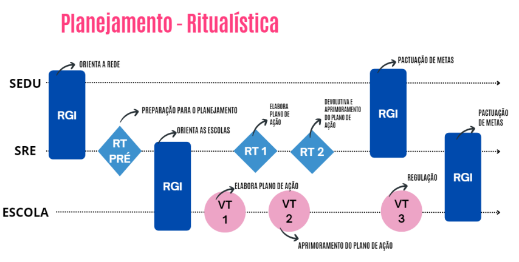

# PLANEJAMENTO

## 1\. A importância do Planejamento

Imagem 1 \- Planejamento Ritualística

O planejamento é a base de todo o trabalho da rede. É nesse momento que a equipe gestora analisa os dados com atenção, reflete sobre os principais desafios e define metas e estratégias para alcançar os objetivos traçados. Mais do que organizar tarefas, planejar significa alinhar toda a equipe em torno de prioridades comuns, garantindo que cada ação tenha sentido dentro de um propósito maior: melhorar a aprendizagem dos estudantes.

Essa etapa também representa uma oportunidade valiosa de escuta — dos dados, da realidade de cada escola, da equipe e da comunidade escolar. Quando conduzido com profundidade e compromisso, o planejamento fortalece vínculos, gera engajamento e favorece tomadas de decisão mais assertivas ao longo do ano.

A etapa de Planejamento da SRE possui três ações principais:

Diagnóstico  ->  Elaboração do Plano de Ação e Plano Tático  ->  Pactuação de Metas

As RTs e RGIs estão organizadas da seguinte forma:

<table>
  <tbody>
  	<tr>
      <td rowspan="2"><strong>Diagnóstico</strong></td>
      <td>RT (Pré-Etapa)</td>
      <td>Realização do diagnóstico da regional e de suas escolas</td>
    </tr>
    <tr>
      <td>RG-1</td>
      <td>Orientações para início do ano letivo</td>
    </tr>
    <tr>
      <td rowspan="2"><strong>Plano de Ação e Plano Tático</strong></td>
      <td>RT-1</td>
      <td>Elaboração do Plano de Ação e Plano Tático</td>
    </tr>
    <tr>
      <td>RT-2</td>
      <td>Aprimoramento do Plano de Ação e Plano Tático</td>
    </tr>
    <tr>
      <td><strong>Pactuação de Metas</strong></td>
      <td>RGI-2</td>
      <td>Pactuação de Metas e corresponsabilização entre os envolvidos</td>
    </tr>
  </tbody>
</table>

## 2\. Diagnóstico e análise da realidade das escolas

A etapa de diagnóstico e análise situacional tem como objetivo caracterizar a realidade da regional, mapeando o cenário atual, identificando os problemas enfrentados e os desafios a serem superados. Esse processo gera os insumos necessários para a definição das estratégias do Plano Tático e a elaboração do Plano de Ação.

O diagnóstico e a análise de indicadores educacionais são etapas fundamentais para a avaliação do desempenho das escolas vinculadas à regional. A partir dessas análises, é possível identificar pontos fortes e aspectos que precisam de aprimoramento, subsidiando decisões baseadas em evidências e orientando o desenvolvimento de estratégias de melhoria.

Com base nos desafios identificados para elevar os índices educacionais que compõem o Índice de Desenvolvimento da Educação Básica do Espírito Santo (IDEBES) das escolas, a Superintendência Regional de Educação (SRE) terá acesso aos Painéis de Risco — disponíveis no sistema de referência do Circuito de Gestão (CdG) — de cada uma de suas escolas. Esse recurso contribui para a priorização de problemas e desafios que estejam sob a governabilidade da regional ou que exijam apoio da Secretaria.

A definição de prioridades, por meio da hierarquização dos problemas, possibilita o direcionamento do foco da atuação da SRE, aumentando a efetividade das ações planejadas no Plano Tático e no Plano de Ação.

Além da análise situacional baseada nos indicadores, a regional deve aprofundar a reflexão sobre a promoção da equidade, com o propósito de assegurar a aprendizagem e a permanência dos estudantes.

**Responsáveis:** Equipe gestora da SRE (superintendente, assessor pedagógico, assessor administrativo e assessor do regime de colaboração).  
**Participantes:** Supervisores escolares.

<table>
  <tbody>
    <tr>
      <td>
		É importante considerar indicadores como: 
		<ul>
			<li>Balanço da Execução do ano anterior </li>
			<li>Taxa de aprovação / reprovação </li>
			<li>Taxa de abandono / evasão </li>
			<li>Resultados das Avaliações Externas </li>
			<li>Resultado da Avaliação Diagnóstica </li>
			<li>Resultados de proficiência </li>
			<li>Alcance das metas pactuadas</li>
		</ul>
	  </td>
    </tr>
  </tbody>
</table>

## 3\. RT Pré-etapa: Diagnóstico da regional e de suas escolas

**Objetivo**  
Preparar a primeira etapa do Circuito de Gestão no ano letivo que se iniciará.

**Período**  
Janeiro, antes da realização da primeira Reunião de Gestão Integrada (RGI) com os diretores escolares.

### 3.1. Roteiro para a RT Pré-Etapa

**A) Preparação do Supervisor Escolar para a RT Pré-Etapa:**  
I. Realizar o diagnóstico do conjunto de escolas sob sua responsabilidade, considerando os dados dos 1º, 2º e 3º trimestres, o compilado dos registros do Balanço da Execução do ano anterior, os resultados das avaliações externas, a execução do Plano de Ação e das prioridades do Plano Tático do ano anterior, além de outros dados que considerar pertinentes.  
II. Levantar os principais problemas enfrentados pelas escolas, com base nesse diagnóstico.  
III. Sistematizar todas as informações coletadas, que serão utilizadas durante a RT Pré-etapa.

**B) Preparação da Equipe Gestora da SRE para a RT Pré-Etapa:**  
I. Realizar o diagnóstico da regional e a análise situacional com base nos dados do ano anterior, incluindo os três trimestres, os resultados das avaliações externas, a execução do Plano de Ação, os resultados do Plano Tático e o alcance das metas estabelecidas.  
II. Definir quais escolas serão acompanhadas pelos supervisores escolares referência, conforme determinado em Portaria. Recomenda-se que um mesmo supervisor não acompanhe uma escola por mais de dois anos consecutivos.

**Justificativa**  
Ao atuar em diferentes contextos e comunidades, os supervisores escolares têm a oportunidade de trocar experiências e identificar melhores práticas. Essa diversidade de perspectivas enriquece suas competências profissionais e estimula a inovação nas abordagens de liderança escolar.

**C) Realização da RT (Pré-Etapa)**  
**I. Apresentação do Diagnóstico e da Análise Situacional da Regional**  
Durante a reunião, a equipe gestora da SRE deverá apresentar aos supervisores escolares o diagnóstico construído com base nos dados educacionais do ano anterior, incluindo a análise situacional da regional.

**II. Levantamento e Priorização dos Problemas da Regional**  
Com base na análise feita pelos supervisores e nos dados da regional, a equipe deve identificar os principais problemas enfrentados, destacando os que são comuns às escolas. Em seguida, será feita a priorização dos problemas que exigem maior atenção no planejamento.

**III. Definição de Desafios sob Governabilidade**  
A equipe deverá diferenciar os desafios que estão sob a governabilidade da própria regional e aqueles que demandam apoio da Secretaria. Essas informações também servirão de base para o preenchimento do Painel de Risco no sistema de referência do Circuito de Gestão (CdG).

**IV. Alinhamento sobre o Exercício Prévio nas Escolas**  
Deverá ser alinhado como os supervisores orientarão as escolas na realização do Exercício Prévio, utilizando como base os dados dos três trimestres dos anos anteriores, os registros do Balanço da Execução, os resultados das avaliações externas, a análise da execução do Plano de Ação e das prioridades do Plano Tático, além das orientações das diretrizes pedagógicas da Secretaria – com ênfase no diagnóstico do perfil dos estudantes e nos programas e projetos em andamento.

**V. Definição do Material de Apoio às Escolas**  
Será definido o conjunto de materiais que será enviado às escolas para subsidiar a realização do Exercício Prévio com suas equipes.

**VI. Construção da Pauta da 1ª VT do Planejamento**  
Com base no diagnóstico elaborado na Jornada Pedagógica Preliminar (JPP) e no Exercício Prévio das escolas, será estruturada a pauta da primeira Visita Técnica (VT) do Planejamento.

**VII. Preparação da Reunião de Gestão Integrada (RGI)**  
A equipe gestora da SRE deverá organizar a primeira RGI com os diretores escolares, com o objetivo de orientar sobre o início do ano letivo e garantir o alinhamento das ações planejadas.

**VIII. Registro da RT Pré-etapa**  
Por fim, todos os encaminhamentos e decisões da RT Pré-etapa deverão ser registrados em ata e inseridos no sistema de referência do CdG, garantindo a formalização e o acompanhamento das ações.

## 4\. RGI-1: Orientações para o início do ano letivo

**Objetivo**  
Alinhar com os diretores escolares o planejamento e as diretrizes pedagógicas que nortearão o ano letivo vigente.

**Período**  
Janeiro, após a realização da RT Pré-etapa.

### 4.1. Preparação do Supervisor Escolar para a RGI-1

**A) Preparação do Supervisor Escolar para A RGI-1**

**I. Apropriação do Diagnóstico e das Diretrizes**  
O supervisor escolar deve se apropriar do diagnóstico da regional e das escolas sob sua responsabilidade, bem como das diretrizes pedagógicas da Secretaria e das orientações definidas na RT Pré-etapa.

**B) Preparação da Equipe Gestora da SRE para a RGI-1**

**I. Orientações sobre o Exercício Prévio**  
A equipe gestora deverá preparar as orientações para a realização do Exercício Prévio nas escolas, conforme definido coletivamente na RT Pré-etapa.

**II. Apresentação do Planejamento da Rede**  
Também é responsabilidade da equipe preparar a apresentação do planejamento da rede, incluindo o Plano Tático da Secretaria, diretrizes pedagógicas, calendário escolar, cronograma do Circuito de Gestão (CdG), resultados e metas educacionais.

**C) Realização da RGI-1**

**I. Orientações sobre o Diagnóstico Escolar**  
Durante a reunião, os diretores escolares devem ser orientados sobre como conduzir o diagnóstico com suas equipes, com base no Exercício Prévio, durante a Jornada Pedagógica Preliminar (JPP).

**II. Apresentação dos Desafios da Regional**  
A equipe gestora deve apresentar os principais desafios identificados na RT Pré-etapa, destacando aqueles que impactam diretamente o planejamento das escolas.

**III. Prioridades do Plano Tático**  
Devem ser apresentadas e explicadas as prioridades definidas pela Secretaria no Plano Tático, para garantir que todos os diretores estejam alinhados quanto às metas e ações estratégicas do ano.

**IV. Calendário Escolar e Cronograma do CdG**  
A equipe deve apresentar o calendário escolar atualizado e o cronograma completo do Circuito de Gestão, reforçando prazos e etapas do planejamento.

**V. Diretrizes Regionais para as Escolas**  
Também devem ser compartilhadas as orientações específicas da regional para suas escolas, com ênfase nas diretrizes relativas à etapa de Planejamento.

**VI. Apresentação dos Supervisores Escolares Referência**  
Cada diretor deve ser informado sobre qual supervisor escolar será responsável pelo acompanhamento e assessoria de sua escola ao longo do ano.

**VII. Registro da RGI no Sistema**  
Todos os encaminhamentos da RGI-1 devem ser formalizados com o registro da ata no sistema de referência do Circuito de Gestão (CdG).

## 5\. RT-1: Plano de Ação e Plano Tático da Regional

**Objetivo**  
Definir coletivamente as ações que comporão o Plano de Ação e o Plano Tático da regional, com base no diagnóstico e na análise situacional construídos na RT Pré-etapa. Também serão considerados como subsídios: as diretrizes pedagógicas do ano, as metas da regional e das escolas, e as demandas sob a governabilidade da regional, identificadas nos Painéis de Risco das escolas.

**Período**  
Após a realização da VT-1 nas escolas da regional.

**Responsáveis**  
Equipe Gestora da Superintendência Regional de Educação (SRE): superintendente, assessor pedagógico, assessor administrativo e assessor do regime de colaboração.

**Participantes**  
Supervisores escolares.

### 5.1. Roteiro para a RT-1: Elaboração do Plano De Ação e do Plano Tático

**Objetivos**

-   Iniciar a elaboração do Plano de Ação da regional.
-   Iniciar a elaboração do Plano Tático.
-   Levantar as demandas oriundas do Painel de Risco das escolas.

Fluxo para elaboração do plano de ação

Metas  ->  Objetivos Estratégicos Finalísticos  ->   Componentes do IDEBES  ->  Problemas  ->  Desafios  ->  Planos da Regional

### 5.2. RT-1: Elaboração do Plano de Ação e Plano Tático da Regional

**Objetivo**  
Construir, de forma colaborativa, a primeira versão do Plano de Ação e do Plano Tático da regional. O trabalho será guiado pelo diagnóstico e análise situacional produzidos na RT Pré-etapa, considerando também as diretrizes pedagógicas do ano, as metas da regional e os Painéis de Risco das escolas com demandas sob a governabilidade da SRE.

**Período**  
Após a VT-1 das escolas da regional.

**Responsáveis:**  
Equipe Gestora da SRE: superintendente, assessor pedagógico, assessor administrativo e assessor do regime de colaboração.  
 **Participantes:** Supervisores escolares.

**A) Preparação do Supervisor Escolar para a RT-1**

I. Compilar as demandas do Painel de Risco referentes ao seu conjunto de escolas. Esse levantamento será a base para a construção coletiva dos planos da regional.

**B) Preparação da Equipe Gestora para a RT-1**

I. Revisar os problemas priorizados e os desafios apontados na RT Pré-etapa.  
II. Definir como será realizado o monitoramento, pelos supervisores, das prioridades do Plano Tático junto às escolas.  
III. Estabelecer os instrumentos de gestão que serão utilizados para acompanhar indicadores de processo e evidências relacionados ao Plano Tático.  
IV. Planejar o modelo de acompanhamento interno das prioridades dentro da própria regional.

**C) REALIZAÇÃO DA RT-1**

I. Construir coletivamente as ações necessárias para enfrentar os desafios identificados pela regional.  
II. Selecionar os componentes do Índice de Desenvolvimento da Educação Básica do Espírito Santo (IDEBES) que serão priorizados para superar os desafios.  
III. Definir estratégias para atender cada prioridade da Secretaria, incluindo formas de monitoramento, avaliação e possíveis intervenções.  
IV. Registrar a ata da RT-1 no sistema de referência do Circuito de Gestão (CdG).  
V. Finalizar a primeira versão do Plano de Ação e do Plano Tático.  
VI. Postar a primeira versão do Plano de Ação no sistema de referência do CdG e o Plano Tático no Microsoft Planner.

## 6\. Elaboração do Plano de Ação da Regional

O Plano de Ação é o principal instrumento de planejamento operacional da regional. Ele organiza e orienta a execução das ações necessárias para superar desafios específicos, visando alcançar os resultados esperados nos componentes do Índice de Desenvolvimento da Educação Básica do Espírito Santo (IDEBES).

Cada ação planejada é registrada em um **mapa de ação**, estruturado de forma a garantir o acompanhamento e o monitoramento das tarefas diárias. Para cada desafio identificado, deve ser criado um mapa correspondente, com ações claramente definidas e alinhadas às metas da Secretaria.

Essas ações devem incidir diretamente sobre os componentes do IDEBES e serão monitoradas por meio dos **indicadores estruturantes**. Estudantes presentes em sala e professores ministrando as aulas previstas são condições essenciais para o desempenho acadêmico e, portanto, foco do monitoramento.

### 6.1. Abrangência dos Mapas de Ação

Na construção dos mapas, é fundamental considerar as duas etapas de ensino: **Ensino Fundamental** e **Ensino Médio**. As ações podem ser planejadas de duas formas:

-   **Conjuntas**, quando abordam problemas e desafios comuns às duas etapas.
-   **Específicas**, quando respondem às particularidades de apenas uma etapa, respeitando suas necessidades e contextos.

Essa distinção garante que o Plano de Ação da regional seja abrangente e alinhado às realidades de todas as escolas.

### 6.2. Base para Elaboração dos Mapas

A construção dos mapas de ação deve considerar as **demandas do Painel de Risco**, disponível no sistema de referência do CdG. Essas demandas foram identificadas na elaboração dos Planos de Ação das escolas e devem ser tratadas da seguinte forma:

-   **Demandas sob governabilidade da regional**: devem ser incorporadas diretamente ao Plano de Ação da regional.
-   **Demandas sob governabilidade da Secretaria**: devem ser registradas no Painel de Risco do Plano de Ação da regional.

O Plano de Ação, portanto, é o guia da atuação regional no enfrentamento dos desafios educacionais e no fortalecimento dos resultados da rede.

### 6.3. Estrutura do Plano de Ação da Regional

O Plano de Ação é composto por mapas estruturados que organizam os elementos essenciais para o enfrentamento dos desafios educacionais. Os campos que devem ser preenchidos para cada ação planejada são:

**Categoria**  
Indica a natureza da ação, que pode ser:

-   Gestão e governança
-   Pedagógico
-   Vulnerabilidade e aspectos socioemocionais
-   Gestão de pessoas
-   Administrativo-financeiro

**Objetivo Estratégico**  
Cada ação deve estar alinhada aos objetivos estratégicos finalísticos da Secretaria da Educação (SEDU), com foco na melhoria dos componentes do IDEBES (Índice de Desenvolvimento da Educação Básica do Espírito Santo). Esses objetivos funcionam como guia para a construção de um plano alinhado às metas institucionais.

**Componentes do IDEBES**  
O Plano de Ação deve indicar claramente em quais componentes do IDEBES a ação pretende atuar:

-   Proficiência em Matemática
-   Proficiência em Língua Portuguesa
-   Taxa de Aprovação

Esses componentes devem ser escolhidos com base no diagnóstico da regional e associados aos objetivos estratégicos definidos.

**Problemas**  
São os impasses identificados no diagnóstico da regional que impactam negativamente o desempenho educacional (fluxo e proficiência). Cada problema registrado será vinculado a um ou mais desafios a serem superados.

**Desafio**  
Define o que a regional deseja alcançar diante dos problemas identificados. O desafio representa o objetivo a ser atingido ao final da execução do Plano de Ação e pode responder a um problema específico ou a um conjunto de problemas.

**Nome da Ação**  
É a forma de identificação da ação. Pode ser curto ou descritivo, desde que seja facilmente reconhecido pela equipe como algo relacionado à prática planejada.

**Descrição da Ação**  
Apresente um resumo claro e objetivo que permita a qualquer pessoa compreender o que será feito. Aqui, você pode incluir detalhes relevantes sobre a ideia central da ação e sua execução.

**Público-Alvo**  
Informe quem será diretamente impactado pela ação. É importante especificar o grupo-alvo com clareza, considerando especialmente os públicos em situação de maior vulnerabilidade.

**Responsável**  
 Informe o nome da pessoa que assumirá a responsabilidade geral pela ação. Essa pessoa será o ponto focal para garantir a execução do plano, coordenar os envolvidos e acompanhar o andamento das tarefas.

**Produto**  
Descreva o que será entregue como resultado direto da ação. O produto precisa ser **quantificável** e alinhado ao desafio que se pretende superar. Um bom produto é específico, verificável e representa uma entrega concreta, que pode ser acompanhada e avaliada.

Exemplo: _Realização de 4 formações presenciais para professores de Matemática do Ensino Médio até setembro._

**Resultado Esperado**  
Indique qual impacto a ação deve gerar. O resultado precisa ser **mensurável** e mostrar claramente como a ação contribui para resolver o desafio identificado. Deve estar conectado ao componente do IDEBES e à meta da regional.

Exemplo: _Aumentar em 15% a proficiência média em Matemática dos estudantes da 3º série do EM até o final do ano letivo._

**Cronograma de Tarefas**  
Organize as etapas da ação em uma tabela sequencial. Cada linha deve conter:

-   **Nome da tarefa**
-   **Responsável direto pela execução**
-   **Data de início**
-   **Data de término**

Esse cronograma é essencial para o monitoramento da execução. O avanço ou atraso nas tarefas indicará o status geral da ação, permitindo ajustes tempestivos.

### 6.4. Passos para a elaboração do Plano de Ação da regional

Para apoiar a construção das ações da regional, é importante considerar alguns pontos-chave organizados em diferentes categorias. A proposta é que essas categorias se integrem de forma estratégica, orientando a equipe para o cumprimento dos objetivos definidos pela Secretaria e para o alcance das metas educacionais.

Com base nos **desafios já mapeados** e no **diagnóstico aprofundado na RT Pré-etapa**, o próximo passo é realizar um diálogo com a equipe regional, refletindo sobre:

-   O que é mais urgente enfrentar?
-   Quais ações terão maior impacto nos componentes do IDEBES?
-   O que está dentro da governabilidade da regional?

Essa reflexão coletiva é essencial para garantir que o Plano de Ação seja **alinhado à realidade local**, **focado em resultados concretos** e **direcionado para os principais desafios** enfrentados pelas escolas.

A partir disso, será possível construir **mapas de ação estruturados, coerentes e viáveis**, com objetivos claros e estratégias bem definidas, voltadas para a melhoria do desempenho dos estudantes e para o fortalecimento das práticas pedagógicas e de gestão.

**Fluxo para elaboração do plano de ação**

METAS  ->  COMPONENTES DO IDEBES  ->  OBJETIVOS ESTRATÉGICOS FINALÍSTICOS  ->  PROBLEMAS  ->  DESAFIOS  ->  
MAPA DE AÇÃO  ->  PLANO DE AÇÃO DA REGIONAL

Planilha Gestão e Governança

| **CATEGORIA**            | **TÓPICOS**     | **PONTOS RELEVANTES** |
|-------------------------|-----------------|-------------------------------------------------------------------------------------------------------------------------------------------------------------------------------------------------------------------------------------------------------------------------------------------------------------------------------------------------------------------------------------------|
| **GESTÃO E GOVERNANÇA** | **Articulação** | **Colaboração intersetorial/interinstitucional:** Estabeleça parcerias e colaborações com outros setores ou instituições, organizações e comunidades para fortalecer a articulação entre diferentes atores no ambiente educacional.    **Alinhamento com o planejamento estratégico:** Certifique-se de que os objetivos estratégicos do Plano de Ação e do Plano Tático estejam articulados entre si e que os objetivos estratégicos da Secretaria e as prioridades do Plano Tático sejam claramente percebidas e operacionalizadas na rede. |
|                         | **Comunicação** | **Transparência:** Promova a transparência na comunicação entre gestores educacionais, entre os servidores e a comunidade escolar. Uma comunicação eficiente fortalece a confiança, tanto internamente, com equipes escolares, quanto externamente, com equipes e comunidades escolares.    **Fluxo de comunicação eficiente:** Estabeleça um fluxo de comunicação eficiente entre os níveis de governança e entre o Plano de Ação e o Plano Tático, garantindo que as informações relevantes sejam divulgadas de maneira precisa e acessível.  |
|                         | **Equidade**     | **Feedback:** Crie mecanismos para receber feedback dos diversos envolvidos (servidores da regional, equipes escolares e comunidade escolar). A escuta ativa fortalece os vínculos e amplia as possibilidades de aprendizagem, além de favorecer os ajustes quando necessários.    **Programa de Enfrentamento ao Racismo:** Mobilize as escolas para que desenvolvam ações afirmativas e de enfrentamento ao racismo, de forma articulada com a política de equidade e de educação antirracista.    **Distorção idade-série:** Promova o acompanhamento dos estudantes em situação de distorção idade-série.  |
|                         | **Participação** | **Fluxo de participação:** Estimule o envolvimento dos diferentes atores educacionais, levando em conta os diversos territórios e contextos vividos pelos estudantes, servidores e comunidade.    **Mobilização:** Promova eventos e fluxos de oportunidades para que servidores da rede e comunidade escolar participem da execução e monitoramento do Plano de Ação. O engajamento coletivo é um princípio fundamental da gestão democrática e fortalece o senso de responsabilidade pelo processo de melhoria da educação.    **Engajamento:** Incentive a participação ativa dos servidores, equipes escolares, estudantes e comunidade escolar nas atividades das escolas e regionais e/ou nos momentos de decisão. |

Planilha Gestão de Pessoas e Administrativo-Financeiro

| **CATEGORIA**   | **TÓPICOS**     | **PONTOS RELEVANTES** |
|----------------|------------------|-------------------------------------------------------------------------------------------------------------------------------------------------------------------------------------------------------------------------------------------------------------------------------------------------------------------------------------------------------------------------------------------------------------------------------------------|
| **PEDAGÓGICO** | **Planejamento** | **Equidade e inclusão:** Realize uma análise detalhada sobre os recortes de raça, situação socioeconômica e territorial para identificar desigualdades existentes e garantir que o Plano de Ação e o Plano Tático incluam estratégias específicas para promover a equidade.    **Recomposição das aprendizagens:** Certifique-se de orientar as escolas e monitorar os resultados das avaliações diagnósticas para compreender as lacunas de aprendizagem dos estudantes. Com base nos resultados dessas avaliações, é crucial desenvolver estratégias de nivelamento, ficando atento ao cronograma destinado à implementação dessa ação, garantindo um processo equitativo de superação das aprendizagens. O monitoramento contínuo do currículo, aliado a intervenções personalizadas, permite ajustar as abordagens pedagógicas conforme as demandas identificadas.    **Cultura digital:** Oriente para o uso pedagógico de tecnologias com o intuito de promover um ambiente educacional inovador e eficaz. É essencial estabelecer metas claras e alinhadas às tecnologias com os objetivos educacionais específicos. Oriente para considerar as necessidades e estilos de aprendizagem dos estudantes e promover atividades e plataformas que complementem a implementação do currículo. Promova um ambiente de formação continuada para que os profissionais façam uso das tecnologias e metodologias ativas e outras que julgar necessário.    **Educação integral:** Oriente para que as escolas considerem em seu planejamento não apenas o aspecto acadêmico, mas também aspectos sociais, emocionais e culturais. Atividades complementares, atividades extracurriculares, projetos interdisciplinares e vivências que promovam o protagonismo juvenil. Além disso, é essencial orientar para o fortalecimento das ações pedagógicas que promovam a autonomia e a responsabilidade. Ao alinhar o planejamento escolar com as realidades e aspirações dos estudantes, ampliam-se as possibilidades de transformação social e de desenvolvimento dos estudantes, preparando-os com repertório para lidar com questões das comunidades solidárias e uma ampla visão do mundo ao seu redor. |

Planilha Vulnerabilidade e Aspectos Socioeconômicos

| **CATEGORIA**                                   | **TÓPICOS**                         | **PONTOS RELEVANTES** |
|------------------------------------------------|-------------------------------------|--------------------------------------------------------------------------------------------------------------------------------------------------------------------------------------------------------------------------------------------------------------------------------------------------------------------------------------------------------------------------------------------------------------------------------------------|
| **VULNERABILIDADE E ASPECTOS SOCIOEMOCIONAIS** | **Acolhimento socioemocional**      | **Espaço de Acolhimento:** Oriente a equipe gestora escolar a promover um espaço acolhedor e empático, onde as emoções e experiências de cada pessoa sejam reconhecidas e valorizadas. Ao adotar o acolhimento socioemocional, a equipe escolar proporciona um ambiente seguro, estimulando o desenvolvimento emocional, social e cognitivo dos estudantes. Isso inclui a escuta ativa, o desenvolvimento da empatia, a promoção de relações saudáveis e a implementação de práticas que fortaleçam os vínculos entre os alunos e a escola. O acolhimento socioemocional contribui não apenas para um clima positivo na comunidade escolar, mas também para a sucessão acadêmica, uma vez que estudantes que se sentem emocionalmente apoiados tendem a estar mais engajados e motivados em seu processo de aprendizagem. |
|                                                | **Enfrentamento do abandono e evasão** | **Protocolo de monitoramento de frequência:** Analise os instrumentos de performance da frequência dos estudantes nas escolas da sua regional, bem como o monitoramento da frequência dos estudantes e do índice de transferência, com o objetivo de propor intervenções que garantam o retorno e a permanência dos estudantes faltosos nas escolas sob sua jurisdição. |

Planilha Gestão de Pessoas

| **CATEGORIA**               | **TÓPICOS**                                 | **PONTOS RELEVANTES** |
|----------------------------|---------------------------------------------|-----------------------------------------------------------------------------------------------------------------------------------------------------------------------------------------------------------------------------------------------------------------------------------------------------------------------------|
| **GESTÃO DE PESSOAS**      | **Formação para profissionais**             | **Demandas formativas:** Identifique as necessidades formativas dos profissionais sob a jurisdição da regional.   **Mobilização:** Mobilize os profissionais da regional e das escolas para participarem das formações oferecidas pela regional e pela Secretaria. |
|                            | **Quadro de profissionais**                 | Certifique-se de que o quadro de profissionais seja adequado para atender às necessidades de cada unidade escolar, garantindo a organização e a manutenção da rotina escolar.                                                                              |
|                            | **Condições para o engajamento dos profissionais** | **Motivação:** Promova um ambiente de trabalho positivo e colaborativo. Essa é uma maneira eficaz de incentivar o comprometimento e o desenvolvimento dos profissionais. Além disso, valorize suas ideias, promova um diálogo aberto e ofereça feedback construtivo, contribuindo para fortalecer a autoestima e a autoconfiança – elementos cruciais para manter uma equipe motivada e engajada.    **Condições de trabalho:** Garanta um ambiente de trabalho adequado às atividades escolares e administrativas (limpo, com instalações adequadas, recursos e materiais acessíveis). Além disso, é fundamental promover uma cultura organizacional que valorize o bem-estar e proporcione oportunidades de escuta e acolhimento. A criação de espaços coletivos de convivência e momentos de escuta e participação ativa na tomada de decisões fortalece o sentimento de pertencimento. São aspectos também importantes para criar um clima positivo. |
| **ADMINISTRATIVO-FINANCEIRO** | **Recursos**                                | Certifique-se de que todas as escolas tenham e garantam o acesso a equipamentos, oportunidades de acesso à internet e infraestrutura de serviços. Além disso, promova um cuidado com a infraestrutura física (salas de aula e espaços comuns) e com o uso consciente dos recursos pedagógicos, tecnológicos e materiais didáticos. |

### 6.5. Elaboração do Plano Tático

O Plano Tático é um instrumento de gestão que detalha as ações necessárias para colocar em prática as estratégias definidas no planejamento estratégico. Com foco no médio prazo, ele orienta as decisões da regional e busca alinhar esforços com as prioridades da Secretaria da Educação (SEDU).

Seu objetivo é fortalecer as ações regionais, garantindo que escolas, regionais e Secretaria atuem de forma coordenada, mesmo respeitando as especificidades de cada instância. Assim, todos caminham em direção às mesmas metas.

Para construir um Plano Tático efetivo, é essencial planejar com base nas prioridades do ano letivo. Algumas diretrizes precisam ser seguidas para garantir a efetividade do plano:

**Critérios para a elaboração do Plano Tático**

• Compreender a prioridade a ser trabalhada, com base nos resultados esperados pela SEDU.  
• Definir ações claras e objetivas para alcançar os resultados esperados em cada prioridade.  
• Estabelecer estratégias de monitoramento, que permitam acompanhar o andamento das ações e a evolução dos indicadores.  
• Criar indicadores de processo mensuráveis, que ajudem a acompanhar a execução das ações e a avaliar sua efetividade.  
• Elaborar instrumentos de coleta de evidências, como formulários, planilhas ou registros que comprovem o andamento e os resultados das ações.  
• Alinhar as evidências esperadas para cada prioridade, garantindo clareza sobre o que será considerado na avaliação.  
• Atribuir prazos e responsáveis por cada ação, bem como pela coleta de indicadores, evidências e realização do monitoramento.  
• Definir a periodicidade e a forma do monitoramento, prevendo momentos para ajustes e intervenções, caso necessário.  
• Planejar a orientação às escolas sobre como coletar e registrar indicadores e evidências de forma padronizada.

METAS  ->  COMPONENTES DO IDEBES  -> OBJETIVOS ESTRATÉGICOS FINALÍSTICOS  ->  PROBLEMAS  ->  DESAFIOS  ->  PRIORIDADES  ->  PLANO TÁTICO DA REGIONAL

<table>
	<tbody>
		<tr>
			<td>A definição das prioridades tem um papel fundamental: fortalecer as ações da regional e ajudar a alcançar os resultados esperados. Além disso, garante que Secretaria, regionais e escolas atuem de forma alinhada. Assim, todos trabalham com foco nas mesmas prioridades — cada um com suas responsabilidades, mas seguindo na mesma direção.</td>
		</tr>
	</tbody>
</table>

### 6.6. RT-2: Aprimoramento do Plano de Ação e do Plano Tático

**Objetivos da RT-2**

A RT-2 tem como propósito fortalecer a atuação da regional por meio do aprimoramento dos seus principais instrumentos de planejamento. São os objetivos:

-   Consolidar as análises dos Planos de Ação das escolas;
-   Realizar um momento de alinhamento entre a equipe regional e os supervisores escolares, com foco nas devolutivas feitas aos Planos de Ação das escolas;
-   Aprimorar o Plano de Ação da regional, considerando as contribuições vindas das escolas;
-   Aprimorar o Plano Tático da regional, a partir das prioridades estabelecidas pela Secretaria;
-   Validar os dois planos (Plano de Ação e Plano Tático) com a equipe regional, garantindo que todos compreendam e assumam os compromissos firmados.

## 7\. Roteiro da RT-2

**A) Etapas de Preparação do Supervisor Escolar**

1. **Análise individual dos Planos de Ação das escolas sob sua supervisão**, utilizando o teste de consistência como referência.
2. **Consolidação das análises**, com foco em identificar padrões, pontos fortes e aspectos que precisam de ajustes nos Planos de Ação das escolas.

**B) Etapas de Preparação da Equipe Gestora da Regional**

1. **Acompanhar e garantir que todos os supervisores escolares tenham aplicado os testes de consistência** nas escolas que acompanham.

2. **Organizar a dinâmica da reunião da RT-2**, assegurando tempo para que os supervisores compartilhem suas análises e para que a regional apresente as indicações gerais para aprimoramento dos Planos de Ação escolares.

**C) Realização da RT-2**

Durante a realização da RT-2, a equipe regional deverá seguir os seguintes passos:

1. **Apresentar o consolidado das devolutivas dos Planos de Ação das escolas**, promovendo o compartilhamento das principais análises feitas pelos supervisores escolares.
2. **Orientar sobre as indicações da regional para as devolutivas das escolas**, esclarecendo como cada escola poderá aprimorar seus Planos de Ação com base nas prioridades regionais e nos objetivos estratégicos.
3. **Coletar os insumos apresentados pelas escolas em seus Planos de Ação** e incorporar esses elementos ao Plano de Ação e ao Plano Tático da regional, quando forem pertinentes.
4. **Ajustar e validar a versão final dos dois documentos** (Plano de Ação e Plano Tático), garantindo que estejam alinhados com as diretrizes da Secretaria e com a realidade da regional.
5. **Iniciar a preparação da RGI de Pactuação de Metas**, com base nas metas regionais e nas prioridades identificadas nos planos.
6. **Registrar a ata da RT-2 no sistema de referência do CdG**, assegurando o devido registro institucional da reunião.
7. **Finalizar o Plano de Ação e o Plano Tático**, com base em todas as contribuições e validações realizadas durante a RT-2.
8. **Postar a versão final do Plano de Ação no sistema de referência do CdG**, concluindo oficialmente o processo de consolidação do documento.
9. **Publicar o Plano Tático no Microsoft Planner**, para garantir o acompanhamento prático e atualizado das ações ao longo do ano.

### 7.1. Análise do Teste de Consistência

Na segunda Visita Técnica, o papel do supervisor escolar é realizar a devolutiva do Plano de Ação com cada escola, analisando em conjunto os aprimoramentos necessários. Para isso, o supervisor precisa realizar previamente uma análise individual do plano, testando sua consistência para orientar a escola com precisão.

Contudo, para garantir que os Planos de Ação estejam verdadeiramente alinhados com as prioridades da Secretaria e com o foco estratégico da regional, é essencial que essa análise vá além do olhar técnico do supervisor.

A participação do superintendente e do supervisor pedagógico é fundamental para agregar recomendações mais amplas e estratégicas. Essa contribuição ajuda a fortalecer a coerência entre as diferentes instâncias — Secretaria, regional e escolas — assegurando que todas atuem com foco em objetivos comuns.

Durante a reunião, a equipe deve transformar as análises individuais em uma reflexão coletiva sobre o conjunto dos Planos de Ação sob a responsabilidade de cada supervisor. Para orientar essa discussão, algumas perguntas-chave devem ser consideradas:

-   Qual é o panorama geral dos Planos de Ação das escolas acompanhadas por cada supervisor?
-   Quais ações são mais recorrentes nas escolas da regional?
-   As ações propostas são consistentes e suficientes para impactar os objetivos estratégicos e alcançar as metas definidas?
-   Quais objetivos estratégicos ainda apresentam fragilidades nas ações planejadas?
-   Os desafios identificados pelas escolas estão alinhados com os desafios priorizados pela regional?
-   Esses desafios também dialogam com as diretrizes e prioridades da Secretaria?
-   Os problemas apontados como fora da governabilidade das escolas realmente estão fora do seu alcance de atuação?
-   Há problemas que foram classificados como fora da governabilidade da escola, mas que podem (e devem) ser enfrentados pela regional?

A análise coletiva, orientada por essas questões, permite consolidar um panorama mais completo e preciso. A partir disso, torna-se possível elaborar devolutivas mais qualificadas para as escolas, bem como identificar pontos de melhoria para fortalecer os Planos de Ação em toda a regional.

### 7.2. Indicações da regional para compor a devolutiva às escolas

Com base no panorama consolidado dos Planos de Ação das escolas, a equipe da regional deve elaborar orientações estratégicas para subsidiar a devolutiva do supervisor escolar. O objetivo é garantir que cada escola receba indicações claras sobre como fortalecer ou ajustar seu plano, alinhando-o às prioridades da regional e da rede.

Essas orientações devem considerar:

-   Ações prioritárias que não foram contempladas pelas escolas;
-   Objetivos estratégicos que precisam de maior atenção ou fortalecimento;
-   Ações que, mesmo diante de contextos diferentes, devem ser implementadas por todas as escolas da regional.

As indicações elaboradas pela regional serão integradas ao teste de consistência realizado por cada supervisor e discutidas com as equipes escolares durante a segunda Visita Técnica.

### 7.3. Aprimoramento e validação do Plano de Ação e do Plano Tático

As análises feitas pelos supervisores escolares oferecem uma visão ampla dos principais desafios enfrentados pelas escolas, das soluções que vêm sendo construídas e dos pontos que precisam de maior suporte. Essas informações são essenciais para qualificar os Planos de Ação e o Plano Tático da regional.

O Painel de Risco, o panorama consolidado das análises e os dados trazidos pelos supervisores são insumos estratégicos. Com base neles, a regional deve avaliar se os documentos que está construindo respondem de forma efetiva às necessidades identificadas nas escolas.

Além de mapear desafios, essas análises mostram onde a regional precisa se organizar para apoiar a execução dos planos das escolas. Isso demanda uma atuação mais coordenada e propositiva, que assuma como compromisso coletivo o enfrentamento dos desafios apresentados.

Após a realização da RT-2, é essencial que a equipe da regional retome o consolidado das discussões, revise seus documentos e finalize as versões do Plano de Ação e do Plano Tático que serão encaminhadas à Secretaria.

### 7.4. Revisão das ações e qualificação final dos planos da regional

Na etapa final, o foco deve estar em revisar e qualificar o Plano de Ação e o Plano Tático à luz das devolutivas recebidas da Secretaria e das análises internas da regional. Com os documentos finalizados e sistematizados, e após verificar a viabilidade e a efetividade das ações propostas, a regional deve atualizar os planos nos sistemas oficiais.

Esse processo fecha o ciclo de construção dos planos com base em diálogo, análise estratégica e corresponsabilidade entre Secretaria, regionais e escolas.

### 7.5. Pactuação de Metas

A pactuação de metas educacionais é um momento estratégico da rede estadual. Ela se conecta diretamente ao planejamento do ano letivo, formando um processo integrado e essencial para o fortalecimento da gestão educacional.

Nesse processo, Secretaria de Educação, Superintendências Regionais de Educação (SREs) e escolas definem, de forma articulada e consensual, os objetivos que devem ser alcançados ao longo do ano. O alinhamento entre essas instâncias garante clareza de propósitos e compromissos compartilhados em torno da aprendizagem com equidade.

A pactuação de metas tem como finalidade promover:

-   Alinhamento estratégico entre Secretaria, regionais e escolas;
-   Corresponsabilização de todos os atores da rede;
-   Compromisso coletivo com os resultados de aprendizagem dos estudantes.

As regionais desempenham papel central nessa etapa: são responsáveis por mobilizar as escolas sob sua jurisdição e apoiar a articulação com as respectivas comunidades escolares.

**Período:**  
 Após a realização da RGI (Reunião de Gestão Integrada) de Pactuação de Metas entre a Secretaria e a regional.

**Responsáveis:**

-   **Na SRE:** Equipe gestora (superintendente, assessor pedagógico, assessor administrativo e assessor do regime de colaboração)
-   **Na escola:** Diretor escolar

**Participantes:**

-   **Na SRE:** Supervisores escolares e diretores
-   **Na escola:** Toda a comunidade escolar

## 8\. **RGI-2: Pactuação de Metas**

**Objetivos**  
• Apresentar metas educacionais para diretores escolares.  
• Apresentar relação de escolas prioritárias.  
• Pactuar as metas educacionais com diretores escolares para o ano letivo vigente.  
• Orientar os diretores escolares para realizarem a Pactuação de Metas com a comunidade escolar.

### 8.1. Roteiro para a RGI-2 (Reunião de Gestão Integrada)

A RGI-2 é um momento estratégico da jornada de planejamento da rede estadual. Nela, regionais e escolas pactuam metas com base no IDEBES (Índice de Desenvolvimento da Educação Básica do Espírito Santo) e assumem compromissos conjuntos para fortalecer a aprendizagem com equidade.

**A) Preparação do Supervisor Escolar**

Antes da RGI-2, o supervisor escolar deve:

-   Estudar as metas educacionais definidas para as escolas sob sua supervisão.
-   Conhecer a lista de escolas prioritárias da regional.
-   Compreender as orientações para o assessoramento dessas escolas.

**B) Preparação da Equipe Gestora da Regional (SRE)**

A equipe gestora da SRE deve:

-   Convocar os diretores escolares para a RGI-2.
-   Planejar a cerimônia de Pactuação de Metas com os diretores, alinhando como cada escola conduzirá o mesmo processo com sua comunidade.
-   Organizar a logística da reunião (data, local, materiais, participantes).
-   Orientar os supervisores escolares sobre as etapas e objetivos da Pactuação de Metas nas escolas.

**C) Realização da RGI-2**

Durante a reunião, a regional deve:

-   Conduzir a cerimônia de Pactuação de Metas com os diretores escolares.
-   Apresentar a meta da regional e indicar as escolas prioritárias.
-   Orientar os diretores sobre como conduzir a Pactuação de Metas nas escolas com a comunidade escolar.
-   Acompanhar a execução do processo nas escolas.
-   Registrar a ata da reunião no sistema de referência do CdG (Circuito de Gestão).

### 8.2. Participação da Regional na Pactuação de Metas

A regional participa em duas frentes:

**1\. Meta da regional**

Definida com base na meta do IDEBES, é pactuada em RGI conduzida pela Secretaria de Educação, com apoio da Liderança Estratégica e da Liderança Tática do CdG Capixaba.

**2\. Metas das escolas vinculadas**

Também baseadas no IDEBES, são pactuadas em RGI conduzida pela regional, com participação da equipe gestora da SRE (superintendente, assessores pedagógico e administrativo, supervisores escolares) e diretores escolares.

**Cerimônia de Pactuação de Metas**

Durante a RGI-2, cabe à equipe da regional preparar um documento individual para cada escola, apresentando:

-   os resultados obtidos no IDEBES;
-   a meta pactuada para o ano letivo vigente.

Em seguida, os diretores escolares deverão ser convocados para assinar esse documento, oficializando o compromisso da escola com o alcance da meta estabelecida.