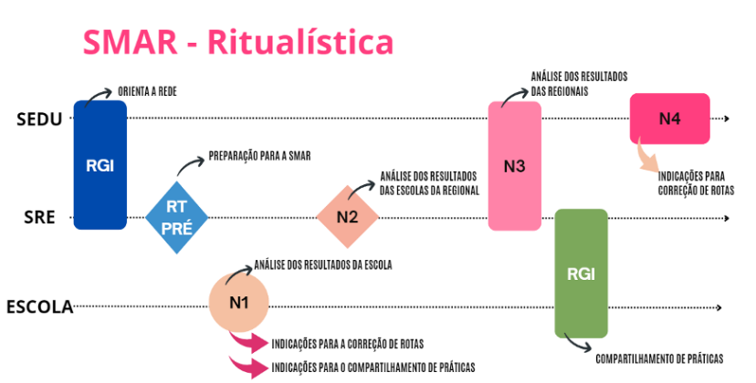
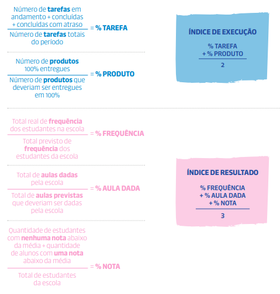
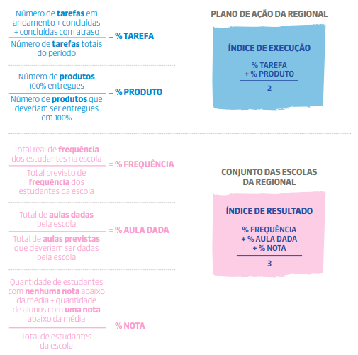

# SMAR

## 1\. A importância da SMAR

A Sistemática de Monitoramento e Avaliação dos Resultados (SMAR) é uma etapa essencial do **Circuito de Gestão Capixaba**. É nesse momento que as três instâncias da rede pública estadual de educação analisam, com base em dados e evidências, os resultados alcançados nos seus Planos de Ação.

Essa análise é sempre feita de forma colaborativa, com foco na melhoria contínua das práticas e no alcance das metas pactuadas.

**Como a SMAR acontece?**

A SMAR é realizada em quatro níveis (N1 a N4), cada um com participantes, objetivos e rituais específicos que garantem o monitoramento, a análise e a correção de rotas, além do compartilhamento de boas práticas.

-   **SMAR Nível 1 (N1):**

Acontece no âmbito da escola. A equipe escolar analisa os resultados da unidade com o apoio do supervisor escolar referência, identifica correções de rota e práticas bem-sucedidas, e compartilha essas informações com a regional.

-   **SMAR Nível 2 (N2):**

Ocorre no âmbito da Superintendência Regional de Educação (SRE). Envolve a análise dos resultados das escolas da regional, com a participação da equipe gestora regional, supervisores e demais servidores envolvidos nas ações. Essa etapa prepara a regional para o nível seguinte da SMAR.

-   **SMAR Nível 3 (N3):**

É coordenada pela Secretaria da Educação (SEDU) e conta com a participação das equipes gestoras das regionais (SREs), das gerências e assessorias da SEDU. O foco é a análise consolidada dos resultados das regionais, subsidiando decisões estratégicas para a rede.

-   **SMAR Nível 4 (N4):**

Envolve a alta gestão da SEDU, incluindo o Secretário de Educação. Nessa etapa são validadas as análises e definidas indicações para correções de rota em nível sistêmico, reforçando o compromisso institucional com os avanços da aprendizagem.

Imagem 7 \- SMAR Ritualística

A SMAR tem como finalidade principal **avaliar se as ações planejadas e executadas foram eficazes** e se os resultados esperados por **escola, regional e Secretaria** foram de fato alcançados.

Quando os resultados não são atingidos, é necessário **compreender as causas** e identificar **quais ajustes devem ser feitos** para melhorar ou reverter a situação nas próximas etapas do ciclo de gestão.

**Como essa avaliação é feita?**

Para que a avaliação seja eficaz, é preciso que ela seja:

-   **Periódica**, ou seja, realizada em momentos definidos do planejamento;

-   **Guiada por indicadores**, que ajudam a medir o que foi feito e com que impacto;

-   **Reflexiva e investigativa**, com base em perguntas que ajudam a analisar, entender e agir sobre os resultados.

Essas análises fornecem insumos importantes para duas etapas-chave do Circuito de Gestão:

-   **Compartilhamento de Práticas**: onde experiências bem-sucedidas são trocadas entre escolas;

-   **Correção de Rotas**: momento de replanejar ações para alcançar melhores resultados.

**Que indicadores são usados?**

Os **indicadores de avaliação** estão disponíveis nos **Relatórios SMAR**, dentro do sistema do Circuito de Gestão. Eles se dividem em dois grupos principais:

1. **Índices de Execução** – mostram o quanto do plano foi realizado:

    - **Tarefa**: aponta a proporção de tarefas que foram:

        - Concluídas no prazo
        - Concluídas com atraso
        - Ainda em andamento
        - Atrasadas
        - Não iniciadas

Além da análise numérica, é essencial verificar **a qualidade da execução**: as tarefas foram realizadas conforme o planejado?

-   **Ação**: indica a proporção de ações que estão nas mesmas categorias acima. Mas aqui, o foco está em entender **se as ações estão, de fato, ajudando a superar os desafios identificados** no planejamento.

2. **Índices de Resultados** – ajudam a avaliar os impactos reais das ações realizadas.

Os **índices de resultados** revelam se houve **progresso, estabilidade ou retrocesso** na execução do planejamento em relação aos objetivos traçados. Eles são calculados com base nos chamados **indicadores estruturantes**, que são:

-   **Aulas Dadas**: mostra o percentual de aulas realmente ministradas nas escolas da regional, em relação ao total previsto para o período.
-   **Frequência**: aponta o percentual de presença dos estudantes nas aulas dadas, comparando a frequência real com a esperada.
-   **Notas**: indica a proporção de estudantes por categoria de desempenho:

    -   Sem notas abaixo da média
    -   Com uma nota abaixo da média
    -   Com duas notas abaixo da média
    -   Com três ou mais notas abaixo da média

**Onde consultar os dados?**

A regional pode acessar:

-   **Indicadores de execução** dos seus próprios Planos de Ação e dos planos das escolas sob sua jurisdição.
-   **Indicadores estruturantes**, com possibilidade de:

    -   Visualizar a **média das escolas da regional**
    -   Ver a **lista de escolas**
    -   Acessar os dados **de cada escola individualmente**, por meio de filtros no sistema

O sistema do Circuito de Gestão cruza os dados de execução e de resultados e gera um **relatório de situação de eficácia**, usado pelas escolas, pela regional e pela Secretaria.

**Foco nos grupos mais vulneráveis**

Na etapa da SMAR, é fundamental **observar os grupos mais vulnerabilizados**. A escola, a regional e a rede precisam:

-   Identificar esses grupos
-   Entender os fatores que causam desigualdades na aprendizagem
-   Elaborar intervenções específicas

Essa atenção deve considerar especialmente **recortes de gênero e raça**, promovendo justiça educacional com base no princípio da equidade.

**A importância das Visitas Técnicas**

As **Visitas Técnicas da SMAR N1** geram os primeiros insumos para as demais etapas de avaliação. Durante essas visitas, os supervisores e as equipes escolares devem investigar:

-   Se o Plano de Ação está melhorando os resultados
-   Se há aprendizagem para **todos os estudantes**
-   Se as **aprendizagens estão sendo recuperadas** com equidade
-   Se estudantes em **abandono estão sendo reintegrados**
-   Se a escola está avançando rumo à **meta pactuada**

Essas análises são essenciais para a regional entender a situação de cada escola e **avaliar seu próprio Plano de Ação**.

**Etapas de análise e governança**

A análise começa na **SMAR N1**, avança para as reuniões da **SMAR N2** e segue até a **SMAR N4**, onde chega à governança da Secretaria.

Na SMAR N2, a regional:

-   Analisa os resultados consolidados das escolas
-   Identifica **demandas que pode ou não resolver**
-   Agrega dados e evidências para formar **um retrato completo da rede**

### 1.1. O que acontece após a SMAR?

Com base nas evidências coletadas, a SMAR deve orientar:

-   **Ajustes nos Planos de Ação** durante a etapa de **Correção de Rotas**
-   A identificação de **apoios necessários às escolas** por parte da regional

### 1.2. Como a regional se prepara para essa etapa?

**SMAR N1**  
Temos a RT (Pré-SMAR)

**SMAR N2**  
RT-1 (Análise dos Resultados)  
RGI-1 (Onde ocorre a SMAR N2 e o Compartilhamento de Práticas).

-   **Duas Reuniões de Trabalho (RTs)**: As RTs ocorrem entre a equipe gestora e os supervisores escolares, com foco no alinhamento das ações e análise consistente dos dados.
-   **Uma Reunião de Gestão Integrada (RGI)**: A RGI reúne gestores regionais, supervisores escolares e diretores para avaliar os resultados de cada escola e seu impacto no desempenho da regional.

As reuniões previstas para a etapa da SMAR estão organizadas da seguinte forma:

<table>
  <tbody>
    <tr>
      <td>Organização para a SMAR N1</td>
      <td>RT Pré-Etapa</td>
      <td>Organização e preparação das equipes da regional para o início da etapa da SMAR.</td>
    </tr>
    <tr>
      <td>Análise dos Resultados da Regional e suas escolas</td>
      <td>RT 1 - SMAR N2 (1º Momento)</td>
      <td>
        <ul>
          <li>Analisar os relatórios da SMAR quanto aos indicadores de execução e aos indicadores estruturantes.</li>
          <li>Avaliar a eficácia do Plano de Ação e do Plano Tático da regional.</li>
          <li>Avaliar a eficácia dos Planos de Ação das escolas vinculadas à regional.</li>
          <li>Analisar os resultados das escolas prioritárias.</li>
          <li>Identificar fragilidades, problemas, desafios e riscos à execução dos Planos, a fim de apontar intervenções a serem realizadas na etapa de Correção de Rotas.</li>
          <li>Identificar práticas para compartilhamento.</li>
          <li>Identificar demandas para a SMAR N3.</li>
        </ul>
      </td>
    </tr>
    <tr>
      <td>Análise dos Resultados das Escolas e Avaliação do Cenário da Regional</td>
      <td>RGI 1 - SMAR N2 (2º Momento)</td>
      <td>
        <ul>
          <li>Compartilhar os resultados das escolas da regional com diretores escolares.</li>
          <li>Apresentar fragilidades, problemas, desafios e riscos à execução dos Planos, a fim de apontar intervenções a serem realizadas na etapa de Correção de Rotas. Compartilhamento de Práticas das escolas da regional.</li>
        </ul>
      </td>
    </tr>
  </tbody>
</table>

## 2\. ROTEIRO PARA A RT PRÉ-ETAPA

**A) PREPARAÇÃO DO SUPERVISOR ESCOLAR PARA A RT PRÉ-ETAPA**

**I.** Ler atentamente o Protocolo da SMAR do Circuito de Gestão Capixaba voltado à atuação dos supervisores escolares.  
**II.** Analisar como estão sendo executados os Planos de Ação das escolas sob sua responsabilidade.  
**III.** Avaliar os dados dos relatórios da SMAR das escolas que acompanha, considerando aulas dadas, frequência e notas.  
**IV.** Apropriar-se dos resultados das avaliações externas (AMA e Avaliação Diagnóstica) das escolas de sua referência.  
**V.** Apropriar-se da avaliação de eficácia dos Planos de Ação, comparando os resultados das escolas com os da regional.  
**VI.** Estudar o Formulário I, que será preenchido durante a Visita Técnica da SMAR N1 e sistematizado na SMAR N2.  
**VII.** Revisitar registros da etapa de Execução para identificar pontos que merecem atenção especial nas análises da SMAR N1.  
**VIII.** Realizar uma análise aprofundada da execução dos Planos de Ação e dos relatórios da SMAR das escolas prioritárias.

**B) PREPARAÇÃO DA EQUIPE GESTORA PARA A RT PRÉ-ETAPA**

**I.** Revisar a execução e os resultados do Plano de Ação e do Plano Tático da regional, identificando fragilidades, problemas e desafios a serem discutidos na RT.  
**II.** Analisar os relatórios da SMAR da regional, com foco em aulas dadas, frequência e notas.  
**III.** Estudar os resultados das avaliações externas (AMA e Avaliação Diagnóstica) da regional.  
**IV.** Apropriar-se da avaliação de eficácia das escolas da regional, observando índices de execução e resultados em comparação com outras escolas da rede.  
**V.** Verificar a execução dos indicadores de processo das prioridades do Plano Tático, identificando pontos críticos e possíveis intervenções para orientar os ajustes na Correção de Rotas.  
**VI.** Definir orientações claras para a equipe de supervisores escolares, assegurando alinhamento na pauta das Visitas Técnicas da SMAR N1 e nos formulários e informações que serão utilizados na Reunião de Trabalho da SMAR N2 na regional.

**C) REALIZAÇÃO DA RT PRÉ-ETAPA**

**I.** Apresentar uma avaliação qualitativa do Plano de Ação e do Plano Tático da regional, destacando as fragilidades, os problemas e os desafios observados na execução. Esses pontos devem servir de base para a realização da SMAR N1 e N2, orientando as recomendações de ajustes na etapa de Correção de Rotas.

**II.** Orientar a equipe sobre como identificar boas práticas que possam ser compartilhadas por meio de evidências na RGI, levando em consideração os resultados positivos que essas práticas trouxeram para os indicadores estruturantes da escola.

**III.** Analisar como tem sido feita a coleta e o registro de dados e evidências pelos supervisores escolares, acompanhando o histórico de monitoramento desses processos.

**IV.** Levantar apontamentos sobre a execução dos Planos de Ação das escolas, com atenção especial às escolas prioritárias. A análise deve considerar:

-   a realização das Visitas Técnicas (VTs) previstas;
-   os dados dos relatórios da SMAR, especialmente dos indicadores estruturantes;
-   os resultados das avaliações externas;
-   os pontos de atenção identificados;
-   as demandas sob a governabilidade da regional e da Secretaria;
-   os apoios e intervenções que as escolas ainda precisam.

**V.** Definir a pauta da Visita Técnica da SMAR N1 que será conduzida pelos supervisores escolares nas escolas. Caso necessário, deve-se definir uma pauta específica para as escolas prioritárias.

**VI.** Definir a pauta da SMAR N2 a ser realizada na regional com os supervisores escolares e diretores.

Ao analisar e se apropriar dos relatórios da SMAR, é fundamental observar os resultados dos indicadores estruturantes em todas as etapas: oferta, série, turma, turno, componente curricular e os recortes de raça e gênero — tanto no aspecto da frequência quanto das notas.

Com essas informações já organizadas e compreendidas, a regional estará mais preparada para iniciar o diálogo com os supervisores, promovendo uma reflexão aprofundada sobre os dados de todas as escolas e a forma como se relacionam com o que foi executado.

### 2.1. Avaliação de eficácia dos Planos de Ação das escolas e da regional

O **relatório de situação de eficácia dos Planos de Ação** das escolas da regional apresenta uma comparação entre o **índice de resultado** e o **índice de execução** de cada escola da regional em relação aos índices gerais da rede.

Essa análise permite verificar como cada escola está se saindo tanto na implementação quanto nos impactos esperados de seus Planos de Ação.

A seguir, estão apresentados os cálculos utilizados para determinar:

-   o **índice de execução** da escola e da regional;
-   o **índice de resultado** da escola e da regional.

**Imagem 8 \- Cálculo do Índice de Resultado e do Índice de Execução da Escola**

**Imagem 9 \- Cálculo do Índice de Resultado e do Índice de Execução da Regional**

<table>
  <tbody>
    <tr>
      <td>
        
<strong>GRÁFICO DE SITUAÇÃO DE EFICÁCIA DO PLANO DE AÇÃO DA REGIONAL </strong>

        
O gráfico de situação de eficácia apresenta visualmente a posição da regional em relação às demais, considerando dois eixos principais:

        <ul>
          <li>O <strong>índice de execução da regional</strong> é comparado ao índice de execução das outras regionais da rede.</li>
          <li>O <strong>índice de resultado da regional</strong> é comparado ao índice de resultado das demais escolas da rede.</li>
        </ul>
        
Essa análise permite verificar o equilíbrio entre o que foi executado e os resultados alcançados, sinalizando quais regionais apresentam melhor relação entre esforço e impacto.

      </td>
    </tr>
  </tbody>
</table>

**Situação de Eficácia do Plano de Ação da Escola no Quadrante**

A situação de eficácia de cada escola é representada graficamente no **quadrante**, considerando os **índices de execução** e **índices de resultado** em comparação com os índices médios da rede.

Com base nessa análise, cada escola da regional é posicionada em um dos seguintes campos do quadrante:

-   **Destaque**: escolas com alta execução e altos resultados.
-   **Alinhamento**: escolas com boa execução, mas resultados ainda em desenvolvimento.
-   **Apoio intensivo**: escolas com baixa execução e resultados insatisfatórios.

Essa visualização facilita a **identificação do nível de suporte necessário** e orienta a definição de estratégias específicas para cada perfil de escola.

<table>
  <tbody>
    <tr>
      <td><strong>Escolas de Destaque</strong></td>
      <td>São aquelas que apresentam índice de resultado e índice de execução igual ou acima da média da rede.</td>
    </tr>
    <tr>
      <td><strong>Escolas em Alinhamento</strong></td>
      <td>São aquelas que apresentam o índice de resultado abaixo da média da rede, mas o índice de execução está acima da média geral da rede. Ou seja, estão executando seu Plano de Ação, mas não estão melhorando os resultados dos indicadores estruturantes. Nesse contexto, é necessário identificar problemas de execução que impedem a melhoria dos resultados e, assim, ajustar seu Plano.</td>
    </tr>
    <tr>
      <td><strong>Intensivo</strong></td>
      <td>São aquelas que apresentam indicador de execução abaixo da média da rede. Essas escolas não estão executando suas tarefas no prazo nem conseguindo entregar os produtos que haviam previsto. Nesse contexto, é necessário identificar quais as principais barreiras que impedem a execução do Plano de Ação.</td>
    </tr>
  </tbody>
</table>

<table>
  <tbody>
    <tr>
      <td>
        
<strong>Atenção!</strong>

        
Os relatórios de situação de eficácia não devem ser utilizados como instrumento de classificação entre escolas. Esses relatórios refletem exclusivamente o nível de implementação do Plano de Ação e os resultados alcançados no trimestre, funcionando como uma fotografia do momento atual. É fundamental interpretar esses dados como ferramentas de análise e reflexão, e não como rankings ou comparações punitivas.

      </td>
    </tr>
  </tbody>
</table>

### 2.2. Pontos relevantes para a avaliação da eficácia dos Planos de Ação das escolas

A análise da eficácia deve considerar a **distribuição das escolas da regional nos quadrantes do gráfico**, compreendendo o que caracteriza cada grupo. Para isso, reflita a partir das seguintes questões:

-   **Quantas escolas estão distribuídas em cada quadrante?**

**Escolas em apoio intensivo**

-   Quais são essas escolas?
-   Quais são seus pontos fortes e seus pontos críticos?
-   Quais ajustes precisam ser realizados nesses Planos de Ação?
-   Que tipo de apoio essas escolas demandam da regional?
-   E da Secretaria?

**Escolas em alinhamento**

-   Quais são essas escolas?
-   Quais são seus pontos fortes e seus pontos críticos?
-   Quais ajustes devem ser implementados para fortalecer os resultados?
-   Que apoios são necessários por parte da regional?
-   E da Secretaria?

**Escolas em destaque**

-   Quais são essas escolas?
-   Quais são seus principais pontos fortes? Há pontos críticos a serem observados?
-   Que práticas dessas escolas devem ser fortalecidas, potencializadas e compartilhadas com outras?

Essa análise contribuirá para definir intervenções mais assertivas, orientar a correção de rotas e qualificar a atuação regional em apoio às escolas.

### 2.3. Avaliação de eficácia do Plano de Ação da regional

O relatório de situação de eficácia do Plano de Ação da regional apresenta a **medida de eficácia** com base em dois indicadores principais:

-   **Índice de execução:** corresponde ao desempenho da regional na entrega das tarefas e produtos previstos no Plano de Ação em comparação às outras regionais.
-   **Índice de resultado:** considera o desempenho do conjunto das escolas da regional nos indicadores de **frequência**, **aulas dadas** e **notas**, em comparação com os resultados das demais escolas da rede.

A partir dessa análise, é possível identificar a situação de eficácia da regional, conforme sua posição no gráfico-quadrante, comparando seus índices com os das demais regionais da rede.

As possíveis situações de eficácia são:  
 _(a listagem das situações deve vir a seguir no texto original ou ser acrescentada)_.

<table>
  <tbody>
    <tr>
      <td>Alto Grau de Execução com Resultados Positivos</td>
      <td>
        
Regional com índice de execução igual ou maior que a média da rede.

        
Regional com índice de resultado igual ou maior que a média da rede.

      </td>
    </tr>
    <tr>
      <td>Alto Grau de Execução com Resultados Abaixo do Esperado</td>
      <td>
        
Regional com índice de execução igual ou maior que a média da rede.

        
Regional com índice de resultado menor que a média da rede.

      </td>
    </tr>
    <tr>
      <td>Baixo Grau de Execução com Resultados Positivos</td>
      <td>
        
Regional com índice de execução abaixo da média da rede.

        
Regional com índice de resultado igual ou maior que a média da rede.

      </td>
    </tr>
    <tr>
      <td>Baixo Grau de Execução com Resultados Abaixo do Esperado</td>
      <td>
        
Regional com índice de execução menor que a média da rede.

        
Regional com índice de resultado menor que a média da rede.

      </td>
    </tr>
  </tbody>
</table>

### 2.4. Pontos relevantes para avaliação da eficácia dos Planos de Ação da regional

A seguir, estão os critérios para análise da eficácia do Plano de Ação da regional em relação à rede. Essa avaliação contribui diretamente para a etapa de **Correção de Rotas**, permitindo ajustes estratégicos na elaboração e execução do Plano.

**Alto grau de execução com resultados positivos**

-   Quais ações previstas no Plano de Ação contribuíram para a melhoria dos resultados das escolas?
-   Entre essas ações, quais mostraram-se mais eficazes e devem ser **potencializadas** na regional?
-   Existem práticas que podem ser **compartilhadas** com outras regionais por apresentarem impactos positivos?

Alto grau de execução com resultados abaixo do esperado

-   O que pode ter causado a **falta de impacto** nos resultados, mesmo com a execução das ações planejadas?
-   O diagnóstico inicial foi preciso? Ou apresentou **fragilidades** que afetaram a definição de ações eficazes?
-   As ações executadas foram **potentes o suficiente** para enfrentar os desafios identificados?
-   Quais **aprendizados** essa experiência traz para a regional em relação ao planejamento e à execução do seu Plano?

_Importante:_ Considere revisar o Plano desde o diagnóstico para identificar ações que precisam ser **ajustadas**, **substituídas** ou **interrompidas**. Essa revisão é essencial para o aperfeiçoamento do plano e para a melhoria dos resultados.

**Baixo grau de execução com resultados positivos**

-   Quais ações estão sendo realizadas pela regional, mas **não foram registradas** no Plano?
-   Com quais **indicadores estruturantes** essas ações se conectam?
-   Essas ações foram pensadas para **alcançar quais objetivos e resultados**?
-   Serão ações pontuais ou terão **continuidade** nos próximos ciclos?

_Se necessário_, atualize o Plano de Ação incluindo as ações que têm demonstrado bons resultados e que serão mantidas.

**Baixo grau de execução com resultados abaixo do esperado**

-   Por que o Plano de Ação **não foi executado** como previsto?
-   Os obstáculos enfrentados são de origem **interna** (sob responsabilidade da regional) ou **externa** (fora da governabilidade)?
-   Houve **mudanças na realidade local** que inviabilizaram a execução das ações planejadas?
-   Os resultados insatisfatórios decorrem apenas da **baixa execução**, ou também da **baixa efetividade** das ações implementadas?

Aponte que tipo de **apoio da Secretaria** é necessário para que a regional melhore sua capacidade de execução e alcance melhores resultados.

### 2.5. Análise de outros dados relevantes

A análise da eficácia da regional deve considerar também dados complementares, que ampliam a compreensão sobre o contexto e os resultados. Para isso:

-   Avalie indicadores de **fluxo escolar** (aprovação, reprovação e abandono) e **rendimento** (nota), entre outros dados que considerar relevantes para apresentação na reunião da **SMAR N2**.
-   Observe o **desempenho médio da regional ao longo dos anos** em cada indicador, identificando tendências de **avanço**, **recuo** ou **estagnação**.
-   Utilize as plataformas de indicadores da rede para acessar os dados segmentados por **escola**, **etapa de ensino**, **oferta**, **série** e **ano**.

**Visitas Técnicas às escolas**

-   Analise a **evolução dos registros** das Visitas Técnicas no sistema.
-   Verifique se há escolas com **dificuldades de postagem dentro do prazo** e identifique as que precisam de **apoio**.
-   Avalie a **qualidade das informações registradas**, considerando se os dados refletem com precisão os contextos observados.

**Indicadores de execução e aprendizagem**

-   Analise os resultados de **aulas dadas**, **frequência dos estudantes** e **notas** nas escolas da sua regional.
-   Compare esses dados com a **média da rede**, identificando **pontos fortes** e **áreas que precisam de atenção** por etapa de ensino.

## 3\. RT-1 – SMAR N2

**Objetivo**

Consolidar as análises realizadas nas escolas da regional durante a SMAR N1 e avaliar a efetividade do Plano de Ação para atingir os resultados esperados e as metas pactuadas.

**Período de realização**

A RT-1 deverá acontecer **após a realização das Visitas Técnicas (VTs) da SMAR N1**, conforme previsto no cronograma do **Circuito de Gestão Capixaba**.

### 3.1. Roteiro para a RT-1

**A) Preparação do Supervisor Escolar para a SMAR N2**

**Etapa I – Preenchimento do Formulário I**  
Após cada Visita Técnica da SMAR N1, o supervisor deverá preencher o **Formulário I**, conforme orientações do **Protocolo do Circuito de Gestão – Supervisor Escolar**.

**Etapa II – Elaboração de síntese analítica**  
Com base nas análises realizadas, o supervisor deve produzir uma **síntese destacando as escolas que mais demandam atenção da regional**. Essa análise deve considerar os seguintes aspectos:

-   Frequência dos estudantes e manutenção da presença;
-   Desigualdades na frequência (por grupo, série ou perfil);
-   Casos de propensão ao abandono escolar;
-   Ações realizadas pela escola para melhorar a frequência, conforme o Plano de Ação;
-   Avanços na oferta de ensino (estrutura, acesso, cobertura);
-   Desigualdades de aprendizagem;
-   Qualidade das aulas e estratégias preventivas ao abandono;
-   Avanços na aprendizagem;
-   Ações da escola voltadas à aprendizagem, conforme o Plano de Ação;
-   Indicadores de execução do Plano de Ação:
    -   Cumprimento de tarefas e entrega de produtos;
    -   Coleta de dados e qualidade do registro das informações.

**B) Preparação da Equipe Gestora da SRE para a SMAR N2**

**Etapa I – Preparação dos materiais analíticos**  
 A equipe gestora da SRE deve montar um **template com gráficos e relatórios da SMAR**, estruturando os dados por:

-   Etapa de ensino, oferta, série e turno;
-   Recorte de raça e gênero.

Esses dados serão utilizados para subsidiar as discussões durante a SMAR N2.

**Etapa II – Organização da dinâmica de análise coletiva**  
A reunião deve ser planejada para garantir **a participação de todos os envolvidos**, promovendo um ambiente colaborativo, com foco nas análises estratégicas necessárias para construir **um panorama realista da situação das escolas** da regional.

**C) Realização da SMAR N2**

### 3.2. Etapa I – Análise dos resultados trimestrais

Durante a SMAR N2, a equipe deve analisar os resultados do conjunto de escolas da regional considerando os seguintes recortes:

-   Ensino Fundamental – Anos Finais (regular);
-   Ensino Fundamental – Anos Finais (Tempo Integral);
-   Ensino Médio (regular);
-   Ensino Médio (Tempo Integral);
-   Raça e gênero;
-   Escolas prioritárias.

**Dica**: sempre que possível, aprofunde a análise por **série** e **turno**.

### 3.3. Etapa II – Avaliação dos indicadores de execução

Analise os indicadores de execução dos Planos de Ação das escolas, considerando:

-   Cumprimento de tarefas e entrega dos produtos planejados;
-   Qualidade do processo de coleta de dados e registro das informações.

### 3.4 Etapa III – Sistematização das informações das escolas da regional

Organize as informações levantadas sobre as escolas da regional, com base nos dados analisados:

-   **Pontos fortes** nos índices de resultado e execução;
-   **Pontos críticos** nos índices de resultado e execução;
-   **Indicações para Correção de Rotas** nos Planos de Ação escolares;
-   Ações que estão gerando bons resultados e podem ser **compartilhadas como boas práticas**;
-   Demandas que estão sob a **governabilidade da regional**;
-   Demandas que estão sob a **governabilidade da Secretaria**.

### 3.5. Etapa IV – Sistematização das informações da regional

Colete também informações referentes ao **Plano de Ação e Plano Tático da regional**, registrando:

-   **Pontos fortes** nos índices de resultado e execução;
-   **Pontos críticos** nos índices de resultado e execução;
-   Propostas de **melhoria para os planos regionais**, considerando a necessidade de **Correção de Rotas**.

### 3.6. Etapa V – Indicações para Correção de Rotas

Com base nas análises realizadas, defina as **indicações de Correção de Rotas** para os Planos de Ação das escolas.

### 3.7. Etapa VI – Identificação de boas práticas

Identifique as escolas que obtiveram **resultados significativos** a partir da implementação de ações previstas em seus Planos de Ação. Convide essas escolas a apresentarem suas estratégias no **Compartilhamento de Práticas** da regional.

**Reflexões para análise dos resultados**

Considerando os resultados das escolas sob a jurisdição da regional, as seguintes questões reflexivas podem auxiliar na análise dos resultados e na avaliação do cenário da regional:

Tabela 5 Questões Reflexivas Aulas Dadas

<table>
  <thead>
    <tr>
      <th>Índice</th>
      <th>Indicador</th>
      <th>Questões Reflexivas</th>
    </tr>
  </thead>
  <tbody>
    <tr>
      <td rowspan="9">Resultado</td>
      <td rowspan="9">Aulas Dadas</td>
      <td>Há discrepâncias no quantitativo de aulas dadas entre as escolas da regional, considerando etapa, oferta, série e componente curricular?</td>
    </tr>
    <tr>
      <td>Qual é a taxa de absenteísmo entre os professores e como isso afeta o quantitativo e a qualidade das aulas?</td>
    </tr>
    <tr>
      <td>Como a formação contínua dos professores influencia na qualidade do ensino e no engajamento dos estudantes?</td>
    </tr>
    <tr>
      <td>Quais são os principais indicadores de qualidade das aulas, como participação dos estudantes, interatividade, uso de recursos didáticos, uso de metodologias ativas, uso de tecnologia, entre outros?</td>
    </tr>
    <tr>
      <td>Como os professores são avaliados em relação à sua capacidade de fornecer aulas de alta qualidade?</td>
    </tr>
    <tr>
      <td>Quais estratégias estão sendo implementadas para melhorar a qualidade das aulas, especialmente em áreas identificadas com defasagem de aprendizagem dos estudantes?</td>
    </tr>
    <tr>
      <td>Como práticas pedagógicas inovadoras estão sendo incorporadas para melhorar a qualidade das aulas e promover a aprendizagem dos estudantes?</td>
    </tr>
    <tr>
      <td>Quais estratégias a regional tem implementado para colaborar com a melhoria da qualidade das aulas dos estudantes?</td>
    </tr>
    <tr>
      <td>Como o protagonismo dos estudantes e os conselhos de líderes podem contribuir para a melhoria da qualidade das aulas?</td>
    </tr>
  </tbody>
</table>

Tabela 6 Questões Reflexivas Frequência dos Estudantes

<table>
  <thead>
    <tr>
      <th>Índice</th>
      <th>Indicador</th>
      <th>Questões Reflexivas</th>
    </tr>
  </thead>
  <tbody>
    <tr>
      <td rowspan="10">Resultado</td>
      <td rowspan="10">Frequência dos Estudantes</td>
      <td>Qual a frequência média dos estudantes? Há discrepâncias entre as escolas da regional? Há discrepância na frequência dos estudantes, considerando os recortes de etapa, oferta, série, componente curricular, raça e gênero?</td>
    </tr>
    <tr>
      <td>Existem diferenças significativas na frequência entre diferentes escolas dentro da regional?</td>
    </tr>
    <tr>
      <td>Quais fatores podem estar contribuindo para a infrequência dos estudantes?</td>
    </tr>
    <tr>
      <td>Como o contexto socioeconômico e as condições de vida dos estudantes influenciam sua frequência escolar?</td>
    </tr>
    <tr>
      <td>Quais estratégias estão sendo implementadas pelas escolas com melhor desempenho em termos de frequência dos estudantes?</td>
    </tr>
    <tr>
      <td>Como o acompanhamento da frequência dos estudantes é realizado e quão eficaz é o monitoramento existente?</td>
    </tr>
    <tr>
      <td>Quais ações podem ser implementadas para melhorar a frequência dos estudantes nas escolas com taxas mais baixas?</td>
    </tr>
    <tr>
      <td>Existem ações de engajamento e corresponsabilização para pais e responsáveis que estão impactando positivamente na frequência dos estudantes?</td>
    </tr>
    <tr>
      <td>Qual é o papel dos professores e equipes escolares na promoção de uma cultura de frequência regular entre os estudantes?</td>
    </tr>
    <tr>
      <td>Como estão as ações de acolhimento para garantir a permanência nas escolas?</td>
    </tr>
  </tbody>
</table>

Tabela 7 Questões Reflexivas Frequência dos Estudantes

<table>
  <thead>
    <tr>
      <th>Índice</th>
      <th>Indicador</th>
      <th>Questões Reflexivas</th>
    </tr>
  </thead>
  <tbody>
    <tr>
      <td rowspan="9">Resultado</td>
      <td rowspan="9">Frequência dos Estudantes</td>
      <td>Como as estratégias de intervenção são adaptadas para atender às necessidades específicas das escolas com estudantes com baixa frequência?</td>
    </tr>
    <tr>
      <td>Como a frequência dos estudantes varia, considerando o recorte de raça e gênero? Como as disparidades precisam ser exploradas?</td>
    </tr>
    <tr>
      <td>Como a interseccionalidade entre raça e gênero influencia as taxas de frequência dos estudantes?</td>
    </tr>
    <tr>
      <td>Quais estratégias têm sido implementadas para melhorar a frequência dos estudantes de diferentes origens étnicoraciais? Essas estratégias têm sido eficazes? Por quê ou por que não?</td>
    </tr>
    <tr>
      <td>Como o ambiente escolar pode contribuir para garantir o acesso e a permanência dos estudantes entre as diferentes relações étnico-raciais?</td>
    </tr>
    <tr>
      <td>Como as expectativas dos professores em relação aos estudantes variam com base em sua raça e gênero? Essas expectativas podem influenciar as taxas de frequência? De que forma?</td>
    </tr>
    <tr>
      <td>Quais são as experiências e perspectivas dos próprios estudantes em relação ao ambiente escolar e às práticas pedagógicas? Eles percebem diferenças significativas em relação ao suporte recebido com base em sua raça e gênero?</td>
    </tr>
    <tr>
      <td>Quais medidas relacionadas à frequência escolar podem ser ajustadas ou aprimoradas para promover a equidade e a inclusão no contexto educacional, visando eliminar as disparidades nas taxas de frequência dos estudantes, considerando as relações étnico-raciais e de gênero?</td>
    </tr>
    <tr>
      <td>Como a comunidade escolar pode colaborar de forma mais eficaz com as famílias e as comunidades locais para apoiar a frequência dos estudantes, especialmente daqueles que enfrentam desafios adicionais devido às relações étnicoraciais e de gênero?</td>
    </tr>
  </tbody>
</table>

Tabela 8 Questões Reflexivas Nota (Desempenho dos Alunos)

<table>
  <thead>
    <tr>
      <th>Índice</th>
      <th>Indicador</th>
      <th>Questões Reflexivas</th>
    </tr>
  </thead>
  <tbody>
    <tr>
      <td rowspan="11">Resultado</td>
      <td rowspan="11">Nota (Desempenho dos Alunos)</td>
      <td>Qual é o desempenho acadêmico dos estudantes? Há discrepâncias no desempenho dos estudantes, considerando os recortes de etapa, oferta, série, componente curricular, raça e gênero?</td>
    </tr>
    <tr>
      <td>O desempenho dos estudantes está alinhado com as metas pactuadas?</td>
    </tr>
    <tr>
      <td>Existem disparidades significativas no desempenho dos estudantes entre diferentes escolas dentro da regional?</td>
    </tr>
    <tr>
      <td>Quais fatores podem influenciar positiva ou negativamente no desempenho dos estudantes?</td>
    </tr>
    <tr>
      <td>Como as práticas de ensino e metodologias pedagógicas estão contribuindo para o progresso acadêmico dos estudantes?</td>
    </tr>
    <tr>
      <td>Qual é o impacto do apoio e intervenções oferecidos aos estudantes com dificuldades de aprendizagem?</td>
    </tr>
    <tr>
      <td>Como as condições socioeconômicas dos estudantes afetam seu desempenho acadêmico?</td>
    </tr>
    <tr>
      <td>Como os projetos e programas da Secretaria podem contribuir para o desempenho acadêmico dos estudantes?</td>
    </tr>
    <tr>
      <td>Como as avaliações formativas e somativas são utilizadas para monitorar o progresso dos estudantes? As equipes escolares têm se apropriado e monitorado regularmente os resultados das avaliações, de modo a identificar as defasagens de aprendizagem dos estudantes e propor intervenções pedagógicas?</td>
    </tr>
    <tr>
      <td>Quais estratégias estão sendo implementadas para motivar e engajar os estudantes e promover uma cultura de aprendizagem?</td>
    </tr>
    <tr>
      <td>Como as iniciativas de desenvolvimento profissional dos professores estão alinhadas com as necessidades de melhoria do desempenho dos estudantes?</td>
    </tr>
  </tbody>
</table>

Tabela 9 Questões Reflexivas Nota (Desempenho dos Alunos)

<table>
  <thead>
    <tr>
      <th>Índice</th>
      <th>Indicador</th>
      <th>Questões Reflexivas</th>
    </tr>
  </thead>
  <tbody>
    <tr>
      <td rowspan="9">Resultado</td>
      <td rowspan="9">Nota (Desempenho dos Alunos)</td>
      <td>Quais ações a regional tem implementado para contribuir com a melhoria do desempenho acadêmico dos estudantes?</td>
    </tr>
    <tr>
      <td>Como os resultados de aprendizagem variam, considerando o recorte de raça e gênero, entre os estudantes? Existem disparidades que precisam ser abordadas?</td>
    </tr>
    <tr>
      <td>Como a interseccionalidade entre raça e gênero influencia o desempenho acadêmico dos estudantes?</td>
    </tr>
    <tr>
      <td>Quais estratégias foram implementadas para apoiar o sucesso acadêmico dos estudantes de diferentes origens étnico-raciais? Essas estratégias são eficazes? Por quê ou por que não?</td>
    </tr>
    <tr>
      <td>Como o ambiente escolar pode contribuir para mitigar as desigualdades nos resultados de aprendizagem entre as diferentes relações étnico-raciais?</td>
    </tr>
    <tr>
      <td>Como as expectativas dos professores em relação aos estudantes variam com base em sua raça e gênero? Essas expectativas influenciam os resultados de aprendizagem? De que forma?</td>
    </tr>
    <tr>
      <td>Quais são as experiências e perspectivas dos próprios estudantes em relação ao ambiente escolar e às práticas pedagógicas? Eles percebem diferenças significativas em relação ao suporte recebido com base em sua raça e gênero?</td>
    </tr>
    <tr>
      <td>Quais medidas podem ser adotadas para promover a equidade e a inclusão no contexto educacional, visando eliminar as disparidades nos resultados de aprendizagem entre as diferentes relações étnicoraciais e de gênero?</td>
    </tr>
    <tr>
      <td>Como podemos garantir que a análise dos resultados de aprendizagem leve em consideração, de forma adequada, as nuances e complexidades das relações étnico-raciais e de gênero dos estudantes, evitando generalizações ou estereótipos?</td>
    </tr>
  </tbody>
</table>

Tabela 10 Questões Reflexivas Tarefas

<table>
  <thead>
    <tr>
      <th>Índice</th>
      <th>Indicador</th>
      <th>Questões Reflexivas</th>
    </tr>
  </thead>
  <tbody>
    <tr>
      <td rowspan="7">Resultado</td>
      <td rowspan="7">Tarefas</td>
      <td>Quão bem as escolas estão executando as tarefas e iniciativas delineadas em seus Planos de Ação?</td>
    </tr>
    <tr>
      <td>Existe consistência no cumprimento das metas e prazos estabelecidos no Plano de Ação?</td>
    </tr>
    <tr>
      <td>Quais são os principais obstáculos enfrentados pelas escolas na execução de suas tarefas do Plano de Ação?</td>
    </tr>
    <tr>
      <td>Quais estratégias estão sendo empregadas para monitorar e avaliar regularmente o progresso na execução das tarefas e ações do Plano?</td>
    </tr>
    <tr>
      <td>Como a participação e a colaboração dos diferentes atores da equipe escolar estão influenciando na eficácia da execução do Plano de Ação das escolas?</td>
    </tr>
    <tr>
      <td>Qual é a qualidade das tarefas e iniciativas realizadas em relação aos resultados esperados no Plano de Ação das escolas?</td>
    </tr>
    <tr>
      <td>Como as lições aprendidas durante a execução do Plano de Ação estão sendo utilizadas para ajustar e melhorar as ações futuras?</td>
    </tr>
  </tbody>
</table>

Tabela 11 Questões Reflexivas Produto

<table>
  <thead>
    <tr>
      <th>Índice</th>
      <th>Indicador</th>
      <th>Questões Reflexivas</th>
    </tr>
  </thead>
  <tbody>
    <tr>
      <td rowspan="7">Resultado</td>
      <td rowspan="7">Produto</td>
      <td>Os produtos planejados no Plano de Ação foram entregues dentro dos prazos estabelecidos?</td>
    </tr>
    <tr>
      <td>Os produtos planejados são potentes para incidir sobre o resultado que se espera?</td>
    </tr>
    <tr>
      <td>Quais foram os principais desafios enfrentados pelas escolas na entrega dos produtos planejados?</td>
    </tr>
    <tr>
      <td>Como a alocação de recursos e a capacidade organizacional das escolas impactaram na entrega e na qualidade dos produtos do Plano de Ação?</td>
    </tr>
    <tr>
      <td>Quais estratégias foram adotadas para monitorar e avaliar a entrega e a qualidade dos produtos planejados?</td>
    </tr>
    <tr>
      <td>Quais são os critérios utilizados para avaliar a qualidade dos produtos entregues?</td>
    </tr>
    <tr>
      <td>Como as lições aprendidas durante o processo de entrega dos produtos estão sendo utilizadas para aprimorar as práticas futuras e garantir melhorias contínuas?</td>
    </tr>
  </tbody>
</table>

## 4\. Avaliação dos resultados das escolas prioritárias

As escolas prioritárias são aquelas que exigem **maior atenção da Secretaria e das Superintendências Regionais de Educação (SREs)**. Elas são identificadas no momento da definição das metas, com base no **não alcance de metas anteriores** e em **critérios técnicos estabelecidos pela Secretaria**.

O acompanhamento dessas escolas tem como objetivo **promover a equidade**, garantindo que todas as unidades de ensino — independentemente do território ou contexto — ofereçam oportunidades educacionais de qualidade para todos os estudantes.

Durante a análise dos resultados, é essencial considerar os seguintes aspectos:

**1\. Contexto e diagnóstico**

-   Compreender o **contexto específico** de cada escola, incluindo:
    -   Índice socioeconômico;
    -   Complexidade de gestão;
    -   Histórico de desempenho nos últimos anos.
-   Identificar os **principais desafios e necessidades** da comunidade escolar.

**2\. Avaliação de metas e indicadores**

-   Avaliar o cumprimento das **metas dos últimos 5 anos**, com foco em:

    -   Resultados do IDEBES;
    -   Proficiência em Língua Portuguesa e Matemática.

-   Monitorar o desempenho **atual**, analisando:
    -   Resultados absolutos;
    -   Progresso em relação às metas pactuadas.

**3\. Elaboração de Planos de Ação personalizados**

-   Apoiar a construção de **Planos de Ação específicos** para cada escola prioritária, considerando:
    -   Necessidades diagnosticadas;
    -   Expectativas de aprendizagem;
    -   Estratégias intencionalmente planejadas para garantir o direito de aprender.

**4\. Acompanhamento estratégico e contínuo**

-   Realizar um **monitoramento sistemático**, observando:

    -   Indicadores-chave de desempenho;
    -   Eficácia das ações implementadas.

-   Fornecer **suporte técnico contínuo**, com:
    -   Formação de gestores e equipes escolares;
    -   Recursos e assessoramento personalizado.

**5\. Colaboração e fortalecimento da rede**

-   Estimular o **compartilhamento de boas práticas** com outras escolas da regional.
-   Incentivar a criação de **comunidades de prática** entre as equipes escolares, para:
    -   Troca de experiências;
    -   Discussão de estratégias e resolução de desafios;
    -   Desenvolvimento de habilidades de gestão pedagógica.

**6\. Avaliação e ajustes**

-   Fornecer **feedback regular** às escolas, com base nas análises e avanços observados.
-   Realizar avaliações periódicas para **mensurar o impacto** das ações implementadas e **ajustar rotas**, sempre que necessário.

**Importante**: o assessoramento às escolas prioritárias deve ser **focado, contínuo e efetivo**, contribuindo diretamente para a **melhoria do desempenho dos estudantes** e o **alcance das metas pactuadas**.

## 5\. RGI-1 – Apresentação dos resultados das escolas e avaliação do cenário da regional

**Objetivo**  
Apresentar os resultados obtidos pelo conjunto de escolas da regional aos diretores escolares, promovendo uma análise coletiva do desempenho educacional e da evolução dos indicadores. A partir dessa análise, avaliar o cenário educacional da regional em comparação com o panorama da rede estadual, identificando avanços, desafios e necessidades.

**Período**  
A RGI-1 deve ser realizada **após a conclusão da SMAR N2**, de acordo com o cronograma previsto no Circuito de Gestão.

**Orientação estratégica**  
Considere **conciliar a realização da RGI-1 com o momento de Compartilhamento de Práticas da regional**, valorizando experiências bem-sucedidas e estimulando a troca entre as equipes escolares.

### 5.1. Roteiro para a RGI-1 – Apresentação dos Resultados das Escolas e Avaliação do Cenário da Regional

A RGI-1 é um momento estratégico para consolidar análises da SMAR N2, alinhar diretrizes e promover o engajamento das lideranças escolares. Este roteiro organiza as etapas de preparação e condução do encontro com foco na clareza dos dados, na colaboração e no aprimoramento contínuo das ações pedagógicas.

**A) Preparação do Supervisor Escolar**

**Antes da reunião com os diretores escolares, o supervisor deve:**

1. **Estudar a pauta da SMAR N2**: familiarize-se com os tópicos que serão discutidos com os diretores escolares.
2. **Analisar as indicações para Correção de Rotas**: compreenda quais ajustes foram apontados para os Planos de Ação das escolas.
3. **Orientar escolas selecionadas**: entre em contato com as escolas convidadas para o Compartilhamento de Práticas, garantindo que preparem suas apresentações com foco nos resultados e estratégias que geraram impacto.

**B) Preparação da Equipe Gestora da Regional**

**A equipe da regional deve organizar os seguintes materiais e informações:**

1. **Template com gráficos da SMAR**: reúna os dados organizados por etapa, oferta, série, turno, raça e gênero, facilitando a leitura e o debate durante a RGI.
2. **Orientações para a Correção de Rotas**: prepare um resumo com as principais recomendações para ajustes nos Planos de Ação das escolas.
3. **Lista de escolas para o Compartilhamento de Práticas**: selecione e registre as escolas que se destacaram, a partir dos dados da SMAR N2, para apresentar suas experiências na reunião.

**C) Realização da RGI-1 com os Diretores Escolares**

**Durante o encontro, conduza os seguintes momentos:**

1. **Apresentação dos resultados trimestrais**: compartilhe os dados analisados na SMAR N2, destacando os recortes por etapa, oferta, série, turno, raça e gênero.
2. **Orientações sobre a Correção de Rotas**: indique os principais ajustes a serem incorporados nos Planos de Ação das escolas, com base nos resultados e nas análises coletivas.
3. **Compartilhamento de Práticas**: apresente as escolas selecionadas, valorizando suas ações e resultados, como forma de inspiração e aprendizagem entre pares.

### 5.2. Importância da RGI-1

Esse momento fortalece a **transparência, a colaboração e o compromisso com a melhoria contínua**. A análise coletiva dos dados permite reconhecer avanços, identificar desafios e mobilizar soluções integradas. Além disso, ao compartilhar boas práticas, os diretores se sentem valorizados, motivados e corresponsáveis pelas metas da rede.

Aproveite a reunião para destacar as **indicações de Correção de Rotas que se repetem entre as escolas**. Assim, é possível orientar ajustes nos Mapas de Ação de forma mais estratégica e alinhada aos desafios comuns.

## 6\. Compartilhamento de Práticas

O Compartilhamento de Práticas é um espaço estratégico da rede para fortalecer a cultura de colaboração, valorização das conquistas e aprendizado coletivo.

Esses encontros, realizados tanto no âmbito da regional quanto da Secretaria, são momentos de integração entre os gestores escolares. Ocorrem logo após a SMAR N2, podem ser integrados à reunião da RGI ou acontecer em momento próprio, desde que respeitem o cronograma do Circuito de Gestão.

Mais do que uma vitrine de boas práticas, essa iniciativa tem o objetivo de gerar insumos valiosos para a etapa seguinte do ciclo: a **Correção de Rotas**.

**Objetivo**

Promover a troca de experiências entre os gestores escolares, com foco na melhoria das práticas pedagógicas e de gestão. O encontro visa:

-   Fortalecer a colaboração entre escolas e equipe regional.
-   Valorizar soluções inovadoras e eficientes.
-   Disseminar práticas bem-sucedidas adaptáveis a diferentes contextos escolares.
-   Preparar as equipes para os ajustes na etapa de Correção de Rotas.

**Período**

O Compartilhamento de Práticas deve ocorrer **após a realização da SMAR N2**, de acordo com o cronograma do Circuito de Gestão. A regional tem autonomia para definir se o encontro acontecerá junto à SMAR ou em um momento específico com os gestores escolares.

### 6.1. Roteiro para o Compartilhamento de Práticas

**A) Preparação do Supervisor Escolar**

Antes do encontro, o supervisor deve:

1. **Analisar as práticas indicadas pelos gestores escolares** no Formulário I da Visita Técnica da SMAR N1.
2. **Apropriar-se das orientações da Secretaria** sobre a condução do Compartilhamento de Práticas, para alinhar sua atuação à proposta do evento.

**B) Preparação da Equipe Gestora da Regional (SRE)**

A equipe da regional deve:

1. **Apropriar-se das diretrizes da Secretaria** para estruturar o Compartilhamento de Práticas.
2. **Retomar os registros da SMAR N2**, destacando as escolas que apresentaram maior eficácia na execução do Plano de Ação e melhoria nos indicadores.
3. **Selecionar as práticas que serão compartilhadas**, considerando os desafios comuns da regional e as orientações da Secretaria.
4. **Definir e encaminhar orientações aos gestores escolares** para a apresentação de suas práticas, com foco em clareza, resultados e possibilidade de replicação.
5. **Organizar a logística do encontro**, garantindo:
    - Espaço físico adequado;
    - Recursos audiovisuais disponíveis;
    - Tempo suficiente para cada apresentação;
    - Ambiente que favoreça o diálogo e o aprendizado.

### 6.2. Orientações para a Equipe Escolar — Compartilhamento de Práticas

Com base nas diretrizes da Secretaria para o Compartilhamento de Práticas, cada escola deve selecionar uma experiência significativa, alinhada aos desafios enfrentados e aos avanços conquistados a partir da execução do Plano de Ação. A prática escolhida deve apresentar um potencial de inspiração e replicação dentro da rede.

**1\. Preparação da Apresentação**

A equipe gestora da escola deverá preparar uma apresentação clara e objetiva, abordando no mínimo os seguintes pontos:

**O ideal**

-   O que motivou a criação da prática?
-   Qual era o objetivo principal?
-   Que problema buscava resolver?

**O desafio**

-   Qual era o cenário enfrentado pela escola?
-   Qual desafio precisava ser superado?

**Objetivo estratégico**

-   Qual é o Objetivo Estratégico relacionado a essa ação?

**Para quem**

-   Quem foi diretamente beneficiado por essa ação? Estudantes? Professores? A equipe como um todo?

**O caminho**

-   O que foi feito, como, com quem e com quais recursos?
-   Quais dificuldades surgiram no processo?

**Resultados gerados com a prática**

-   Quais eram os resultados esperados?
-   Quais foram os resultados alcançados na prática?
-   Quais as lições aprendidas?

**Próximos passos**

-   O que ainda precisa ser feito para consolidar ou expandir essa prática?

A apresentação deve ser enviada **com antecedência** à equipe da regional, respeitando o prazo estabelecido, para que seja possível organizar a ordem das falas e garantir uma distribuição de tempo justa entre as escolas participantes.

**2\. Durante o Encontro: Diálogo e Troca**

Mais do que uma exposição de boas práticas, o Compartilhamento é um espaço para conversas construtivas.

Após cada apresentação, haverá um tempo reservado para **perguntas, comentários e reflexões coletivas**. O mediador será responsável por conduzir esse momento de forma acolhedora, garantindo a participação ativa de todos.

O objetivo é que os participantes possam:

-   Explorar diferentes pontos de vista;
-   Trazer contribuições a partir de suas realidades;
-   Gerar novas ideias aplicáveis a outros contextos escolares.

**3\. Avaliação e Continuidade**

No encerramento do evento, será realizada uma **avaliação breve** com os participantes, com o intuito de recolher impressões, sugestões e propostas de melhoria. Esse retorno ajudará a aprimorar os próximos encontros.

Também será organizada uma **agenda futura de Compartilhamento de Práticas**, mantendo viva a proposta de aprendizado coletivo e contínuo ao longo do Circuito de Gestão.

**Critérios para o Compartilhamento de Práticas**

A escolha das práticas a serem apresentadas deve considerar os seguintes critérios:

**Relevância**  
 A prática deve estar alinhada aos **Objetivos Estratégicos da Secretaria**, contribuindo diretamente para o alcance das metas pactuadas pela rede.

**Inovação**  
 Serão valorizadas experiências **criativas**, com abordagens diferenciadas e que tenham gerado impactos positivos no cotidiano escolar.

**Resultados**  
 É importante apresentar **resultados concretos e mensuráveis**, sempre que possível, demonstrando o sucesso da prática adotada.

**Replicabilidade**  
 A experiência deve ter **potencial de reaplicação** em outras escolas ou contextos educacionais, ampliando seus benefícios e impactos dentro da rede.

**Realização do Compartilhamento de Práticas**

Para garantir a qualidade do encontro e a participação efetiva das escolas, é importante seguir as etapas abaixo:

1. **Acolhimento e integração**  
   Inicie o encontro com um momento de recepção das equipes escolares, promovendo um ambiente acolhedor e de colaboração.

2. **Apresentação da pauta e dos objetivos**  
   Deixe claro o propósito do encontro e os tópicos que serão abordados durante o Compartilhamento de Práticas.

3. **Apresentações das escolas**  
   Conduza as apresentações conforme a programação, assegurando tempo equitativo e organização do fluxo.

4. **Diálogo após cada apresentação**  
   Reserve um tempo ao final de cada fala para **perguntas, comentários e trocas** entre os participantes, incentivando a escuta ativa e a colaboração.

5. **Encerramento com celebração e motivação**  
   Finalize o momento valorizando os resultados já alcançados e reforçando o compromisso com a continuidade dos Planos de Ação nas escolas.

6. **Avaliação dos participantes**  
   Disponibilize um formulário simples de avaliação para registrar impressões, sugestões e pontos de melhoria sobre o encontro.

7. **Sistematização das práticas compartilhadas**  
   Organize as experiências apresentadas em um **documento digital** e disponibilize para as escolas da regional como forma de inspirar e ampliar o repertório coletivo.

8. **Registro da ata no sistema**  
   Finalize o processo com o **registro oficial da ata** no sistema de referência do Circuito de Gestão da Aprendizagem.

**Participação das Escolas no Compartilhamento de Práticas**

É importante destacar que **nem todas as escolas poderão apresentar suas iniciativas** durante o encontro, devido às limitações de tempo e espaço disponíveis. Por isso, é fundamental **comunicar previamente essa restrição às equipes escolares**, esclarecendo que a seleção das práticas será feita com base nos critérios definidos.

Ressalta-se que, para participar deste momento, a prática apresentada deve estar **alinhada aos critérios de relevância, inovação, resultados e replicabilidade**, conforme orientações da Secretaria.

**Valorização do Momento Coletivo**

O Compartilhamento de Práticas é uma **oportunidade estratégica para fortalecer a cultura de colaboração, o aprendizado coletivo e o aprimoramento contínuo** na regional.

Ao dividir experiências bem-sucedidas, estratégias e desafios enfrentados no cotidiano escolar, as equipes têm a chance de **ampliar o repertório, inspirar-se mutuamente e construir soluções mais eficazes para os desafios comuns** vivenciados em diferentes territórios.

Esse momento de troca fortalece o trabalho em rede e reforça o compromisso conjunto com a melhoria dos resultados educacionais.