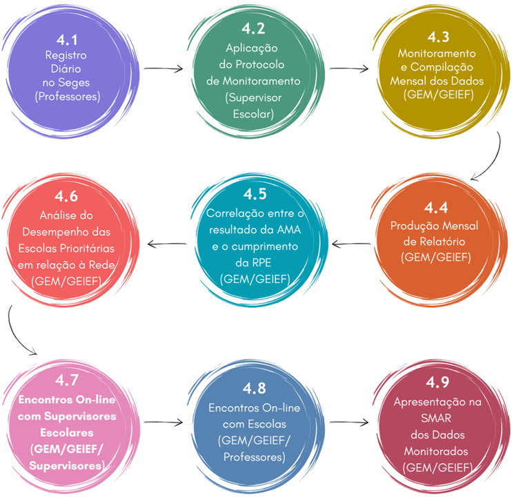

# Etapas do monitoramento

Neste capítulo das Diretrizes, apresentamos uma visualização das operações que constituem o Monitoramento da Rotina Pedagógica Escolar. O objetivo é oferecer um panorama preciso do Monitoramento, que propicie a compreensão dos procedimentos e das etapas dessa ação. A seguir, você encontrará um fluxograma que ilustra de maneira visual e concisa as etapas e inter-relações dos procedimentos que serão detalhados e discutidos a seguir. Este recurso visual serve como um guia prático, auxiliando na compreensão rápida e eficaz de todo o processo que será posteriormente descrito.

A metodologia adotada pela Sedu-Unidade Central para o monitoramento da Rotina Pedagógica Escolar compreende uma abordagem multifacetada, combinando dados coletados por diversos atores em diferentes instrumentos, a fim de obter uma visão abrangente e aprofundada da execução e dos resultados da RPE. Os principais componentes dessa metodologia são:

## Registro Diário no Sistema Estadual de Gestão Escolar - Seges (Professores)

Os professores são responsáveis por registrar diariamente no Seges o cumprimento ou não dos descritores e habilidades previstos na Rotina da semana, bem como os motivos para o seu cumprimento parcial ou não cumprimento. Esse registro é fundamental para a coleta contínua de dados sobre a execução da RPE e fornece uma visão geral do progresso nas turmas. As informações sobre o cumprimento dos descritores são utilizadas para calcular o percentual de turmas nas quais a RPE não foi integralmente aplicada para correlacionar o cumprimento (ou não cumprimento) da RPE ao desempenho do grupo amostral na AMA.

## Aplicação do Protocolo de Monitoramento pelo Supervisor Escolar durante as VTs do CdG

Antes da visita do Supervisor Escolar, O CP deve fazer um alinhamento com seus PCAs, a fim de preparar a escola para a VT, considerando o Protocolo do Supervisor.

O supervisor escolar, durante visitas técnicas específicas às escolas, aplica um protocolo de monitoramento junto à equipe (gestores, coordenadores pedagógicos, pedagogos e professores). Esse protocolo tem como objetivo aferir o cumprimento da RPE, identificar os desafios enfrentados pelas escolas e promover a reflexão sobre as práticas pedagógicas. O supervisor registra os principais apontamentos da escola na ata de Visita Técnica, no Sistema de Gestão para o Avanço Contínuo da Educação (Sigae) e em seu formulário de monitoramento, de modo a acompanhar as ações e a identificar necessidades de suporte. As informações registradas por meio do protocolo são utilizadas para analisar:

- o número de ano/série em que a RPE não foi cumprida ou foi parcialmente cumprida (Indicador de Execução);
- os fatores mais determinantes para o não cumprimento ou para o cumprimento parcial da RPE (Indicador de Execução);
- os fatores que mais impactam positivamente no cumprimento da RPE (Indicador de Execução);
- o nível de comprometimento dos professores com a execução da RPE (Indicador Envolvimento e Entendimento);
- o número de escolas prioritárias que incluíram o Monitoramento da RPE em seu Plano de Ação (Indicador Envolvimento e Entendimento);
- a consistência das ações e a execução das tarefas referentes ao Monitoramento da RPE incluídas no Plano de Ação das escolas (Indicador Envolvimento e Entendimento);
- o número de escolas que utilizaram os documentos fornecidos pela Sedu para desenvolver seu monitoramento interno da RPE (Indicador de Aprimoramento e Autonomia).

## Monitoramento e Compilação Mensal dos Dados Colhidos via Seges (GEM/GEIEF)

A Gerência de Ensino Médio (GEM) e a Gerência de Educação Infantil e Ensino Fundamental (GEIEF) monitoram e compilam mensalmente os dados colhidos via Seges, analisam as informações e compartilham com as SREs, a fim de subsidiar o trabalho dos supervisores escolares em suas futuras visitas. Em outras palavras, com periodicidade mensal, cada SRE e cada Supervisor conseguirá identificar as escolas mais fragilizadas em relação ao cumprimento da RPE, bem como os principais fatores que contribuíram para esse cenário.

## Produção Mensal de Relatório a ser Encaminhado à SEEB e Geceb (GEM/GEIEF)

A GEM e a GEIEF produzem mensalmente um relatório a ser encaminhado à Subsecretaria de Educação Básica (Seeb) e à Gerência de Currículo da Educação Básica (Geceb) com os pontos de atenção identificados no Monitoramento via Seges, sendo:

- quantitativo de turmas em que os descritores previstos pela RPE foram cumpridos;
- quantitativo de turmas em que os descritores previstos pela RPE não foram cumpridos ou foram cumpridos parcialmente, bem como os fatores mais determinantes para tal.

Esse relatório visa identificar pontos de atenção na execução da RPE, com vistas a planejar e a direcionar ações de intervenção para sanar as fragilidades em tempo hábil (antes do fim do trimestre letivo).

## Análise dos resultados da AMA e o cumprimento da RPE (GEM/GEIEF)

A Sedu Central, por meio da GEM e da GEIEF, realiza a análise dos resultados da AMA de forma abrangente, considerando diferentes recortes e comparações:

- **Rede -** análise do percentual de acerto da rede na AMA por etapa e por componente curricular, identificando os descritores com menor percentual de acerto por ano/série.
- **Escolas Prioritárias -** comparativo do percentual de acerto na AMA entre a rede e as Escolas Prioritárias por etapa e por componente curricular, bem como um comparativo do percentual de acerto dos descritores mais frágeis na AMA entre a rede e as Escolas Prioritárias por ano/série e por componente curricular.
- **Seleção de Grupo Amostral -** seleção de um grupo amostral estratégico, composto por oito escolas da rede, escolhidas com base em seu desempenho na Avaliação de Monitoramento da Aprendizagem (AMA): quatro escolas com o maior percentual de acerto e quatro escolas com o menor percentual de acerto. A seleção considerará os resultados do 9.º ano do Ensino Fundamental e da 3.ª série do Ensino Médio, por componente curricular.
- **Comparativo do Desempenho do Grupo Amostral -** comparativo detalhado entre o desempenho do grupo e o da rede como um todo. Esse comparativo abrange o percentual de acerto na AMA por etapa e por componente curricular, permitindo identificar se o grupo amostral apresenta um desempenho significativamente diferente da média da rede. Adiciona-se a essa análise um comparativo específico do
percentual de acerto dos descritores mais fragilizados entre a rede e o grupo amostral, por ano/série e por componente curricular. Esse comparativo permitirá identificar se o grupo amostral enfrenta desafios específicos em relação a determinados conteúdos ou habilidades.

A análise dos resultados da Avaliação de Monitoramento da Aprendizagem fornece dados valiosos sobre a eficácia da RPE, permitindo identificar áreas de sucesso e desafios a serem superados, orientando a tomada de decisões e o aprimoramento contínuo das práticas pedagógicas.

## Análise do Desempenho das Escolas Prioritárias em relação à Rede (GEM/GEIEF)

A Gerência de Ensino Médio e a Gerência de Educação Infantil e Ensino Fundamental realizam uma análise comparativa detalhada do desempenho das escolas prioritárias em relação ao desempenho da rede como um todo. Essa análise visa identificar disparidades e avaliar o impacto da RPE nas escolas que demandam maior atenção. A comparação será feita em níveis diversos:

- **Desempenho Geral:** comparativo entre o percentual de acerto na AMA da rede e das escolas prioritárias, por etapa e por componente curricular. Essa análise permitirá identificar se as escolas prioritárias apresentam um desempenho inferior, similar ou superior ao da rede como um todo.
- **Descritores Fragilizados:** comparativo específico entre o percentual de acerto dos descritores mais fragilizados da AMA (isto é, aqueles com menor índice de acerto) na rede e nas escolas prioritárias, por ano/série e por componente curricular. Essa análise permitirá identificar se as escolas prioritárias enfrentam dificuldades específicas em relação a determinados descritores ou habilidades, em comparação com a rede.

A partir dessa análise comparativa, será possível identificar áreas de maior necessidade nas escolas prioritárias e direcionar ações e recursos de forma mais eficaz, visando a melhoria do desempenho dos estudantes e a redução das desigualdades.

## Encontros On-line com Supervisores Escolares (GEM/GEIEF/Supervisores)

- A cada trimestre, a GEM e a GEIEF promovem encontros on-line com os supervisores escolares. O objetivo desses encontros é discutir os resultados do monitoramento da RPE nas escolas, identificar os desafios enfrentados pelos supervisores em campo e alinhar estratégias de apoio e intervenção. Os dados coletados nas etapas anteriores (Seges, Protocolo do Supervisor e Análise de Dados AMA) serão utilizados como base para as discussões e para a identificação de ações de aprimoramento do trabalho dos supervisores.

## Encontros On-line com as Escolas (GEM/GEIEF/Professores)

A cada trimestre, a GEM e a GEIEF promovem encontros on-line com professores representantes de escolas com os resultados mais significativos (2 escolas com menor e

2 escolas com maior percentual de acerto na AMA por etapa e por componente curricular). Esses encontros têm como objetivo promover a escuta dos docentes, compartilhar boas práticas e ajustar estratégias para garantir a melhoria contínua no desenvolvimento e no cumprimento das rotinas. Os dados aferidos nas etapas anteriores (Seges, Protocolo do Supervisor e Análise de Dados AMA) subsidiam as discussões e a identificação de ações de aprimoramento.

## Apresentação na SMAR dos Dados Monitorados (GEM/GEIEF)

As sínteses dos resultados são apresentadas ao Secretário e aos Subsecretários durante a Sistemática de Monitoramento e Avaliação de Resultados (SMAR), após cada uma das etapas de coleta e análise dos dados do monitoramento. Essa apresentação inclui os dados de cumprimento e de não cumprimento da RPE (bem como os motivos para o seu cumprimento parcial ou para o seu não cumprimento) aferidos no Seges, além dos dados do Protocolo do Supervisor e dos resultados da AMA. O objetivo é informar os gestores sobre o andamento da RPE, identificar os desafios e as necessidades de suporte e definir as ações de aprimoramento a serem implementadas.

A combinação desses diferentes instrumentos e abordagens de coleta de dados permite obter uma visão abrangente e aprofundada da execução e dos resultados da RPE, possibilitando o acompanhamento contínuo, a identificação de desafios e a implementação de ações de aprimoramento para garantir o sucesso da Rotina Pedagógica Escolar e a recomposição das aprendizagens.
