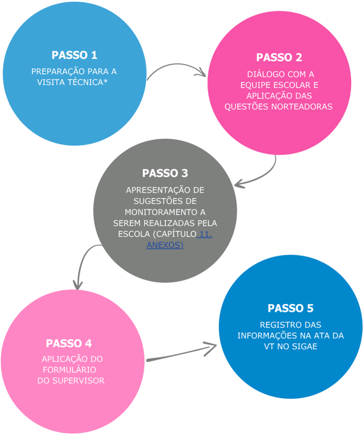

# Roteiro do monitoramento

O protocolo deverá ser aplicado na ocasião das Visitas Técnicas do Circuito de Gestão durante as Etapas de Execução.

## Passo a passo do protocolo de monitoramento

* As Visitas Técnicas voltadas ao Monitoramento da RPE deverão acontecer durante as Visitas Pedagógicas da Etapa de Execução.

## Detalhamento do passo a passo

### Passo 1 - Preparação para a visita técnica (durante as Visitas Pedagógicas da Etapa de Execução)

- Estudar as perguntas norteadoras que guiarão o diálogo com a equipe gestora.

### Passo 2 - Diálogo com a equipe escolar e aplicação das questões norteadoras

- Conduzir uma reflexão sobre as ações desenvolvidas pela escola quanto à RPE, com base nas Questões Norteadoras;
- Apoiar a escola na identificação dos desafios e na proposição de soluções conjuntas para aprimorar a execução da RPE;
- Identificar o envolvimento da equipe escolar com a Rotina Pedagógica.

### Passo 3 - Apresentação de sugestões de monitoramento a serem realizadas pela escola

- Compartilhar com os gestores escolares as Sugestões de Monitoramento da RPE pela Escola (capítulo 11. ANEXOS), ressaltando que se tratam de sugestões adaptáveis à realidade de cada escola*;
- Destacar estratégias para aprimorar a execução da Rotina Pedagógica;
- Incentivar a implementação de boas práticas e ajustes na execução da RPE, conforme necessidade.
- * Caso a escola já tenha ferramentas de monitoramento funcionais, explorar estas já existentes.

### Passo 4 - Aplicação do Formulário do Supervisor

- Aplicar o Formulário do Supervisor Escolar junto à equipe pedagógica para verificar o uso e a conclusão dos Materiais Estruturados;
- O formulário deve contemplar a verificação de cada ano/série quanto à conclusão das rotinas pedagógicas no mês anterior;
- Identificar os motivos para não conclusão dos materiais, caso não aplicável.

### Passo 5 - Registro das informações no SIGAE

- Elaborar uma síntese das respostas obtidas durante a discussão com a equipe pedagógica;
- Registrar os apontamentos na ata da VT no SIGAE.
