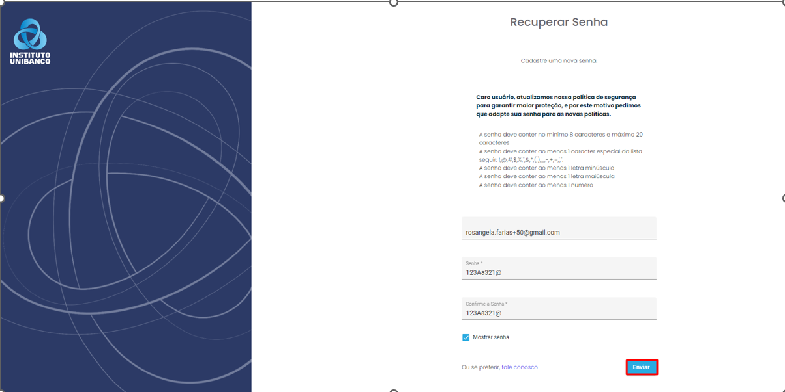
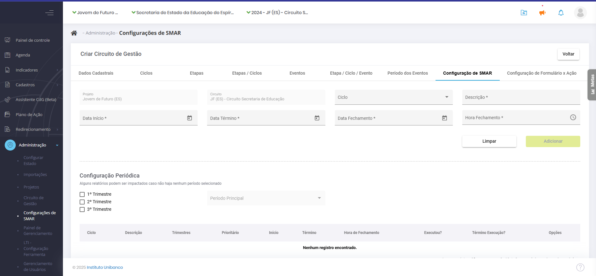
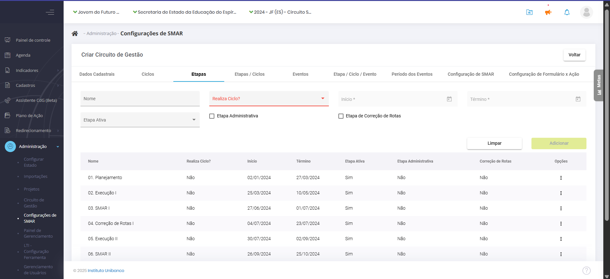
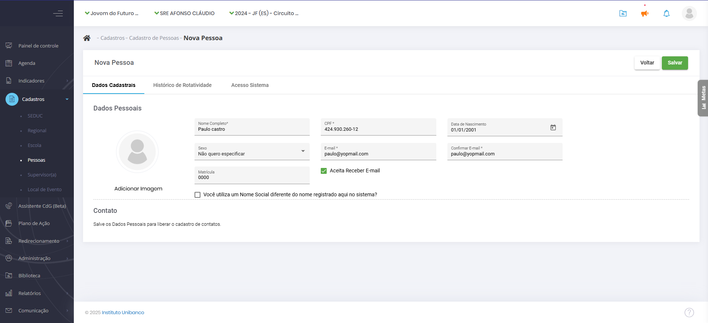
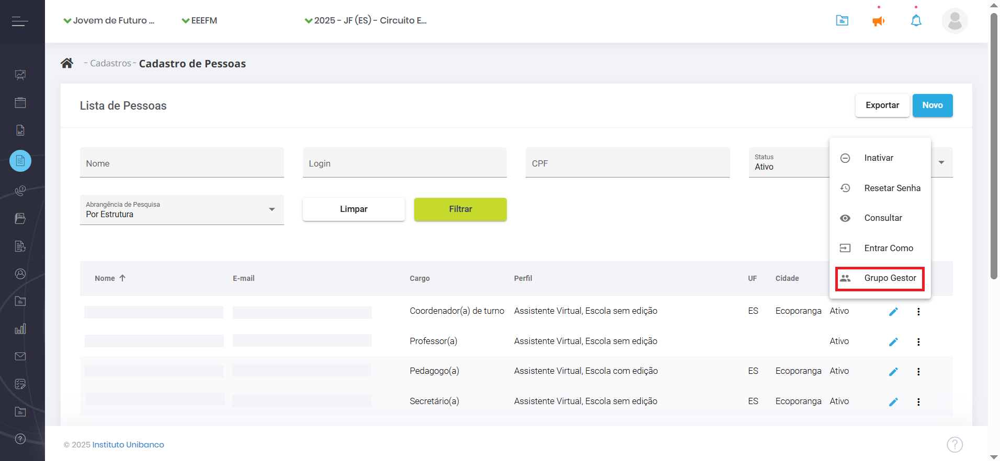
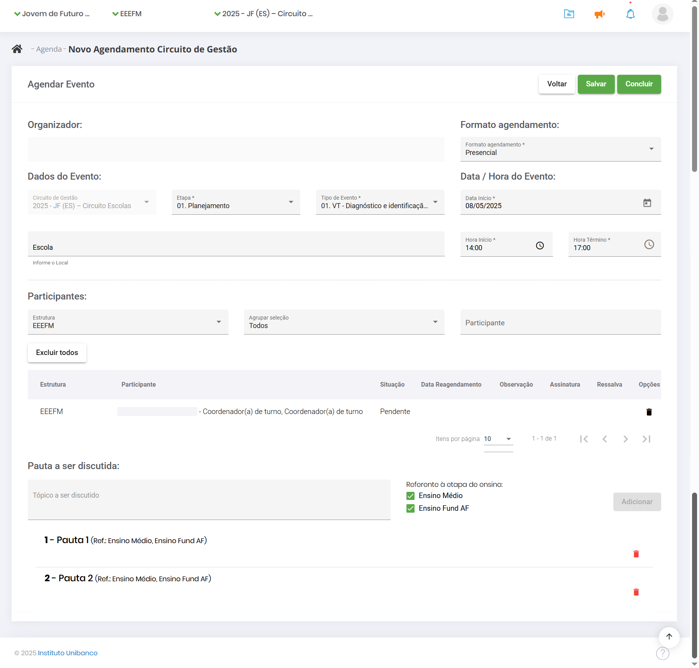
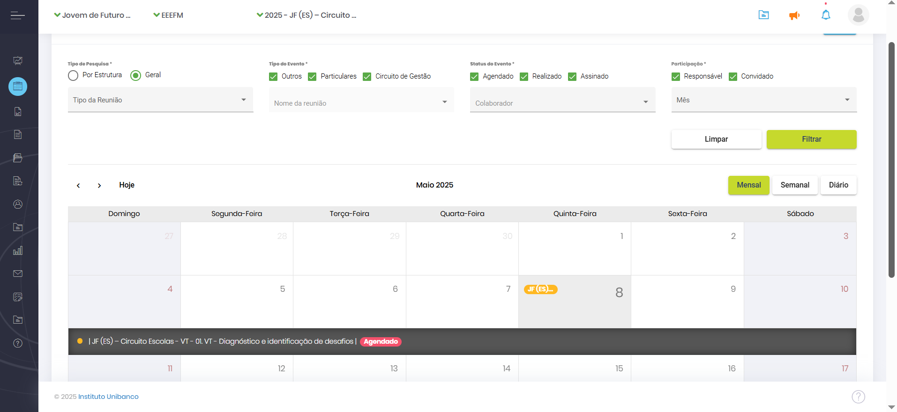
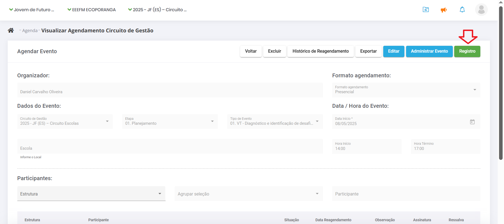
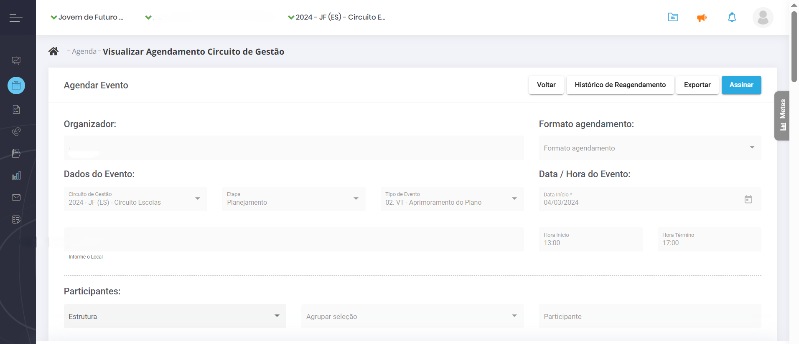

# **2. Funcionalidades gerais**

## 2.1. Login e senha

Abra seu navegador e vá para [https://sigae.institutounibanco.org.br/portal/login](https://sigae.institutounibanco.org.br/portal/login). Preencha os campos de login e senha com seus dados cadastrados. Marque a opção que você não é um robô e, depois, em “**Entrar**”.

Caso seja o seu primeiro acesso, aguarde o e-mail com o link para criar sua senha.

Você pode fazer login da seguinte forma:

1. **CPF:** Digite seu CPF (exemplo: 123.456.789-00);
2. **E-mail:** Digite seu e-mail (exemplo: pessoa.tal@sedu.es.gov.br).

<table>
	<tbody>
		<tr>
			<td><strong>Observação:</strong> Se houver outro usuário com o mesmo login, um número será adicionado para diferenciar ou você poderá usar seu CPF ou e-mail cadastrado.</td>
		</tr>
	</tbody>
</table>

Se não souber sua senha, clique em "**Esqueceu sua senha?**". Solicite uma nova ou entre em contato com o “Fale Conosco” (ligação gratuita).

**Senha**

Garanta que sua senha atenda aos seguintes critérios:

-   **Comprimento:** Tenha entre 8 e 20 caracteres;
-   **Caracteres especiais:** Inclua pelo menos 1 dos seguintes: `!,@,#,$,%, ̈,&,*,(,),_,-,+,=,’,”`;
-   **Letras minúsculas:** Inclua pelo menos 1 letra minúscula;
-   **Letras maiúsculas:** Inclua pelo menos 1 letra maiúscula;
-   **Números:** Inclua pelo menos 1 número.

O SIGAE trabalha com a confirmação em duas etapas, de modo que, após realizar o acesso com login e senha, você será direcionado para a página de validação do código de acesso. Um código de cinco dígitos será gerado e enviado para o e-mail utilizado em seu cadastro. Cole o token no campo indicado e clique em “**Validar**”. Caso não tenha recebido o código ou o mesmo tenha se perdido, clique em “**Reenviar código de acesso**” para gerar um novo código*.*

**Dica:** Verifique a caixa de spam do seu e-mail caso o código não esteja na caixa de entrada.

## 2.2. Recuperação de senha

Para recuperar sua senha, clique na opção “**Esqueceu sua senha?**” e informe o login cadastrado para receber um link e cadastrar uma nova senha.

Aguarde o envio de um **link** para o e-mail cadastrado. Abra o e-mail, clique no link recebido e siga as instruções no sistema para criar uma nova senha.

De volta ao sistema, será exibida uma tela para que uma nova senha seja cadastrada. Não há restrição quanto às últimas senhas utilizadas. Portanto, a senha anterior pode ser novamente cadastrada.

## 2.3. Criação das etapas

Para adicionar as etapas, acesse o SIGAE, no menu, clique em **Administração**, depois em **Circuito de Gestão**. Escolha a instância, na aba de **Etapa**. Para atribuir o Circuito de Gestão a uma escola, por exemplo, é no cadastro da escola, em **Projeto**.

Comece selecionando a instância desejada. Selecione o Circuito de Gestão criado para o ano corrente. Preencha a etapa a ser inserida. No campo “Realiza Ciclo?” selecione a opção “Não”. Preencha as datas de início e término da etapa para a instância selecionada. Ative a etapa apenas quando quiser disponibilizar o agendamento para os usuários (pode ser editado posteriormente) e clique em **Adicionar.**

Repita o processo para as demais instâncias.

## 2.4. Cadastro de novo usuário

Faça login no SIGAE como responsável pelo cadastro de cada instância.

No Painel de Controle, selecione a estrutura da qual o novo usuário faz parte (Sedu, SRE ou escola) usando o **filtro master** superior da tela.

Clique em "**Cadastro**" no menu principal e, em seguida, selecione a opção "**Pessoas**".

Clique no botão “**Novo**”, em azul na parte superior da tela.

Preencha os campos obrigatórios na tela de cadastro: **nome**, **CPF** e **e-mail**. Comece pelo CPF, pois se o usuário já estiver cadastrado, os demais dados serão preenchidos automaticamente.

Após preencher os dados obrigatórios, clique em “**Salvar**”. Confirme o vínculo à estrutura associada clicando em “**Sim**” na mensagem de sucesso do cadastro. Selecione o **cargo** da pessoa na nova mensagem exibida. Em seguida, escolha o **perfil de acesso** que ela terá no sistema na mesma tela.

Existem duas modalidades de perfis de acesso ao SIGAE: consulta e edição. Como os nomes indicam, o primeiro perfil permite ao usuário apenas consultar as informações exibidas no SIGAE, enquanto o último permite alterá-las.

Ao final, será exibida a **data corrente**, com possibilidade de alteração, para que seja possível informar quando a pessoa iniciou seus trabalhos na estrutura a que está associada. Assim que clicar em “**Salvar**”, será enviado um e-mail para o endereço cadastrado no SIGAE, permitindo que o novo usuário crie sua senha.

Após a finalização, a pessoa recém-cadastrada deverá aparecer na listagem da sua instância, podendo ser localizada pelos filtros de nome, login ou CPF.

### 2.4.1. Como editar o cadastro de um usuário

É provável que ocorram alterações na estrutura da instância, que podem resultar na realocação de cargos ou substituição de pessoas. Nos casos em que é necessário alterar o cargo do profissional, selecione a estrutura da qual o novo usuário faz parte (Sedu, SRE ou escola) usando o **filtro master** superior da tela. Clique em "**Cadastro**" no menu principal e, em seguida, selecione a opção "**Pessoas**". Localize o cadastro do gestor e clique em “**Editar Pessoa**” identificado pelo ícone de um lápis azul. Nesta janela dividida em três abas é possível alterar todos os dados do gestor, **exceto o** **CPF**.

Na aba “**Dados Cadastrais**” altere os dados pessoais. Na aba “**Histórico de Rotatividade**” a alteração é feita por meio da adição do novo cargo e a exclusão do antigo. Para adicionar o novo cargo, basta selecionar as opções “**Estrutura**”, “**Função**”, “**Etapa de Ensino**” e “**Data de Início**”. Para excluir o antigo cargo, clique em “**Editar Rotatividade**”, representado pelo ícone de lápis azul. Ao clicar, o campo “**Data de Término**” ficará disponível para preenchimento. Atribua a data corrente e clique em “**Alterar**”, isto fará com o que o cargo seja encerrado.

Para dar acesso à plataforma para o participante, o último passo é clicar na aba “**Acesso Sistema**”. Selecione o perfil na lista suspensa e atribua a data corrente no campo “Data início”. Posteriormente, clique em “Adicionar”. Pronto, foi dado acesso ao sistema para o participante.

**Atenção\!** Lembre-se sempre de encerrar o cargo, senão o usuário aparecerá no SIGAE com dois cargos distintos.

### 2.4.2. Como eleger o Grupo Gestor

A identificação dos responsáveis pela gestão da instância dentro do SIGAE é um passo importante, principalmente no que se refere aos agendamentos dos eventos componentes do Circuito de Gestão.

Para selecionar os usuários, clique em "**Cadastro**" no menu principal e, em seguida, selecione a opção "**Pessoas**". Identificada a pessoa, clique nos três pontos no canto direito e selecione a opção “**Grupo Gestor**”.

Uma nova janela se abrirá. Selecione a pessoa, a função no grupo e a data de início e depois clique em “**Adicionar**". Preenchido todos os campos, clique em “**Adicionar**”. Pronto, o participante foi adicionado.

## 2.5. Como realizar ou editar agendamentos

Para fazer o agendamento de eventos como Visitas Técnicas, comece fazendo login no sistema com os seus dados e clicando no reCAPTCHA para assinalar que não é um robô. Clique em “**Entrar**”.

Para iniciar o agendamento, clique em “**Agenda**”, no menu lateral.

Aparecerá uma tela de calendário. É possível fazer uma pesquisa por estrutura ou geral. No tipo de evento, há as opções “**Outros**”, “**Particulares**” e “**Circuito de Gestão**”, para centralizar todos os eventos da escola ou da regional em um único calendário, que pode ser visualizado em 3 configurações à sua escolha: mensal, semanal ou diário. Para agendar um novo evento, clique em “**Novo**” e “**Circuito de Gestão**”, no topo.

Selecione o tipo de evento. Para o supervisor que quer agendar uma Visita Técnica com uma de suas escolas, por exemplo, no filtro master, selecione a escola para a qual vai realizar o agendamento. O campo “**Organizador”** será o seu nome de usuário. Em seguida, escolha o **formato** do agendamento: remoto ou presencial. Marque a **etapa** do Circuito de Gestão à qual o evento se refere e o evento em si. Preencha a **data**, o **local**, o **horário** de início e de término.

Role a página para baixo para selecionar os **participantes**. No campo “**Estrutura**”, confirme a seleção da escola. Depois, você pode selecionar um **agrupamento**: Todos, Dupla Gestora da Escola ou Grupo Gestor da Escola. Ao clicar em “**Participante**”, vão aparecer todas as pessoas da escola que estão cadastradas no sistema.

Depois de adicionar os participantes, role a página mais um pouco para cadastrar as **pautas** a serem discutidas. É importante que cada pauta seja cadastrada separadamente. Isso vai facilitar no momento do registro. Preencha e clique em “**Adicionar**” para cada uma delas. Para finalizar, clique em “**Concluir**” na parte superior da página. O sistema exibirá uma mensagem de que o agendamento foi efetuado com sucesso.

Para **editar um agendamento**, pelo Painel de Controle na página inicial, navegue pelo módulo de agenda, que indica os dias em que há eventos. Ao clicar em um deles, é exibido o nome do evento e, clicando novamente, abre-se uma ficha com todos os detalhes. Na parte superior da página, clique em “**Editar**”, mude as informações necessárias (data, pautas, participantes etc.) e clique em “**Concluir**”. O sistema exibirá uma mensagem de que o agendamento foi efetuado com sucesso.

## 2.6. Como incluir o registro de um evento

Após a realização de um evento, é necessário realizar o registro do que foi discutido. O SIGAE permite registrar as reuniões por instância e monitora as postagens dos registros de acordo com as reuniões previstas. Os registros possuem 3 status:

-   Agendado – Informa os participantes que haverá a reunião, exibindo os pontos que serão discutidos.
-   Realizado – Quando a descrição do que aconteceu é postado pelo responsável.
-   Assinado – Quando pelo menos um participante assina o registro, confirmando sua participação e atestando que o relato é coerente com os pontos discutidos.

No menu principal clique em “**Painel de Controle**”, navegue no módulo de Agenda e clique no evento para exibir os detalhes.

Na parte superior da página, clique em “**Registro**”.

Um novo formulário vai abrir para registrar a presença dos participantes convidados, marcando a opção “Compareceu”. Quem não foi, não deve ser marcado. Abaixo, é hora de registrar as pautas. Há a opção “**Tópico não discutido**”, caso um assunto não tenha sido abordado. Para as pautas discutidas, faça um breve resumo. Se novos temas tiverem sido abordados, clique em “**Adicionar**” para incluir.

Também é possível anexar arquivos que ilustram o que foi discutido na reunião. Além disso, registre os encaminhamentos, clicando no botão “**Novo Encaminhamento**”. Faça uma breve descrição da atividade relacionada a ele. Selecione o responsável, que deve ser algum dos presentes na reunião, a data de início da atividade e a data de término. Clique em “**Salvar**”.

Após registrar a presença dos profissionais, as pautas discutidas e os encaminhamentos, suba a página e clique em “**Concluir**”. Os encaminhamentos inseridos no registro dos eventos precisam de apoio das instâncias superiores para serem resolvidos, por isso, registre-os com bastante cuidado.

## 2.7. Como assinar o registro de um evento

No Painel de Controle, no topo, ao lado do perfil do usuário, aparecem três ícones. O primeiro, em formato de pasta, é da **biblioteca**, quando você tiver novos arquivos. O segundo é um megafone, para **comunicados**. E, por fim, um sino para **notificações**, que vai exibir quando houver o registro de um evento.

Após a inclusão do registro do evento, todos que estavam presentes e que foram convidados (mesmo se não tiverem comparecido), recebem a notificação de que o registro foi incluído. Você pode clicar direto na notificação para conferir a lista de presença, a pauta discutida e os encaminhamentos. No topo da página, há o botão de “**Assinar**”.

Há outro caminho para encontrar o registro dos eventos. Na página inicial do Painel de Controle, no calendário da agenda, basta encontrar o evento que já foi realizado. Ao passar o mouse sobre ele, são exibidas as informações do tipo de evento, data, horário e status. Para assinar a ata, é só clicar e selecionar o evento para exibir a página com detalhes, conferir todos os dados e clicar em “**Assinar**” no topo da página.

Ao assinar o registro, é exibida uma caixa de mensagem sobre **ressalvas**, onde você pode incluir algum encaminhamento ou algum item de pauta que não foi mencionado. Depois de incluir a sua ressalva, se você tiver alguma, é só clicar em “**Assinar**” e o sistema exibirá a informação de que o registro foi assinado com sucesso.

Após feitos os registros do evento, o **status** muda de “**Agendado**” para “**Realizado**”. Ao entrar no Painel de Controle e ir em Agenda e passar o mouse por cima do evento (Realizado), ao clicar neste evento, aparece o botão azul "**Assinar**". Quando o evento é assinado, o seu status muda de “**Realizado**” para “**Assinado**”.

Lembre-se que é possível filtrar os eventos por status (agendado, realizado ou assinado). É só selecionar as opções que deseja no filtro superior e clicar em “**Filtrar**” para ver só os itens que você selecionou.

