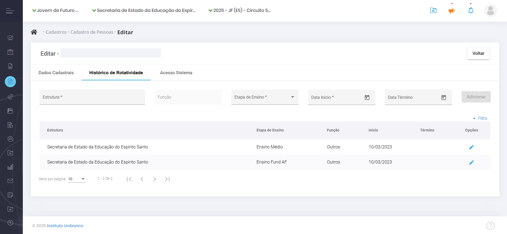
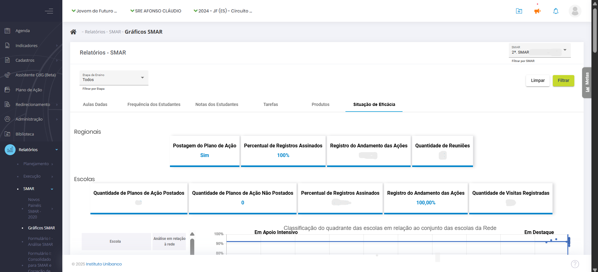
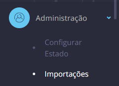
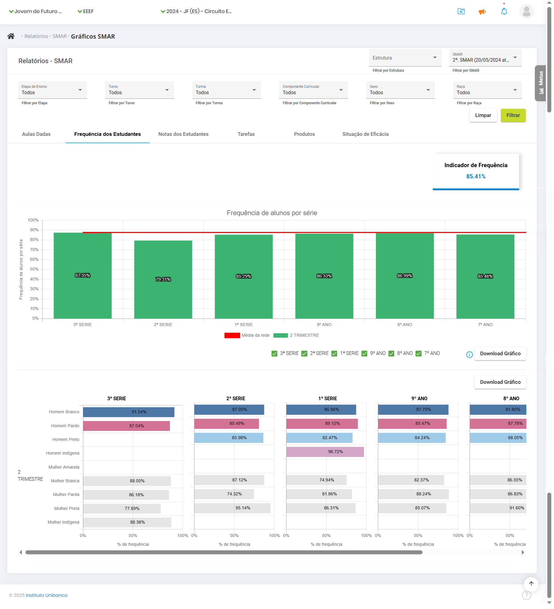

# 1. A importância do SIGAE

O SIGAE (Sistema de Gestão para o Avanço Contínuo da Educação) é uma plataforma digital desenvolvida pelo Instituto Unibanco para fortalecer a implementação do Circuito de Gestão (CdG) nos territórios de atuação. Por meio dela, é possível planejar, monitorar e avaliar a gestão da educação pública no Ensino Fundamental \- Anos Finais e Ensino Médio com ações em tempo real, de maneira simples, rápida e atualizada.

O SIGAE permite visualizar informações, dados, gráficos e emitir relatórios que fornecem um panorama da situação atual das escolas, das Superintendências Regionais de Ensino (SRE) e da Secretaria com relação à implementação do Circuito de Gestão. Sua atualização constante é fundamental para apoiar o trabalho dos profissionais envolvidos. Seu preenchimento não se trata de um processo burocrático ou formal, e sim parte importante do processo de alcance dos objetivos estratégicos da Secretaria.

## 1.1. Funcionalidades do SIGAE

O SIGAE permite:

-   Visualizar informações, dados e gráficos;
-   Emitir relatórios sobre a situação atual das escolas, Superintendências Regionais de Educação (SREs) e da Secretaria em relação à implementação do Circuito de Gestão (CdG).

Manter os dados atualizados é essencial para apoiar o trabalho dos profissionais envolvidos e alcançar as metas da Sedu. O preenchimento do sistema não é apenas uma formalidade burocrática, mas parte crucial desse processo.

## 1.2. Acesso ao SIGAE

O SIGAE pode ser acessado em qualquer dispositivo (computadores, tablets, notebooks ou smartphones) pelo link: [https://sigae.institutounibanco.org.br](https://sigae.institutounibanco.org.br)

## 1.3. Suporte e Dúvidas

Para ajuda e informações relacionadas ao SIGAE e/ou Programa Jovem de Futuro:

-   **Telefone**: 0800 050 0064
-   **E-mail:** atendimento@jovemdefuturo.org.br

O atendimento é realizado das 8h às 20h de segunda a sexta-feira.

# **2. Funcionalidades gerais**

## 2.1. Login e senha

Abra seu navegador e vá para [https://sigae.institutounibanco.org.br/portal/login](https://sigae.institutounibanco.org.br/portal/login). Preencha os campos de login e senha com seus dados cadastrados. Marque a opção que você não é um robô e, depois, em “**Entrar**”.

Caso seja o seu primeiro acesso, aguarde o e-mail com o link para criar sua senha.

Você pode fazer login da seguinte forma:

1. **CPF:** Digite seu CPF (exemplo: 123.456.789-00);
2. **E-mail:** Digite seu e-mail (exemplo: pessoa.tal@sedu.es.gov.br).

<table>
	<tbody>
		<tr>
			<td><strong>Observação:</strong> Se houver outro usuário com o mesmo login, um número será adicionado para diferenciar ou você poderá usar seu CPF ou e-mail cadastrado.</td>
		</tr>
	</tbody>
</table>

Se não souber sua senha, clique em "**Esqueceu sua senha?**". Solicite uma nova ou entre em contato com o “Fale Conosco” (ligação gratuita).

**Senha**

Garanta que sua senha atenda aos seguintes critérios:

-   **Comprimento:** Tenha entre 8 e 20 caracteres;
-   **Caracteres especiais:** Inclua pelo menos 1 dos seguintes: `!,@,#,$,%, ̈,&,*,(,),_,-,+,=,’,”`;
-   **Letras minúsculas:** Inclua pelo menos 1 letra minúscula;
-   **Letras maiúsculas:** Inclua pelo menos 1 letra maiúscula;
-   **Números:** Inclua pelo menos 1 número.

O SIGAE trabalha com a confirmação em duas etapas, de modo que, após realizar o acesso com login e senha, você será direcionado para a página de validação do código de acesso. Um código de cinco dígitos será gerado e enviado para o e-mail utilizado em seu cadastro. Cole o token no campo indicado e clique em “**Validar**”. Caso não tenha recebido o código ou o mesmo tenha se perdido, clique em “**Reenviar código de acesso**” para gerar um novo código*.*

**Dica:** Verifique a caixa de spam do seu e-mail caso o código não esteja na caixa de entrada.

## 2.2. Recuperação de senha

Para recuperar sua senha, clique na opção “**Esqueceu sua senha?**” e informe o login cadastrado para receber um link e cadastrar uma nova senha.

Aguarde o envio de um **link** para o e-mail cadastrado. Abra o e-mail, clique no link recebido e siga as instruções no sistema para criar uma nova senha.

De volta ao sistema, será exibida uma tela para que uma nova senha seja cadastrada. Não há restrição quanto às últimas senhas utilizadas. Portanto, a senha anterior pode ser novamente cadastrada.

## 2.3. Criação das etapas

Para adicionar as etapas, acesse o SIGAE, no menu, clique em **Administração**, depois em **Circuito de Gestão**. Escolha a instância, na aba de **Etapa**. Para atribuir o Circuito de Gestão a uma escola, por exemplo, é no cadastro da escola, em **Projeto**.

Comece selecionando a instância desejada. Selecione o Circuito de Gestão criado para o ano corrente. Preencha a etapa a ser inserida. No campo “Realiza Ciclo?” selecione a opção “Não”. Preencha as datas de início e término da etapa para a instância selecionada. Ative a etapa apenas quando quiser disponibilizar o agendamento para os usuários (pode ser editado posteriormente) e clique em **Adicionar.**

Repita o processo para as demais instâncias.

## 2.4. Cadastro de novo usuário

Faça login no SIGAE como responsável pelo cadastro de cada instância.

No Painel de Controle, selecione a estrutura da qual o novo usuário faz parte (Sedu, SRE ou escola) usando o **filtro master** superior da tela.

Clique em "**Cadastro**" no menu principal e, em seguida, selecione a opção "**Pessoas**".

Clique no botão “**Novo**”, em azul na parte superior da tela.

Preencha os campos obrigatórios na tela de cadastro: **nome**, **CPF** e **e-mail**. Comece pelo CPF, pois se o usuário já estiver cadastrado, os demais dados serão preenchidos automaticamente.

Após preencher os dados obrigatórios, clique em “**Salvar**”. Confirme o vínculo à estrutura associada clicando em “**Sim**” na mensagem de sucesso do cadastro. Selecione o **cargo** da pessoa na nova mensagem exibida. Em seguida, escolha o **perfil de acesso** que ela terá no sistema na mesma tela.

Existem duas modalidades de perfis de acesso ao SIGAE: consulta e edição. Como os nomes indicam, o primeiro perfil permite ao usuário apenas consultar as informações exibidas no SIGAE, enquanto o último permite alterá-las.

Ao final, será exibida a **data corrente**, com possibilidade de alteração, para que seja possível informar quando a pessoa iniciou seus trabalhos na estrutura a que está associada. Assim que clicar em “**Salvar**”, será enviado um e-mail para o endereço cadastrado no SIGAE, permitindo que o novo usuário crie sua senha.

Após a finalização, a pessoa recém-cadastrada deverá aparecer na listagem da sua instância, podendo ser localizada pelos filtros de nome, login ou CPF.

### 2.4.1. Como editar o cadastro de um usuário

É provável que ocorram alterações na estrutura da instância, que podem resultar na realocação de cargos ou substituição de pessoas. Nos casos em que é necessário alterar o cargo do profissional, selecione a estrutura da qual o novo usuário faz parte (Sedu, SRE ou escola) usando o **filtro master** superior da tela. Clique em "**Cadastro**" no menu principal e, em seguida, selecione a opção "**Pessoas**". Localize o cadastro do gestor e clique em “**Editar Pessoa**” identificado pelo ícone de um lápis azul. Nesta janela dividida em três abas é possível alterar todos os dados do gestor, **exceto o** **CPF**.

Na aba “**Dados Cadastrais**” altere os dados pessoais. Na aba “**Histórico de Rotatividade**” a alteração é feita por meio da adição do novo cargo e a exclusão do antigo. Para adicionar o novo cargo, basta selecionar as opções “**Estrutura**”, “**Função**”, “**Etapa de Ensino**” e “**Data de Início**”. Para excluir o antigo cargo, clique em “**Editar Rotatividade**”, representado pelo ícone de lápis azul. Ao clicar, o campo “**Data de Término**” ficará disponível para preenchimento. Atribua a data corrente e clique em “**Alterar**”, isto fará com o que o cargo seja encerrado.

Para dar acesso à plataforma para o participante, o último passo é clicar na aba “**Acesso Sistema**”. Selecione o perfil na lista suspensa e atribua a data corrente no campo “Data início”. Posteriormente, clique em “Adicionar”. Pronto, foi dado acesso ao sistema para o participante.

**Atenção\!** Lembre-se sempre de encerrar o cargo, senão o usuário aparecerá no SIGAE com dois cargos distintos.

### 2.4.2. Como eleger o Grupo Gestor

A identificação dos responsáveis pela gestão da instância dentro do SIGAE é um passo importante, principalmente no que se refere aos agendamentos dos eventos componentes do Circuito de Gestão.

Para selecionar os usuários, clique em "**Cadastro**" no menu principal e, em seguida, selecione a opção "**Pessoas**". Identificada a pessoa, clique nos três pontos no canto direito e selecione a opção “**Grupo Gestor**”.

Uma nova janela se abrirá. Selecione a pessoa, a função no grupo e a data de início e depois clique em “**Adicionar**". Preenchido todos os campos, clique em “**Adicionar**”. Pronto, o participante foi adicionado.

## 2.5. Como realizar ou editar agendamentos

Para fazer o agendamento de eventos como Visitas Técnicas, comece fazendo login no sistema com os seus dados e clicando no reCAPTCHA para assinalar que não é um robô. Clique em “**Entrar**”.

Para iniciar o agendamento, clique em “**Agenda**”, no menu lateral.

Aparecerá uma tela de calendário. É possível fazer uma pesquisa por estrutura ou geral. No tipo de evento, há as opções “**Outros**”, “**Particulares**” e “**Circuito de Gestão**”, para centralizar todos os eventos da escola ou da regional em um único calendário, que pode ser visualizado em 3 configurações à sua escolha: mensal, semanal ou diário. Para agendar um novo evento, clique em “**Novo**” e “**Circuito de Gestão**”, no topo.

Selecione o tipo de evento. Para o supervisor que quer agendar uma Visita Técnica com uma de suas escolas, por exemplo, no filtro master, selecione a escola para a qual vai realizar o agendamento. O campo “**Organizador”** será o seu nome de usuário. Em seguida, escolha o **formato** do agendamento: remoto ou presencial. Marque a **etapa** do Circuito de Gestão à qual o evento se refere e o evento em si. Preencha a **data**, o **local**, o **horário** de início e de término.

Role a página para baixo para selecionar os **participantes**. No campo “**Estrutura**”, confirme a seleção da escola. Depois, você pode selecionar um **agrupamento**: Todos, Dupla Gestora da Escola ou Grupo Gestor da Escola. Ao clicar em “**Participante**”, vão aparecer todas as pessoas da escola que estão cadastradas no sistema.

Depois de adicionar os participantes, role a página mais um pouco para cadastrar as **pautas** a serem discutidas. É importante que cada pauta seja cadastrada separadamente. Isso vai facilitar no momento do registro. Preencha e clique em “**Adicionar**” para cada uma delas. Para finalizar, clique em “**Concluir**” na parte superior da página. O sistema exibirá uma mensagem de que o agendamento foi efetuado com sucesso.

Para **editar um agendamento**, pelo Painel de Controle na página inicial, navegue pelo módulo de agenda, que indica os dias em que há eventos. Ao clicar em um deles, é exibido o nome do evento e, clicando novamente, abre-se uma ficha com todos os detalhes. Na parte superior da página, clique em “**Editar**”, mude as informações necessárias (data, pautas, participantes etc.) e clique em “**Concluir**”. O sistema exibirá uma mensagem de que o agendamento foi efetuado com sucesso.

## 2.6. Como incluir o registro de um evento

Após a realização de um evento, é necessário realizar o registro do que foi discutido. O SIGAE permite registrar as reuniões por instância e monitora as postagens dos registros de acordo com as reuniões previstas. Os registros possuem 3 status:

-   Agendado – Informa os participantes que haverá a reunião, exibindo os pontos que serão discutidos.
-   Realizado – Quando a descrição do que aconteceu é postado pelo responsável.
-   Assinado – Quando pelo menos um participante assina o registro, confirmando sua participação e atestando que o relato é coerente com os pontos discutidos.

No menu principal clique em “**Painel de Controle**”, navegue no módulo de Agenda e clique no evento para exibir os detalhes.

Na parte superior da página, clique em “**Registro**”.

Um novo formulário vai abrir para registrar a presença dos participantes convidados, marcando a opção “Compareceu”. Quem não foi, não deve ser marcado. Abaixo, é hora de registrar as pautas. Há a opção “**Tópico não discutido**”, caso um assunto não tenha sido abordado. Para as pautas discutidas, faça um breve resumo. Se novos temas tiverem sido abordados, clique em “**Adicionar**” para incluir.

Também é possível anexar arquivos que ilustram o que foi discutido na reunião. Além disso, registre os encaminhamentos, clicando no botão “**Novo Encaminhamento**”. Faça uma breve descrição da atividade relacionada a ele. Selecione o responsável, que deve ser algum dos presentes na reunião, a data de início da atividade e a data de término. Clique em “**Salvar**”.

Após registrar a presença dos profissionais, as pautas discutidas e os encaminhamentos, suba a página e clique em “**Concluir**”. Os encaminhamentos inseridos no registro dos eventos precisam de apoio das instâncias superiores para serem resolvidos, por isso, registre-os com bastante cuidado.

## 2.7. Como assinar o registro de um evento

No Painel de Controle, no topo, ao lado do perfil do usuário, aparecem três ícones. O primeiro, em formato de pasta, é da **biblioteca**, quando você tiver novos arquivos. O segundo é um megafone, para **comunicados**. E, por fim, um sino para **notificações**, que vai exibir quando houver o registro de um evento.

Após a inclusão do registro do evento, todos que estavam presentes e que foram convidados (mesmo se não tiverem comparecido), recebem a notificação de que o registro foi incluído. Você pode clicar direto na notificação para conferir a lista de presença, a pauta discutida e os encaminhamentos. No topo da página, há o botão de “**Assinar**”.

Há outro caminho para encontrar o registro dos eventos. Na página inicial do Painel de Controle, no calendário da agenda, basta encontrar o evento que já foi realizado. Ao passar o mouse sobre ele, são exibidas as informações do tipo de evento, data, horário e status. Para assinar a ata, é só clicar e selecionar o evento para exibir a página com detalhes, conferir todos os dados e clicar em “**Assinar**” no topo da página.

Ao assinar o registro, é exibida uma caixa de mensagem sobre **ressalvas**, onde você pode incluir algum encaminhamento ou algum item de pauta que não foi mencionado. Depois de incluir a sua ressalva, se você tiver alguma, é só clicar em “**Assinar**” e o sistema exibirá a informação de que o registro foi assinado com sucesso.

Após feitos os registros do evento, o **status** muda de “**Agendado**” para “**Realizado**”. Ao entrar no Painel de Controle e ir em Agenda e passar o mouse por cima do evento (Realizado), ao clicar neste evento, aparece o botão azul "**Assinar**". Quando o evento é assinado, o seu status muda de “**Realizado**” para “**Assinado**”.

Lembre-se que é possível filtrar os eventos por status (agendado, realizado ou assinado). É só selecionar as opções que deseja no filtro superior e clicar em “**Filtrar**” para ver só os itens que você selecionou.

# 3. Como cadastrar o Plano de Ação

Para cadastrar, clique no menu lateral em “**Plano de Ação**”.

Depois clique em “**Novo Plano de Ação**”.

A tela de cadastro do Plano de Ação começa com o campo para descrição e um espaço para anexar arquivos, onde você pode adicionar o projeto político pedagógico da escola. Na descrição, use um título direto, por exemplo, Plano de Ação da Escola Estadual X.

Após descrever o Plano de Ação, clique em “**Próximo**”.

Neste momento, o sistema irá exibir a seguinte mensagem: “Você irá alterar o status do Plano de Ação. Deseja continuar?”. Quando você clica em “**Sim**”, você muda o status do seu Plano para “**Em diagnóstico**”.

Para começar a elaboração do Plano, na aba “**Situação**”, escolha os **Objetivos Estratégicos,** bem como os componentes do IDEBES que serão trabalhados. Após selecioná-los na caixa de seleção lateral, clique em “**Próximo**”.

Na aba “Diagnóstico”, para cada componente selecionado, **descreva um problema**, selecione a **etapa** de ensino, responda se o problema é ou não da **governabilidade** da escola e preencha o campo “**Desafio interno**”. Em seguida, selecione a **categoria** do problema: pedagógico, gestão de pessoas, comunicação e mobilização ou administrativo-financeiro.

Os problemas que não são da governabilidade da escola vão compor o Painel de Riscos da SRE à qual a escola pertence. Não é possível preencher o resultado esperado para eles, mas a prioridade e a categoria, sim. Depois, clique em “**Adicionar**” para incluí-los no Plano. O mesmo processo deve ser feito para todos os objetivos selecionados na etapa anterior. Cabe ressaltar que todos os componentes devem ter pelo menos um problema de governabilidade da sua instância.

Após o cadastro de um resultado, você pode aproveitá-lo no registro de outro problema.  
Ou seja, se a resolução de dois problemas contribui para o alcance de um mesmo resultado, você pode aproveitar um resultado já cadastrado.

Quando você tiver registrado os problemas da sua governabilidade para todos os componentes selecionados, o sistema exibirá o botão “**Próximo**” para passar para a etapa seguinte do seu Plano de Ação.

Na tela a seguir, na aba “**Planejamento**”, o sistema exibirá todos os objetivos, componentes e desafios que você quer alcançar, registrados na etapa anterior. Se for uma escola multinível, será exibida uma coluna a respeito da etapa de ensino (Fundamental ou Médio). Clique nos três pontinhos na coluna de “Opções” e em “**Adicionar ação**”.

Na tela de cadastro da ação, preencha o nome da ação, uma breve descrição, público-alvo, categoria, produto, resultado esperado e escolha os colaboradores envolvidos. Na lista de pessoas da escola ou da regional cadastradas no sistema, selecione uma delas para ser o responsável – todas as ações devem ter um responsável. Clique em “**Adicionar**” e, na sequência, em “**Salvar**”. O sistema exibirá a mensagem de ação cadastrada com sucesso.

Toda ação deve ser desmembrada em pedaços menores, que são as tarefas. Após cadastrar e salvar a ação, clique na aba ao lado, “**Tarefas**”. Preencha o nome da tarefa,  
a data na qual ela se inicia e a data de término. Se houver algum custo relacionado a ela, preencha o campo do valor previsto e clique em “**Salva**r”.

Após salvar a tarefa, o sistema pedirá para cadastrar um responsável por aquela tarefa em específico. Escolha a partir dos usuários cadastrados na sua instância: regional, secretaria ou escola. Após a tarefa descrita e o responsável definido, clique em “**Fechar**”.

Depois de cadastrar as ações e as tarefas, o sistema volta para a tela dos resultados, agora com uma lista das ações e tarefas vinculadas. Se houver falha no preenchimento de alguma informação, como falta do responsável, a tarefa aparecerá em uma linha vermelha. Para corrigir ou para editar qualquer outra informação relacionada, como data de início e de término, clique no lápis à direita. Corrija, clique em “**Salvar**” e no X para fechar.

Com todas as ações e tarefas cadastradas, o sistema exibirá o botão “**Concluir Planejamento**”. Após clicar, confirme com “**Sim**”.

Depois do registro das tarefas, o Plano de Ação fica com o status de “**Elaborado**”. Se não houver alterações, o processo de planejamento está terminado.

## 3.1. Análise de Eficácia do Plano de Ação

A eficácia do Plano de Ação na SMAR mensura a capacidade do Plano de produzir efeitos sobre a realidade escolar, uma vez que demonstra se a sua realização vem contribuindo para gerar resultados de aprendizagem com garantia de acesso, permanência e aprendizagem com redução das desigualdades.

Os gráficos de indicadores permitem comparar os dados da escola em relação ao conjunto de escolas que implementam o Circuito de Gestão na rede.

A análise de eficácia é exibida juntamente com as outras abas da SMAR e, mesmo nela, há comparações de Execução \- Plano de Ação (Tarefas e Produtos) e Resultados \- Aula, Frequência e Notas. Para acessar, o caminho é: Menu \> Relatórios \> SMAR \> Gráficos SMAR \> Aba: Situação de Eficácia.

# 4. Como fazer o registro da Execução do Plano de Ação

Para registrar a execução do Plano de Ação da escola, comece fazendo login no sistema. No Painel de Controle, na tela inicial, vá ao menu lateral, clique no item “**Plano de Ação”**. A tela vai exibir os Planos da escola, da SRE e da Secretaria, sendo os das instâncias superiores somente para consulta.

A partir da primeira atualização de execução, o Plano muda do status “Elaborado” para o status “Em execução”. Para atualizar, clique nos três risquinhos, na coluna “**Opções**”, referentes à execução e hierarquia. Nesse momento, o sistema vai carregar todo o seu Plano com os objetivos, os resultados, as ações e as tarefas planejadas.

Na coluna de status, a sinaleira indica: vermelho para uma tarefa que já deveria ter começado e ainda não começou, cinza para uma tarefa que ainda vai começar, amarelo para uma tarefa atrasada e verde escuro para uma tarefa concluída ou verde claro para concluída com atraso. Para consultar o significado de cada cor, é só passar o mouse  
sobre ela. As ações sempre terão a cor que demonstra a média do status das tarefas à qual elas estão vinculadas.

Para atualizar o status de uma tarefa, clique no lápis para exibir seus dados. Um quadro que não está mais disponível para edição vai mostrar o que foi previsto. Outro quadro estará disponível para registrar o que e quando efetivamente foi feito. Clique em “**Salvar**” para alterar o status da ação, veja a mensagem de confirmação do sistema e clique no X para fechar. A coluna de status estará atualizada.

Lembre-se de manter o registro da execução do Plano de Ação sempre atualizado. No momento da avaliação dos resultados, o sistema irá exibir o quanto já foi realizado e se os objetivos estão sendo alcançados. Crie uma rotina de atualização do seu Plano de Ação e o hábito de entrar no sistema esporadicamente para registrar tudo o que foi executado. Assim, você evita correrias na semana da data de corte.

# 5. Importação das metas para o sistema

Esta funcionalidade tem como objetivo preencher a aba de metas com os resultados do ano e suas respectivas metas por etapa e viabilizar o uso do simulador.

O processo de importação é simples. É semelhante ao carregamento de um documento em um diretório no computador. Porém, é necessário garantir que o formato dos arquivos segue a estrutura de dados que o sistema requer. Os templates são gerados automaticamente pelo script disponibilizado. Atenção: os arquivos precisam estar no formato .csv

No menu lateral, clique em **Administração,** depois em **Importações**.

Marque a instância e selecione o arquivo desejado. Clique em **Importar**.

O status após o carregamento deve ser “**Concluído com Sucesso**”. Caso seja “Concluído com Erro”, clique em “**Consultar Inconsistências**” na coluna de Opções.

Abaixo, é exibido um gráfico com o histórico da rede, da escola ou da regional. No gráfico, para ter mais detalhes das informações, passe o mouse sobre os pontos e linhas, que uma caixinha com todas as informações será exibida. A aba de “**Metas**” está disponível na lateral de todas as telas do SIGAE.

# 6. Painel de Riscos

Para acessar o Painel de Riscos, vá ao menu lateral, clique em “**Relatórios**”, em seguida, clique em “**Planejamento**” e em “**Painel de Riscos**”.

O Painel de Riscos do **ponto de vista da regional** exibe uma tabela com o nome dos supervisores, código Inep, escolas sob sua jurisdição, etapa de ensino, objetivos estratégicos e problemas apontados pelas escolas no Planejamento que não estão sob a sua governabilidade.

Na **visão da escola**, o Painel de Riscos exibe apenas os riscos que ela apontou.

Por sua vez, a **Secretaria tem a visão geral** da rede, inclusive os riscos direcionados a ela pelas regionais.

O Painel de Riscos pode ser exportado em Excel para facilitar o trabalho de indexação e de filtragem dos riscos. É muito importante que as equipes das regionais e da Secretaria estejam atentas aos riscos apontados no painel para possibilitar o apoio adequado para as escolas realizarem suas ações.

# 7. SMAR

Na etapa da **SMAR (Sistemática de Monitoramento e Avaliação de Resultados)**, vamos olhar para os indicadores estruturantes (aulas dadas, frequência e notas dos estudantes e monitorar como anda a execução do Plano de Ação nas escolas.

Para acessar o painel da SMAR, comece fazendo login no sistema com os seus dados. Ao carregar a página inicial, vá ao menu lateral, clique em “**Relatórios**”, selecione a etapa “**SMAR**” e clique em “**Gráficos SMAR**”.

A página carrega com os filtros selecionados para todos, mas é possível filtrar por etapa de ensino (no caso das escolas multiníveis), por turno, por turma e por componente curricular.

No primeiro grupo de gráficos, é exibida a porcentagem de **aulas dadas** por série. No canto superior, há um indicador de aula. Logo abaixo dos gráficos, é possível selecionar para ver o gráfico de uma série específica. Também estão disponíveis os botões de “**Download Gráfico**” e “**Exportar para Excel**”.

Sob o ponto de vista da Secretaria, também é exibida uma tabela com o percentual de aulas dadas por cada uma das regionais, seguida da média de aulas dadas por toda a rede de ensino.

No caso das regionais, a mesma tabela é exibida, porém com o percentual de aulas dadas de suas escolas.

Já sob o ponto de vista da escola é exibida uma tabela com o percentual de aulas dadas segundo o componente curricular.

Subindo a página, na aba “**Frequência dos Estudantes**”, é exibido o Indicador de Frequência. A tela vai exibir um grupo de gráficos da frequência dos estudantes por série e por trimestre, com a opção de filtros por etapa de ensino, série, turno e componente curricular. No ponto de vista das escolas, a frequência é apresentada com o recorte de raça e gênero para cada série.

No ponto de vista da Secretaria, é exibida uma tabela com a frequência registrada pelas regionais.

Para as regionais, é exibida a frequência de suas escolas.

Voltando à parte superior da tela, há a aba “**Notas dos Estudantes**”. Ao clicar, são exibidos os gráficos de nota por série e por trimestre, com as cores explicadas na legenda. No caso das escolas, as informações de notas são apresentadas com o recorte de raça e gênero por componente curricular. Passe o mouse por cima da barra para visualizar o componente curricular do seu interesse. É possível fazer o download do gráfico para outras análises.

Nos pontos de vista da Secretaria e das regionais, abaixo do gráfico é exibida uma tabela com o percentual de notas das regionais ou escolas de acordo com a sua categoria.

Depois de olhar para os indicadores estruturantes (aulas dadas, frequência e notas dos estudantes), é hora de **monitorar a execução do Plano de Ação** da escola. Para isso, clique na aba “**Tarefas**”, na parte superior da página. No canto superior, está o Indicador de Tarefas, com a média das tarefas cumpridas da escola. O gráfico exibe o total de tarefas para o período, as tarefas que já deveriam ter sido iniciadas e as tarefas que já deveriam estar finalizadas. Na parte superior estão os filtros para selecionar a etapa de ensino, a instância de interesse e Efeito da Recuperação.

A partir de 2025, a aba “**Efeito da Recuperação**” passou a incluir, além dos dados da recuperação trimestral dos componentes curriculares, as médias de aprovação por área de conhecimento – alteração em relação ao ano 2024, quando apenas os dados da recuperação eram considerados.

É com base nessas informações que a eficácia do Plano de Ação é avaliada, última aba dos gráficos da avaliação de resultados. O primeiro gráfico traz o cruzamento do percentual de execução (ações e tarefas entregues) e o percentual de resultado (aulas dadas, frequência e notas). Dependendo do ponto em que a regional ou a escola se localizar, ela será categorizada como “**Em Destaque**”, “**Em alinhamento**” ou “**Em apoio intensivo**”.

É hora de refletir: a escola está dando conta de realizar as ações planejadas? Se sim, elas estão tendo o impacto esperado, aumentando a quantidade de aulas dadas, a frequência e a nota dos estudantes? A partir dessa reflexão e desse diagnóstico, tem início a próxima etapa do Circuito de Gestão (CdG), que é a Correção de Rotas, quando os Planos de Ação são ajustados à luz das evidências.
