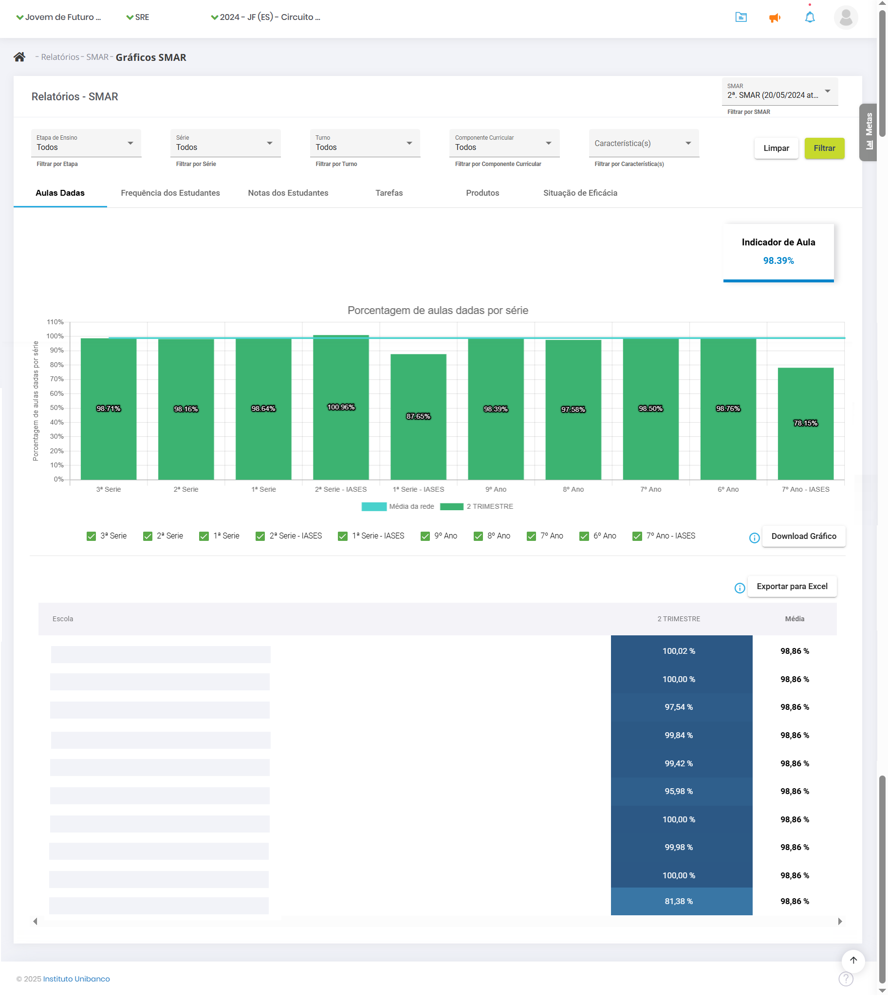
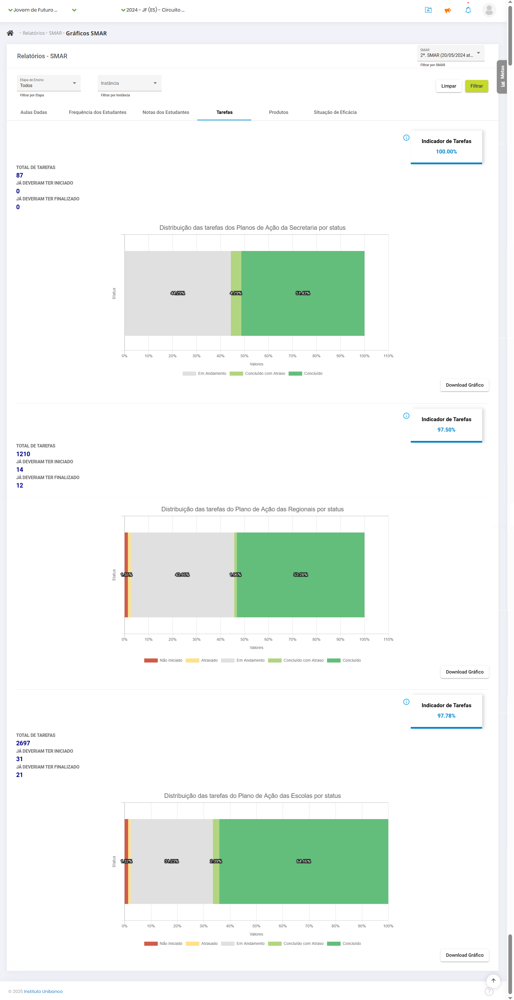

# 7. SMAR

Na etapa da **SMAR (Sistemática de Monitoramento e Avaliação de Resultados)**, vamos olhar para os indicadores estruturantes (aulas dadas, frequência e notas dos estudantes e monitorar como anda a execução do Plano de Ação nas escolas.

Para acessar o painel da SMAR, comece fazendo login no sistema com os seus dados. Ao carregar a página inicial, vá ao menu lateral, clique em “**Relatórios**”, selecione a etapa “**SMAR**” e clique em “**Gráficos SMAR**”.

A página carrega com os filtros selecionados para todos, mas é possível filtrar por etapa de ensino (no caso das escolas multiníveis), por turno, por turma e por componente curricular.

No primeiro grupo de gráficos, é exibida a porcentagem de **aulas dadas** por série. No canto superior, há um indicador de aula. Logo abaixo dos gráficos, é possível selecionar para ver o gráfico de uma série específica. Também estão disponíveis os botões de “**Download Gráfico**” e “**Exportar para Excel**”.

Sob o ponto de vista da Secretaria, também é exibida uma tabela com o percentual de aulas dadas por cada uma das regionais, seguida da média de aulas dadas por toda a rede de ensino.

No caso das regionais, a mesma tabela é exibida, porém com o percentual de aulas dadas de suas escolas.

Já sob o ponto de vista da escola é exibida uma tabela com o percentual de aulas dadas segundo o componente curricular.

Subindo a página, na aba “**Frequência dos Estudantes**”, é exibido o Indicador de Frequência. A tela vai exibir um grupo de gráficos da frequência dos estudantes por série e por trimestre, com a opção de filtros por etapa de ensino, série, turno e componente curricular. No ponto de vista das escolas, a frequência é apresentada com o recorte de raça e gênero para cada série.

No ponto de vista da Secretaria, é exibida uma tabela com a frequência registrada pelas regionais.

Para as regionais, é exibida a frequência de suas escolas.

Voltando à parte superior da tela, há a aba “**Notas dos Estudantes**”. Ao clicar, são exibidos os gráficos de nota por série e por trimestre, com as cores explicadas na legenda. No caso das escolas, as informações de notas são apresentadas com o recorte de raça e gênero por componente curricular. Passe o mouse por cima da barra para visualizar o componente curricular do seu interesse. É possível fazer o download do gráfico para outras análises.

Nos pontos de vista da Secretaria e das regionais, abaixo do gráfico é exibida uma tabela com o percentual de notas das regionais ou escolas de acordo com a sua categoria.

Depois de olhar para os indicadores estruturantes (aulas dadas, frequência e notas dos estudantes), é hora de **monitorar a execução do Plano de Ação** da escola. Para isso, clique na aba “**Tarefas**”, na parte superior da página. No canto superior, está o Indicador de Tarefas, com a média das tarefas cumpridas da escola. O gráfico exibe o total de tarefas para o período, as tarefas que já deveriam ter sido iniciadas e as tarefas que já deveriam estar finalizadas. Na parte superior estão os filtros para selecionar a etapa de ensino, a instância de interesse e Efeito da Recuperação.

A partir de 2025, a aba “**Efeito da Recuperação**” passou a incluir, além dos dados da recuperação trimestral dos componentes curriculares, as médias de aprovação por área de conhecimento – alteração em relação ao ano 2024, quando apenas os dados da recuperação eram considerados.

É com base nessas informações que a eficácia do Plano de Ação é avaliada, última aba dos gráficos da avaliação de resultados. O primeiro gráfico traz o cruzamento do percentual de execução (ações e tarefas entregues) e o percentual de resultado (aulas dadas, frequência e notas). Dependendo do ponto em que a regional ou a escola se localizar, ela será categorizada como “**Em Destaque**”, “**Em alinhamento**” ou “**Em apoio intensivo**”.

É hora de refletir: a escola está dando conta de realizar as ações planejadas? Se sim, elas estão tendo o impacto esperado, aumentando a quantidade de aulas dadas, a frequência e a nota dos estudantes? A partir dessa reflexão e desse diagnóstico, tem início a próxima etapa do Circuito de Gestão (CdG), que é a Correção de Rotas, quando os Planos de Ação são ajustados à luz das evidências.