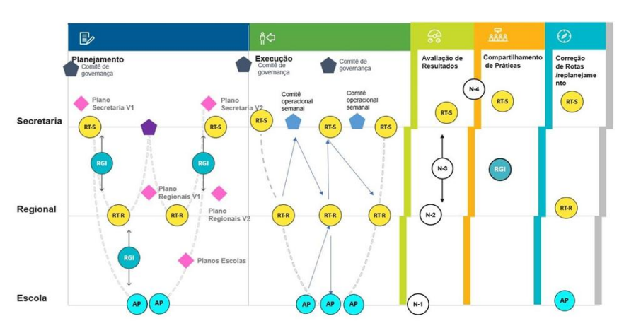

# Correção de Rotas

## 1\. A importância da Correção de Rotas

A etapa **Correção de Rotas (CR)** marca o encerramento de um ciclo e o início de outro dentro do **Circuito de Gestão Goiano (CdGG)**. Toda a experiência acumulada desde o **Planejamento** até a **Sistemática de Monitoramento de Avaliação e Resultados (SMAR)** será utilizada para ajustar o **Plano de Ação** da Secretaria, da regional e das unidades escolares.

O principal objetivo da Correção de Rotas é **revisar o Plano de Ação**. Não se trata de criar um novo plano, mas de **analisar e readequar os problemas, desafios e ações** definidos na etapa de Planejamento, a partir das evidências e interpretações obtidas na etapa SMAR.

Durante essa revisão, devem ser priorizadas as ações que **não estão atingindo os resultados esperados** em relação aos seguintes Objetivos Estratégicos:

-   Garantia de aprendizagem
-   Redução das desigualdades
-   Mitigação da evasão e do abandono escolar

Após a finalização da etapa SMAR, a Correção de Rotas segue uma **sequência de reuniões**, com a participação de diferentes instâncias do Circuito de Gestão Goiano:

**1. Reunião de Trabalho da Secretaria (RT-S)**  
Realizada no âmbito da Secretaria, é conduzida pelo grupo gestor do CdGG. Participam as equipes responsáveis pela execução e pelo monitoramento do Plano de Ação.

**2. Reunião de Gestão Integrada da Secretaria (RGI)**  
Também no âmbito da Secretaria, essa reunião reúne os responsáveis da própria Secretaria e os grupos gestores regionais do CdGG. O foco é alinhar decisões e ajustes a partir da análise coletiva.

**3. Reunião de Trabalho Regional (RT-R)**  
Realizada na regional, é conduzida pelo grupo gestor do CdGG local. Participam todos os membros do departamento pedagógico da **Coordenação Regional de Educação (CRE)** e demais profissionais responsáveis pelo Plano de Ação na regional.

**4. Reunião de Gestão Integrada da Regional (RGI)**  
Conduzida também na regional, essa reunião inclui o grupo gestor da CRE e os grupos gestores das unidades escolares. Participam o gestor escolar, coordenadores pedagógicos, secretário, **Coordenador Administrativo Financeiro (CAF)** e demais lideranças da escola.

**5. Acompanhamento Pedagógico (AP)**  
Ocorre na unidade escolar. É conduzido pelo Tutor Educacional com o grupo gestor da escola, formado por: gestor escolar, coordenador pedagógico, secretário, CAF, e representantes dos professores e estudantes.

Imagem 5 \- Etapas do Circuito de Gestão Goiano

## 2\. Estrutura Geral do Acompanhamento Pedagógico de Correção de Rotas

O Acompanhamento Pedagógico (AP) de Correção de Rotas (CR) deve ser planejado com antecedência e conduzido com base nas análises feitas nas etapas anteriores do Circuito de Gestão Goiano (CdGG). O objetivo é apoiar a unidade escolar na revisão do Plano de Ação, usando os dados gerados na Sistemática de Monitoramento de Avaliação e Resultados (SMAR).

**Preparação**

-   Agende o AP no **Sistema de Gestão para o Avanço Contínuo da Educação (Sigae)**.
-   Estude este protocolo com atenção.
-   Envie orientações às unidades escolares para que se preparem para o encontro.
-   Elabore sua apresentação com os principais dados e direcionamentos.

**Desenvolvimento**

**Momento 1 – Integração do grupo**  
Acolha os participantes e crie um ambiente de escuta, colaboração e confiança.

**Momento 2 – Revisão do Plano de Ação**  
Conduza a releitura coletiva dos principais pontos:

-   Problemas identificados
-   Desafios enfrentados
-   Ações planejadas
-   Práticas inspiradoras de outras unidades que possam contribuir

**Momento 3 – Análise dos processos cruciais**  
Revisite a execução do plano no Sigae, considerando:

-   Registros realizados
-   Tarefas executadas
-   Entregas feitas
-   Evolução dos indicadores educacionais
-   Indicadores estruturantes: aulas dadas, frequência dos estudantes e notas

**Momento 4 – Definição dos próximos passos**  
Finalize o encontro com os acordos necessários para o avanço da escola

## 3\. Preparação para o Acompanhamento Pedagógico de Correção de Rotas

Para se preparar para a Correção de Rotas (CR), é importante que o Tutor Educacional levante informações relevantes e registre previamente quais alterações considera imprescindíveis sugerir, de modo a apoiar a escola na revisão do seu Plano de Ação.

**Passo a passo**

-   **Agende o Acompanhamento Pedagógico (AP)** no Sistema de Gestão para o Avanço Contínuo da Educação (Sigae).
-   **Estude este protocolo**, buscando compreender a lógica da Correção de Rotas e seus desdobramentos na revisitação do Plano de Ação das unidades escolares.
-   **Envie orientações às escolas**, solicitando que se preparem para o Acompanhamento Pedagógico de Correção de Rotas.
-   **Peça ao grupo gestor escolar que leve para o encontro:**

    -   O Plano de Ação da unidade escolar.
    -   O registro da SMAR – Nível 1 (N1), disponível no Sigae, por meio do Formulário I: Consolidado para SMAR e Correção de Rotas.
    -   O registro das práticas compartilhadas na Reunião de Gestão Integrada (RGI) de Correção de Rotas, que já foi encaminhado pela regional.

-   **Elabore a apresentação que será usada no Acompanhamento Pedagógico de Correção de Rotas.** Para isso, acesse no Sigae:

    -   O Plano de Ação da unidade escolar e sistematize os conteúdos relevantes: problemas, desafios e ações priorizadas.
    -   O registro da SMAR – N1, identificando, com base nas análises realizadas, quais pontos merecem maior atenção por parte da escola.
    -   As atas da Reunião de Trabalho – Regional e da Reunião de Gestão Integrada da Regional, sistematizando as orientações, diretrizes e encaminhamentos que devem ser considerados pelas escolas durante a revisão dos Planos de Ação.

-   **Retome as apresentações das práticas feitas durante a RGI** e inclua os trechos relevantes na sua apresentação. Lembre-se de que cada escola elaborou sua apresentação com base no roteiro enviado pela regional.
-   **Reveja os encaminhamentos e repactuações da RGI de Correção de Rotas**. A partir deles, elabore uma síntese dos principais problemas específicos da unidade escolar, bem como suas causas. Esse conteúdo foi discutido durante o Acompanhamento Pedagógico na etapa SMAR – Nível 1\.
-   **Selecione e organize todos os materiais** que serão utilizados no Acompanhamento Pedagógico de Correção de Rotas, garantindo clareza, foco e objetividade no momento da condução.

## 4\. Desenvolvimento do Acompanhamento Pedagógico de Correção de Rotas

**a) Acolhimento e expectativas**  
Comece acolhendo o grupo, utilizando estratégias de sensibilização e mobilização. Uma boa proposta é pedir que cada participante compartilhe um novo aprendizado — algo que tenha descoberto ou vivenciado recentemente e que considere importante dividir com os colegas. Essa dinâmica promove conexão entre os participantes e cria um ambiente mais colaborativo desde o início.

**b) Onde estamos? Apresente o infográfico do Circuito de Gestão Goiano**  
Mostre onde se localiza a etapa de Correção de Rotas dentro do Circuito de Gestão Goiano. Apresente a sequência das etapas, explicando a lógica que conecta cada uma delas e destacando a corresponsabilização entre as diferentes instâncias da rede. Essa contextualização ajuda o grupo a entender seu papel dentro de um processo maior e contínuo.

**c) Apresente os objetivos e os conteúdos que serão abordados neste Acompanhamento Pedagógico de Correção de Rotas**  
Retome as expectativas que surgiram na acolhida e conecte-as aos objetivos do encontro. Mostre que o foco é revisitar o Plano de Ação da unidade escolar com base nas avaliações realizadas durante a SMAR, nas orientações da regional e da Secretaria, e no que foi compartilhado na RGI.

Reforce a importância de revisar os problemas, desafios e ações já traçados. Retome o percurso realizado até aqui: o trabalho na etapa de planejamento, o desenho do diagnóstico da escola, o levantamento dos problemas e a definição dos objetivos que se busca alcançar. Valorize as estratégias já elaboradas e incentive o grupo a considerá-las à luz das desigualdades educacionais presentes na rede — levando em conta marcadores como gênero, raça e nível socioeconômico, que impactam os diferentes contextos escolares.

**d) Reforce o olhar sobre os fatores que ampliam as desigualdades de aprendizagem**  
A Correção de Rotas deve ser conduzida com atenção especial à redução das desigualdades de aprendizagem e à garantia da permanência dos estudantes na escola. É fundamental considerar a diversidade dos perfis estudantis e os fatores que influenciam diretamente o aprendizado, como cor/raça, gênero e condição socioeconômica. Essa escuta ativa permite construir caminhos mais justos e eficazes.

**e) Estabeleça os combinados da reunião**  
Converse com o grupo gestor sobre como será conduzida a reunião. Combine a metodologia a ser usada, defina os tempos de fala de cada participante e identifique quem será responsável por registrar as informações nos formulários. Oriente o grupo a manter acesso ao Sigae durante o encontro, sempre que possível, para facilitar a consulta às informações diretamente no sistema:

TABELA 15 \- Objetivos estratégicos

<table>
  <tbody>
    <tr>
      <td colspan="3">Objetivos estratégicos</td>
    </tr>
    <tr>
      <td colspan="3">Revisão dos problemas</td>
    </tr>
    <tr>
      <td>Ensino Fundamental</td>
      <td>Geral</td>
      <td>Ensino Médio</td>
    </tr>
    <tr>
      <td colspan="3">Revisão dos problemas</td>
    </tr>
    <tr>
      <td>Ensino Fundamental</td>
      <td>Geral</td>
      <td>Ensino Médio</td>
    </tr>
    <tr>
      <td colspan="3">Revisão dos desafios</td>
    </tr>
    <tr>
      <td>Ensino Fundamental</td>
      <td>Geral</td>
      <td>Ensino Médio</td>
    </tr>
    <tr>
      <td colspan="3">Revisão dos mapas de ação</td>
    </tr>
    <tr>
      <td>Ensino Fundamental</td>
      <td>Geral</td>
      <td>Ensino Médio</td>
    </tr>
    <tr>
      <td colspan="3">Revisão dos desafios</td>
    </tr>
    <tr>
      <td>Ensino Fundamental</td>
      <td>Geral</td>
      <td>Ensino Médio</td>
    </tr>
    <tr>
      <td colspan="3">Consolidação e postagem da revisão do Plano de Ação</td>
    </tr>
  </tbody>
</table>

### 4.1. Revisão dos problemas

**Passo a passo**

-   Contextualize a atividade com o grupo gestor:

    ➢ Relembre que, no exercício prévio realizado na SMAR, foram verificados novos dados sobre a trajetória escolar e a aprendizagem dos estudantes — dados que ainda não estavam disponíveis na época do Planejamento.

    ➢ O grupo analisou informações atualizadas, como taxas de aprovação, reprovação, abandono e evasão, além de resultados de avaliações internas e externas da rede. Esse olhar aprofundado contribui para identificar desigualdades de aprendizagem.

    ➢ Esses novos dados possibilitam um diagnóstico mais atual e preciso da realidade da escola, o que pode levar à necessidade de revisar os problemas e desafios previamente identificados.

    ➢ Desta forma, para dar início à Correção de Rotas e à revisão do Plano de Ação, é essencial que tutor e grupo gestor avaliem se há necessidade de acrescentar novos problemas, redefinir prioridades ou estabelecer novas combinações entre os problemas já identificados.

-   Releia com o grupo gestor:

    -   A lista de problemas identificados no Planejamento.
    -   O registro do exercício prévio da SMAR feito pela unidade escolar.
    -   O registro do Acompanhamento Pedagógico da SMAR-N1 \[Formulário I: indicações para a etapa de Correção de Rotas\] no Sigae.

-   Combine com o grupo quem será responsável pelo registro das discussões.

-   Estimule o debate com perguntas-chaves e espere pelas contribuições antes de seguir para a próxima questão.

**Revisão dos problemas**

-   Com base nos dados atualizados e nas análises feitas na SMAR, surgiram novos problemas que precisam ser enfrentados pela unidade escolar? Quais são eles?

-   Considerando todos os problemas (os identificados no Planejamento e os novos), quais devem ser priorizados neste momento? Por quê?

Ao final da discussão, solicite que a pessoa responsável pelo registro faça uma checagem da produção coletiva, garantindo que os novos problemas e suas prioridades estejam devidamente organizados.

### 4.2. Revisão dos desafios

**Passo a passo**

-   Contextualize a atividade com o grupo gestor, explicando que:

    ➢ Após a revisão dos problemas identificados no Planejamento — com a possibilidade de excluir, incluir ou reorganizar os problemas — é preciso analisar o impacto dessas mudanças sobre os desafios definidos anteriormente, sempre à luz dos objetivos estratégicos da unidade.

    ➢ Como os desafios estão diretamente ligados aos problemas (cada desafio responde a um ou mais problemas), o grupo deverá identificar quais desafios serão mantidos, quais serão alterados, quais deixarão de fazer sentido e se há necessidade de criar novos desafios.

    ➢ Ao criar um novo desafio, é importante lembrar que ele deverá estar vinculado a pelo menos uma ação específica no Plano de Ação — podendo haver mais de uma ação, conforme a complexidade da questão.

    ➢ Releia com o grupo os desafios registrados no Plano de Ação da unidade escolar, promovendo uma análise crítica à luz das revisões feitas até aqui.

    ➢ Combine com o grupo quem será responsável por registrar as definições e ajustes feitos durante essa etapa.

<table>
  <tbody>
    <tr>
      <td>Atenção! Caso um desafio seja excluído, todos os Mapas de Ação vinculados ao desafio também serão excluídos.</td>
    </tr>
  </tbody>
</table>

### 4.3. Revisão dos desafios

**Quais desafios:**

-   **mantêm-se?**  
    Reflitam sobre quais desafios continuam atuais e pertinentes frente ao novo diagnóstico e à trajetória revisada da escola.

-   **precisam ser alterados?**  
    Identifiquem os desafios que necessitam de ajustes, e registrem quais mudanças devem ser feitas na formulação original para garantir maior alinhamento com os problemas e metas da unidade escolar.

-   **devem ser suprimidos?**  
    Verifiquem se há desafios que perderam relevância ou que foram superados, e que, portanto, não precisam mais constar no Plano de Ação.

-   **precisam ser criados e incluídos no Plano de Ação da unidade escolar?**  
    Com base na nova leitura do cenário escolar, avaliem a necessidade de registrar novos desafios que respondam às questões emergentes.

**Orientações para registro no Formulário I: revisão do Plano de Ação da unidade escolar – Problemas e desafios (Anexo)**

Registrem claramente no formulário:

-   Desafios mantidos
-   Desafios alterados (detalhamento de quais são os ajustes necessários)
-   Desafios suprimidos
-   Novos desafios (elaborar formulações claras e objetivas para os novos desafios da unidade)

➢ Ao final, solicite ao responsável pelo registro que compartilhe a produção com o grupo gestor para validação coletiva.

### 4.4. Revisão das ações

**A. Desafios mantidos \+ desafios que precisam ser alterados**

➢ Oriente o grupo gestor a refletir e responder às perguntas abaixo:

-   Quais **ações relacionadas a esses desafios** serão mantidas?
-   Quais **ações serão suprimidas**?
-   Há **ações que precisam ser criadas** para responder melhor aos desafios?
-   Quais ações precisam ser **aprimoradas** com base nos **pontos críticos e nas indicações da Correção de Rotas**?  
     ↳ A quais pontos críticos essas ações estão relacionadas?  
     ↳ Quais são os aprimoramentos necessários?

-   No caso das ações que serão **mantidas sem alterações**, os **componentes** permanecem os mesmos?  
     ↳ (Tarefas, produtos, responsáveis, prazos etc.)

<table>
  <tbody>
    <tr>
      <td>Atenção! Caso uma ação seja excluída, todos os componentes vinculados à ação também serão excluídos – ou seja, todo o Mapa da Ação será apagado. Se essa ação for a única vinculada a um determinado desafio, o desafio também será automaticamente suprimido do Plano de Ação.</td>
    </tr>
  </tbody>
</table>

-   Se o **percentual de aulas dadas** está **abaixo da média da regional ou da rede**, reflitam:  
     ↳ Por que a escola se encontra nessa condição?

➢ **Orientações para preenchimento do Formulário II: Revisão do Plano de Ação da unidade escolar – Desafios e Ações (Anexo)**

-   Ações mantidas (indicar o desafio ao qual cada ação está vinculada)
-   Ações alteradas/aprimoradas (indicar o desafio correspondente)
-   Ações suprimidas (indicar o desafio correspondente)
-   Novas ações (indicar o desafio ao qual cada nova ação estará vinculada)

**B. Desafios suprimidos \+ novos desafios**

➢ Oriente o grupo gestor a refletir e responder às perguntas abaixo:

**Desafios suprimidos**

-   As ações ligadas a esse desafio também devem ser excluídas?
-   Há alguma ação que **precisa ser mantida**?  
     ↳ Se sim, **a qual desafio ela será reconectada**?  
     ↳ Essas ações precisam ser aprimoradas? Quais seriam os aprimoramentos?
-   As ações ainda respondem aos **pontos críticos identificados na SMAR**? Quais?

**Novos desafios**

-   Quais **novas ações precisam ser criadas** para enfrentar esses desafios?
-   A quais **pontos críticos** essas novas ações estão respondendo?

➢ **Orientações para preenchimento do Formulário II: Revisão do Plano de Ação da unidade escolar – Desafios e Ações (Anexo)**

-   Ações mantidas (indicar o desafio correspondente)
-   Ações alteradas/aprimoradas (indicar o desafio correspondente)
-   Ações suprimidas (indicar o desafio correspondente)
-   Novas ações (indicar o desafio correspondente)

## 5\. Práticas de outras unidades escolares que podem contribuir para enfrentar desafios

**Passo a passo**

-   Explique ao grupo gestor que o objetivo desse momento é **identificar coletivamente práticas de outras escolas** que possam inspirar ou ajudar no enfrentamento dos desafios da própria unidade.
-   Para isso, **apresente a síntese das práticas compartilhadas na Reunião de Gestão Integrada (RGI)**. Use esse material apenas como apoio de memória, lembrando que o grupo já teve acesso a essas práticas durante a RGI.
-   Defina quem será o **responsável pelo registro das contribuições** feitas durante a discussão.
-   Conduza a conversa com as perguntas abaixo, incentivando a troca de ideias e a reflexão coletiva:
    -   Que **inspirações ou aprendizados** o Compartilhamento de Práticas trouxe para você?
    -   Alguém gostaria de compartilhar o que anotou?
    -   Quais práticas compartilhadas podem realmente **contribuir para resolver os desafios** da nossa escola?
-   Ao final da discussão, peça ao responsável pelo registro que **compartilhe com o grupo** o conteúdo anotado.

**Momento 3: Revisão dos processos cruciais**

**Passo a passo**

-   Explique ao grupo gestor que este momento é dedicado a retomar as análises realizadas durante a SMAR e a RGI sobre os **processos cruciais da escola**.
-   Os processos analisados incluem:

    -   Execução do Plano de Ação no SIGAE
    -   Registro e acompanhamento das tarefas
    -   Entrega dos produtos
    -   Evolução dos indicadores estruturantes: **aulas dadas, frequência e notas**

-   O objetivo aqui é **reforçar as estratégias de coleta, registro, acompanhamento e monitoramento** na escola.
-   Combine quem será o **responsável por registrar as contribuições** do grupo.
-   Apresente os **encaminhamentos e repactuações definidos durante a RGI** que buscam garantir a boa realização dos processos cruciais.
-   Em seguida, faça uma **síntese dos principais problemas identificados** (e suas causas) em relação a esses processos.
-   Pergunte ao grupo:

    -   Os **aprimoramentos indicados na RGI** são suficientes para que os processos cruciais funcionem corretamente na escola?
    -   É necessário algum **apoio adicional do Tutor Educacional ou da equipe regional**?
    -   Há **algo mais a ser ajustado ou pactuado** para garantir que os processos cruciais ocorram como o esperado?

-   Reserve tempo para que o grupo possa refletir sobre essas questões. Depois, **pactuem encaminhamentos práticos** para garantir a efetividade dos processos.
-   Reforce que a **qualidade dos registros e a confiabilidade dos dados** são fundamentais para que a escola **se reconheça nos relatórios da SMAR** e tome decisões mais assertivas.
-   Ao final, o grupo gestor e o Tutor Educacional devem verificar **quais ações precisam ser criadas ou ajustadas** para corrigir rotas nos processos cruciais.

Registrem:

-   O que será feito
    -   Quem será o responsável
    -   Qual o prazo para execução

**Momento 4: Combinar os próximos passos**

**Revisão dos Mapas de Ação do Plano da unidade escolar no SIGAE**

**Passo a passo**

-   Alinhe com o grupo gestor **quem será o responsável pela finalização dos registros** nos **Formulários I e II**.
-   Estabeleça, em conjunto, o **prazo para a entrega dos formulários**, garantindo que todos tenham clareza sobre o que precisa ser preenchido e enviado.
-   Combine também com a equipe gestora **como será feito o processo de revisão dos Mapas de Ação no SIGAE**.
-   Definam um **prazo para essa revisão**, considerando o **cronograma oficial do Circuito de Gestão Goiano (CdGG)**.

**IMPORTANTE\!**

<table>
  <tbody>
    <tr>
      <td>
		
Sempre que um novo desafio for incluído, será necessário planejar pelo menos uma nova ação correspondente. Também é possível que novas ações sejam criadas para responder a desafios já existentes ou reformulados, além daquelas que precisam apenas de ajustes ou aprimoramentos. 

		
De todo modo, o grupo gestor deverá se reunir novamente para dar continuidade ao replanejamento, considerando os demais componentes do Mapa da Ação, como tarefas, produtos, responsáveis e prazos.

	</td>
    </tr>
  </tbody>
</table>

Depois de revisar os desafios e as ações do Plano de Ação da unidade escolar, é fundamental conferir se todos os pontos críticos identificados durante a SMAR, além das diretrizes e orientações da regional e da Secretaria, foram efetivamente contemplados nessa revisão. Caso algum ponto crítico, diretriz ou orientação tenha sido deixado de fora, é importante confirmar se ele não representa uma prioridade no momento ou, se for o caso, retomar a revisão dos desafios e ações para garantir que esses aspectos sejam devidamente endereçados.

**Registro do Acompanhamento Pedagógico de Correção de Rotas no Sigae**

Com base no cronograma vigente do CdGG, é preciso definir o prazo para a conclusão das alterações no Plano de Ação no Sigae, assim como indicar quem, dentro do grupo gestor, será responsável por realizar essas atualizações.

TABELA 16 \- Formulário I: revisão do Plano de Ação da unidade escolar – Problemas e desafios

<table>
  <thead>
    <tr>
      <th>Problemas já identificados no Planejamento (registrar por ordem de relevância/prioridade)</th>
      <th>Novo(a)s problemas/problemáticas identificados na SMAR (registrar por ordem de relevância/prioridade)</th>
      <th>Problemas excluídos</th>
      <th>Desafios mantidos</th>
      <th>Desafios suprimidos</th>
      <th>Desafios alterados</th>
      <th>Novos desafios</th>
    </tr>
  </thead>
  <tbody>
    <tr>
      <td></td>
      <td></td>
      <td></td>
      <td></td>
      <td></td>
      <td></td>
      <td></td>
    </tr>
  </tbody>
</table>

TABELA 17 \- Formulário II: revisão do Plano de Ação da escola – Desafios e ações

<table>
  <thead>
    <tr>
      <th></th>
      <th>Ações mantidas</th>
      <th>Ações que precisam ser alteradas</th>
      <th>Novas ações</th>
      <th>Ações que precisam ser suprimidas</th>
    </tr>
  </thead>
  <tbody>
    <tr>
      <td>Desafios mantidos Desafios alterados</td>
      <td></td>
      <td></td>
      <td></td>
      <td></td>
    </tr>
    <tr>
      <td>Novos desafios Desafios suprimidos</td>
      <td></td>
      <td></td>
      <td></td>
      <td></td>
    </tr>
  </tbody>
</table>
