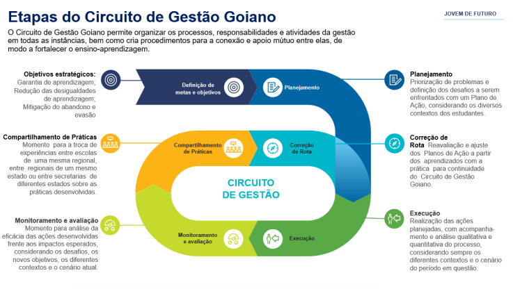
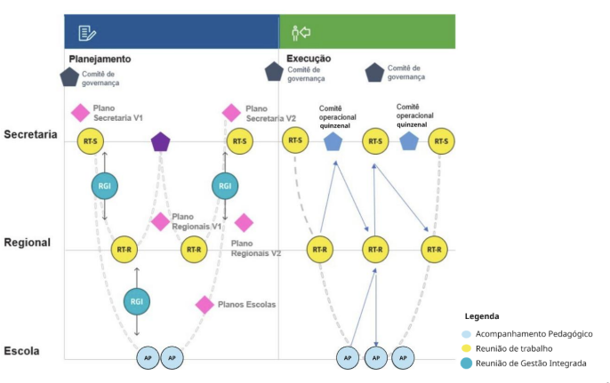

# Execução

## 1\. Importância da Execução

O Acompanhamento Pedagógico de Execução tem como objetivo **monitorar a implementação das ações previstas no Plano de Ação** e **analisar sua efetividade**, promovendo pequenos ajustes sempre que necessário.

Nessa etapa, espera-se que a equipe gestora da escola esteja **mais familiarizada com a lógica de acompanhamento e monitoramento**, conseguindo **atuar com mais precisão** na execução das ações planejadas.

Além disso, o momento favorece **maior engajamento, troca de experiências e reflexões aprofundadas**. É importante **aliar a análise qualitativa dos avanços à leitura dos dados quantitativos**, que ajudam a avaliar os resultados obtidos.

Durante todo o acompanhamento, tanto a equipe gestora quanto o Tutor Educacional devem realizar um **monitoramento sistemático das ações**, promovendo reflexões que contribuam para o aprofundamento da etapa N1 da **Sistemática de Monitoramento e Avaliação de Resultados (SMAR)**.

Também é fundamental **dialogar com a unidade escolar para verificar se já é possível mensurar resultados quantitativos**, como avaliações, atividades e projetos, uma vez que já se passou um período considerável de execução.

Imagem 1 \- Etapas do Circuito de Gestão Goiano

Imagem 2 \- Etapas do Circuito de Gestão Goiano

Nessa etapa, o Tutor Educacional conduz perguntas reflexivas em diálogo com a equipe gestora para entender como as ações estão sendo realizadas em relação ao que foi planejado.

Essa etapa não se trata de um checklist de prazos ou entrega de produtos. É o momento em que o planejamento se transforma em realidade e se observa se as estratégias respondem aos desafios concretos enfrentados pela escola, com foco na melhoria da aprendizagem dos estudantes.

Analisar as informações da execução ajuda a entender o que está dando resultado e o que está trazendo dificuldades na realização das ações. Isso permite fazer os ajustes necessários e fortalecer o acompanhamento da regional. Durante esse processo, podem surgir novas necessidades que não estavam no Plano de Ação, mas que afetam diretamente a execução e precisam ser reconhecidas e resolvidas

Nos Acompanhamentos Pedagógicos, o papel do Tutor é apoiar a equipe gestora a refletir sobre o andamento da execução, considerando se as ações estão alinhadas aos desafios definidos pela própria unidade escolar e aos objetivos estratégicos da rede. Essa reflexão deve partir do conhecimento que a equipe tem do cotidiano da unidade escolar e se concentrar sempre no período mais recente, com o objetivo de melhorar continuamente a prática de forma coletiva e crítica. Esse processo fortalece a análise e qualifica a atuação da gestão.

A equipe gestora deve ser incentivada a fazer devolutivas formativas com sua equipe, da mesma forma que essa postura deve ser adotada também durante os próprios acompanhamentos. A partir das análises realizadas, vale promover espaços de apoio entre pares para fortalecer o compartilhamento de práticas e qualificar ainda mais as ações em curso.

Todo esse trabalho alimenta as discussões e decisões na regional, que precisam ser compartilhadas com a unidade escolar. Também é essencial reforçar o apoio que será prestado, com base no monitoramento realizado anteriormente. Por isso, cada acompanhamento pedagógico reserva um momento para comunicar à equipe gestora o suporte previsto e as orientações para a continuidade das ações.

Para facilitar esse processo, há instrumentos de síntese disponíveis para registrar e sistematizar as reflexões feitas durante os acompanhamentos. A proposta é fortalecer a organização das informações e garantir coerência entre o trabalho das escolas, das regionais e da Secretaria, promovendo apoio mútuo em toda a rede.

Por fim, é importante entender como os acompanhamentos pedagógicos se conectam com outras instâncias do processo de Execução. A primeira Reunião de Trabalho da regional define orientações que devem ser repassadas durante os acompanhamentos nas unidades escolares. Nos Acompanhamentos Pedagógicos, as reflexões são registradas e retornam à regional, alimentando as reuniões seguintes. Esse ciclo garante coerência e continuidade entre unidades escolares, regionais e Secretaria.

## 2\. Preparação para o Acompanhamento Pedagógico

Antes de cada acompanhamento pedagógico, é fundamental que o tutor se aproprie das orientações sistematizadas pela regional na última Reunião de Trabalho (RT) da qual participou. Essas orientações devem ser discutidas durante os Acompanhamentos Pedagógicos (APs), estabelecendo conexões entre a etapa de Planejamento e a etapa atual de Execução. É importante garantir que a equipe gestora compreenda como o trabalho desenvolvido contribui para o alcance dos resultados da unidade escolar.

Também é necessário acompanhar o painel de Execução física da unidade no Sistema de Gestão para o Avanço Contínuo da Educação (Sigae), observando o cumprimento das tarefas e das entregas parciais de produtos. Isso permite ao tutor entender o andamento operacional das ações antes de iniciar os diálogos com a escola.

Durante o acompanhamento, recomenda-se promover reflexões com base nas perguntas do Roteiro da Etapa de Execução a seguir. Essas questões funcionam como provocações para análise e não precisam ser respondidas ou registradas uma a uma. O mais importante é conduzir uma sequência reflexiva coerente com a realidade da unidade escolar, que contribua efetivamente para o aprofundamento da execução.

Por fim, é essencial dominar os instrumentos sugeridos para esse momento, de modo a facilitar seu uso junto à equipe gestora. O bom uso desses instrumentos potencializa o registro e a sistematização das discussões realizadas, servindo de base para as informações que serão levadas às reuniões da regional.

### 2.1. Objetivos

-   Definir, junto à equipe gestora, como serão conduzidos os acompanhamentos na etapa de Execução.
-   Compartilhar e dialogar sobre os apoios oferecidos pela regional.
-   Analisar a realização das ações previstas desde a etapa de Planejamento.
-   Verificar e refletir sobre a execução das ações realizadas no período mais recente, desde o último acompanhamento pedagógico.
-   Estimular a reflexão sobre todo o percurso da Execução, preparando a equipe para a análise aprofundada na N1 da SMAR.
-   Garantir que todas as informações sobre a execução física do Plano de Ação estejam atualizadas no Sigae.

TABELA 1 \- Roteiro da Etapa de Execução

<table>
  <thead>
    <tr>
      <th colspan="2">Roteiro da Etapa de Execução</th>
    </tr>
  </thead>
  <tbody>
    <tr>
      <td><strong>Passo 1</strong></td>
      <td>Pactuação dos acompanhamentos na etapa de Execução</td>
    </tr>
    <tr>
      <td><strong>Passo 2</strong></td>
      <td>Apresentação das formas de apoio da regional</td>
    </tr>
    <tr>
      <td><strong>Passo 3</strong></td>
      <td>Análise da execução física do Plano de Ação</td>
    </tr>
    <tr>
      <td><strong>Passo 4</strong></td>
      <td>Análise da execução das ações em relação aos desafios</td>
    </tr>
    <tr>
      <td><strong>Passo 5</strong></td>
      <td>
        Análise da execução das ações em relação aos objetivos estratégicos
      </td>
    </tr>
    <tr>
      <td><strong>Passo 6</strong></td>
      <td>
        Registro das reflexões do acompanhamento pedagógico para desdobramento
      </td>
    </tr>
    <tr>
      <td><strong>Passo 7</strong></td>
      <td>Encaminhamento para N1 da SMAR</td>
    </tr>
  </tbody>
</table>

### 2.2. Pactuação dos acompanhamentos na etapa de Execução

Ao iniciar o acompanhamento pedagógico, retome com a equipe gestora o percurso realizado, conectando o Planejamento da unidade escolar à etapa atual de Execução, que está em seu primeiro período conforme o cronograma do Plano de Ação. É fundamental que a unidade escolar compreenda que esse momento é chave no processo, pois, se conduzido adequadamente, pode gerar resultados significativos e integradores.

Destaque questões essenciais para esta fase, conforme a introdução deste Guia: quais indicadores serão coletados, como o acompanhamento será realizado e de que forma isso fortalecerá o diálogo com a regional. Tenha em mente que, você pode enfrentar diferentes situações, como a ausência de coleta de dados pela unidade escolar. Por isso, a análise conjunta entre você, tutor educacional, e equipe gestora é essencial para buscar alternativas de coleta e análise das informações e evidências, garantindo que essas alimentem o monitoramento da aprendizagem.

Defina, junto à, o número de acompanhamentos pedagógicos previstos. Nas unidades escolares prioritárias, esse número deve ser maior, promovendo um apoio mais próximo e fortalecido. Reconheça que esses encontros são fundamentais para o acompanhamento da execução no cotidiano da unidade.

É importante que o grupo gestor contribua com seu conhecimento sobre a realidade local e o andamento das ações. A cada acompanhamento, essas informações serão analisadas por meio das perguntas reflexivas. Apresente os blocos de perguntas disponíveis na sequência deste Guia para que a equipe esteja atenta aos pontos essenciais da Execução, aprofundando a discussão nos próximos acompanhamentos pedagógicos.

Recomende que a equipe gestora crie um Painel de Gestão visível a todos os envolvidos na unidade escolar. Essa visibilidade permite que todos acompanhem, participem ativamente da execução das ações, saibam quais tarefas estão planejadas e quando devem ser realizadas. Assim, o grupo gestor mantém-se alerta durante a Execução e contribui de forma efetiva nos acompanhamentos pedagógicos futuros.

### 2.3. Apresentação das formas de apoio da regional

Com base nos encaminhamentos da última Reunião de Trabalho da regional, compartilhe com a unidade escolar as decisões e orientações definidas, bem como as formas de apoio que serão oferecidas para dar continuidade à etapa de Execução. Caso existam respostas para demandas que a unidade declarou não estar sob sua governabilidade, faça a devolutiva sobre o que foi determinado.

Para fortalecer a coerência interna entre as instâncias, destaque que todas as conclusões dos acompanhamentos pedagógicos serão sistematizadas, gerando insumos e demandas para a regional. Isso contribuirá para as discussões e encaminhamentos futuros.

## 3\. Análise da execução física do Plano de Ação

Neste momento, atualizem e/ou consultem o painel do Sigae referente à execução física das ações, que disponibiliza informações sobre o cumprimento das tarefas previstas conforme o cronograma, bem como as entregas parciais dos produtos. Pode haver a necessidade de orientações mais específicas para fortalecer o registro da execução no Sigae pela unidade escolar, conforme as análises feitas na Reunião de Trabalho (RT) anterior ao acompanhamento pedagógico.

Analise o painel com atenção, verificando cada ação para entender como o plano está sendo executado. Se for identificada a necessidade, realize ajustes pontuais nos mapas de ação, como alterações de datas dentro do período estipulado ou mudança de responsáveis, que podem ser registrados no Sigae.

**Proposta de perguntas reflexivas**

-   Qual é a leitura do andamento de cada ação? As tarefas estão sendo cumpridas conforme o planejado, e os produtos parciais estão sendo entregues?
-   O andamento das ações planejadas para o Ensino Fundamental está equilibrado com a execução das ações para o Ensino Médio?
-   Houve adequações imediatas no período em análise? Quais?
-   Se houve adequações, foram satisfatórias? Resolveram as necessidades imprevistas?
-   Surgiram novos pontos de atenção quanto à capacidade da unidade escolar de executar o planejado (disponibilidade de pessoal, distribuição de responsabilidades, execução das tarefas no tempo previsto etc.)? Se sim, quais? Há discrepâncias ao analisar essas questões em relação às ações?
-   Para contemplar esses pontos, é preciso realizar ajustes pontuais nos mapas de ação?
-   Dentro da governabilidade da unidade escolar, o que pode ser feito (conversas de alinhamento, mais apoio aos envolvidos etc.)? Que feedbacks podem ser fornecidos aos responsáveis pelas ações e tarefas?
-   Quais pontos de atenção demandam ações da regional ou da Secretaria para serem mitigados?

## 4\. Análise da execução das ações em relação aos desafios

**IMPORTANTE:** Os ajustes nos mapas de ação durante a etapa de execução devem ser pontuais, focados nos detalhes das ações, sem promover replanejamentos. Alterações mais amplas devem ser feitas posteriormente, na etapa de Correção de Rotas, após um período maior de execução que permita uma análise mais aprofundada.

Este é o momento de fortalecer o Plano de Ação das unidades escolares, identificando pontos frágeis e realizando devolutiva para a regional. A partir das discussões na Reunião de Trabalho (RT) sobre os itens de atenção levantados, oriente a reflexão realizada no Acompanhamento Pedagógico na direção desses aprimoramentos.

Para isso, a reflexão proposta a seguir é composta pelos conhecimentos da realidade da unidade escolar, trazidos pela equipe gestora, e pelas informações que seus membros obtêm na comunicação diária com a equipe e os envolvidos nas ações. Compartilhem e analisem como vem ocorrendo cada ação, perguntando-se de maneira dialógica e reflexiva:

-   O desafio colocado pela própria unidade escolar em cada ação está em rota de ser superado com o que já foi executado até o momento? Quais são os destaques?
-   Analisando os diferentes desafios colocados para o Ensino Fundamental e o Ensino Médio, verifique se estão equânimes no sentido de serem atingidos, ou se há alguma discrepância muito evidente que demande intervenções ou mudanças.
-   Já é possível verificar alguma ação que, apesar de bem executada, demonstra que seu planejamento estava incompleto?
-   A execução das ações e os desafios colocados propiciam o desenvolvimento profissional e a aprendizagem da equipe? Como potencializar isso?
-   A execução das ações se desenvolve colaborativamente e com engajamento dos envolvidos? Como caminhar na direção do trabalho colaborativo durante esse processo?
-   A execução das ações resulta em aprendizagem profunda e significativa para os estudantes e demais envolvidos, isto é, estimula competências associadas ao pensamento crítico, comunicação, colaboração, criatividade e cidadania? Como fortalecer essa atuação?
-   A execução é realizada com pensamento sistêmico, ou seja, a equipe está consciente, por exemplo, da complexidade do trabalho, do contexto, da comunicação e das relações entre pessoas, processos e ações? Há entendimento de que essa atuação é consequente e tem potencial para impactar diversos aspectos?
-   Diante de tudo isso, quais são as possibilidades de melhoria? Há necessidade de novas tarefas? Ou exclusão de tarefas? Ou outros aprimoramentos pontuais nos mapas de ação?

## 5\. Análise da execução das ações em relação aos objetivos estratégicos

Nesta etapa, ofereça apoio para que analise os efeitos das ações e atividades da unidade escolar em diversas questões relacionadas aos objetivos estratégicos:

-   Garantia da aprendizagem
-   Redução das desigualdades de aprendizagem
-   Mitigação do abandono e da evasão

As perguntas reflexivas sugeridas neste roteiro não tem como objetivo elaborar novas ações, mas monitorar o que já foi planejado, como está sendo desenvolvido e se está impactando as questões relacionadas aos objetivos.

. A proposta é analisar, do ponto de vista da equipe gestora, como acontecem as atividades, as ações, as trocas e os meios de apoio entre os envolvidos considerando a realidade escolar no último período.

Diante das diferentes turmas, séries, turnos e componentes curriculares, é fundamental realizar análises que levem em conta o pertencimento racial, gênero, território e a situação socioeconômica dos estudantes.

**Objetivo: Garantia da aprendizagem**

Os pontos relacionados ao objetivo de garantia da aprendizagem são:

-   Qualidade da interação dos professores com os estudantes;
-   Percentual de estudantes que estão acompanhando efetivamente;
-   Frequência dos estudantes às aulas;
-   Professores utilizando metodologias diversificadas de forma equânime;
-   Aulas ministradas de maneira que instigue a curiosidade dos estudantes;
-   Ensino de estratégias de aprendizagem por meio do Estudo Orientado.

Por isso, é importante que o grupo gestor tenha um olhar atento às especificidades dos estudantes de cada etapa e modalidade de ensino. Isso contribuirá para que a unidade escolar tenha uma visão integral da sua realidade.

### 5.1. Qualidade da interação dos professores com os estudantes

-   Em relação à garantia da aprendizagem, é essencial analisar como está se desenvolvendo a interação dos professores com os estudantes, contribuindo para a aprendizagem e fortalecimento do vínculo. A equipe gestora deve auxiliar e aprimorar esse processo, por isso é importante refletir sobre o papel de cada um: há retorno dos professores em relação às atividades realizadas pelos estudantes?
-   Como estão sendo aplicadas as estratégias diversificadas, considerando os diferentes níveis de aprendizagem e contextos dos estudantes?
-   As estratégias levam em conta as diferentes características dos estudantes de cada etapa de ensino — Ensino Fundamental e Ensino Médio?
-   Existem professores com dificuldades de interação com os estudantes no período mais recente de execução? Como auxiliá-los?
-   Estão sendo promovidas trocas entre os professores para melhorar a qualidade dessa interação com os estudantes? Como aprimorá-las?
-   Quais ações do Plano impactam diretamente nessas questões? Elas estão surtindo efeito, positivo ou negativo?
-   Quais são os destaques? Precisam de ajustes pontuais?

**Percentual de estudantes que estão acompanhando efetivamente as aulas propostas para o ano letivo**

-   Há alguma oscilação na frequência dos estudantes às aulas que indique maior propensão ao abandono?
-   É possível identificar padrões recorrentes nos perfis dos estudantes mais vulneráveis, considerando aspectos como pertencimento racial, gênero, território, situação socioeconômica e composição familiar?
-   Existem diferenças claras entre as etapas de ensino (Ensino Fundamental e Ensino Médio)? Essas diferenças apontam para alguma tendência que exija ações específicas e diferenciadas?

**Professores utilizando metodologias diversificadas e com foco na equidade**

-   Quais ações do Plano de Ação podem impactar essa execução? Até o momento, essas ações têm apresentado resultados positivos ou negativos? Quais ajustes pontuais seriam necessários?
-   Os professores estão efetivamente aplicando metodologias diversificadas em suas aulas? Como podemos apoiar os que apresentam dificuldades pontuais na aplicação dessas metodologias?
-   Os professores demonstram sensibilidade em relação à equidade, considerando as particularidades de cada estudante e da turma como um todo?

**Aulas dadas de maneira que instiguem a curiosidade dos estudantes**

-   Como os recursos pedagógicos e tecnológicos disponíveis estão sendo utilizados para garantir a qualidade das atividades propostas?
-   Quais estratégias estão sendo adotadas para aprimorar as condições e permitir que os professores explorem todo o potencial desses recursos?

### 5.2. Ensino de estratégias de aprendizagem por meio do Estudo Orientado

-   Os professores utilizam estratégias diversificadas para tornar o Estudo Orientado um momento ativo para os estudantes? Isso inclui a realização de tarefas, pesquisas, leitura, esclarecimento de dúvidas, discussões em grupo e revisão de conteúdos?

**Objetivo: Redução das desigualdades de aprendizagem**

Os pontos centrais relacionados a esse objetivo são:

-   Consideração dos diferentes contextos;
-   Interação pedagógica.

É fundamental manter um olhar constante sobre as desigualdades relacionadas a cor/raça, gênero, condição socioeconômica e território, pois esses fatores impactam diretamente nos níveis educacionais na diversidade.

Este é o primeiro passo para fomentar ações que impactaram nestas questões. Contudo, a transformação estrutural necessária começa na prática cotidiana da sala de aula e da unidade escolar, por meio das atividades pedagógicas, do clima escolar e do convívio, que envolvem afetividade, valorização da diversidade e escuta genuína de cada estudante.

**Consideração dos diferentes contextos**

-   A equipe gestora e os professores atuam de forma colaborativa para compreender as condições de vida dos estudantes, o contexto familiar e o impacto do racismo e outras formas de discriminação social na permanência e no desenvolvimento da aprendizagem? Quais evidências recentes confirmam essa atuação?
-   De que forma a unidade escolar está mobilizada para identificar as desigualdades sociais e raciais e desenvolver estratégias que as minimizem?
-   Como as ações previstas no Plano de Ação têm impactado essas questões no período mais recente? Há necessidade de ajustes pontuais? Quais são os principais destaques?

**Interação pedagógica**

-   De que maneira a equipe demonstra entendimento sobre a importância da educação para as relações e para a valorização das identidades étnico-raciais?
-   As metodologias e materiais pedagógicos utilizados valorizam a identidade étnico-racial dos estudantes? Como está o desenvolvimento dessa aplicação no período mais recente?
-   Quem são os estudantes das turmas que apresentam maior dificuldade de aprendizagem recentemente? É possível identificar desigualdades associadas a perfis de pertencimento racial, gênero e situação socioeconômica?
-   Os educadores conhecem os sonhos, críticas e perspectivas dos estudantes sobre o futuro? Os professores conseguem reconhecer avanços e potencialidades nos estudantes com dificuldades, considerando seus perfis étnico-raciais e socioeconômicos, e compartilhar essas conquistas com os estudantes? Como fortalecer esse cuidado?
-   Como as ações do Plano de Ação estão influenciando essas questões no período mais recente? Existem ajustes pontuais necessários? Quais? Destaque-os.

**Objetivo: Mitigar abandono e evasão**

Para alcançar esse objetivo, propomos analisar os seguintes aspectos:

-   Busca ativa;
-   Clima escolar e vínculo dos estudantes com a unidade escolar;
-   Aperfeiçoamento do relacionamento escolar com os estudantes e suas famílias.

Refletir sobre esses pontos demonstra a importância da busca ativa escolar, bem como da comunicação com o Conselho Tutelar quando as tentativas de retorno dos estudantes com faltas recorrentes são esgotadas. Contudo, é fundamental reconhecer que a diversidade de canais e pequenas ações de comunicação ampliam o alcance, alcançando estudantes em diferentes territórios.

O acolhimento cuidadoso em todos os ambientes da unidade escolar é primordial. Sendo essencial para manter o vínculo dos estudantes com a escola, facilitando ações que promovam seu engajamento e participação — fatores decisivos para mitigar o abandono e a evasão.

**Busca ativa**

-   Quais ações estão sendo realizadas pela unidade escolar para promover a busca ativa?
-   A escola consegue identificar o perfil dos estudantes que abandonaram ou evadiram? Existe predominância de estudantes negros ou brancos? Há maior incidência entre meninas ou meninos? Há maior vulnerabilidade socieconômica em alguma série ou etapa de ensino ou período?
-   Quais ações do Plano de Ação impactam essas questões? Elas são eficazes? Quais são os principais destaques? Precisam ser ajustadas pontualmente? Essas ações consideram as especificidades de cada etapa de ensino?

**Clima escolar e vínculo dos estudantes com a unidade escolar**

-   A unidade escolar proporciona espaços para escuta, acolhimento, expressão das identidades e participação dos estudantes? De que forma esses espaços e relações podem ser fortalecidos, valorizando a diversidade e as especificidades de cada etapa de ensino, conforme o observado no último período de execução?
-   É possível identificar o estabelecimento de laços de confiança e referências entre estudantes e corpo docente? Há grupos que parecem mais desconectados da unidade escolar, considerando pertencimento racial, gênero, território, composição familiar ou série? Que estratégias podemos adotar para fortalecer esses vínculos, levando em conta essas diferenças?
-   A comunidade escolar — incluindo o grupo gestor, professores e estudantes — atua de forma colaborativa e solidária, promovendo um clima escolar positivo e inclusivo, sem distinção de cor/raça, gênero ou território?
-   Quais ações do Plano de Ação têm impacto nessas questões? Elas estão alcançando os resultados esperados? Há pontos de destaque? Alguma ação precisa de ajustes pontuais?

**Aperfeiçoamento do relacionamento escolar com estudantes e famílias**

-   Quais pontos de melhoria podem ser identificados na interação entre professores e estudantes nas unidades escolares?
-   Os professores adotam metodologias diversificadas que despertam o interesse dos estudantes pela escola e estimulam a vontade de aprender?
-   A escola promove um ambiente acolhedor e agradável para fortalecer os laços entre pais, responsáveis, professores e a comunidade escolar como um todo?
-   As atividades propostas pelos professores contribuem para tornar a experiência escolar mais atraente e aproximar os estudantes das disciplinas por meio de práticas motivadoras e interativas?

## 6\. Registro das reflexões do Acompanhamento Pedagógico para desdobramento

As análises reflexivas sobre a execução das ações do Plano de Ação devem ser registradas de forma sistematizada, destacando conclusões, pontos de atenção e demandas a serem encaminhadas para a regional.

O tutor educacional tem o papel fundamental não apenas de transmitir essas informações para as instâncias superiores, mas também de ponderar junto à equipe gestora as solicitações específicas da unidade escolar. Para isso, recomenda-se utilizar o instrumento de registro proposto no **Anexo 1**, que acompanha a estrutura dos passos realizados nos acompanhamentos pedagógicos.

Nos campos referentes à análise da execução física e à execução das ações em relação aos desafios, o registro deve ser feito de forma aberta, apresentando as evidências encontradas na reflexão sobre a qualidade da execução. Essa etapa possibilita a identificação conjunta dos apoios necessários em cada rodada de execução.

Para conduzir os acompanhamentos pedagógicos, é importante seguir o roteiro das etapas anteriores, consultando as orientações e as perguntas reflexivas já utilizadas nos acompanhamentos prévios. Os passos principais são:

-   Apresentação das formas de apoio da regional;
-   Análise da execução física do Plano de Ação;
-   Análise da execução das ações em relação aos desafios;
-   Análise da execução das ações em relação aos objetivos estratégicos.

A síntese das informações coletadas a partir dos registros em cada unidade escolar será realizada posteriormente, de modo consolidado, e direcionada às Regiões Técnicas (RTs) na regional.

Para cada RT da regional, será necessário apresentar os registros preenchidos (Anexo 1\) dos Acompanhamentos Pedagógicos realizados. Não é necessário fazer a síntese logo após cada acompanhamento, mas sim guardar os registros para compor a síntese final, que será apresentada na última RT da regional.

Caso haja dúvidas, consulte as orientações detalhadas no roteiro do Acompanhamento Pedagógico e fique atento ao registro das evidências e aprendizados coletados ao longo do processo.

**Encaminhamento para N1 da SMAR**

O último Acompanhamento Pedagógico sobre a execução tem como objetivo orientar a equipe gestora na preparação para a N1 da SMAR. Essa preparação não substitui a reflexão que será feita na SMAR, mas garante a organização das informações para facilitar as discussões na próxima etapa.

Até o próximo encontro na SMAR, a equipe gestora deve revisitar os registros e apontamentos realizados em cada Acompanhamento Pedagógico, identificando a evolução da unidade escolar ao longo do processo de execução e reflexões, fundamentadas nas evidências acumuladas durante todo o período, possível contribuir para uma análise detalhada que será proposta na etapa seguinte.

Recomenda-se que a equipe gestora registre esses apontamentos para que sirvam como insumo para a discussão na SMAR.

**Síntese das conclusões do Acompanhamento Pedagógico nas escolas**

Com base nos registros de todas as unidades escolares acompanhadas, é fundamental organizar uma síntese que será compartilhada na última Reunião Técnica (RT) de Execução da regional. Para facilitar esse trabalho, disponibilizamos um instrumento de síntese no **Anexo 2**.

A ideia é consolidar os apontamentos das unidades escolares em um único documento, organizado por níveis dos pontos de atenção para cada objetivo estratégico. Essa organização facilita a leitura e o processamento das informações pela regional, além de ajudar na definição das prioridades para os encaminhamentos.

No documento, deve-se indicar:

-   O nível em que o conjunto das unidades escolares se encontra nos pontos de atenção dos objetivos;
-   As necessidades comuns e específicas associadas a esse nível;
-   Os destaques relevantes que merecem ser compartilhados e que podem servir de subsídio para outras unidades escolares.

É fundamental também registrar as discussões relacionadas a questões raciais, sociais e territoriais que foram consideradas e se elas foram satisfatórias, sempre apresentando evidências.

Um olhar especial deve ser dedicado às unidades escolares prioritárias, identificando se algumas enfrentam situações mais complexas que demandam atenção diferenciada.

Por fim, registre quais apoios são necessários junto aos pares, à regional e, se for o caso, à Secretaria, para que o acompanhamento pedagógico possa ser continuamente aprimorado e as unidades escolares atendidas da melhor forma possível.

## 7\. Instrumentos de Registro para Acompanhamento e Monitoramento da Execução

Os anexos 1 e 2 têm o objetivo de apoiar o acompanhamento e monitoramento da execução das ações nas Unidades Escolares.

**Anexo 1**  
Deve ser utilizado em todos os Acompanhamentos Pedagógicos de execução para registrar as reflexões sobre a implementação das ações previstas no Plano de Ação. Os registros feitos neste anexo serão apresentados em todas as Reuniões Técnicas (RTs) da Regional, contribuindo para subsidiar os trabalhos regionais.

**Anexo 2**  
Trata-se de um consolidado dos acompanhamentos realizados ao longo do período e será utilizado na última RT de execução da Regional, facilitando a síntese e análise conjunta das informações.

Estrutura e Orientações para Preenchimento

Os instrumentos contemplam os passos realizados nos Acompanhamentos Pedagógicos. Nos campos abertos, relativos às análises da execução física e das ações frente aos desafios, devem ser registradas as evidências encontradas durante a reflexão sobre a qualidade da execução.

Nos campos relativos à análise das ações em relação aos objetivos estratégicos, o preenchimento inclui a indicação de níveis de execução, conforme descrito a seguir:

-   **Nível 1:** A unidade escolar enfrentou muitas dificuldades para realizar uma execução satisfatória das ações no período analisado.
-   **Nível 2:** A unidade escolar enfrentou dificuldades, mas apresentou indicativos positivos e caminhos a seguir para impactar o objetivo.
-   **Nível 3:** Foram observadas dificuldades pontuais, porém com destaques positivos e caminhos já identificados para manter. É possível que, com o apoio do Tutor Educacional durante o diálogo no Acompanhamento Pedagógico, a equipe gestora tenha conseguido pensar em soluções para esses desafios pontuais.
-   **Nível 4:** A unidade escolar executou de forma satisfatória as ações previstas, ainda que com algumas limitações. Foram identificados pontos fortes que devem ser mantidos, pois contribuem diretamente para o avanço em direção ao objetivo proposto.
-   Para o **Anexo 2 – Instrumento de Síntese dos Acompanhamentos Pedagógicos do Conjunto de Unidades Escolares**, utilize os mesmos níveis para avaliar os pontos de atenção dos objetivos estratégicos, considerando o conjunto das unidades acompanhadas.

Anexo 1 – Registro das conclusões dos Acompanhamentos Pedagógicos \- APs

<table>
  <thead>
    <tr>
      <th colspan="7">Registro do AP (feita pela equipe gestora com TE)</th>
    </tr>
    <tr>
      <th colspan="7">Execução e eficácia das ações</th>
    </tr>
  </thead>
  <tbody>
    <tr>
      <td colspan="3">Execução física geral das ações</td>
      <td colspan="4">As tarefas estão todas no prazo? Se não, quais os motivos? Se há demandas para a regional, quais são?</td>
    </tr>
    <tr>
      <td colspan="3">Execução das ações em direção aos desafios</td>
      <td colspan="4">Quais as evidências de que as ações estão ou não em rota de alcançar os desafios? Se há demandas para a regional, quais são?</td>
    </tr>
    <tr>
      <td>Objetivos</td>
      <td>Qual é a avaliação geral da unidade escolar, em relação a suas dificuldades e destaques na execução em cada um dos pontos de atenção discutidos</td>
      <td>1 muitas dificuldades</td>
      <td>2 Dificuldade, mas também obteve alguns indicativos positivos</td>
      <td>3 dificuldades pontuais</td>
      <td>4 execução satisfatória</td>
      <td>Observações</td>
    </tr>
    <tr>
      <td>Garantir a aprendizagem</td>
      <td>Qualidade da interação dos professores com os estudantes</td>
      <td></td>
      <td></td>
      <td></td>
      <td></td>
      <td>
        <ul>
          <li>Como os professores têm dado retorno em relação às atividades realizadas pelos estudantes?</li>
          <li>Como estão sendo aplicadas as estratégias diversificadas em relação aos diferentes níveis de aprendizagem e contextos dos estudantes?</li>
          <li>As estratégias têm levado em consideração as diferentes características dos estudantes de cada uma das etapas de ensino – Ensino Fundamental e Ensino Médio?</li>
          <li>Algum professor de alguma turma, série, turno, ou Componente Curricular específico tem mais dificuldade de interação com os estudantes, no período mais recente de execução? Como auxiliá -lo?</li>
          <li>Estão sendo proporcionadas trocas entre os professores para melhorar essa qualidade de interação com os estudantes? Como aprimorá -la?</li>
          <li>Quais ações do Plano impactam diretamente nessas questões? Estão surtindo efeito (positivo ou negativo)? Quais são destaques? Precisam passar por ajustes pontuais?</li>
          <li>Se há demandas para a regional, quais são?</li>
        </ul>
      </td>
    </tr>
    <tr>
      <td>Garantir a aprendizagem</td>
      <td>Percentual de estudantes que estão acompanhando efetivamente o conteúdo proposto para o ano letivo</td>
      <td></td>
      <td></td>
      <td></td>
      <td></td>
      <td>
        <ul>
          <li>Existe alguma oscilação de frequência dos estudantes nas aulas indicando maior propensão ao abandono?</li>
          <li>É possível observar recorrências nos perfis dos mais vulneráveis (pertencimento racial, gênero, território, situação socioeconômica, composição familiar)?</li>
          <li>É possível observar recorrências diferenciadas entre as etapas de ensino? Se sim, elas demonstram alguma tendência que deve ser cuidada com ações distintas?</li>
          <li>Se há demandas para a regional, quais são?</li>
        </ul>
      </td>
    </tr>
    <tr>
      <td></td>
      <td>Professores utilizando metodologias diversificadas de forma equânime pensando na equidade</td>
      <td></td>
      <td></td>
      <td></td>
      <td></td>
      <td>
        <ul>
          <li>Que ações do Plano podem impactar na sua execução? A sua execução até agora tem surtido efeito (positivo ou negativo)? Que ajustes pontuais são necessários?</li>
          <li>Os professores estão usando metodologias diversificadas em suas aulas? Como podemos auxiliá - los se forem detectadas dificuldades pontuais na efetividade de tais metodologias?</li>
          <li>Os professores têm se mostrado sensíveis em relação à equidade? Pensando em cada estudante em particular e na turma como um todo?</li>
          <li>Se há demandas para a regional, quais são?</li>
        </ul>
      </td>
    </tr>
    <tr>
      <td>Garantir a aprendizagem</td>
      <td>Aulas dadas de maneira que instigue a curiosidade dos estudantes</td>
      <td></td>
      <td></td>
      <td></td>
      <td></td>
      <td>
        <ul>
          <li>Como os recursos pedagógicos e tecnológicos disponíveis são revertidos em qualidade das atividades propostas?</li>
          <li>Como são aprimoradas as condições para que os professores aproveitem todo o potencial desses recursos?</li>
          <li>Se há demandas para a regional, quais são?</li>
        </ul>
      </td>
    </tr>
    <tr>
      <td>Reduzir as desigualdades educacionais</td>
      <td>Consideração dos diferentes contextos</td>
      <td></td>
      <td></td>
      <td></td>
      <td></td>
      <td>
        <ul>
          <li>A equipe gestora e os professores estão trabalhando colaborativamente nas questões que envolvem as condições de vida dos estudantes, o contexto familiar e o impacto do racismo e de outras discriminações sociais na permanência e no desenvolvimento da aprendizagem dos estudantes?</li>
          <li>Quais são as evidências identificadas em relação a isso no período mais recente de execução?</li>
          <li>De que maneira a unidade escolar está mobilizada para identificar questões relacionadas a desigualdades sociais e raciais e desenvolver estratégias para reduzi - las?</li>
          <li>Como as ações do Plano estão impactando nestas questões no período mais recente? Precisam passar por ajustes pontuais? Quais são destaques? Se há demandas para a regional, quais são?</li>
        </ul>
      </td>
    </tr>
    <tr>
      <td>Reduzir as desigualdades educacionais</td>
      <td>Interação pedagógica</td>
      <td></td>
      <td></td>
      <td></td>
      <td></td>
      <td>
        <ul>
          <li>Como a equipe demonstra o entendimento sobre a importância da educação para as relações étnico - raciais e valorização das identidades étnico -raciais?</li>
          <li>As metodologias e materiais em uso valorizam a identidade étnico -racial dos estudantes? Como se desenvolve sua aplicação no período mais recente?</li>
          <li>Quem são os estudantes que compõem as turmas com maior dificuldade de aprendizagem no período mais recente? É possível observar desigualdades por perfis de pertencimento racial, gênero e situação socioeconômica?</li>
          <li>Os educadores da unidade escolar conhecem os sonhos e as críticas de seus estudantes com relação ao futuro?</li>
          <li>Os professores têm conseguido identificar avanços e potencialidades de estudantes que apresentam dificuldades, considerando pertencimentos raciais e situações socioeconômicas, e compartilhar com eles e com o conjunto dos estudantes essas conquistas? Como fortalecer esse cuidado?</li>
          <li>Como as ações do Plano estão impactando nessas questões no período mais recente? Precisam passar por ajustes pontuais? Quais são destaques?</li>
          <li>Se há demandas para a regional, quais são?</li>
        </ul>
      </td>
    </tr>
    <tr>
      <td rowspan="3">Mitigar o abandono e a evasão escolar</td>
      <td>Busca ativa</td>
      <td></td>
      <td></td>
      <td></td>
      <td></td>
      <td>
        <ul>
          <li>O que está sendo realizado pela unidade escolar em relação à busca ativa?</li>
          <li>A unidade escolar tem conseguido identificar o perfil dos estudantes que abandonaram ou evadiram? São mais estudantes negros ou brancos? Há predominância de mulher/homem ou de estudantes em situação de maior vulnerabilidade socioeconômica? Há predominância em algumas séries ou etapa de ensino?</li>
          <li>Quais ações do Plano impactam nessas questões? Estão funcionando? Quais são os destaques? Precisam passar por ajustes pontuais? As ações consideram as especificidades de cada etapa de ensino? Se há demandas para a regional, quais são?</li>
        </ul>
      </td>
    </tr>
    <tr>
      <td>Clima escolar e vínculo dos estudantes com a unidade escola r</td>
      <td></td>
      <td></td>
      <td></td>
      <td></td>
      <td>
        <ul>
          <li>A unidade escolar tem garantido espaços de escuta, acolhimento, expressão de identidades e participação dos estudantes? Como fortalecer esses espaços e essas relações, valorizando a diversidade e as especificidades de cada etapa de ensino, conforme o que foi observado no período mais recente de Informação Pública Mitigar o abandono e a evasão escolar Clima escolar e vínculo dos estudantes com a unidade escola r execução?</li>
          <li>É possível perceber o restabelecimento dos laços de confiança e referências entre estudantes e corpo docente? Nesse processo é possível observar algum grupo mais desconectado da unidade escola r (por pertencimento racial, gênero, território, composição familiar, série)? O que fazer de diferente para fortalecer esse restabelecimento, considerando esses diferentes grupos?</li>
          <li>É possível perceber que a comunidade escolar, incluindo gestores, professores e estudantes, trabalham juntos e apoiam -se mutuamente, possibilitando bom clima no ambiente escolar sem distinção de cor/raça, gênero e território?</li>
          <li>Quais ações do Plano impactam nessas questões? Estão funcionando? Quais são os destaques? Precisam passar por ajustes pontuais? Se há demandas para a regional, quais são?</li>
        </ul>
      </td>
    </tr>
    <tr>
      <td>Aperfeiçoamento do relacionamento escolar com os estudantes e suas famílias</td>
      <td></td>
      <td></td>
      <td></td>
      <td></td>
      <td>
        <ul>
          <li>Podemos analisar e identificar pontos de melhoria nas unidades escolares, como por exemplo, a qualidade da interação entre professores e estudantes?</li>
          <li>Os professores têm utilizado metodologias diferenciadas em sala de aula com o intuito de despertar o interesse dos estudantes pela unidade escolar e a vontade de aprender?</li>
          <li>Foi criado um ambiente agradável para fortalecer os laços entre pais, professores e comunidade escolar em geral? As atividades elaboradas pelos professores Informação Pública despertam um maior interesse à experiência escolar do estudante e oferecem um contato mais aproximado com os Componentes Curriculares por meio de atividades motivadoras e interativas?</li>
          <li>Se há demandas para a regional, quais são?</li>
        </ul>
      </td>
    </tr>
  </tbody>
</table>

Anexo 2 – Instrumento de síntese dos APs do conjunto de unidades escolares

<table border>
  <thead>
    <tr>
      <th colspan="5">Síntese das conclusões da AP do conjunto de unidades escolares acompanhadas pelo TE</th>
    </tr>
    <tr>
      <th colspan="5">Execução e eficácia das ações</th>
    </tr>
  </thead>
  <tbody>
    <tr>
      <td colspan="2"><strong>Execução física geral das ações</strong></td>
      <td colspan="3">De modo geral, se há demandas para a regional relacionadas aos pontos de atenção levantados durante o AP do seu conjunto de unidades escolares, quais são? Há alguma unidades escolares com baixo nível de execução que precise de mais apoio? Qual(is)?</td>
    </tr>
    <tr>
      <td colspan="2"><strong>Execução das ações em direção aos desafios</strong></td>
      <td colspan="3">O conjunto de unidades escolares que você acompanha estão na rota de alcançar os desafios a que se propuseram? Quais as evidências de que as ações estão ou não em rota de alcançar os desafios? Se há demandas para a regional, quais são?</td>
    </tr>
    <tr>
      <td><strong>Objetivos</strong></td>
      <td><strong>Quais unidades escolares estão no nível indicado em relação a cada um dos pontos de atenção referentes ao respectivo objetivo?</strong></td>
      <td><strong>Nível de dificuldade e/ou destaque</strong></td>
      <td><strong>Escolas com dificuldade</strong></td>
      <td><strong>Observações</strong></td>
    </tr>
    <tr>
      <td rowspan="4"><strong>Garantir a aprendizagem</strong></td>
      <td><strong>Qualidade da interação dos professores com os estudantes.</strong></td>
      <td></td>
      <td></td>
      <td>
        
Quais são as necessidades comuns dessas unidades escolares?

        
Quais as necessidades específicas?

        
Existem pontos de atenção que exigem maior acompanhamento (por exemplo, desigualdade de níveis de aprendizagem, desafios por professor, Componente Curricular)? Quais?

        
Há unidades escolares prioritárias cujas dificuldades estejam muito relacionadas entre si, caracterizando situação mais complexa a ser tratada?

        
Se há demandas para a regional, quais são?

        
Quais ações das unidades escolares podem ser destacadas para compartilhamento de prática?

      </td>
    </tr>
    <tr>
      <td><strong>Percentual de estudantes que estão acompanhando efetivamente as aulas dadas proposto para o ano letivo</strong></td>
      <td></td>
      <td></td>
      <td>
        
Quais são as necessidades comuns dessas unidades escolares? Quais as necessidades específicas?

        
Existem pontos de atenção que exigem maior acompanhamento (por exemplo, por etapa de ensino, turno, turma, Componente Curricular, grupos mais afetados)?

        
Existem pontos de atenção que exigem maior acompanhamento (por exemplo, por etapa de ensino, professor/Componente Curricular, diversificação de conteúdo, diálogo com os contextos sociais dos estudantes)? Quais?

        
Há unidades escolares prioritárias cujas dificuldades estejam muito relacionadas entre si, caracterizando situação mais complexa a ser tratada?

        
Se há demandas para a regional, quais são?

        
Quais ações das unidades escolares podem ser destacadas para compartilhamento de prática?

      </td>
    </tr>
    <tr>
      <td><strong>Professores utilizando metodologias diversificadas e pensando na equidade</strong></td>
      <td></td>
      <td></td>
      <td>
        
Quais são as necessidades comuns dessas unidades escolares? Quais as necessidades específicas?

        
Existem pontos de atenção que exigem maior acompanhamento (por exemplo, meios tecnológicos, formação dos profissionais, obtenção de informações via professores)? Quais?

        
Há unidades escolares prioritárias cujas dificuldades estejam muito relacionadas entre si, caracterizando situação mais complexa a ser tratada?

        
Se há demandas para a regional, quais são? Informação Pública

        
Quais ações das unidades escolares podem ser destacadas para compartilhamento de prática?

      </td>
    </tr>
    <tr>
      <td><strong>Aulas dadas de maneira que instigue a curiosidade dos estudantes</strong></td>
      <td></td>
      <td></td>
      <td>
        
Quais são as necessidades comuns dessas unidades escolares? Quais as necessidades específicas?

        
Existem pontos de atenção que exigem maior acompanhamento? Quais?

        
Há unidades escolares prioritárias cujas dificuldades estejam muito relacionadas entre si, caracterizando situação mais complexa a ser tratada?

        
Se há demandas para a regional, quais são? Quais ações das unidades escolares podem ser destacadas para compartilhamento de prática?

      </td>
    </tr>
    <tr>
      <td rowspan="2"><strong>Reduzir as desigualdades de aprendizagem</strong></td>
      <td><strong>Consideração dos diferentes contextos</strong></td>
      <td></td>
      <td></td>
      <td>Quais são as necessidades comuns dessas unidades escolares ? Há unidade escolares com necessidades específicas? Quais? Existem pontos de atenção que exigem maior acompanhamento (por exemplo, por etapa de ensino, turno, turma, grupo racial, situação socioeconômica)? Quais? Há unidades escolares prioritárias cujas dificuldades estejam muito relacionadas entre si, caracterizando situação mais complexa a ser tratada? As discussões sobre desigualdades sociais, raciais e territoriais foram satisfatórias? Se há demandas para a regional, quais são? Quais ações das unidades escolares podem ser destacadas para compartilhamento de prática?</td>
    </tr>
    <tr>
      <td><strong>Interação pedagógica</strong></td>
      <td></td>
      <td></td>
      <td>
        
Quais são as necessidades comuns dessas unidades escolares? Há unidades escolares com necessidades específicas?

        
Existem pontos de atenção que exigem maior acompanhamento (por exemplo, por etapa de ensino, professor, Componente Curricular, turma, turno, grupos mais afetados)? Quais?

        
Há unidades escolares prioritárias cujas dificuldades estejam muito relacionadas entre si, caracterizando situação mais complexa a ser tratada?

        
Se há demandas para a regional, quais são? Quais ações das unidades escolares podem ser destacadas para compartilhamento de prática?

      </td>
    </tr>
    <tr>
      <td rowspan="3"><strong>Mitigar o abandono e a evasão escolar</strong></td>
      <td><strong>Busca ativa</strong></td>
      <td></td>
      <td></td>
      <td>
        
Quais são as necessidades comuns dessas escolas? Há unidades escolares com necessidades específicas?

        
Existem pontos de atenção que exigem maior acompanhamento (por exemplo, por etapa de ensino, turno, turma, grupo racial, gênero, situação socioeconômica)? Quais?

        
Há unidades escolares prioritárias cujas dificuldades estejam muito relacionadas entre si, caracterizando situação mais complexa a ser tratada?

        
Se há demandas para a regional, quais são?

        
Quais ações das unidades escolares podem ser destacadas para compartilhamento de práticas?

      </td>
    </tr>
    <tr>
      <td><strong>Clima escolar e vínculo dos estudantes com a escola;</strong></td>
      <td></td>
      <td></td>
      <td>
        
Quais são as necessidades comuns dessas unidades escolares? Há unidades escolares com necessidades específicas?

        
Existem pontos de atenção que exigem maior acompanhamento (por exemplo, por etapa de ensino, turno, turma, grupo racial, gênero, situação socioeconômica)? Quais?

        
Se há demandas para a regional, quais são?

        
Quais ações das unidades escolares podem ser destacadas para compartilhamento de práticas?

      </td>
    </tr>
    <tr>
      <td><strong>Aperfeiçoamento do relacionamen o escolar com os estudantes e suas famílias</strong></td>
      <td></td>
      <td></td>
      <td>
        
Quais são as necessidades comuns dessas unidades escolares?

        
Há unidades escolares com necessidades específicas?

        
Existem pontos de atenção que exigem maior acompanhamento? (por exemplo, em relação a interação entre professores e estudantes; os professores estão usando metodologias diferenciadas? É necessário fortalecer os laços entre pais e equipe gestora?) quais?

        
Há unidades escolares prioritárias cujas dificuldades estejam muito relacionadas entre si, caracterizando situação mais complexa a ser tratada?

        
Se há demandas para a regional, quais são?

        
Quais ações das unidades escolares podem ser destacadas para compartilhamento de práticas?

      </td>
    </tr>
    <tr>
      <td colspan="2"><strong>Que tipo de apoio da regional e de seus pares você gostaria de obter?</strong></td>
      <td></td>
      <td></td>
      <td></td>
    </tr>
    <tr>
      <td colspan="2"><strong>Que tipo de apoio da Secretaria você gostaria de obter?</strong></td>
      <td></td>
      <td></td>
      <td></td>
    </tr>
  </tbody>
</table>

**Texto Complementar**

**Estruturando um diálogo reflexivo e propositivo**

O diálogo reflexivo, em seu sentido mais amplo, é uma oportunidade de analisar o processo em curso, identificar como as informações estão sendo compreendidas e compartilhadas, além de servir como espaço de troca e construção mútua. Quando bem conduzido, esse momento pode se transformar em uma experiência positiva, que impulsiona o desempenho e fortalece a atuação das equipes.

Como Tutor Educacional, você pode adotar essa postura durante os acompanhamentos pedagógicos e também orientar os gestores escolares a fazerem o mesmo com suas equipes. Para isso, promova momentos de diálogo, escuta e reflexão conjunta, sempre com foco em fortalecer as ações pedagógicas. Algumas estratégias importantes:

-   **Faça perguntas abertas** para verificar os entendimentos e os pontos levantados durante o processo. Isso favorece o diálogo, gera alinhamentos e amplia a escuta ativa com empatia.
-   **Valorize os acertos** e reconheça o esforço dos profissionais envolvidos. Reforçar os aspectos positivos contribui para manter a motivação e o compromisso com o trabalho.
-   **Mantenha o foco nas ações, não nas pessoas.** Traga exemplos concretos e evidências do que foi feito, quando e com quais resultados. Evite julgamentos e inferências subjetivas — concentre-se nos fatos observáveis.
-   **Construa sugestões em conjunto**, com base nos pontos a melhorar. Incentive a equipe a pensar em alternativas possíveis, considerando sempre o contexto de cada escola. As propostas devem ser realizáveis, viáveis e coerentes com a realidade local.
-   **Abra espaço para ouvir como o seu apoio tem sido percebido.** Isso torna o momento ainda mais formativo e ajuda a aprimorar a sua própria atuação como tutor.
-   **Crie uma relação de parceria.** O feedback deve acontecer em um ambiente de confiança, acolhimento e respeito mútuo. Um clima positivo favorece a escuta e amplia o engajamento.

<table>
  <thead>
    <tr>
      <th>Evidências</th>
      <th>Inferências</th>
    </tr>
  </thead>
  <tbody>
    <tr>
      <td>Dados e informações disponíveis;  Descritivas;  Pouco suscetíveis a opiniões pessoais Objetivas;  Mais específicas.</td>
      <td>Conclusões precipitadas ou deduções feitas a partir dos dados e informações disponíveis;  Podem variar conforme opiniões pessoais ou premissas assumidas implicitamente;  Subjetivas Mais gerais.</td>
    </tr>
  </tbody>
</table>
