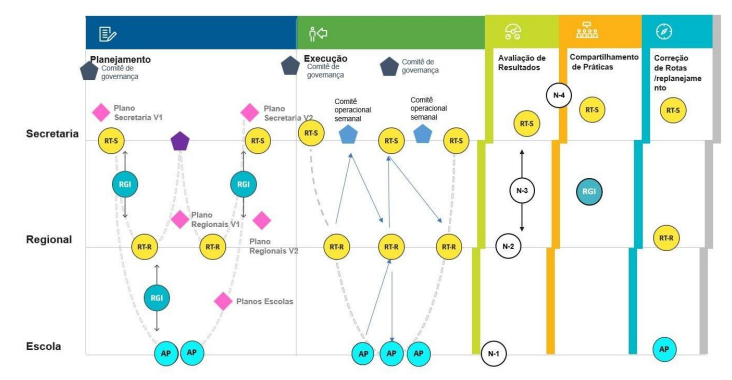
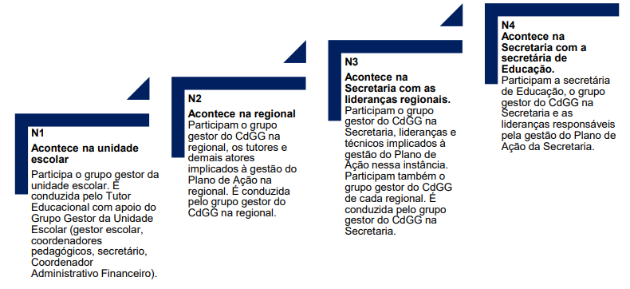

# SMAR

## 1. A Importância da SMAR

Tutor Educacional, a Sistemática de Monitoramento e Avaliação de Resultados (SMAR) é uma etapa fundamental do Circuito de Gestão Goiano. Ela envolve as três instâncias do sistema estadual de educação e tem como objetivo realizar avaliações dos resultados intermediários dos Planos de Ação, especialmente o índice de execução dessas ações. Essa análise baseia-se em evidências concretas e indicadores estruturantes, também chamados de índice de resultado, e é conduzida de maneira coletiva durante reuniões que reúnem diferentes grupos, incluindo você, Tutor Educacional, a comunidade escolar, o grupo gestor das regionais e representantes da Secretaria.

<table>
  <tbody>
    <tr>
      <td>O objetivo é avaliar se as ações planejadas e executadas alcançaram os efeitos e resultados esperados pelas unidades escolares, regional e Secretaria. Caso esses resultados não tenham sido atingidos, este é o momento para construir entendimentos coletivos sobre as razões que explicam esse não cumprimento e definir quais mudanças são necessárias para aprimorar ou reverter a situação no próximo período.</td>
    </tr>
  </tbody>
</table>

A SMAR, assim como as demais etapas do Circuito de Gestão Goiano, reforça a articulação e a corresponsabilização do sistema educacional, envolvendo unidades escolares, regionais e a Secretaria. É importante destacar que, a cada SMAR, é necessário observar cuidadosamente o que esse momento revela sobre a realidade da rede, agindo de forma concreta conforme o contexto específico. A SMAR representa uma oportunidade de aprimoramento dos Planos de Ação, possibilitando uma atuação mais ágil de todos os agentes envolvidos, sem precisar esperar pela conclusão dos resultados para verificar se os Planos de Ação surtiram os efeitos esperados no Planejamento.

**Imagem 3 - Interações do Circuito de Gestão Goiano entre as instâncias do sistema de ensino**

Na imagem, é possível perceber que as análises da SMAR começam na própria unidade escolar, por meio do Acompanhamento Pedagógico realizado pelo Tutor Educacional (AP da N1). Esses acompanhamentos geram dados e encaminhamentos que alimentam as reuniões das instâncias seguintes. Cada nível agrega e sistematiza novas informações, o que possibilita a construção de um panorama mais amplo da rede, até chegar à governança da Secretaria, na SMAR de Nível 4 (N4).

Esse fluxo gera uma série de desdobramentos importantes. Após a SMAR, inicia-se a etapa conhecida como Correção de Rotas. Nela, as equipes da Secretaria comunicam às regionais e unidades escolares os ajustes que precisam ser feitos e os apoios que serão ofertados. Nesse mesmo momento, também é promovida uma Reunião de Compartilhamento de Práticas entre os gestores regionais, com o objetivo de ampliar e enriquecer o repertório de soluções da rede.

As regionais, por sua vez, replicam esse movimento com suas escolas: comunicam os ajustes, declaram os apoios necessários e estimulam a troca de saberes entre os gestores escolares. Essa troca permite que práticas eficazes sejam adaptadas a diferentes realidades, enriquecendo as estratégias locais.

As diretrizes e os apoios definidos nesse processo podem variar de acordo com os resultados e as necessidades específicas das unidades escolares, considerando as diferentes etapas de ensino: Ensino Fundamental, Ensino Médio e Ensino Profissionalizante.

Esses desdobramentos da SMAR são operacionalizados durante a etapa de Correção de Rotas, nas Reuniões de Trabalho (realizadas tanto na Secretaria quanto nas regionais) e nas Reuniões de Gestão Integrada, que envolvem Secretaria e regionais, bem como regionais e suas respectivas unidades escolares.

TABELA 10 \- Fluxo e participantes em cada nível da SMAR e seus desdobramentos

<table>
  <thead>
    <tr>
      <th>N1</th>
      <th>N2</th>
      <th>N3</th>
      <th>N4</th>
    </tr>
  </thead>
  <tbody>
    <tr>
      <td>Acontece na unidade escolar</td>
      <td>Acontece na regional</td>
      <td>Acontece na Secretaria com as lideranças regionais</td>
      <td>Acontece na Secretaria com a secretária de Educação</td>
    </tr>
    <tr>
      <td>Participa o grupo gestor da unidade escolar. É conduzida pelo tutor Educacional com apoio do Grupo Gestor da Unidade Escolar (gestor escolar, coordenadores pedagógicos, secretário, Coordenador Administrativo Financeiro).</td>
      <td>Participam o grupo gestor do CdGG na regional, os tutores e demais atores implicados à gestão do Plano de Ação na regional. É conduzida pelo grupo gestor do CdGG na regional.</td>
      <td>Participam o grupo gestor do CdGG na Secretaria, lideranças e técnicos implicados à gestão do Plano de Ação nessa instância. Participam também o grupo gestor do CdGG de cada regional. É conduzida pelo grupo gestor do CdGG na Secretaria.</td>
      <td>Participam a secretária de Educação, o grupo gestor do CdGG na Secretaria e as lideranças responsáveis pela gestão do Plano de Ação da Secretaria.</td>
    </tr>
  </tbody>
</table>

Imagem 4 - Fluxo e participantes em cada nível da Smar e seus desdobramentos

A SMAR é uma etapa formal e estruturada do Circuito de Gestão Goiano. Ela acontece em momentos específicos do cronograma anual e envolve todas as instâncias do sistema educacional — escola, regional e Secretaria — em um processo coletivo de análise, tomada de decisões e correção de rotas, com base em evidências e indicadores. Seu foco está nos resultados intermediários e estruturantes do Plano de Ação.

Já o monitoramento da execução do Plano é um processo contínuo, realizado ao longo de todo o ano. Ele acontece de forma mais próxima e frequente, especialmente por parte do Tutor Educacional. Seu papel é acompanhar o dia a dia da unidade escolar, verificar a execução das ações planejadas, apoiar os ajustes necessários e garantir que as aprendizagens e os resultados esperados estejam sendo alcançados de maneira efetiva e com equidade.

Enquanto a SMAR consolida análises em momentos pontuais e orienta decisões estratégicas mais amplas, o monitoramento sistemático do Plano de Ação permite intervenções rápidas e oportunas, ajudando a escola a corrigir percursos antes que os desafios se agravem. As duas abordagens se complementam, promovendo uma gestão mais eficaz e responsiva às necessidades da rede.

**Diferença da SMAR para o monitoramento da execução do Plano**

<table>
  <tbody>
    <tr>
      <td>Atenção! A SMAR é uma fotografia da execução do Plano. Nenhuma é igual à outra. Ela só faz sentido se o monitoramento estiver sendo feito com atenção e regularidade.</td>
    </tr>
  </tbody>
</table>

A SMAR é uma parada estratégica. Um momento essencial para avaliar os aprendizados, os desafios enfrentados, os avanços alcançados e os problemas ainda em aberto em cada unidade escolar.

Essa análise ajuda a identificar o que precisa ser ajustado, principalmente nos casos em que a rota precisa ser corrigida para evitar que os mesmos problemas se repitam. Por isso, a etapa de Correção de Rotas é tão importante — mas vamos tratar dela com mais profundidade em outro Guia.

**Conceitos básicos da SMAR/N1**

Na SMAR/N1, dois conceitos centrais guiam a análise da execução do Plano de Ação: **grau de resultado** e **grau de execução**. Esses dois elementos ajudam a observar, de forma combinada, o quanto o plano foi eficaz e eficiente.

Quando dizemos que o Plano de Ação foi eficaz, estamos dizendo que as ações colocadas em prática tiveram consistência suficiente para gerar resultados relevantes, contribuindo diretamente para os objetivos estratégicos da unidade escolar.

**Grau de resultado**

Esse grau é medido a partir de três indicadores principais: a frequência dos estudantes, a quantidade de aulas dadas pelos professores e as notas dos estudantes nas avaliações internas das unidades escolares. Além disso, são consideradas evidências qualitativas percebidas pela escola ou pela regional durante a execução do plano.

Esses dados ajudam a identificar se os resultados estão melhorando, piorando ou permanecendo estagnados. Ou seja, permitem entender se as ações planejadas estão gerando as transformações esperadas, se estão provocando efeitos indesejados ou se não estão surtindo nenhum efeito.

**Grau de execução**

Já o grau de execução considera dois aspectos complementares: as tarefas realizadas e os produtos entregues.

As tarefas representam cada etapa prevista no Plano de Ação. Devem ser registradas regularmente no Sigae, seguindo o cronograma definido. Se não forem realizadas dentro do prazo, a ação é considerada não executada.

Os produtos, por sua vez, são os resultados concretos que cada ação pretende alcançar. Eles precisam ser definidos de forma mensurável e também registrados no sistema. Se os produtos não forem entregues, mesmo com as tarefas feitas, a ação não é considerada concluída.

TABELA 11 \- Estrutura geral do Acompanhamento Pedagógico (AP) da SMAR/N1

<table>
  <thead>
    <tr>
      <th colspan="2">Acompanhamento Pedagógico (AP) da SMAR | N1</th>
    </tr>
  </thead>
  <tbody>
    <tr>
      <td rowspan="7">Preparação</td>
      <td>Estudar o protocolo.</td>
    </tr>
    <tr>
      <td>Apropriar-se do roteiro de exercício analítico prévio da SMAR | N1. Enviar à unidade escolar o roteiro de exercício analítico prévio.</td>
    </tr>
    <tr>
      <td>Retomar os registros dos Acompanhamentos Pedagógicos da etapa de Execução.</td>
    </tr>
    <tr>
      <td>Acessar os relatórios da SMAR no Sigae analisar os indicadores de resultado e de execução, e organizar para levar aos Acompanhamentos Pedagógicos (AP) da SMAR | N1.</td>
    </tr>
    <tr>
      <td>Acessar e analisar os dados de avaliações externas.</td>
    </tr>
    <tr>
      <td>Mapear os pontos fortes e pontos críticos da unidade escolar.</td>
    </tr>
    <tr>
      <td>Agendar o acompanhamento pedagógico no Sigae.</td>
    </tr>
    <tr>
      <td colspan="2"></td>
    </tr>
    <tr>
      <td rowspan="11">Desenvolvimento</td>
      <td>Momento 1: integrar o grupo.</td>
    </tr>
    <tr>
      <td>Momento 2: analisar os processos cruciais.</td>
    </tr>
    <tr>
      <td>Momento 3: avaliar a eficácia do Plano de Ação:</td>
    </tr>
    <tr>
      <td>• análise do indicador frequência dos estudantes;</td>
    </tr>
    <tr>
      <td>• análise do indicador notas dos estudantes;</td>
    </tr>
    <tr>
      <td>• análise dos indicadores de aulas dadas;</td>
    </tr>
    <tr>
      <td>• análise do indicador tarefas;</td>
    </tr>
    <tr>
      <td>• análise dos indicadores produtos entregues;</td>
    </tr>
    <tr>
      <td>• análise da eficácia geral do Plano de Ação.</td>
    </tr>
    <tr>
      <td>Momento 4: identificar as práticas para compartilhamento.</td>
    </tr>
    <tr>
      <td>Momento 5: combinar os próximos passos.</td>
    </tr>
    <tr>
      <td colspan="2"></td>
    </tr>
    <tr>
      <td rowspan="3">Próximos passos</td>
      <td>Registrar.</td>
    </tr>
    <tr>
      <td>Divulgar os resultados da SMAR para a unidade escolar.</td>
    </tr>
    <tr>
      <td>Preparar-se para a SMAR | N2.</td>
    </tr>
  </tbody>
</table>

**Preparação para o Acompanhamento Pedagógico (AP)/N1**

Para que a SMAR/N1 cumpra seu papel de forma eficaz, é essencial que você inicie a coleta de informações com antecedência e comece a analisar os dados disponíveis. Essa preparação prévia vai te ajudar a conduzir reflexões mais consistentes com o grupo gestor da escola durante o Acompanhamento Pedagógico (AP).

**Estude o protocolo com atenção**

Ao revisar o protocolo, identifique os pontos que exigem um olhar mais aprofundado em cada etapa de ensino. Ao mesmo tempo, observe o que pode ser tratado de forma geral, considerando o conjunto das etapas. Esse mapeamento prévio facilita a organização do diálogo com a equipe escolar e torna o encontro mais produtivo.

**Organização prévia para a SMAR/N1**

**Envie o roteiro e oriente o grupo gestor**  
Aproprie-se do conteúdo e envie com antecedência o roteiro do exercício analítico prévio para a SMAR/N1 das unidades escolares. Esse roteiro deve orientar o grupo gestor a acessar os relatórios disponíveis no Sigae e registrar suas primeiras leituras sobre os dados da escola.

Reforce a importância de envolver representantes do Ensino Fundamental, Ensino Médio e Ensino Profissionalizante no processo — esse olhar coletivo contribui para uma análise mais completa e estratégica.

**Retome os registros dos Acompanhamentos Pedagógicos (AP) da etapa de Execução**

Para apoiar a análise dos dados da SMAR/N1, é importante verificar se as ações executadas estão contribuindo, de fato, para que a unidade escolar alcance os objetivos definidos — e em quais condições isso está acontecendo.

Acesse os relatórios da SMAR no Sistema de Gestão de Ações Educacionais (Sigae), analise os indicadores de resultado (aulas dadas, frequência e notas dos estudantes) e os de execução (tarefas e produtos). Organize essas informações para levar ao próximo Acompanhamento Pedagógico (AP) da SMAR/N1.

O Sigae também disponibiliza um relatório de análise chamado **Situação de Eficácia**, que compara o desempenho da unidade escolar com o da rede e com o de outras unidades da mesma regional. Explore o sistema para realizar uma análise mais completa:

-   **Filtre por etapa/ano de escolaridade:** use os filtros para visualizar o desempenho de cada indicador de acordo com a etapa e o ano. Anote os dados mais relevantes.
-   **Escolha o formato:** veja os relatórios diretamente no Sigae ou baixe-os para apresentações (como PowerPoint) ou versões impressas.
-   **Análise das avaliações externas:** acesse os resultados das avaliações externas para compreender melhor o domínio de conteúdos e habilidades dos estudantes, com base na matriz de avaliação da rede.

Outra plataforma essencial nesse processo é a do **Centro de Políticas Públicas e Avaliação da Educação (Caed)**. Ela oferece relatórios detalhados por unidade escolar, turma e estudante. Com base nas avaliações estaduais, é possível cruzar o nível de complexidade dos descritores com o grau de domínio demonstrado pelos estudantes . Isso ajuda o coordenador pedagógico e os professores a identificarem as principais dificuldades e a planejarem ações de reforço e recuperação mais assertivas.

**Mapeie os pontos fortes e os pontos críticos da unidade escolar**

Compare a situação da unidade escolar com os dados da rede e identifique os principais destaques. Com base nessa análise e no apoio deste protocolo, direcione o foco para as conquistas do período e também para os pontos críticos que devem ser priorizados.

**Agende o Acompanhamento Pedagógico (AP) no Sigae – fique atento ao tempo necessário para a SMAR/N1**

Tutor Educacional, acompanhe de perto o cronograma do **Circuito de Gestão Goiano**. Durante os Acompanhamentos Pedagógicos (AP) da SMAR/N1, é essencial organizar sua rotina para garantir que todas as etapas sejam cumpridas dentro do prazo previsto.

**Desenvolvimento do Acompanhamento Pedagógico (AP) da SMAR/N1**

## 2. Momento 1: integração do grupo

Inicie o encontro apresentando o infográfico do Circuito de Gestão Goiano. Mostre onde se localiza este Acompanhamento Pedagógico (AP) da SMAR/Nível 1 (N1) na sequência dos níveis: N1, N2, N3 e N4. Explique a lógica de progressão entre eles para que o grupo compreenda o momento atual dentro do ciclo de gestão.

**Apresente os objetivos desta reunião da SMAR/N1:**

-   Avaliar a eficácia das ações realizadas no período, por meio da análise combinada dos resultados e da execução do Plano de Ação.
-   Identificar experiências exitosas para o Compartilhamento de Práticas.
-   Identificar pontos relevantes que devem ser encaminhados para a etapa de Correção de Rotas.
-   Mapear demandas de apoio que precisam ser encaminhadas à regional e à Secretaria de Estado da Educação (Seduc).
-   Combinar os próximos passos para a etapa de Correção de Rotas.

A proposta é verificar se as ações planejadas e executadas pelas unidades escolares, pela regional e pela Secretaria produziram os efeitos e resultados esperados. Caso os indicadores estejam abaixo do previsto, será necessário entender as causas, refletir sobre os desafios enfrentados e propor ajustes para melhorar ou reverter os resultados no período seguinte.

**Reforce o olhar para os fatores que ampliam desigualdades de aprendizagem**

A análise realizada na SMAR precisa considerar, de forma intencional, a redução das desigualdades de aprendizagem e a garantia de permanência dos estudantes na escola. Leve em conta os diferentes perfis dos estudantes e as desigualdades observadas por cor/raça, gênero e situação socioeconômica.

**Estabeleça os combinados da reunião**

Combine previamente com o grupo gestor a metodologia que será adotada durante a reunião, o tempo previsto para cada momento e quem será responsável por sistematizar os conteúdos gerados — tanto no diálogo quanto nos formulários.

Oriente a pessoa responsável pela sistematização para que esteja com acesso ao Sistema de Gestão de Ações Educacionais (Sigae) durante a reunião, garantindo maior agilidade no registro e na navegação pelos dados.

## 3. Momento 2: análise dos processos cruciais

Conduza, com o grupo gestor, uma análise sobre o andamento e a qualidade dos registros e da coleta de dados da unidade escolar. Utilize as questões abaixo para orientar a reflexão:

-   De que forma a qualidade das informações registradas no **Sistema de Gestão de Ações Educacionais (Sigae)** sobre a execução do Plano de Ação reflete a realidade da unidade escolar?
-   Como o cumprimento dos prazos de postagem contribui para uma análise precisa dos dados da **SMAR – Solução de Monitoramento, Avaliação e Resultados**?
-   Há diferenças na regularidade e na qualidade dos registros quando comparamos as etapas do Ensino Fundamental, Ensino Médio e Ensino Profissionalizante?
-   Se sim, como essas diferenças impactam a análise dos dados e a tomada de decisões específicas para cada etapa?
-   Como estão os registros feitos em outras ferramentas da **Secretaria de Estado da Educação (Seduc)**, considerando prazos e qualidade?
-   Há dificuldades para manter uma rotina de registro adequada e com qualidade? Quais são os principais desafios enfrentados?
-   Que tipos de apoio poderiam ser oferecidos para melhorar a qualidade dos registros?
-   Como a unidade escolar pode fortalecer a colaboração entre os profissionais para garantir que os registros retratem fielmente a realidade e sirvam de base para decisões pedagógicas?

**Reforce com o grupo gestor**: os registros dos **Formulários I e II** devem ser preenchidos com atenção e qualidade. Eles são fundamentais para que a unidade escolar se reconheça nos relatórios da SMAR e consiga tomar decisões mais assertivas.

## 4. Momento 3: avaliação da eficácia do Plano de Ação

A eficácia do Plano de Ação na SMAR se revela na capacidade da unidade escolar de alcançar os objetivos estratégicos da rede por meio da melhoria nos resultados de aprendizagem. Um plano é eficaz quando sua execução impacta positivamente a realidade da escola.

Para realizar essa análise:

-   Observe com atenção os **indicadores estruturantes de resultado**: frequência dos estudantes, aulas dadas e notas.
-   Avalie também os **indicadores de execução**: cumprimento das tarefas e entrega dos produtos previstos no plano.

Defina quem será o **relator**, responsável por registrar os pontos discutidos. Esse registro integrará o **Formulário I**.

Durante a reunião, utilize os seguintes formulários, disponíveis no Sigae:

-   **Formulário I** – Indicações para a etapa de Correção de Rotas.
-   **Formulário II** – Registro de práticas para Compartilhamento.

**Análise do indicador de frequência dos estudantes**

A análise da frequência dos estudantes, além de ser uma condição mínima para garantir a aprendizagem, é fundamental para indicar a propensão ao abandono e à reprovação. Observar esse dado com atenção permite identificar quais estudantes estão mantendo vínculo com a escola, o que contribui para garantir sua permanência e prevenir o abandono.

**Passo a passo**

-   Peça para que o grupo gestor apresente os destaques feitos a partir da leitura dos dados de frequência dos estudantes, em comparação ao previsto, conforme o exercício proposto no roteiro analítico prévio.
-   Após a apresentação, convide o grupo a fazer comentários gerais, se houver.
-   Explique que o objetivo agora será aprofundar essa análise inicial.
-   Navegue pelos relatórios da SMAR “Frequência dos estudantes”, disponíveis no Sigae.
-   Clique nos filtros para ver o desempenho do indicador por etapa/ano de escolaridade.
-   Repita a operação para cada um dos filtros.

    ✓ Etapas (Ensino Fundamental, Ensino Médio e Ensino Profissionalizante)  
    ✓ Turnos  
    ✓ Turmas  
    ✓ Componente Curricular  
    ✓ Frequência por raça, gênero (se houver)

-   Explique como se chega ao percentual médio de frequência, calculando o realizado sobre o previsto. Ou seja, dividindo o total real de frequência (de todos os estudantes, em todos os componentes curriculares) pelo total previsto de frequência (também de todos os estudantes e componentes).

Para mobilizar o grupo a refletir, propõe-se para cada tema um conjunto de perguntas que subsidiarão as discussões, conforme indicado abaixo.

**Garantia e manutenção da frequência dos estudantes**  
O percentual de frequência se manteve estável ao longo do tempo ou houve variações significativas? Reflitam e considerem as seguintes questões:

-   Como se comparam os percentuais de frequência entre todas as séries/anos do Ensino Médio e do Ensino Profissionalizante? Existem diferenças notáveis, e quais particularidades de cada série/ano podem influenciar esses resultados?
-   Existem diferenças notáveis nos percentuais de frequência entre o 6º, 7º, 8º e 9º anos do Ensino Fundamental? Quais particularidades de cada ano podem influenciar esses resultados?
-   Ao analisar os dados de frequência ao longo do ano, quais meses ou períodos apresentam os maiores desvios em relação à média? O que esses picos ou quedas na frequência podem nos revelar sobre o cotidiano escolar e as necessidades dos estudantes?
-   Existe algum componente curricular que apresenta uma frequência menor dos estudantes em comparação com os demais? Quais podem ser as causas dessa menor frequência? Há fatores relacionados ao conteúdo, à metodologia, ao ambiente ou a outros aspectos?
-   Se a média de frequência da unidade escolar estiver abaixo ou muito abaixo da média da regional e/ou da rede, reflitam: por que a unidade escolar está nesta condição? Há variação significativa por etapa de ensino? Se sim, por que isto pode estar acontecendo? Que medidas podem ser tomadas para alinhar a frequência da unidade escolar com as médias da regional e da rede?

**Desigualdades na frequência**

-   Ao analisarmos os dados de frequência, nota-se diferenças significativas entre estudantes homens negros e brancos? E entre estudantes mulheres brancas e negras? Quais fatores podem estar contribuindo para essas disparidades?
-   Caso existam desigualdades na frequência, onde elas se manifestam de forma mais evidente?
-   As diferenças são mais acentuadas na 1ª, 2ª ou 3ª série do Ensino Médio?
-   São mais acentuadas no 1º, 2º ou 3º ano do Ensino Profissionalizante?
-   Ou se concentram no 6º, 7º, 8º ou 9º ano do Ensino Fundamental?
-   Ocorrem maiores variações nos turnos matutino, vespertino ou noturno?
-   Quais hipóteses podemos levantar para explicar essas discrepâncias? Observa-se uma variação significativa por etapa de ensino? Se sim, quais fatores podem estar contribuindo para essa situação?

**Frequência e a propensão ao abandono**

-   Considerando os dados de frequência, podemos identificar grupos de estudantes que demonstram uma maior probabilidade de abandono escolar?
-   Caso existam tais grupos, quais seriam eles? Observa-se alguma diferença relevante entre as etapas de ensino em relação a essa propensão? Em caso afirmativo, quais fatores poderiam explicar essa variação?
-   Quais seriam as possíveis causas de infrequência enfrentadas pelos estudantes pertencentes a esses grupos identificados?

### 4.1. Plano de ação: frequência dos estudantes e ações realizadas pela unidade escolar

-   De que maneira as ações executadas pela unidade escolar, em consonância com o Plano de Ação, contribuíram para a melhoria da frequência dos estudantes? Alguma etapa de ensino se destacou nesse processo, e quais fatores podem explicar esse destaque?
-   Qual foi o impacto da busca ativa realizada pela unidade escolar na frequência dos estudantes? Quais estratégias se mostraram mais eficazes nesse processo?
-   Para quais estudantes a busca ativa apresentou resultados menos satisfatórios, considerando as diferentes condições de vulnerabilidade presentes na unidade escolar? Quais barreiras podem ter dificultado o sucesso da busca ativa nesses casos?
-   Pode-se identificar alguma ação que, embora não estivesse formalmente prevista no Plano de Ação, demonstrou um impacto positivo na frequência dos estudantes? Quais características dessa ação podem ter contribuído para o seu sucesso?

<table><tr><td><strong>Registro para o Formulário I</strong><ul><li>Pontos fortes da unidade escolar.<li>Pontos críticos da unidade escolar.<li>Ideias para ajustes nas ações do Plano de Ação.<li>Ideias para novas ações.<li>Ações da unidade escolar que estejam gerando resultados positivos, que terão continuidade e que ainda não estão no Plano de Ação.<li>Demandas para serem encaminhadas à regional ou à Secretaria.<li>Articulações necessárias (rede de proteção social), relacionadas a trabalho, renda, assistência social, saúde, cultura e lazer.<li>Ações da unidade escolar que estejam gerando resultados positivos, que terão continuidade e que ainda não estão no Plano de Ação.<li>Demandas para serem encaminhadas à regional ou à Secretaria.<li>Articulações necessárias (rede de proteção social), relacionadas a trabalho, renda, assistência social, saúde, cultura e lazer.</ul></table>

**Análise do indicador notas dos estudantes**  
A análise do indicador de notas permite às unidades escolares, às regionais e à Secretaria realizarem um balanço do período vigente. Esse processo ajuda a entender se o esforço para garantir as aulas contribuiu com a permanência dos estudantes e possibilitou a manutenção da aprendizagem para todos.

**Passo a passo**  
Peça que o grupo gestor apresente os destaques feitos a partir da leitura dos dados de notas dos estudantes, elaborados previamente no exercício proposto no roteiro analítico.  
Após a apresentação, convide o grupo a fazer comentários gerais, se houver.  
Assim como no momento anterior, explique que o objetivo agora é aprofundar essa análise inicial.

-   Navegue pelos relatórios da SMAR “Notas dos Estudantes”, disponíveis no Sigae.
-   Clique nos filtros para visualizar o desempenho do indicador por etapa e ano/série de escolaridade.
-   Repita a operação para cada um dos filtros:  
    ✓ Etapa (Ensino Fundamental, Ensino Médio e Ensino Profissionalizante);  
    ✓ Turnos;  
    ✓ Turmas;  
    ✓ Componente curricular;  
    ✓ Notas por componente curricular por raça/cor.
-   Para calcular o percentual médio de notas dos estudantes, some o número de estudantes que não têm nenhuma nota abaixo da média com aqueles que têm apenas uma nota abaixo da média. Depois, divida esse total pelo número de estudantes da unidade escolar. O resultado será o percentual médio desejado.

Para otimizar o tempo e estimular a reflexão, propõe-se, para cada tema a seguir, um conjunto de perguntas que servirá como base para as discussões.

**Avanços na aprendizagem**

-   O percentual de estudantes da unidade escolar sem notas ou com notas abaixo do mínimo exigido para aprovação (ou seja, que seriam reprovados caso o ano letivo terminasse hoje) é semelhante entre o Ensino Médio e o Ensino Profissionalizante? Se sim ou se não, por quê?
-   O que esse percentual revela sobre o nível de aprendizagem? Quais são as primeiras hipóteses possíveis a partir dessa avaliação?
-   De modo geral, quais causas podem ser identificadas para a baixa aprendizagem no Ensino Fundamental, no Ensino Médio ou no Ensino Profissionalizante?
-   Se os percentuais de estudantes sem nota ou com notas abaixo do mínimo exigido forem superiores à média da regional ou da rede, reflitam: por que a unidade escolar está nessa condição?
-   Existem relações entre o percentual de estudantes sem notas ou com notas muito baixas e a frequência? Há variações entre os dados do Ensino Fundamental, do Ensino Médio e do Ensino Profissionalizante?

**Desigualdades de Aprendizagem**

-   Qual é o percentual de estudantes com notas abaixo do mínimo em todas as séries/anos do Ensino Médio e do Ensino Profissionalizante?
-   Qual é o percentual de estudantes com notas abaixo do mínimo no 6º, 7º, 8º e 9º ano do Ensino Fundamental?
-   O percentual de notas abaixo do mínimo varia entre os turnos matutino, vespertino e noturno?
-   Há variações nesses percentuais em algum mês ou período específico do ano letivo?
-   De que forma as condições de vulnerabilidade dos estudantes podem ter influenciado esses resultados?
-   Algum componente curricular apresenta maior índice de estudantes sem nota ou com nota abaixo do mínimo no Ensino Fundamental, no Ensino Médio ou no Ensino Profissionalizante?
-   Quais evidências ajudam a explicar as notas mais baixas nesses componentes curriculares?
-   O percentual de estudantes negros com notas abaixo do mínimo é diferente do de estudantes brancos?
-   Em caso afirmativo, onde essa diferença se mostra mais significativa:  
     a. Na 1ª, 2ª ou 3ª série do Ensino Médio?  
     b. No 1º, 2º ou 3º ano do Ensino Profissionalizante?  
     c. No 6º, 7º, 8º ou 9º ano do Ensino Fundamental?  
     d. Em qual turno (matutino, vespertino ou noturno)?  
     e. Em qual componente curricular?

### 4.2. Plano de ação: aprendizagem dos estudantes e ações realizadas pela unidade escolar

-   As estratégias pedagógicas adotadas para recuperação da aprendizagem (como reforço escolar, intervenção pedagógica etc.) demonstraram eficácia? Houve diferenças nos resultados entre o Ensino Fundamental, o Ensino Médio e o Ensino Profissionalizante?
-   As estratégias foram totalmente eficazes, parcialmente eficazes ou não tiveram o efeito desejado? Quais evidências sustentam essa avaliação?
-   Para quais estudantes as estratégias pedagógicas tiveram menos resultados, considerando o Ensino Fundamental, o Ensino Médio e o Ensino Profissionalizante? O que pode explicar essa disparidade?
-   As ações e decisões realizadas pela unidade escolar contribuíram para a participação dos estudantes com propensão ao abandono?
-   Essas ações foram totalmente eficazes, parcialmente eficazes ou não surtiram o efeito desejado? Quais evidências sustentam essa avaliação?
-   As ações e decisões realizadas pela unidade escolar contribuíram para a redução das desigualdades de aprendizagem dentro da unidade?
-   Essas ações foram totalmente eficazes, parcialmente eficazes ou não produziram o impacto esperado? Quais evidências sustentam essa avaliação?

<table><tr><td>Registro para o Formulário I<ul><li>Pontos fortes da unidade escolar.<li>Pontos críticos da unidade escolar.<li>Ideias para ajustes nas ações do Plano de ação.<li>Ideias para novas ações.<li>Ações da unidade escolar que estejam gerando resultados positivos, que terão continuidade e que ainda não estão no Plano de Ação.<li>Demandas para serem encaminhadas à regional ou à Secretaria.<li>Articulações necessárias (rede de proteção social), relacionadas a trabalho, renda, assistência social, saúde, cultura e lazer.</ul></table>

**Análise do indicador aulas dadas**  
Garantir a realização de todas as aulas representa um esforço crucial para assegurar a oferta de ensino, fortalece os vínculos dos estudantes com a unidade escolar e reafirma o compromisso de garantir o direito à aprendizagem, mesmo diante de tantos desafios.

**Passo a passo**

-   Peça que o grupo gestor apresente os destaques feitos a partir da leitura dos dados de aulas dadas (os destaques foram elaborados previamente, no exercício proposto no roteiro analítico).
-   Após a apresentação, convide o grupo a fazer comentários gerais, se houver.
-   Navegue pelo relatório da SMAR “Aulas Dadas” disponível no Sigae.
-   Assim como no momento anterior, explique que o objetivo agora também é fazer um aprofundamento dessa análise inicial.
-   Repita a operação para cada um dos filtros.  
    ✓ Etapa (Ensino Fundamental, Ensino Médio e Ensino Profissionalizante);  
    ✓ Turnos;  
    ✓ Turmas;  
    ✓ Componente curricular.
-   O percentual médio de Aulas Dadas é obtido calculando a proporção entre o número de aulas efetivamente realizadas e o número total de aulas que estavam previstas. Ou seja, divide-se o total de aulas dadas pelo total de aulas previstas. Para otimizar o tempo e mobilizar a reflexão, propõe-se para cada tema abaixo um conjunto de perguntas que subsidiarão as discussões.

**Avanços na oferta de ensino**

-   Como avaliam o percentual de aulas dadas comparadas com o que era previsto? Surpreende? Sim, não, por quê?
-   O percentual de aulas dadas varia significativamente entre as séries do Ensino Médio (1ª, 2ª e 3ª), Ensino Profissionalizante (1º, 2º e 3º) e do Ensino Fundamental (6º ao 9º ano)?
-   Existem diferenças notáveis no percentual de aulas dadas entre os turnos matutino, vespertino e noturno?
-   Observa-se flutuações no percentual de aulas dadas ao longo do ano letivo, em algum mês ou período específico?
-   Se sim, o que pode ter provocado essas variações?
-   Há algum componente curricular que se destaca por apresentar um percentual menor de aulas dadas em cada etapa de ensino?
-   Se existe, quais hipóteses explicam esse dado?
-   Que leituras se faz ao relacionar o percentual de aulas dadas com a frequência dos estudantes em cada etapa?
-   Se o percentual de aulas dadas na sua unidade escolar está abaixo do percentual da regional ou da rede, qual o motivo faz com que ela esteja nessa condição?

**Condições de oferta e desigualdades**

-   O que os dados da unidade escolar sugerem em relação à formação continuada dos professores? Quais necessidades formativas se destacam?
-   Como se avalia o nível de engajamento dos professores com as atividades escolares e com o processo de ensino-aprendizagem?
-   Como avaliam o domínio de repertórios dos profissionais da unidade escolar?
-   Há diferenças entre as práticas do Ensino Fundamental, Ensino Médio e Ensino Profissionalizante que impactem as condições de oferta? Quais são essas diferenças?
-   As práticas pedagógicas implementadas têm contribuído para reduzir as desigualdades na oferta de ensino entre os estudantes, especialmente aqueles pertencentes a grupos mais vulneráveis?
-   Sim (totalmente? Parcialmente?) ou não?
-   Como? Quais são as evidências que sustentam essa avaliação?

### 4.3. Plano de ação: aulas dadas e ações realizadas pela unidade escolar

1. Em que medida as ações executadas contribuíram para melhorar as condições de oferta de ensino, considerando o trabalho dos gestores pedagógicos e dos professores?

-   Sim (totalmente? Parcialmente?) ou não?
-   Como? Quais evidências sustentam essa avaliação?
-   Há diferenças perceptíveis entre as etapas de ensino?
-   Melhora das Condições de Oferta (Estudantes).

2. Em que medida as ações executadas contribuíram para melhorar as condições de oferta de ensino para os estudantes?

-   Sim (totalmente? Parcialmente?) ou não?
-   Como? Quais evidências sustentam essa avaliação?
-   Há diferenças perceptíveis entre as etapas de ensino?
-   Melhora das Condições de Oferta (Estudantes Vulneráveis).

3. Em que medida as ações executadas contribuíram para melhorar as condições de oferta de ensino para os estudantes em situação de vulnerabilidade?

-   Sim (totalmente? Parcialmente?) ou não? Quais evidências sustentam essa avaliação?
-   Há diferenças perceptíveis entre as etapas de ensino?

<table><tr><td><strong>Registro para o Formulário I</strong><ul><li>Pontos fortes da unidade escolar<li>Pontos críticos da unidade escolar<li>Ideias para ajustes nas ações do Plano de Ação<li>Ideias para novas ações<li>Ações da unidade escolar com resultados positivos, que terão continuidade, mas não constam no Plano de Ação<li>Demandas para serem encaminhadas à regional ou à Secretaria<li>Articulações necessárias (rede de proteção social), relacionadas a trabalho, renda, assistência social, saúde, cultura e lazer</ul></table>

**Análise do indicador tarefas**

As tarefas detalham as ações planejadas pela unidade escolar, com cronogramas específicos. A execução dentro dos prazos é fundamental para garantir que as ações previstas se concretizem com eficácia.

**Passo a passo para análise:**

-   Solicite que o grupo gestor apresente os destaques da leitura dos dados de execução, considerando os status:

    -   **Concluídas:** iniciadas e finalizadas nas datas previstas.
    -   **Concluídas com atraso:** iniciadas na data prevista, mas finalizadas depois.
    -   **Em andamento:** tarefas que estão sendo executadas.
    -   **Atrasadas:** ainda não finalizadas, com prazo final ultrapassado.
    -   **Não iniciadas:** ainda não começaram e deveriam ter iniciado.

-   Após a apresentação, incentive comentários gerais do grupo.
-   Navegue pelo relatório “Tarefas” no Sigae para um aprofundamento detalhado.
-   O percentual médio de tarefas realizadas pela unidade escolar é obtido somando o número de tarefas concluídas (incluindo as concluídas com atraso) e o número de tarefas em andamento. O resultado dessa soma é, então, dividido pelo número total de tarefas que deveriam ter sido iniciadas no período em análise.
-   É importante definir com o grupo quem será o responsável por registrar toda a discussão durante a análise, pois esse registro será fundamental para compor o Formulário I ao final do processo.

**Perguntas para mobilizar a discussão:**

-   Quantas tarefas estão atrasadas?
-   Quantas tarefas deveriam ter sido iniciadas, mas não foram?
-   Há dificuldades no registro das tarefas no sistema? A falta de registro pode gerar impressão equivocada de atraso ou não início.
-   Existe falta de engajamento dos responsáveis? Quais podem ser os motivos do desinteresse?
-   As tarefas foram planejadas de modo realista, considerando recursos e tempo disponíveis?
-   Os profissionais possuem conhecimento e habilidade para usar o Sigae? A familiaridade com o sistema impacta o acompanhamento e execução?
-   O percentual médio de tarefas realizadas está abaixo, acima ou igual à média da regional e da rede? Quais fatores explicam essa situação?

<table><tr><td><strong>Registro para o Formulário I</strong>
Para aumentar a execução do Plano de Ação da unidade escolar, é importante refletir e registrar:<ul><li>Quais são os pontos fortes da unidade escolar?<li>Quais são os pontos críticos da unidade escolar?<li>Quais são as ideias para aumentar ou melhorar a execução do Plano de Ação da unidade escolar?</ul></table>

**Análise do Indicador Produtos**

Os produtos representam o resultado efetivo das ações planejadas pela unidade escolar. Embora as tarefas possam estar sendo executadas, é fundamental verificar se os produtos estão sendo entregues conforme o planejado. A ausência de entregas compromete a conclusão das ações.

Para analisar o andamento do Plano de Ação e identificar possíveis riscos de não conclusão, é importante investigar se houve dificuldades no registro dos produtos ou se mudanças no contexto da unidade escolar impactaram a execução das ações.

**Passo a passo para a análise:**

-   Solicite que o grupo gestor apresente os principais pontos identificados na análise dos dados de eficiência, baseando-se nos destaques previamente elaborados.
-   Após a apresentação, abra espaço para comentários gerais do grupo.
-   Explique que o objetivo agora é aprofundar a análise inicial.
-   Navegue pelos relatórios de “Produtos” disponíveis no sistema Sigae.
-   Explique que o percentual médio de produtos entregues é calculado pela proporção entre a quantidade de produtos 100% entregues e a quantidade total de produtos que deveriam ter sido entregues no período. Caso a unidade escolar não tenha produtos planejados para entrega naquele período, considera-se a média de entrega como 100%.

**Para orientar a discussão, considere as seguintes perguntas:**

-   Quantos e quais produtos deveriam ter sido entregues e não foram? Eles estão concentrados em alguma etapa de ensino específica?
-   O ritmo de entrega dos produtos está abaixo, acima ou dentro do esperado?

-   Se o ritmo está abaixo do esperado, quais fatores podem explicar esse desempenho? Seria por falta de registro, desengajamento ou planejamento inadequado das tarefas?
-   Como o percentual médio de entrega dos produtos da unidade escolar se compara ao da regional e da rede? Quais são as possíveis razões para essa diferença?

<table><tr><td><strong>Registro para o Formulário I</strong>
Para aumentar a execução do Plano de Ação da unidade escolar, é importante refletir e registrar:<ul><li>Quais são os pontos fortes da unidade escolar?<li>Quais são os pontos críticos da unidade escolar?<li>Quais são as ideias para aumentar ou melhorar a execução do Plano de Ação da unidade escolar?</ul></table>

**Análise Geral da Eficácia do Plano de Ação**

A avaliação da eficácia do Plano de Ação da unidade escolar tem como objetivo mensurar a capacidade do plano de gerar impactos reais na realidade escolar, refletidos nos resultados de aprendizagem, permanência dos estudantes e redução das desigualdades educacionais, alinhados aos objetivos estratégicos da rede.

A eficácia é avaliada a partir da análise conjunta dos indicadores estruturantes — frequência, notas e aulas dadas — e dos indicadores de execução — tarefas e produtos.

Após análise detalhada dos dados disponíveis no relatório “Análise geral de eficácia” da SMAR, o grupo gestor refletiu sobre a situação atual da unidade escolar em relação a essas dimensões, considerando:

-   O desempenho nos indicadores de frequência, notas e aulas dadas, avaliando se os estudantes estão efetivamente participando e aprendendo;
-   O grau de cumprimento das tarefas planejadas e entrega dos produtos esperados, apontando o nível de execução das ações previstas no Plano;
-   A articulação entre resultados e execução, para entender se as ações têm sido efetivas para alcançar os objetivos estratégicos da rede;
-   As dificuldades enfrentadas e os pontos que contribuem positivamente para a eficácia do Plano.

A partir dessa reflexão coletiva, a unidade escolar definiu um responsável para registrar as discussões que serão compiladas nos formulários oficiais.

O grupo considera fundamental manter o monitoramento contínuo e promover ajustes no Plano para garantir que a eficácia melhore progressivamente, fortalecendo o compromisso com a garantia da aprendizagem, a permanência escolar e a redução das desigualdades.

TABELA 12 - Medidas de eficácia do Plano de Ação da unidade escolar

<table><thead><tr><th colspan="2">Medidas de eficácia do Plano de Ação da unidade escolar<tbody><tr><td>Alto grau de execução com resultados positivos<td>
3 indicadores estruturantes iguais ou acima da média da rede
2 indicadores de execução iguais ou acima da média da rede<tr><td>Alto grau de execução com resultados abaixo do esperado<td>
3 indicadores estruturantes abaixo da média da rede
2 indicadores de execução iguais ou acima da média da rede<tr><td>Baixo grau de execução e resultados positivos<td>
3 indicadores estruturantes iguais ou acima da média da rede
2 indicadores de execução abaixo da média da rede<tr><td>Baixo grau de execução com resultados abaixo do esperado<td>
1 ou mais indicador estruturante abaixo da média da rede
1 ou mais indicador de execução abaixo da média da rede</table>

**Alto grau de execução com resultados positivos**

Quais ações do Plano podem ter exercido maior influência na melhoria dos indicadores estruturantes?

Ao observar a evolução individual de cada indicador estruturante, em quais deles as ações implementadas demonstraram maior assertividade?

<table><thead><tr><td><strong>Registro para o Formulário I</strong>
Quais ações, dentre as identificadas, podem ser potencializadas na unidade escolar?
<strong>Registro para Formulário II</strong>
Quais práticas podem ser compartilhadas com as demais unidades escolares da regional?</thead></table>

**Baixo grau de execução e resultados positivos**

-   Que ações a unidade escolar está realizando e que não estão registradas no seu Plano?
-   Com quais dos indicadores estruturantes essas ações mais dialogam?
-   Essas ações executadas foram elaboradas com vistas a contribuir para o alcance de quais objetivos?
-   São ações que terão continuidade na unidade escolar ou foram elaboradas somente para um período específico?

<table>
  <tbody>
    <tr>
      <td>
        <strong>Registro para o Formulário I </strong>
        
Inclua no Plano de Ação as ações realizadas que geraram bons resultados e que terão continuidade. 

        <strong>Registro para o Formulário II </strong>
        
Considere indicar as ações executadas que geraram bons resultados para serem compartilhadas com outras unidades escolares.

      </td>
    </tr>
  </tbody>
</table>

**Alto grau de execução com resultados abaixo do esperado**

-   Quais fatores fizeram com que, mesmo com as ações realizadas e produtos entregues, os resultados não tenham sido alcançados?
-   O diagnóstico inicial foi falho, dificultando a escolha das ações certas? Ou as ações feitas não foram fortes o suficiente para os desafios?
-   Que aprendizados essa experiência trouxe para a criação e execução do Plano?
-   Como isso pode ajudar na etapa de Correção de Rotas, para melhorar o planejamento e as próximas ações?

<table>
  <tbody>
    <tr>
      <td>
        Registro para o Formulário I
        
Identifique o que precisa ser revisto no Plano de Ação – que ações devem ser interrompidas e quais demandam ajustes/reconfigurações.

      </td>
    </tr>
  </tbody>
</table>

**Baixo grau de execução com resultados abaixo do esperado**

-   Quais os motivos que impediram a execução do Plano de Ação conforme o previsto?
-   Esses motivos são internos (sob controle da unidade escolar) ou externos (fora do controle)?
-   Houve mudanças no contexto da escola que dificultaram ou impediram a execução?
-   Os resultados ruins são causados só pela falta de execução ou também pela baixa efetividade das ações feitas?

<table>
  <tbody>
    <tr>
      <td>
		<strong>Registro para o Formulário I</strong>
		<ul>
			<li>Qual apoio a unidade escolar precisa da Regional e da Secretaria para melhorar sua execução e seus resultados?</li>
			<li>Quais ideias podem contribuir para melhorar a eficiência do Plano de Ação da unidade escolar?</li>
		</ul>
		</td>
    </tr>
  </tbody>
</table>

## 5. Momento 4: Identificação de Práticas para Compartilhamento

O compartilhamento de experiências e práticas bem-sucedidas enriquece o trabalho coletivo, amplia os repertórios da equipe e inspira novas soluções. Mesmo em contextos diferentes, boas práticas podem servir como referência e adaptação. A criatividade entra justamente nesse ponto: ao reconhecer o que pode ser aproveitado de cada experiência e como aplicá-la de acordo com a realidade da unidade escolar.

**Passo a passo:**

-   Peça ao grupo que identifique as práticas exitosas citadas e registradas ao longo do período de Acompanhamento Pedagógico (AP) da SMAR / N1.
-   As práticas podem ser gerais (envolvendo toda a unidade escolar) ou específicas de uma etapa de ensino (Ensino Fundamental, Ensino Médio ou Ensino Profissionalizante).
-   Mobilize a equipe para identificar de que forma essas práticas colaboraram com os seguintes aspectos:

    ✓ Manutenção e ampliação da frequência dos estudantes;  
     ✓ Redução das desigualdades de frequência, especialmente entre os grupos mais vulneráveis;  
     ✓ Prevenção ou redução do abandono escolar;  
     ✓ Recuperação e avanço da aprendizagem dos estudantes;  
     ✓ Redução das desigualdades de aprendizagem, considerando os estudantes em maior vulnerabilidade;  
     ✓ Melhoria da oferta de ensino, com foco nos estudantes mais impactados por condições de vulnerabilidade.

-   Oriente o grupo para registrar essas práticas no **Formulário II – Registro de Práticas para Compartilhamento**.

<table>
  <tbody>
    <tr>
      <td>
		<strong>Dicas para reconhecer as características de práticas exitosas</strong>
		 ✓ Colocam o estudante no centro do processo de ensino e aprendizagem.
		 ✓ Estão focadas diretamente nos objetivos estratégicos da rede.
		 ✓ Integram os dados das avaliações externas ao projeto educativo da escola e da rede.
		 ✓ Promovem um ambiente de trabalho saudável e um clima escolar positivo.
		 ✓ Estimulam o engajamento de professores e estudantes.
		</td>
    </tr>
  </tbody>
</table>

## 6. Momento 5: Próximos passos

**Combinados com o grupo gestor**  
 ✓ Reforce com a equipe gestora a importância de finalizar os **Formulários I e II** dentro do prazo estipulado para postagem no **SIGAE**.

**Envolvimento da comunidade escolar na SMAR**  
 ✓ Oriente a escola a organizar encontros com professores e comunidade para **apresentar os dados da SMAR**, refletir sobre eles e **pactuar os desafios para o próximo período**.

**Divulgação dos resultados**  
 ✓ Sugira à escola a criação de um **painel com os resultados da SMAR**, destacando as **conquistas e desafios**, para compartilhamento com toda a comunidade escolar.

### 5.1. Preparação para a SMAR | N2

Após o encerramento do Acompanhamento Pedagógico (AP), inicie a preparação para a **SMAR | N2**, que apresentará à coordenação regional a síntese das análises feitas com a escola a partir da SMAR | N1.

Sugestões para essa preparação:  
 ✓ Releia os formulários preenchidos, **mapeando os principais pontos críticos, desafios e evidências** que sustentam essa análise.  
 ✓ Identifique, nos formulários, as **práticas que geraram resultados positivos**.  
 ✓ Revise as demandas que serão encaminhadas à regional e à Secretaria, observando a **governabilidade de cada instância**.

TABELA 13 \- Formulário I: Indicações para a etapa de Correção de Rotas

<table>
  <thead>
    <tr>
      <th>Eficácia</th>
      <th></th>
      <th>Pontos fortes</th>
      <th>Pontos de atenção</th>
      <th>Ideias para aumentar e/ou melhorar a execução do Plano (tarefas e produtos</th>
      <th>Ideias para ajustes / melhoria nas ações do Plano</th>
      <th>Ideias para novas ações</th>
      <th>Ações em andamento (que estão gerando resultados positivos)</th>
      <th>Demandas para a regional</th>
      <th>Demandas para a Secretaria</th>
      <th>Articulações necessárias (comunidade; rede de proteção social)</th>
    </tr>
  </thead>
  <tbody>
    <tr>
      <td>Frequência dos alunos</td>
      <td rowspan="2">Resultados</td>
      <td colspan="9"></td>
    </tr>
    <tr>
      <td>Notas dos estudantes (aprendizagem)</td>
      <td colspan="9"></td>
    </tr>
    <tr>
      <td>Aulas dadas</td>
      <td rowspan="2">Execução</td>
      <td colspan="9"></td>
    </tr>
    <tr>
      <td>Execução das tarefas e entrega dos produtos</td>
      <td colspan="9"></td>
    </tr>
  </tbody>
</table>

TABELA 14 \- Formulário II: Registro de práticas para compartilhamento

<table>
  <thead>
    <tr>
      <th>Nome da Prática</th>
      <th></th>
    </tr>
  </thead>
  <tbody>
    <tr>
      <td><strong>O IDEAL</strong> Qual foi o desejo que motivou a criação da prática? Seu objetivo principal?</td>
      <td></td>
    </tr>
    <tr>
      <td><strong>O REAL</strong> Qual era a realidade instalada na unidade escolar?</td>
      <td></td>
    </tr>
    <tr>
      <td><strong>OBJETIVO ESTRATÉGICO RELACIONADO</strong></td>
      <td></td>
    </tr>
    <tr>
      <td>PARA QUEM? Público beneficiado pela prática</td>
      <td></td>
    </tr>
    <tr>
      <td><strong>O CAMINHO</strong> O que foi feito? Como foi feito? Com quem? Com quais recursos (humanos, materiais, conhecimentos, tecnologias etc.)</td>
      <td></td>
    </tr>
    <tr>
      <td><strong>OS RESULTADOS/EFEITOS GERADOS COM A PRÁTICA</strong></td>
      <td></td>
    </tr>
    <tr>
      <td><strong>PRÓXIMOS PASSOS</strong> O que ainda precisa ser feito?</td>
      <td></td>
    </tr>
  </tbody>
</table>
