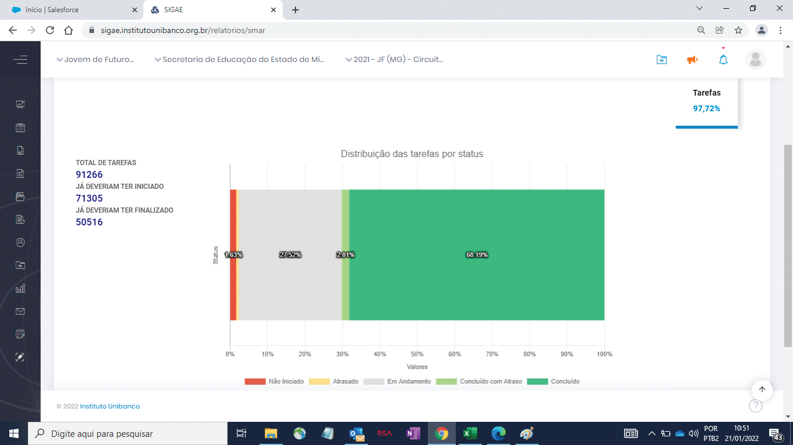
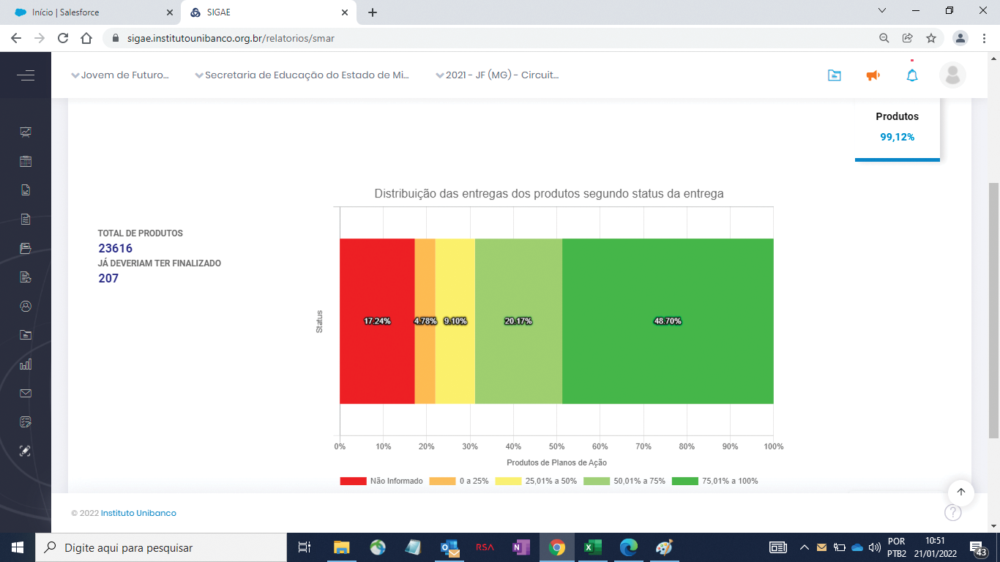
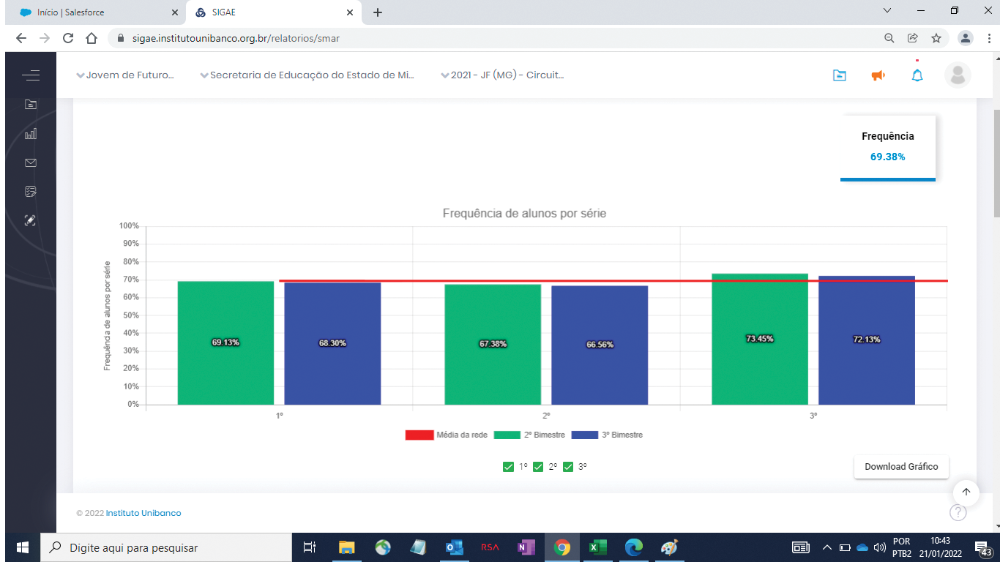
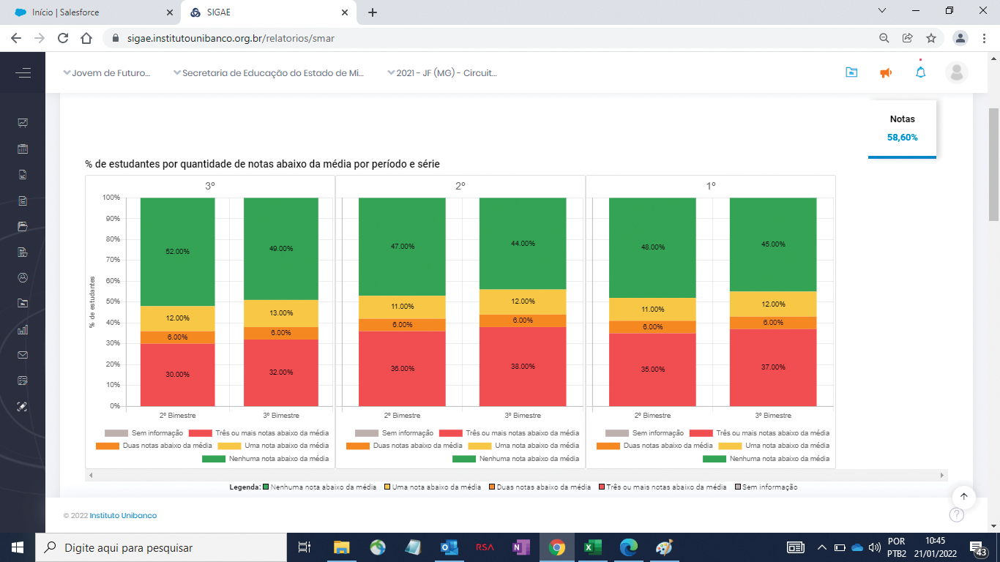
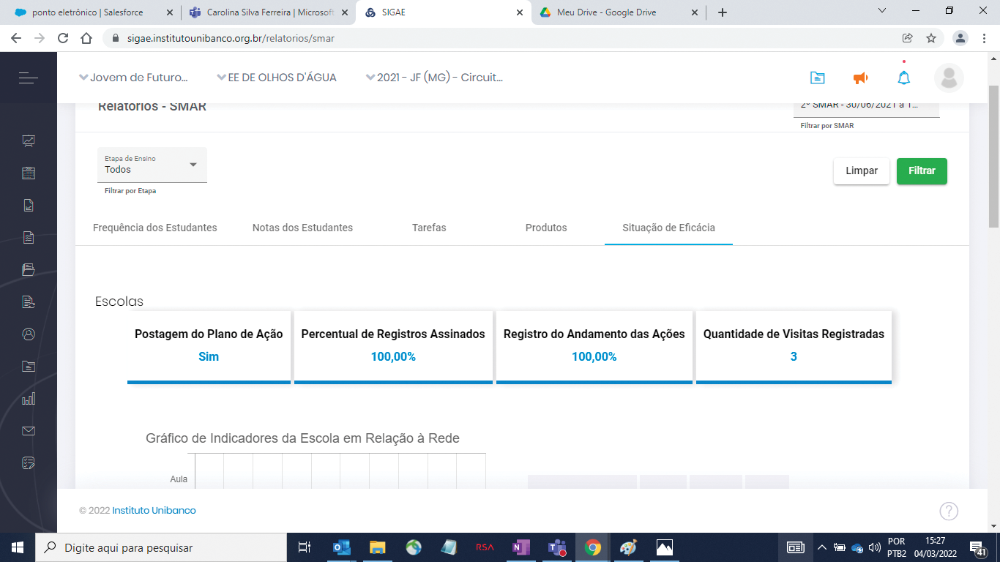

# Sistemática de Monitoramento e Avaliação de Resultados (SMAR)

## 1. A importância da SMAR

A Sistemática de Monitoramento e Avaliação dos Resultados (SMAR) verifica se as ações planejadas estão na direção correta ou se precisam de melhorias ou mudanças, que serão realizadas na próxima etapa: Correção de Rotas/Compartilhamento de Práticas. Os seis objetivos estratégicos são:

1. Tornar a escola mais atrativa e inclusiva com a comunidade escolar atuante.
2. Ter profissionais motivados e atualizados quanto às demandas educacionais.
3. Fortalecer o regime de colaboração entre estado e municípios.
4. Preparar os estudantes para o mercado de trabalho, alinhado ao seu projeto de vida
5. Implantar modelos inovadores de gestão escolar e ter lideranças motivadas e qualificadas.
6. Garantir a continuidade da aprendizagem para todos os níveis e etapas, da educação básica ao ensino superior.

É essencial refletir sobre questões raciais e de gênero, identificar grupos vulneráveis e planejar ações para corrigir desigualdades de aprendizagem. Os encontros da SMAR proporcionam reflexões individuais e coletivas, ampliando a capacidade das escolas, das SREs e da SEE de garantir o direito de aprender e se desenvolver de cada estudante mineiro.

Na SMAR, as instâncias (SEE, SREs e escolas) avaliam a execução dos Planos de Ação e os Indicadores Estruturantes com base em evidências. O objetivo é verificar se as ações planejadas estão sendo executadas corretamente e se os resultados estão alinhados com as expectativas. Caso contrário, identificam-se as causas e realizam-se ajustes. Por isso, a SMAR é fundamental para a etapa de Correção de Rotas/Compartilhamento de Práticas e para o atingimento dos objetivos estratégicos da rede de ensino.

É com base nas evidências analisadas na SMAR que se faz as correções necessárias no Plano de Ação.

## 2. Relatórios da SMAR

A SMAR gera informações e dados que podem ser analisados por meio de relatórios extraídos do Sigae. Esses relatórios focam na execução do Plano de Ação e nos resultados das escolas que implementam o programa a cada ciclo do CdG.

Relatórios gerados na escola:

-   Tarefas
-   Produtos
-   Aulas dadas
-   Frequência
-   Notas
-   Situação de Eficácia do Plano de Ação

### 2.1. Tarefas

O relatório de Tarefas no Sigae mostra um gráfico com os percentuais de distribuição das tarefas do Plano de Ação da escola por status:

-   **Vermelho:** Não iniciada
-   **Amarelo:** Atrasada
-   **Cinza:** Em andamento
-   **Verde claro:** Concluída com atraso
-   **Verde escuro:** Concluída

No canto superior direito, há o percentual de execução das tarefas concluídas, concluídas com atraso e em andamento, em relação ao total de tarefas previstas no Plano de Ação no período analisado.

### 2.2. Produtos

O relatório de Produtos no Sigae gera um gráfico com percentuais que indicam a entrega dos produtos do Plano de Ação da escola por intervalo.

**Interpretação do Gráfico**

-   **Vermelho**: Não informado
-   **Amarelo:** 0 a 25%
-   **Cinza**: 25,01 a 50%
-   **Verde claro**: 50,01 a 75%
-   **Verde escuro**: 75,01 a 100%

No canto superior direito, há o percentual de produtos 100% entregues em relação ao total previsto no período analisado.

**Atualização no Sigae**

Ao atualizar o percentual de entrega dos produtos no Sigae, também atualize o resultado conforme o status:

-   Total: 75,01% a 100%
-   Parcial: 25,01 a 75%
-   Não iniciado: 0 a 25%

### 2.3. Aulas Dadas

O relatório de Aulas Dadas no Sigae gera um gráfico mostrando os percentuais de aulas dadas pela escola durante o período analisado em cada SMAR.

**Como Interpretar o Gráfico**

-   **Barras:** representam o percentual de aulas dadas por mês, diferenciadas por cores para cada ano do Ensino Médio Parcial e do Integral (1º, 2º e 3º anos).
-   **Linha Horizontal Azul:** indica a média de aulas dadas considerando todas as escolas que implementam o programa Jovem de Futuro.
-   **Filtros Disponíveis:** permitem acessar informações específicas, como componente curricular e turma.
-   **Campo Superior Direito:** mostra o percentual total de aulas dadas pela escola em relação ao total previsto no período analisado.

**Notas Importantes**

-   A apresentação mensal do gráfico depende do formato de disponibilização dos dados pela SEE. Se os dados forem fornecidos bimestralmente, a visualização mensal não será possível.

    ### 2.4. Frequência

O relatório de Frequência dos Estudantes, disponível no Sigae, apresenta um gráfico com os percentuais de frequência dos estudantes por ano de escolaridade (1º, 2º e 3º anos) durante o período analisado em cada SMAR.

**Entendendo o Gráfico**

-   **Barras:** representam o percentual de frequência dos estudantes por ano de escolaridade e bimestre;
-   **Linha Horizontal Vermelha:** indica a média de frequência dos estudantes das escolas que implementam o programa Jovem de Futuro na rede.

**Funcionalidades**

-   **Filtros Disponíveis:** ano, componente curricular e turma**.**
-   **Campo Superior Direito:** exibe o percentual total de frequência dos estudantes da escola em relação ao total previsto para o período analisado.

### 2.5. Notas

O relatório de Notas dos Estudantes no Sigae gera um gráfico com a distribuição dos estudantes por quantidade de notas abaixo da média a cada ciclo de SMAR nas escolas.

**Como Interpretar o Gráfico**

-   **Barras:** Representam a distribuição dos estudantes de acordo com a quantidade de notas abaixo da média, por ano de escolaridade (1º, 2º, e 3º anos) e por bimestre.
    -   **Verde:** Nenhuma nota abaixo da média
    -   **Amarelo:** 1 nota abaixo da média
    -   **Laranja:** 2 notas abaixo da média
    -   **Vermelho:** 3 ou mais notas abaixo da média
    -   **Cinza:** Sem informação

-   **Filtros Disponíveis:** permitem acessar informações específicas, como componente curricular e turma.
-   **Campo Superior Direito:** mostra o percentual de estudantes com nenhuma nota abaixo da média e com 1 nota abaixo da média, em relação ao total de estudantes da escola.

### 2.6. Situação de Eficácia do Plano de Ação

O relatório de Situação de Eficácia do Plano de Ação no Sigae combina os índices de Execução e Resultado, gerando cartões e gráficos com informações detalhadas sobre a implementação do plano.

**Informações dos Cartões**

-   Postagem do Plano de Ação;
-   Percentual de Registros de Reuniões Assinados;
-   Percentual de Registros do Andamento das Ações;
-   Quantidade de Visitas e Pontos de Checagem.

**Gráficos Gerados**

1. **Indicadores da Escola em Relação ao Conjunto de Escolas:**
    - Compara a média da escola com outras que implementam o programa Jovem de Futuro.
    - Considera os índices de Resultado (aulas dadas, frequência e notas dos estudantes) e de Execução (tarefas e produtos).
    - Percentuais dos indicadores são mostrados em uma tabela ao lado do gráfico.

**2\. Gráfico de Situação de Eficácia do Plano de Ação**

O gráfico de Situação de Eficácia do Plano de Ação mostra a classificação da escola quanto à eficácia do Plano de Ação, considerando os índices de Execução e Resultado.

**Entendendo o Gráfico**

-   **Bolinha Azul:** Índices de Execução e Resultado da escola.
-   **Bolinha Verde:** Média dos índices das escolas que implementam o programa Jovem de Futuro.

Se a bolinha azul estiver abaixo da verde, a escola está com índices de Execução e Resultado abaixo da média da rede, indicando uma situação de baixa eficácia.

**Classificações de Eficácia**

1. **Alto grau de execução com resultado positivo:**
    - Índice de execução maior ou igual a média da rede
    - Índice de resultado maior ou igual a média da rede
2. **Alto grau de execução com resultado abaixo do esperado:**
    - Índice de execução maior ou igual a média da rede
    - Índice de resultado menor que a média da rede
3. **Baixo grau de execução e resultado positivo:**
    - Índice de execução menor que a média da rede
    - Índice de resultado maior ou igual a média da rede
4. **Baixo grau de execução com resultado abaixo do esperado:**
    - Índice de execução menor que a média da rede
    - Índice de resultado menor que a média da rede

## 3. Conceitos Básicos da SMAR

Na SMAR, dois índices importantes são analisados: de Execução e de Resultado.

### 3.1 Índice de Execução

A análise da execução do Plano de Ação verifica:

-   Se as instâncias estão seguindo o planejamento.
-   Se o planejamento é adequado à realidade.
-   Dificuldades na execução das ações.

O grau de execução é um resultado das tarefas e produtos do Plano de Ação. Manter o Sigae atualizado é essencial.

**Tarefas:** detalham cada ação do Plano, estipulando cronogramas. Sem a execução das tarefas, a ação não é realizada.

**Produtos:** são as entregas das ações previstas, definidas em termos mensuráveis. Mesmo que as tarefas sejam executadas, é necessário registrar se os produtos são entregues. Sem produtos, a ação não se conclui e não há resultados.

### 3.2. Índice de Resultado

Indica o avanço, manutenção ou retrocesso em direção aos objetivos estratégicos. É mensurado por evidências quantitativas e qualitativas relacionadas a:

-   Vínculo/acesso dos estudantes;
-   Aprendizagem;
-   Redução das desigualdades educacionais.

Na SMAR, os resultados são medidos considerando os Indicadores Estruturantes e as evidências qualitativas observadas na execução do Plano de Ação.

## 4. Como elaborar os Exercícios Prévios 2 e 3 e preparar a reunião de Nível 1 (N1) da SMAR

Nesta fase acontecem as etapas de análise do Plano de Ação, a partir dos indicadores de resultado e execução. Em seguida, a identificação de práticas exitosas e registro dessas práticas e, por fim, a verificação dos processos cruciais.

Antes da reunião de SMAR N1, a Dupla Gestora da escola deve reunir o Grupo Gestor para realizar um exercício analítico, conforme orientações do roteiro do Exercício Prévio, e fazer os registros necessários. Utilize os espaços do Conselho de Classe e/ou Módulo II para analisar e dialogar sobre os resultados do período.

Para facilitar o exercício, a SEE criou um Google Forms, contendo toda a estrutura do Exercício Prévio da SMAR. Após a reunião, finalize os registros e poste-os no Sigae. Sistematize as práticas exitosas para inspirar outras escolas e potencializar os aprendizados coletivos. Faça o registro desses aprendizados para compartilhamento na etapa de Correção de Rotas/Compartilhamento de Práticas.

**TABELA 6 \-** **Consolidado para SMAR e Correção de Rotas**

<table>
  <thead>
    <tr>
      <th rowspan="2">EFICÁCIA</th>
      <th colspan="3">RESULTADOS</th>
      <th>EXECUÇÃO</th>
    </tr>
    <tr>
      <th>Frequência dos estudantes</th>
      <th>Notas dos estudantes</th>
      <th>Aulas dadas</th>
      <th>Execução das tarefas e entrega dos produtos</th>
    </tr>
  </thead>
  <tbody>
    <tr>
      <td>Pontos fortes</td>
      <td></td>
      <td></td>
      <td></td>
      <td></td>
    </tr>
    <tr>
      <td>Pontos críticos</td>
      <td></td>
      <td></td>
      <td></td>
      <td></td>
    </tr>
    <tr>
      <td>
        Ideias para aumentar e/ou melhorar a execução do Plano (tarefas e
        produtos)
      </td>
      <td></td>
      <td></td>
      <td></td>
      <td></td>
    </tr>
    <tr>
      <td>Ideias para ajustes nas ações do Plano</td>
      <td></td>
      <td></td>
      <td></td>
      <td></td>
    </tr>
    <tr>
      <td>Ideias para novas ações</td>
      <td></td>
      <td></td>
      <td></td>
      <td></td>
    </tr>
    <tr>
      <td>Ações em andamento (que estão gerando resultados positivos)</td>
      <td></td>
      <td></td>
      <td></td>
      <td></td>
    </tr>
    <tr>
      <td>Demandas para a SRE</td>
      <td></td>
      <td></td>
      <td></td>
      <td></td>
    </tr>
    <tr>
      <td>Demandas para a SEE</td>
      <td></td>
      <td></td>
      <td></td>
      <td></td>
    </tr>
    <tr>
      <td>Articulações necessárias</td>
      <td></td>
      <td></td>
      <td></td>
      <td></td>
    </tr>
  </tbody>
</table>

### 4.2. Análise dos Processos Cruciais e Registro de Práticas

A análise dos processos cruciais garante que o CdG está sendo cumprido dentro de suas etapas e ciclos. Tratam-se dos processos que geram dados e evidências para a execução, o monitoramento e a avaliação de ações.

Já no registro de práticas, o gestor deve identificar as práticas exitosas que a escola vem realizando para tratar dos problemas identificados no Plano de Ação e que colaborem para o atingimento dos objetivos estratégicos. Como sugestão, você pode usar a Tabela 7 \- Registro de Práticas, apropriada para esta análise.

**TABELA 7 \- Registro de Práticas**

<table>
  <thead>
    <tr>
      <th>NOME DA PRÁTICA</th>
      <th>EXECUÇÃO</th>
    </tr>
  </thead>
  <tbody>
    <tr>
      <td><b>O IDEAL</b>  Qual fato/situação motivou a criação da prática?</td>
	  <td></td>
    </tr>
    <tr>
      <td><b>O REAL</b>  Qual era o contexto da escola?</td>
	  <td></td>
    </tr>
    <tr>
      <td>
        <b>OBJETIVO ESTRATÉGICO RELACIONADO</b>  Qual é o objetivo estratégico
        relacionado?
      </td>
	  <td></td>
    </tr>
    <tr>
      <td><b>PARA QUEM?</b>  Público beneficiado pela prática.</td>
	  <td></td>
    </tr>
    <tr>
      <td>
        <b>O CAMINHO</b>  O que foi feito? Como foi feito? Com quais recursos
        (humanos, materiais, conhecimentos, tecnologias etc.)?
      </td>
	  <td></td>
    </tr>
    <tr>
      <td><b>OS RESULTADOS/EFEITOS DA PRÁTICA</b></td>
	  <td></td>
    </tr>
    <tr>
      <td><b>PRÓXIMOS PASSOS</b>  O que ainda precisa ser feito.</td>
	  <td></td>
    </tr>
  </tbody>
</table>

<table border="1">
  <tbody>
    <tr>
      <td>
        

            Dicas para reconhecer as características de práticas exitosas:
            <ul>
                <li>
                    Práticas que colocam o estudante no centro da discussão.
                </li>
            </ul>
        

        

            Práticas explicitamente focalizadas e dirigidas ao alcance dos objetivos estratégicos da rede:
            <ul>
                <li>Tornar a escola mais atrativa e inclusiva com a comunidade escolar atuante.</li>
                <li>Ter profissionais motivados e atualizados quanto às demandas educacionais.</li>
                <li>Fortalecer o regime de colaboração entre estado e municípios.</li>
                <li>Preparar os estudantes para o mercado de trabalho, alinhado ao seu projeto de vida.</li>
                <li>Implantar modelos inovadores de gestão escolar e ter lideranças motivadas e qualificadas.</li>
                <li>Garantir a continuidade da aprendizagem para todos os níveis e etapas, da educação básica ao ensino superior.</li>
            </ul>
        

        
Práticas que implicam os professores, estudantes e outros profissionais da comunidade escolar, garantindo a participação nos processos de discussão e decisão da escola.

        
Práticas que articulam as medidas das avaliações externas com os propósitos e o projeto educativo da escola e da rede.

        
Práticas promotoras de um bom ambiente de trabalho e de um clima positivo.

        
Práticas promotoras do engajamento dos professores e estudantes.

      </td>
    </tr>
  </tbody>
</table>

A qualidade das informações é essencial para mostrar o andamento dos processos, tanto os bem-sucedidos quanto os que precisam de ajustes. Esses dados servirão como base para reflexões e para definir os próximos passos da unidade e da rede, que pode se inspirar em suas experiências.

### 4.3. Análise dos Relatórios da SMAR no Sigae

Explore os relatórios no Sigae usando os filtros de turnos, turmas e componente curricular. Avalie os Índices de Execução e de Resultado, considerando o período avaliado. No final, observe outras evidências relevantes para a avaliação na SMAR.

Você saberá mais sobre eles logo a frente, mas os relatórios da SMAR são esses:

-   Tarefas
-   Produtos
-   Aulas dadas
-   Frequência
-   Notas
-   Situação de Eficácia do Plano de Ação

### 4.4. Importância do registro sistemático

O registro sistemático, fidedigno e de qualidade dos dados e informações é essencial para a análise. Isso permite que a escola fundamente suas ações, atue adequadamente sobre os problemas, alcance os objetivos pretendidos e garanta transparência e prestação de contas à comunidade escolar e à rede como um todo.

Há, abaixo, a Tabela 8 com dimensões e tópicos a serem analisados previamente à SMAR N1.

**Tabela 8 para análise prévia à SMAR**

<table>
  <thead>
    <tr>
      <th>DIMENSÃO</th>
      <th>TÓPICOS</th>
    </tr>
  </thead>
  <tbody>
    <tr>
      <td>Registros da execução do Plano de Ação (vide Sigae)</td>
      <td>
        Cumprimento dos prazos de postagem: Há ações e tarefas atrasadas?
        Qualidade das informações registradas: Elas correspondem à realidade? O
        que explica ações ou tarefas atrasadas? A entrega dos produtos e o
        status dos resultados estão sendo registrados? Se não, por quê? Quais os
        pontos críticos com relação ao registro das ações, tarefas e produtos? E
        os positivos? Há demandas a serem feitas para a SRE e/ou SEE com relação
        ao registro no Sigae?
      </td>
    </tr>
    <tr>
      <td>
        Execução do Plano de Ação da escola (Acompanhamento do PC e da VT)
      </td>
      <td>
        O Plano de Ação está sendo executado no prazo? Se não, por quê? Com qual
        qualidade a realização das ações e tarefas está sendo feita? Caso
        existam ações ou tarefas atrasadas, o que explica esse desempenho? Os
        profissionais da escola estão engajados? Se não, por quê? A escola tem
        alcançado os resultados? Se não, quais fatores explicam esse desempenho?
        Quais os pontos críticos com relação à realização do Plano de Ação? E os
        positivos? Há demandas a serem feitas para a SRE e/ou SEE com relação à
        realização do Plano de Ação da escola?
      </td>
    </tr>
    <tr>
      <td>Registros no SIMADE/DED</td>
      <td>
        Cumprimento dos prazos de postagem: Os prazos foram cumpridos pela
        escola?
      </td>
    </tr>
    <tr>
      <td>
        Resultados das escolas  <b>Frequência dos estudantes</b> 
        (vide Sigae | Gráficos da SMAR)
      </td>
      <td>
        Há algum componente curricular com menor frequência dos estudantes?
        Qual? Por quê? Os resultados de frequência sinalizam possíveis grupos
        com propensão ao abandono? Quais são esses grupos? De modo geral, as
        ações executadas pela escola, conforme seu Plano de Ação, garantiram a
        frequência dos estudantes? Vocês identificam alguma ação que não esteja
        registrada no Plano e que influenciou positivamente a frequência dos
        estudantes? Quais os pontos críticos com relação à manutenção do vínculo
        dos estudantes com a escola? E os positivos? Há demandas a serem feitas
        à SRE e/ou SEE com relação a esse indicador?
      </td>
    </tr>
    <tr>
      <td>
        Resultados da escola  <b>Aulas dadas</b>  (vide Sigae |
        Gráficos da SMAR)
      </td>
      <td>
        Como avaliam o percentual de aulas dadas no período analisado? Que
        leituras são possíveis ao relacionar o percentual de aulas dadas com a
        frequência dos estudantes? As ações executadas contribuíram para
        melhorar as condições de oferta de ensino, pensando no trabalho dos
        gestores pedagógicos e dos professores? As ações executadas contribuíram
        para melhorar as condições de oferta de ensino para os estudantes? Quais
        os pontos críticos com relação às condições de oferta de ensino para os
        estudantes? E os positivos? Há demandas a serem feitas à SRE e/ou SEE
        com relação a esse indicador?
      </td>
    </tr>
    <tr>
      <td>
        Resultados da escola  <b>Notas dos estudantes</b>  (vide Sigae
        | Gráficos da SMAR)
      </td>
      <td>
        O percentual de estudantes da escola sem notas e/ou com notas abaixo da
        média para aprovação é alto? Por quê?
      </td>
    </tr>
    <tr>
      <td>Avaliações externas (vide SIMAVE)</td>
      <td>Como vocês avaliam os dados das avaliações externas da escola?</td>
    </tr>
    <tr>
      <td>
        Eficácia do Plano de Ação da escola 
        <b>Alto grau de execução com resultado positivo</b>
      </td>
      <td>
        Que ações do Plano podem ter impactado mais para se ter esse resultado?
        Quais práticas podem ser compartilhadas com as demais unidades escolares
        da SRE?
      </td>
    </tr>
    <tr>
      <td>
        Eficácia do Plano de Ação da escola 
        <b>Alto grau de execução com resultado abaixo do esperado</b>
      </td>
      <td>
        Que fatores contribuíram para que, apesar do alto grau de execução
        (realização das ações e entrega dos produtos), as ações não gerassem os
        resultados esperados?
      </td>
    </tr>
    <tr>
      <td>
        Eficácia do Plano de Ação da escola 
        <b>Baixo grau de execução e resultado positivo</b>
      </td>
      <td>
        Que fatores contribuíram para que o resultado da escola fosse positivo,
        apesar da execução estar abaixo do esperado?
      </td>
    </tr>
    <tr>
      <td>
        Eficácia do Plano de Ação da escola 
        <b>Baixo grau de execução com resultado abaixo do esperado</b>
      </td>
      <td>
        Por quais razões o Plano de Ação não foi executado conforme o previsto?
        Os resultados abaixo do esperado estão relacionados unicamente a não
        execução do Plano? Ou há outro fator? Há ideia para a mudança desse
        cenário? Há demandas para SEE e/ou SRE que podem auxiliar a escola no
        alcance dos objetivos?
      </td>
    </tr>
    <tr>
      <td>Redução das desigualdades</td>
      <td>
        No Plano de Ação, a escola contemplou ações para a redução das
        desigualdades (raciais, de gênero, de grupos mais vulneráveis)? Se não,
        a partir das evidências, o que se propõe?
      </td>
    </tr>
  </tbody>
</table>

## 5. Como se preparar para a SMAR N1?

Nesta fase, são analisados os Índices de Execução e Resultado, focando nas ações que contribuíram para os resultados, as quais podem ser potencializadas e compartilhadas, e nas que apresentaram desafios e obstáculos.

Participam da N1 o Grupo Gestor, o Inspetor Escolar e, se necessário, o responsável pelo EMTI na SRE. Este encontro presencial promove um diálogo sobre os avanços e o que poderia ter sido diferente, além de mapear demandas a serem encaminhadas à SRE e SEE. Durante a reunião, são identificados os pontos relevantes para a etapa seguinte \- Correção de Rotas/Compartilhamento de Práticas \- e definidos os próximos passos. Ao final, o Inspetor Escolar registra a reunião no Sigae, com a ciência do Grupo Gestor.

<table border="1">
  <tbody>
    <tr>
      <td>
        
Dicas para reconhecer práticas exitosas:

        

          As práticas exitosas focam no estudante e se alinham aos objetivos
          estratégicos da rede, como tornar a escola mais atrativa e inclusiva
          com a comunidade atuante, preparar os estudantes para o mercado de
          trabalho, alinhado ao seu projeto de vida, ter profissionais motivados
          e atualizados quanto às demandas educacionais, implantar modelos
          inovadores de gestão escolar e ter lideranças motivadas e
          qualificadas, fortalecer o regime de colaboração entre estado e
          municípios e garantir a continuidade da aprendizagem para todos os
          níveis e etapas, da educação básica ao ensino superior. Elas envolvem
          professores, estudantes e a comunidade escolar em processos de
          discussão e decisão, integram resultados de avaliações externas com os
          objetivos educacionais da escola e da rede, promovem um ambiente de
          trabalho positivo e incentivam o engajamento de professores e
          estudantes no processo de ensino e aprendizagem.
        

      </td>
    </tr>
  </tbody>
</table>

Volte na **tabela 8**, onde há um roteiro de perguntas para orientar a SMAR N1.

Use as informações coletadas na SMAR N1 como subsídio para a SMAR N2, abordando perguntas sobre desempenho, avaliação de resultados, hipóteses para diferenças, necessidades de apoio, atenção aos componentes curriculares, diferenças entre turnos e demandas para a SRE e SEE.

<table border="1">
  <tbody>
    <tr>
      <td>
        
<b>Atenção</b>

        

          Consolide as produções da SMAR N1 e disponibilize-as para a SRE na
          SMAR N2, influenciando o compartilhamento de práticas e a revisão do
          Plano de Ação da SRE.
        

        

          A SMAR N2 é o segundo evento da SMAR e acontece nas SREs, sendo
          realizado nos ciclos 1 e 2, pelo Grupo Gestor da SRE, Inspetores
          Escolares e o servidor da SRE responsável pelo EMTI.
        

      </td>
    </tr>
  </tbody>
</table>

## 6. Perguntas frequentes sobre a SMAR

**1. Como acessar os relatórios da SMAR?**

A SMAR gera informações e dados que podem ser analisados por meio de relatórios extraídos do Sigae, como foco na execução do Plano de Ação e nos resultados do conjunto das escolas que implementam o Jovem de Futuro na rede, a cada ciclo do Circuito de Gestão (CdG). Para acessar o sistema do Sigae, é necessário ir para a página: [HTTPS://SIGAE.INSTITUTOUNIBANCO.ORG.BR/PORTAL/LOGIN](HTTPS://SIGAE.INSTITUTOUNIBANCO.ORG.BR/PORTAL/LOGIN)

**2. Como analisar os relatórios da SMAR?**

Você pode acessar os relatórios da SMAR pelo Sigae, que tem filtros que ajudam na análise, como turno, turmas e componente curricular. É importante analisar os relatórios levando em conta o período da SMAR e todas as evidências relevantes do contexto escolar.

**3. Qual o objetivo da Reunião SMAR N1? Quem participa?**

A SMAR N1 é um encontro entre o Inspetor Escolar, o Grupo Gestor da escola e o servidor da regional responsável pelo Ensino Médio em Tempo Integral (se a escola for EMTI).
Para a SMAR N1, o Inspetor Escolar precisa analisar os relatórios da escola no Sigae. O Grupo Gestor da escola também deve se preparar para a reunião, realizando o Exercício Prévio à SMAR N1. Assim, durante o encontro, todos vão conseguir conversar melhor sobre os resultados do período, a eficácia das ações do Plano, e as demandas e necessidades de apoio das Regionais e da Secretaria. Também é crucial identificar desafios, celebrar os resultados e avançar com base nos aprendizados e nas oportunidades que surgirem.

Nesse encontro, todos conversam sobre os resultados do período, focando nos Índices de Execução e de Resultado. Essa discussão ajuda a identificar melhorias para a próxima etapa do Circuito de Gestão (CdG), que é a Correção de Rotas/Compartilhamento de Práticas.

Participam da N1:

-   Grupo Gestor da escola
-   Inspetor Escolar
-   Servidor da SRE responsável pelo EMTI (se for o caso)
