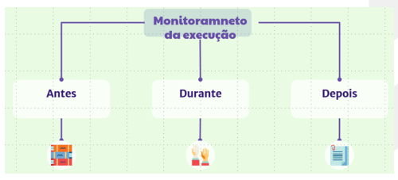
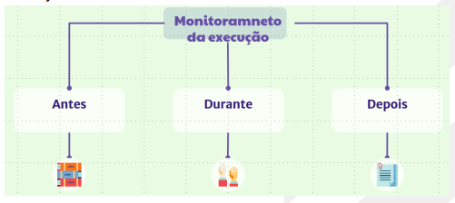

# Execução

## 1\. A importância da Execução

Essa etapa consiste na **orientação e acompanhamento sistemático da execução do Plano de Ação**, envolvendo as três instâncias – Secretaria de Educação (SEDU), Gerências Regionais de Educação (GREs) e Escolas. O foco está na realização das ações e tarefas previstas, bem como na análise contínua de dados, com o objetivo de assegurar a melhoria dos processos de ensino e aprendizagem dos estudantes.

Com o Plano de Ação devidamente registrado na **Plataforma SIGAE**, inicia-se a etapa de monitoramento da **Execução**, essencial para a efetiva implementação do **Programa Gestão da Aprendizagem na Rede**. A execução consistente das ações planejadas é condição fundamental para promover avanços reais na aprendizagem dos estudantes.

O monitoramento ocorre de forma contínua, por meio da **verificação semanal das ações e tarefas**, dos **indicadores estruturantes**, como frequência e desempenho dos estudantes, e do registro de aulas ministradas.

As informações coletadas e sistematizadas durante essa etapa alimentam as **análises trimestrais** e oferecem subsídios importantes para as decisões pedagógicas, especialmente nos momentos de **Correção de Rotas**.

Para facilitar a rotina de acompanhamento, é importante que as equipes escolares respondam, de forma objetiva e reflexiva, às seguintes perguntas:

-   As ações previstas estão sendo executadas conforme o planejado?
-   As tarefas estão sendo realizadas nos prazos estipulados?
-   Como apoiar os responsáveis para garantir a continuidade da execução?
-   O que os indicadores (frequência dos estudantes, notas e aulas dadas) estão revelando?

O monitoramento deve ser baseado em **evidências concretas da execução das ações e tarefas**, sustentado por dados e informações coletadas durante o processo. Além disso, **diálogos sistemáticos com os responsáveis pelas ações e com o público-alvo** são fundamentais para validar as informações e identificar possíveis ajustes ao longo da trajetória.

Tabela 5 \- Rotina Estruturada da Etapa de Monitoramento da Execução

<table>
  <thead>
    <tr>
      <th>Rotina Estruturada</th>
      <th>O que é?</th>
    </tr>
  </thead>
  <tbody>
    <tr>
      <td>1º Encontro de Monitoramento de Execução / Sede <strong>1º EM/ES</strong></td>
      <td>Reunião de trabalho com a Equipe SEDUC/SEDE para orientação, acompanhamento e monitoramento de execução das ações e tarefas do plano de Gestão da Aprendizagem, análise dos indicadores estruturantes e dos relatórios das GREs, dos processos do Circuito de Gestão da Aprendizagem.</td>
    </tr>
    <tr>
      <td>1º Encontro de Monitoramento de Execução / Regionais <strong>1º EM/ER</strong></td>
      <td>Reunião de trabalho para orientação, acompanhamento e monitoramento por regiões dos Encontros e Visitas de Assessoramento Pedagógico, da execução do Plano de Gestão da Aprendizagem, das GRE e do cumprimento de tarefas e ações das escolas pactuadas nas ações prioritárias do plano, assim como da execução das atividades relacionadas à recomposição das aprendizagens. Encontro destinado também à organização dos processos referentes à avaliação em entrada, simulados, ministérios e retificação do Censo Escolar.</td>
    </tr>
    <tr>
      <td>1ª Visita de Assessoramento Pedagógico de Monitoramento de Execução - Escolas <strong>VAP 1</strong></td>
      <td>Encontro para análise dos dados de execução das ações e tarefas do Plano de Gestão da Aprendizagem por áreas e séries pactuadas no Plano de Gestão da Aprendizagem, tendo como base as atividades prioritárias do plano, indicadores estruturantes e dados da recomposição das aprendizagens, além do acompanhamento dos processos referentes à rede: avaliação de entrada, simulados, ministérios e retificação do Censo Escolar.</td>
    </tr>
    <tr>
      <td>2º Encontro de Monitoramento de Execução / Sede <strong>2º EM/ES</strong></td>
      <td>Encontro para análise dos dados de execução das ações e tarefas do Plano de Gestão da Aprendizagem e dos processos do Circuito de Gestão da Aprendizagem, a partir das informações sistematizadas pelas Equipes Técnicas Regionais. Encontro também destinado à definição de ações preparatórias para tomadas de decisão e desenho de ações propositivas para a rede.</td>
    </tr>
    <tr>
      <td>2º Encontro de Monitoramento de Execução / Regionais <strong>2º EM/ER</strong></td>
      <td>Encontro para análise dos dados de execução das ações e tarefas do Plano de Gestão da Aprendizagem e dos processos do Circuito de Gestão da Aprendizagem nas escolas sob sua jurisdição. Encontro também destinado à preparação das Visitas de Assessoramento Pedagógico e definição de ações propositivas para a rede com foco em ações prioritárias, recomposição das aprendizagens e estratégias para a Recuperação e Suporte à Aprendizagem.</td>
    </tr>
    <tr>
      <td>2ª Visita de Assessoramento Pedagógico de Monitoramento de Execução - Escolas <strong>VAP 2</strong></td>
      <td>Diálogo com a dupla gestora da escola, com base em evidências da execução de ações pactuadas junto à equipe GRE no momento do diagnóstico inicial, a partir das etapas do plano de ação da escola, indicadores estruturantes e dados da recomposição das aprendizagens. Reunião também destinada à definição de estratégias para avaliação diagnóstica da escola, formação de professores regentes e Recomposição de Aprendizagem.</td>
    </tr>
  </tbody>
</table>

A Etapa de Monitoramento de Execução é composta por três Encontros de Monitoramento de Execução (EME) e três Visitas de Assessoramento Pedagógico (VAPs).

## 2\. 1º Encontro da Etapa de Execução

### 2.1. Antes do 1º Encontro

Antes da realização do primeiro encontro, os gestores regionais devem se reunir para construir, de forma colaborativa, a pauta e os materiais que serão apresentados à equipe. Esse momento deve contemplar o compartilhamento de experiências e os principais resultados observados durante a Visita de Assessoramento Pedagógico (VAP) de Planejamento nas escolas.

É necessário, ainda, revisar e ajustar as tarefas do Plano de Ação diretamente na Plataforma SIGAE, considerando a realidade da regional.

A pauta deve destacar os seguintes pontos:

-   Panorama da finalização da etapa de Planejamento.
-   Quantitativo de escolas e turmas da regional que ofertam a 3ª série do Ensino Médio.
-   Escolas com maior número de matrículas na 3ª série.
-   Desempenho da 3ª série do Ensino Médio nas avaliações aplicadas: Avaliação Diagnóstica, Simulados, Minitestes e Quiz.
-   Participação dos professores regentes de Língua Portuguesa e Matemática nas formações semanais das Trilhas do Gestão da Aprendizagem, com orientações sobre a aplicação do material didático-pedagógico.
-   Acompanhamento contínuo da presença dos professores regentes nas formações das trilhas SAEB e Aprendizagem.
-   Atualização dos dados no iSEDUC, mantendo as informações sempre atualizadas.
-   Análise contínua dos resultados das avaliações e devolutiva às equipes escolares.

### 2.2. Durante o 1º Encontro

A reunião deve começar com a discussão sobre os Planos da Sede e da regional, com atenção às implicações para a execução dos Planos nas escolas. Em seguida, os gestores regionais devem orientar a equipe técnica para que se aproprie efetivamente dos Planos das escolas sob sua responsabilidade.

Esse domínio é essencial para que as Visitas de Assessoramento Pedagógico sejam realizadas com pautas bem estruturadas e devolutivas consistentes, orientadas pelos dados da própria escola.

Na sequência, os gestores regionais devem alinhar com a equipe técnica as ações estratégicas para alcançar a meta pactuada para 2025\. O encontro também deve ser um espaço de reflexão coletiva sobre o engajamento da equipe e sua responsabilidade no sucesso do Plano.

Sugerimos, para esse momento, as seguintes questões norteadoras:

-   A equipe GRE conhece bem o Plano, suas ações e tarefas?
-   Os integrantes da GRE estão engajados na execução das ações sob sua responsabilidade?
-   Todos têm clareza sobre o que precisa ser feito para alcançar os objetivos do Plano e a meta de 2025?
-   É necessário remanejar responsáveis por alguma ação ou tarefa?
-   Como a equipe pode colaborar entre si para garantir a execução do Plano?
-   Todos estão apropriados dos dados das escolas e da regional nos eixos do Gestão da Aprendizagem?

### 2.3. Depois do 1º Encontro

Organize uma comunicação prévia às escolas sobre a importância das Visitas de Assessoramento Pedagógico.

## 3\. 2º Encontro da Etapa de Execução

Imagem 1 \- Monitoramento de Execução

### 3.1. Antes do 2º Encontro

Os gestores regionais devem, em conjunto:

-   **Elaborar a pauta** do 2º encontro, definindo os conteúdos prioritários com base na etapa de Monitoramento de Execução.
-   **Preparar o material de apresentação** com dados e informações relevantes.
-   **Mobilizar a equipe**, compartilhando antecipadamente a pauta e orientando os técnicos a apresentarem uma **síntese dos insumos e evidências** levantados durante a 1ª Visita de Assessoramento Pedagógico (VAP) nas escolas.

Para a realização efetiva desse encontro, é essencial que os gestores regionais se apropriem dos seguintes aspectos:

-   **Execução das ações e tarefas** do Plano de Ação da regional e das escolas: identificar quais tarefas estão em andamento, quais estão atrasadas e quais ajustes são necessários para garantir a continuidade da execução.
-   **Dados da 3ª série do Ensino Médio**: analisar a participação e o desempenho dos estudantes nas avaliações aplicadas (Diagnóstica, Simulados, Minitestes e Quiz), com foco na aprendizagem e nos resultados.
-   **Diretrizes da Secretaria**:
    -   Impressão e uso dos materiais didáticos das Trilhas de Aprendizagem e SAEB;
    -   Acompanhamento da participação dos professores nas formações das trilhas;
    -   Inserção e atualização constante dos dados no iSEDUC.

Essa preparação prévia é indispensável para garantir um encontro mais produtivo, alinhado às metas da rede e orientado para a tomada de decisões que fortalecem o Plano de Ação e o acompanhamento pedagógico das escolas.

### 3.2. Durante o 2º Encontro

O encontro começa com os gestores regionais apresentando o consolidado dos dados da 1ª Visita de Assessoramento Pedagógico (VAP) da etapa de Monitoramento de Execução. Essa apresentação deve oferecer uma visão geral da execução do Plano de Ação nas escolas, promovendo um diálogo qualificado com os técnicos de ensino.

Na sequência, os técnicos apresentam suas **sínteses da VAP1**, evidenciando como cada escola tem executado suas ações e tarefas.

A regional também deve expor o **status geral da execução do seu próprio Plano**, destacando:

-   Total de ações e tarefas iniciadas;
-   Total de ações e tarefas em atraso;
-   Envolvimento da equipe regional e o impacto desse engajamento na implementação do Plano.

**Reflexão coletiva**

Para orientar esse momento de análise e diálogo, sugerem-se as seguintes perguntas:

-   Como a equipe regional avalia o andamento da execução do Plano? As tarefas estão sendo cumpridas conforme o previsto?
-   Há mobilização e engajamento suficientes para garantir a execução das ações e tarefas? Se não, quais orientações precisam ser reforçadas?
-   Existe colaboração entre os integrantes da equipe regional para garantir a efetiva implementação do Gestão da Aprendizagem?

**Planejamento com base nos dados**

Após esse momento de análise, os gestores regionais devem sistematizar as contribuições da equipe e preparar uma devolutiva para o próximo encontro.

Além da apropriação do andamento do Plano, a equipe deve analisar os **dados das avaliações de rede já disponíveis**, com foco em ações propositivas para as escolas da regional.

Sugestões para essa análise:

-   Avaliar a participação e o desempenho dos estudantes nas avaliações (Diagnóstica, Minitestes, Simulados SAEB), comparando os dados entre escolas para identificar aquelas com maiores desafios e melhores resultados.
-   Planejar a devolutiva dos resultados para os gestores escolares e professores durante as VAPs.
-   Propor estratégias de acompanhamento dos indicadores estruturantes: frequência, aulas dadas e notas.
-   Orientar o monitoramento da formação continuada, considerando tanto a frequência dos professores quanto o uso dos materiais estruturados em sala de aula.

É importante enfatizar que o diálogo nas Visitas de Assessoramento Pedagógico deverá ter como ponto de partida evidências percebidas tanto nos resultados das escolas quanto durante as visitas. Para tanto, há um diálogo dirigido com foco nos questionamentos a seguir:

Tabela 6 \- Conhecimento da Equipe GRE

<table>
  <thead>
    <tr>
      <th>Qual o conhecimento da equipe GRE em relação aos requisitos abaixo:</th>
    </tr>
  </thead>
  <tbody>
    <tr>
      <td>Os estudantes com dificuldades de aprendizagem recebem auxílio, estímulo e apoio para atingir o nível de aprendizagem esperado.</td>
    </tr>
    <tr>
      <td>Os componentes curriculares críticos recebem maior atenção e direcionamento por parte dos gestores escolares e os professores fazem uso de metodologia diferenciada.</td>
    </tr>
    <tr>
      <td>Os professores utilizam os materiais disponibilizados da rede, ressignificando-os de acordo com a necessidade de sua turma.</td>
    </tr>
    <tr>
      <td>O diretor promove reuniões frequentes para análise dos dados com o corpo docente e faz a devolutiva a comunidade escolar.</td>
    </tr>
  </tbody>
</table>

### 3.3. Depois do 2º Encontro

Finalizado o encontro, reserve um tempo para organizar os registros feitos durante as discussões. Não deixe de anotar as contribuições dos técnicos de ensino. A sistematização desses registros deve facilitar o retorno às escolas sobre os pontos levantados no encontro. Avalie também a melhor forma de repassar essas respostas, considerando o papel do acompanhamento pedagógico da equipe da GRE e o compromisso coletivo com os resultados.

## 4\. 3ª Encontro da Etapa de Execução

Imagem 2 \- Monitoramento de Execução

### 4.1. Antes do 3º Encontro

Os Gestores Regionais elaboram coletivamente a pauta e o material do 3º encontro, mobilizam sua equipe para participar e compartilham previamente os temas que serão abordados. Também orientam os Técnicos de Ensino a apresentarem, durante o encontro, a síntese dos insumos e evidências da 2ª e da 3ª Visita de Assessoramento Pedagógico (se já realizadas) da etapa de Monitoramento de Execução.

Para a efetivação do encontro, é necessário que os Gestores Regionais se aprofundem em:

a) Encaminhamentos pactuados nos 1º e 2º encontros, garantindo coerência na conclusão da etapa de Monitoramento de Execução;

b) Execução efetiva das ações e tarefas do Plano da GRE e das escolas jurisdicionadas, com foco nas tarefas ainda em atraso — especialmente as já sinalizadas no 2º encontro — e com propostas para priorização e execução;

c) Forma como foi realizada a devolutiva das avaliações e como diretores e coordenadores pedagógicos das escolas receberam essas devolutivas;

d) Diretrizes da rede sobre impressão e uso dos materiais didáticos de Recomposição da Aprendizagem nas turmas de 3ª série do EM, com foco nos Professores Regentes de Língua Portuguesa e Matemática;

e) Diretrizes para acompanhamento da formação continuada de Professores Regentes da Formação Geral Básica e Recomposição da Aprendizagem, bem como das inscrições e da participação efetiva desses profissionais;

f) Diretrizes sobre a conclusão do 1º trimestre, especialmente em relação à atualização dos dados de aulas dadas, frequência e notas no iSeduc, além do planejamento das ações para o 2º trimestre;

g) Diretrizes para a realização da recuperação paralela, assegurando que todos os técnicos se apropriem dessas orientações e consigam repassá-las às escolas.

### 4.2. Durante o 3º Encontro

Para iniciar o encontro, os Gestores Regionais retomam os encaminhamentos pactuados nos 1º e 2º encontros, apresentam o consolidado dos dados da VAP1 e VAP2 e os insumos preliminares da VAP3 de Monitoramento da Execução de suas escolas.

O objetivo é oferecer uma visão geral do andamento da etapa de Monitoramento da Execução: o que já foi encaminhado, o que ainda está pendente e precisa ser priorizado pela Regional. Esse mesmo olhar deve se estender às escolas, observando quais ações e tarefas previstas foram executadas e quais ainda seguem em atraso.

Em seguida, os Técnicos de Ensino apresentam as sínteses produzidas na VAP1, na VAP2 e os insumos preliminares da VAP3.

A execução do Plano da regional deve ser retomada com foco em evidenciar o status geral:

-   Total de ações e tarefas iniciadas;
-   Total de ações e tarefas em atraso.

Na sequência, reflitam sobre os **avanços e desafios** ainda presentes na execução do Plano e no desenvolvimento da etapa de Monitoramento. Para isso, sugerimos as seguintes questões:

**Análise da execução e engajamento da equipe:**

a) Quais os avanços desde as observações registradas no 2º Encontro?

b) As tarefas em atraso foram realizadas ou replanejadas?

c) Quais tarefas seguem sendo um desafio e precisam ser priorizadas ou replanejadas?

d) Como foi o desenvolvimento da etapa de Monitoramento pela Regional?

e) Quais boas práticas devem ser fortalecidas e quais precisam ser repensadas?

f) As orientações do 2º Encontro contribuíram para o engajamento da equipe?

g) A equipe está mais mobilizada para executar o Plano?

h) A comunicação interna está mais efetiva e a equipe mais integrada?

i) O que ainda representa um desafio e quais os possíveis caminhos para superá-lo?

**Foco na conclusão do 1º Trimestre:**

a) Como foi feita a devolutiva das avaliações aos gestores e coordenadores pedagógicos?

b) Eles compreenderam os dados e se engajaram no uso pedagógico dos resultados?

c) Conseguiram repassar essa devolutiva aos professores de forma produtiva?

d) Quais estratégias foram pensadas para alcançar a meta de 90% de participação dos estudantes nas próximas avaliações?

e) Como está o planejamento da conclusão do 1º Trimestre? Todas as escolas estão com os dados de aulas dadas, frequência e notas atualizados no iSeduc?

f) Como estão os indicadores estruturantes? A equipe regional e os gestores escolares estão apropriados das orientações sobre a recuperação paralela do 1º Trimestre?

g) A GRE conseguiu identificar e inscrever os professores ainda não registrados nas formações? Como está a frequência e o engajamento dos professores já inscritos nas Trilhas?

h) Os materiais didáticos foram impressos e estão sendo utilizados conforme o cronograma?

É importante enfatizar que o diálogo nas Visitas de Assessoramento Pedagógico deve partir das diretrizes presentes no roteiro das VAPs, das reflexões propostas e das evidências observadas durante as visitas.

### 4.3. Depois do 3º Encontro

Reserve um tempo para organizar os registros feitos durante o encontro, incluindo as contribuições dos técnicos de ensino. Com base nessa sistematização, avalie como será feita a devolutiva às escolas sobre os pontos discutidos, reforçando o compromisso compartilhado.

**Lembramos que o registro na plataforma SIGAE é essencial para análise dos dados e para as devolutivas às GREs. Além disso, é fundamental comunicar previamente as escolas sobre as próximas Visitas de Assessoramento Pedagógico.**
