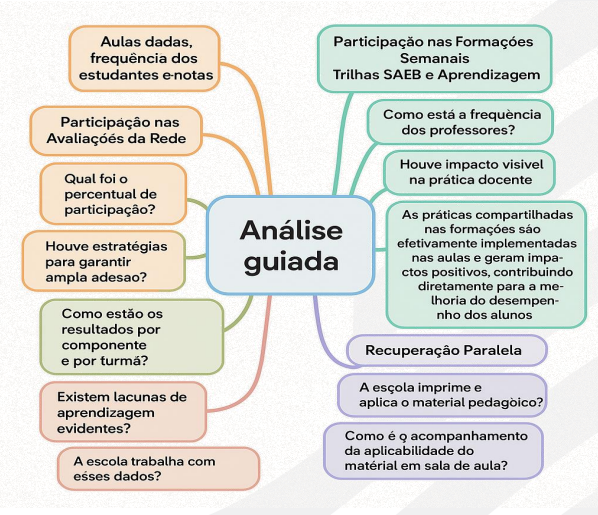

# Redirecionamento

## 1\. A importância da Etapa de Redirecionamento

A etapa de **Redirecionamento** encerra um ciclo do **Circuito do Programa Gestão da Aprendizagem (GdA)** e marca o início de uma nova rodada. Seu objetivo central é **ajustar as ações pedagógicas com base na análise crítica dos resultados da VAP de Avaliação**.

O foco principal é apoiar a **Dupla Gestora** das escolas na **revisão e aprimoramento das tarefas planejadas** nos seguintes eixos do programa:

-   Indicadores Estruturantes
-   Avaliação
-   Material Didático
-   Formação
-   Acompanhamento Pedagógico

Assim como nas demais etapas do Circuito GdA, o Redirecionamento fortalece a **articulação e a corresponsabilização entre SEDUC, GRE e ESCOLA**, promovendo um alinhamento efetivo entre as instâncias.

Reconhecendo a importância dessa etapa, será incorporada a **escuta ativa de professores de Língua Portuguesa e Matemática**, bem como dos **estudantes da 3ª série do Ensino Médio**. O objetivo é **coletar evidências significativas sobre o processo de ensino e aprendizagem**, valorizando as percepções e experiências dos diferentes atores envolvidos na jornada escolar.

## 2\. Roteiro da Etapa de Redirecionamento

### 2.1. Antes do Encontro

**1\. Estude o roteiro de Redirecionamento**  
Leia com atenção cada etapa da visita e identifique os momentos que exigem maior aprofundamento analítico. Antecipe os pontos que precisarão de mediação mais ativa.

**2\. Revise os registros da VAP de Avaliação**  
Junto ao coordenador de ensino, retome os registros das visitas anteriores às escolas sob sua responsabilidade. Verifique:

-   O ponto de partida de cada escola no início do trimestre
-   O estágio atual de cada uma no fechamento deste ciclo
-   Quais pontos de atenção foram mapeados na última etapa
-   Desafios ainda não superados
-   Tarefas que exigiram muito esforço e não trouxeram os resultados esperados
-   Tarefas que não foram realizadas dentro do cronograma

Essas informações serão fundamentais para identificar quais ações devem ser redirecionadas pela equipe escolar.

**3\. Planeje a Análise Guiada**  
Organize com antecedência os dados e gráficos que serão utilizados na visita. Prepare-se para orientar a equipe no uso do instrumento de Análise Guiada, conforme detalhado no item correspondente à visita no roteiro.

**4\. Agende e confirme a visita no SIGAE**  
A visita de Redirecionamento é um momento de diálogo, escuta e planejamento. É essencial que haja tempo disponível para construir novas tarefas com a equipe gestora.

-   Agende uma data e horário que favoreçam esse momento de escuta ativa.
-   Confirme o agendamento pelo menos um dia antes, para que o(a) diretor(a) e o(a) coordenador(a) pedagógico possam se organizar e garantir um tempo de qualidade para a reunião.

### 2.2. Durante o Encontro

**1\. Abertura e apresentação da pauta**  
Inicie a reunião esclarecendo os objetivos da visita. Alinhe com a equipe gestora a pauta prevista e abra espaço para inclusão de tópicos adicionais que considerem relevantes.

**2\. Retomada dos encaminhamentos anteriores**  
Recupere com a equipe os principais pontos da visita anterior:

-   Desafios identificados
-   Potencialidades observadas
-   Pontos de atenção ainda em aberto

Esse resgate ajuda a contextualizar a discussão e a manter o foco na continuidade do trabalho.

**3\. Análise Guiada dos Indicadores**  
Apresente à equipe o percurso da análise, utilizando o instrumento de **Análise Guiada** para revisar a execução dos eixos do GdA e o plano de ação da escola. Reforce que esse instrumento tem caráter **norteador**, ajudando a identificar **evidências concretas** sobre o impacto de cada ação nos resultados de aprendizagem.

**Importante:** Retome as discussões feitas na visita da Etapa de Avaliação e destaque os **indicadores críticos**, ou seja, aqueles que seguem abaixo do esperado.

##### 2.2.1. Análise de Dados

Revise, junto com a equipe, os dados disponíveis, incluindo:

-   Análises feitas na etapa de Avaliação de Resultados
-   Gráficos consolidados dos indicadores de execução (tarefas do plano) e indicadores estruturantes (aulas dadas, frequência e notas – extraídos do SIGAE e iSEDUC)
-   Participação e proficiência nos Minitestes e Simulados de Língua Portuguesa e Matemática (mobieduca.me)
-   Participação dos professores nas trilhas SAEB e Aprendizagem
-   Desempenho dos estudantes após a recuperação paralela

##### 2.2.2. Análise do Plano de Ação

Verifique o status de execução das tarefas:

-   Quais tarefas foram ou não executadas dentro do cronograma?
-   Quais ações não trouxeram impacto perceptível ou não foram realizadas?

A análise deve permitir uma leitura crítica sobre o que funcionou e o que precisa ser revisto.

##### 2.2.3. Redefinição das Tarefas

Com base nas evidências, proponha ajustes e novas ações nos eixos do Programa, alinhando as estratégias à realidade atual da escola e às metas pactuadas.

**Refinando a Análise com a Equipe**

Durante a leitura dos dados e gráficos, estimule a reflexão conjunta:

-   Os dados mostram avanço, estagnação ou retrocesso?
-   Estamos nos aproximando das metas ou ainda longe dos resultados esperados?
-   As tarefas implementadas têm, de fato, contribuído para a aprendizagem?

Essa análise intencional é essencial para embasar decisões, corrigir rotas e reforçar práticas bem-sucedidas.

Imagem 3 \- Análise guiada

Durante a visita de Redirecionamento, inicie apresentando uma **síntese do contexto atual da escola**, considerando os principais dados, desafios enfrentados, avanços observados e características específicas que impactam a execução do Plano de Ação.

Em seguida, conduza a **Análise Guiada com o núcleo gestor**, utilizando os indicadores previstos pelo Programa Gestão da Aprendizagem (GdA). Este momento deve ser intencional, colaborativo e focado em resultados.

Durante a análise:

-   **Registre anotações** sobre as tarefas que deverão ser **ajustadas, substituídas ou inseridas**, conforme os pontos discutidos com a equipe.
-   Com base nesse primeiro olhar geral, **aprofunde a leitura do Plano de Ação** com foco nos eixos do GdA:
    -   **Indicadores Estruturantes** (aulas dadas, frequência e notas)
    -   **Avaliação**, com ênfase no uso pedagógico dos resultados
    -   **Materiais Didáticos** (uso, distribuição, aderência ao currículo)
    -   **Formação** (participação, alinhamento com as necessidades pedagógicas)
    -   **Acompanhamento Pedagógico** (frequência, foco e efetividade das ações)

Analise, junto à equipe, **em que medida cada tarefa contribuiu para o avanço dos eixos** e, quando necessário, refaça o planejamento de forma realista e eficaz.

Esse processo é fundamental para garantir que o novo ciclo de ações esteja ancorado em dados, reflexões coletivas e estratégias direcionadas à melhoria da aprendizagem.

<table>
  <tbody>
    <tr>
      <td>
        Análise Guiada do Plano de Ação Para conduzir esta etapa, é essencial que a escola tenha o plano de ação em mãos, seja acessado pelo SIGAE ou em versão impressa. O foco da análise é verificar em que medida as tarefas previstas estão contribuindo para o alcance das metas de aprendizagem, com base nos eixos do Programa Gestão da Aprendizagem (GdA): Formação dos profissionais Materiais Didáticos utilizados Avaliações e o uso pedagógico dos resultados Frequência dos estudantes Acompanhamento Pedagógico realizado Perguntas orientadoras para a discussão com o núcleo gestor: Quais tarefas
        estão, de fato, promovendo avanços nas metas de aprendizagem? Quais ações não estão gerando impacto significativo ou não vêm sendo executadas conforme o previsto? Atenção: É fundamental reconhecer, com clareza, as iniciativas que não estão funcionando, seja por baixa efetividade, execução parcial ou falta de alinhamento com as necessidades da escola. Essa análise crítica é o que permite ajustar estratégias e redirecionar esforços, tornando o plano mais realista, efetivo e alinhado aos objetivos do programa.
      </td>
    </tr>
  </tbody>
</table>

### 3\. Ajustes no Plano de Ação

Concluída a análise das tarefas em cada eixo do **Programa Gestão da Aprendizagem (GdA)**, é hora de realizar os **ajustes necessários** no plano de ação. Esses ajustes podem envolver:

-   **Adequações em tarefas já existentes**
-   **Inclusão de novas ações**, conforme as evidências levantadas

As decisões devem considerar os **avanços observados até o momento**, com foco no **desempenho dos estudantes**. Tarefas que se mostraram eficazes devem ser **mantidas, fortalecidas e replicadas**, a fim de potencializar seus efeitos positivos na aprendizagem.

#### 3.1. Análise Guiada do Contexto – Escuta dos Professores

**Diálogo com Professores da 3ª Série do Ensino Médio**

**Possibilidade 1 – Estratégia de Escuta Qualificada**

Durante momentos oportunos, o técnico pode realizar uma **caminhada pela escola**, utilizando esse tempo para **conversar informalmente com professores e estudantes**, especialmente os envolvidos com a 3ª série do Ensino Médio.

Esse diálogo deve ser:

-   **Espontâneo e acolhedor**, sem caráter de entrevista formal
-   Marcado pela **escuta ativa**, com empatia e abertura
-   Focado em **aspectos concretos da prática pedagógica**, estimulando reflexões sobre o que tem funcionado, os desafios enfrentados e as percepções sobre o processo de ensino e aprendizagem

O objetivo é **criar vínculos de confiança** e **coletar impressões relevantes** para subsidiar o redirecionamento de ações, com base na vivência real dos professores.

Sugere-se abordar temas por meio de perguntas naturais e informais, como por exemplo:

Tabela 7 \- Análise guiada do professor

<table>
  <thead>
    <tr>
      <th>Análise guiada do professor</th>
    </tr>
  </thead>
  <tbody>
    <tr>
      <td>Como você tem vivenciado as formações da trilha SAEB?</td>
    </tr>
    <tr>
      <td>As formações têm contribuído com a sua prática em sala de aula?</td>
    </tr>
    <tr>
      <td>Você sente apoio da equipe gestora para participar dessas formações?</td>
    </tr>
    <tr>
      <td>Os materiais didáticos estão acessíveis e de fácil uso?</td>
    </tr>
    <tr>
      <td>A escola costuma imprimir os materiais com a devida antecedência?</td>
    </tr>
    <tr>
      <td>Você utiliza o material proposto na íntegra ou costuma fazer adaptações?</td>
    </tr>
  </tbody>
</table>

**Possibilidade 2 – Estratégia: Roda de Conversa com Professores**

-   Promova uma **roda de conversa breve, acolhedora e objetiva** com os professores da 3ª série, junto ao coordenador pedagógico da escola.
-   Apresente **evidências concretas** dos resultados das turmas (como gráficos, comparativos ou destaques de desempenho).
-   Estimule os docentes a refletirem sobre o que **está funcionando**, o que **precisa ser ajustado** e quais **apoios são necessários** neste momento.

**Sugestões de perguntas para guiar a conversa:**

-   _Quais estratégias você tem usado para trabalhar os descritores mais críticos?_
-   _Como tem sido a aplicação e o uso dos materiais didáticos em sala?_
-   _Os estudantes estão se engajando com as atividades propostas?_
-   _Você tem sugestões para melhorar o envolvimento da turma da 3ª série?_

**Importante:** Registre os principais pontos discutidos no **formulário de acompanhamento pedagógico**, pois esses dados são fundamentais para o redirecionamento das ações no plano de ação.

#### 3.2. Análise Guiada do Contexto – Escuta dos Estudantes

Durante a visita, aproveite momentos informais para conversar com os estudantes da 3ª série. O objetivo é criar um espaço de **escuta acolhedora e espontânea**, que valorize a percepção dos alunos sobre seu próprio processo de aprendizagem.

Essa escuta deve ser:

-   **Leve e empática**, sem tom avaliativo ou formal
-   Marcada pela **escuta ativa**, com perguntas abertas e naturais
-   Direcionada a **aspectos concretos da rotina escolar**, como ensino, apoio e motivação

**Sugestões de perguntas informais:**

-   _Você tem conseguido acompanhar as aulas com tranquilidade?_
-   _Qual matéria você sente mais dificuldade? Por quê?_
-   _Os professores têm usado materiais que ajudam a entender melhor os conteúdos?_
-   _Você sente que a escola está te ajudando a se preparar para o que vem depois do Ensino Médio?_
-   _O que mais tem te ajudado a aprender? E o que está mais difícil?_

A escuta dos estudantes complementa a análise pedagógica e oferece pistas valiosas sobre o que pode ser ajustado para fortalecer a aprendizagem nesta etapa final da educação básica.

Imagem 4 \- Análise guiada estudantes

Procure fazer anotações rápidas desses diálogos, elas serão importantes no momento de preencher o formulário de acompanhamento.

**Encaminhamentos**

Após a análise das tarefas previstas em cada eixo do Programa Gestão da Aprendizagem (GdA), siga os encaminhamentos abaixo:

1. **Pactue com a equipe gestora as novas tarefas** ou os ajustes necessários no plano de ação.
2. **Registre as informações no SIGAE e no Forms de Acompanhamento Pedagógico**, contemplando os seguintes itens:

    - Tarefas redirecionadas
    - Motivos que levaram ao redirecionamento
    - Novos desafios identificados durante a visita
    - Boas práticas observadas (destaques positivos)
    - Pontos de atenção relacionados à liderança escolar e ao clima institucional

**Observações Finais**

O redirecionamento não deve ser interpretado como correção de erros, mas sim como uma **estratégia de ajuste fundamentada em evidências concretas**. Valorize os avanços da escola, reconheça os esforços da equipe e mantenha o foco no apoio técnico contínuo, com o objetivo de fortalecer as práticas e melhorar os resultados de aprendizagem.
