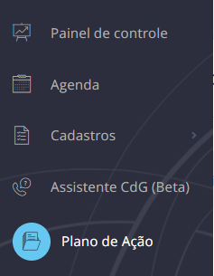
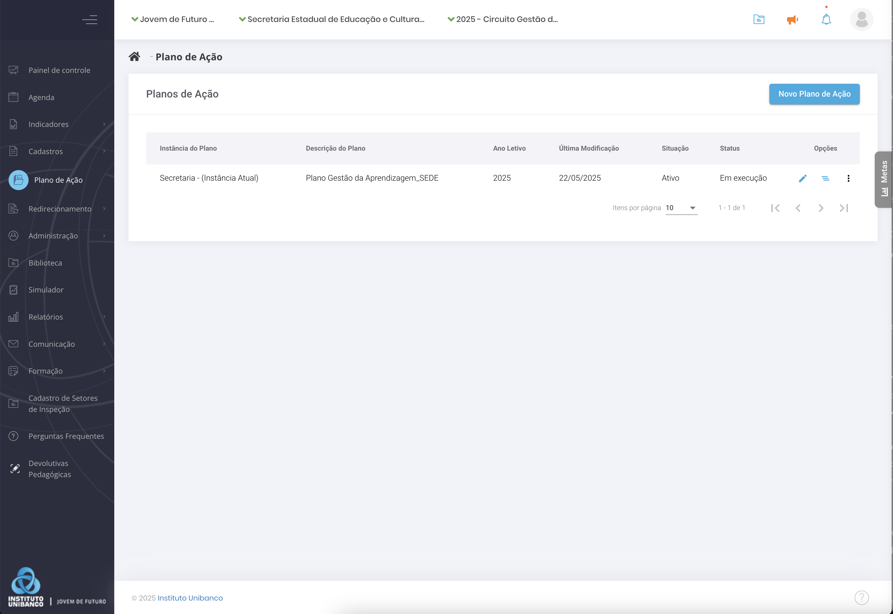
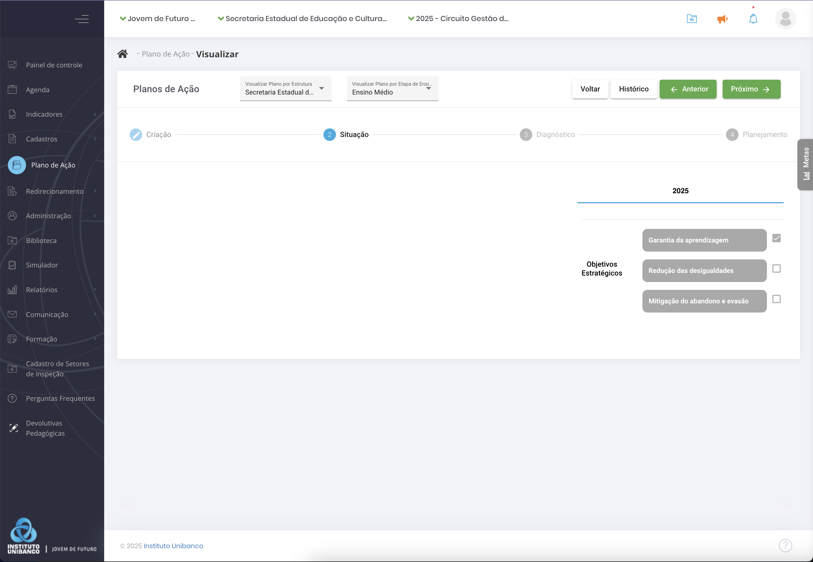
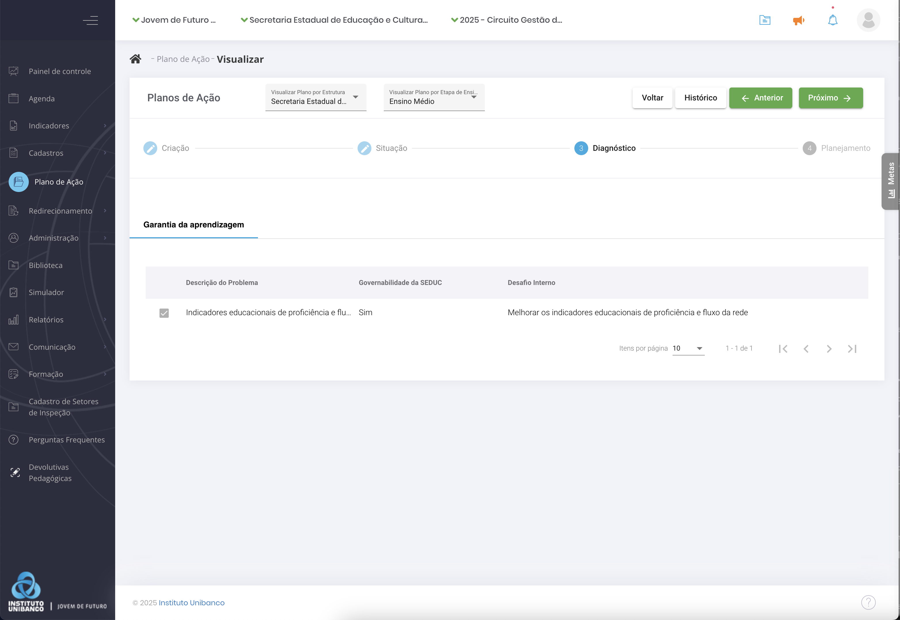
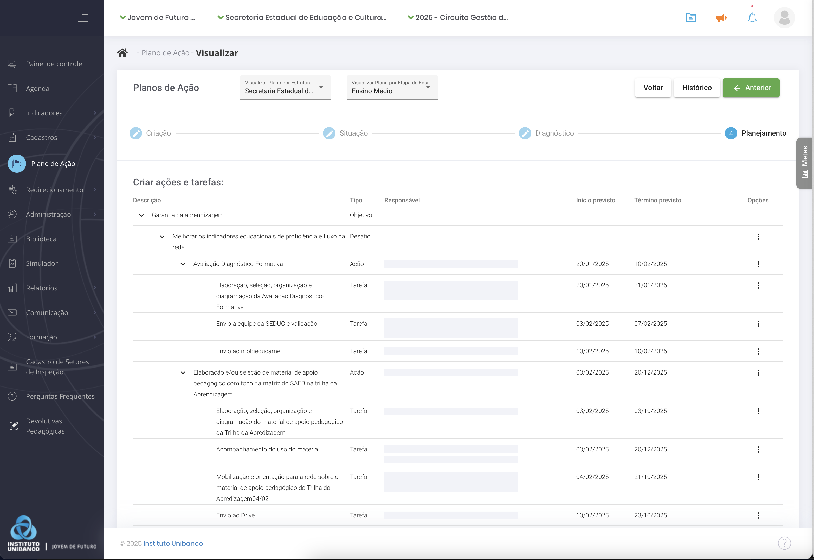
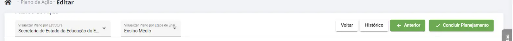
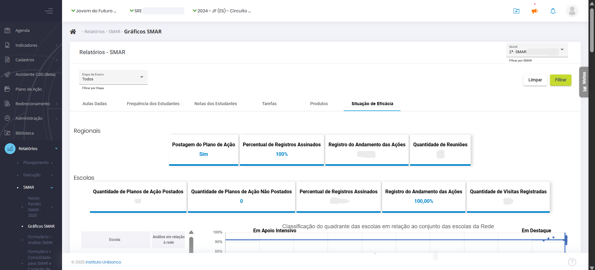

# 3\. Como cadastrar o Plano de Ação

Para cadastrar, clique no menu lateral em “**Plano de Ação**”. Depois clique em “**Novo Plano de Ação**”.

26-Menu Plano de Acao

A tela de cadastro do Plano de Ação começa com o campo para descrição e um espaço para anexar arquivos, onde você pode adicionar o projeto político pedagógico da escola. Na descrição, use um título direto, por exemplo, Plano de Ação da Escola Estadual X.

27-Novo Plano de Ação

Após descrever o Plano de Ação, clique em “**Próximo**”. Neste momento, o sistema irá exibir a seguinte mensagem: “Você irá alterar o status do Plano de Ação. Deseja continuar?”. Quando você clica em “**Sim**”, você muda o status do seu Plano para “**Em diagnóstico**”.

28-Cadastro Plano de Ação

Para começar a elaboração do Plano, na aba “**Situação**”, escolha os **Objetivos Estratégicos,** bem como os componentes do IDEB que serão trabalhados. Após selecioná-los na caixa de seleção lateral, clique em “**Próximo**”.

29-Plano de Ação Próximo

Na aba “**Diagnóstico**”, para cada componente selecionado, **descreva um problema**, selecione a **etapa** de ensino, responda se o problema é ou não da **governabilidade** da escola e preencha o campo “**Desafio interno**”. Em seguida, selecione a **categoria** do problema: pedagógico, gestão de pessoas, comunicação e mobilização ou administrativo-financeiro.

30-Preenchimento Plano de Ação

Os problemas que não são da governabilidade da escola vão compor o Painel de Riscos da GRE à qual a escola pertence. Não é possível preencher o resultado esperado para eles, mas a prioridade e a categoria, sim. Depois, clique em “**Adicionar**” para incluí-los no Plano. O mesmo processo deve ser feito para todos os objetivos selecionados na etapa anterior. Cabe ressaltar que todos os componentes devem ter pelo menos um problema de governabilidade da sua instância.

Após o cadastro de um resultado, você pode aproveitá-lo no registro de outro problema.  
Ou seja, se a resolução de dois problemas contribui para o alcance de um mesmo resultado, você pode aproveitar um resultado já cadastrado.

Quando você tiver registrado os problemas da sua governabilidade para todos os componentes selecionados, o sistema exibirá o botão “**Próximo**” para passar para a etapa seguinte do seu Plano de Ação.

Na tela a seguir, na aba “**Planejamento**”, o sistema exibirá todos os objetivos, componentes e desafios que você quer alcançar, registrados na etapa anterior. Se for uma escola multimodalidade, será exibida uma coluna a respeito da etapa de ensino (Fundamental ou Médio). Clique nos três pontinhos na coluna de “Opções” e em “**Adicionar ação**”.

Na tela de cadastro da ação, preencha o nome da ação, uma breve descrição, público-alvo, categoria, produto, resultado esperado e escolha os colaboradores envolvidos. Na lista de pessoas da escola ou da regional cadastradas no sistema, selecione uma delas para ser o responsável – todas as ações devem ter um responsável. Clique em “**Adicionar**” e, na sequência, em “**Salvar**”. O sistema exibirá a mensagem de ação cadastrada com sucesso.

Toda ação deve ser desmembrada em pedaços menores, que são as tarefas. Após cadastrar e salvar a ação, clique na aba ao lado, “**Tarefas**”. Preencha o nome da tarefa,  
a data na qual ela se inicia e a data de término. Se houver algum custo relacionado a ela, preencha o campo do valor previsto e clique em “**Salva**r”.

31-Planejamento

Após salvar a tarefa, o sistema pedirá para cadastrar um responsável por aquela tarefa em específico. Escolha a partir dos usuários cadastrados na sua instância: regional, secretaria ou escola. Após a tarefa descrita e o responsável definido, clique em “**Fechar**”.

Depois de cadastrar as ações e as tarefas, o sistema volta para a tela dos resultados, agora com uma lista das ações e tarefas vinculadas. Se houver falha no preenchimento de alguma informação, como falta do responsável, a tarefa aparecerá em uma linha vermelha. Para corrigir ou para editar qualquer outra informação relacionada, como data de início e de término, clique no lápis à direita. Corrija, clique em “**Salvar**” e no X para fechar.

Com todas as ações e tarefas cadastradas, o sistema exibirá o botão “**Concluir Planejamento**”. Após clicar, confirme com “**Sim**”.

Depois do registro das tarefas, o Plano de Ação fica com o status de “**Elaborado**”. Se não houver alterações, o processo de planejamento está terminado.

32-Concluir Planejamento

## 3.1. Análise de Eficácia do Plano de Ação

A eficácia do Plano de Ação na Avaliação de Resultados mensura a capacidade do Plano de produzir efeitos sobre a realidade escolar, uma vez que demonstra se a sua realização vem contribuindo para gerar resultados de aprendizagem com garantia de acesso, permanência e aprendizagem com redução das desigualdades.

Os gráficos de indicadores permitem comparar os dados da escola em relação ao conjunto de escolas que implementam o Circuito de Gestão da Aprendizagem na rede.

A análise de eficácia é exibida juntamente com as outras abas da Avaliação de Resultados e, mesmo nela, há comparações de Execução \- Plano de Ação (Tarefas e Produtos) e Resultados \- Aula, Frequência e Notas. Para acessar, o caminho é: Menu \> Relatórios \> Avaliação de Resultados \> Gráficos Avaliação de Resultados \> Aba: Situação de Eficácia.

33.Analise de Eficacia do Plano (censurada)

