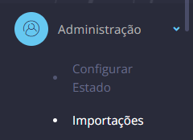
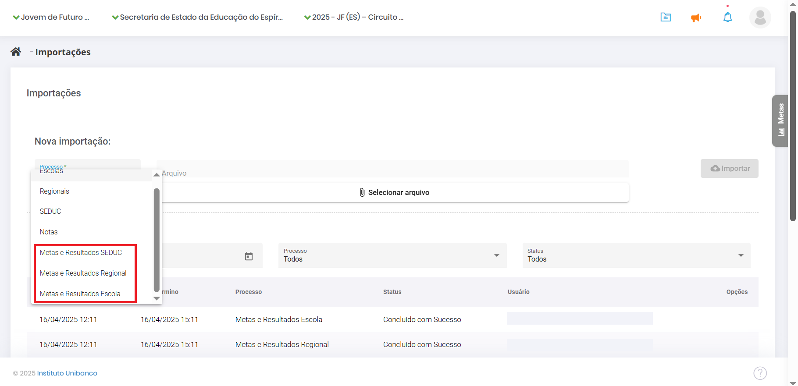

# 5\. Importação das metas para o sistema

Esta funcionalidade tem como objetivo preencher a aba de metas com os resultados do ano e suas respectivas metas por etapa e viabilizar o uso do simulador.

O processo de importação é simples. É semelhante ao carregamento de um documento em um diretório no computador. Porém, é necessário garantir que o formato dos arquivos segue a estrutura de dados que o sistema requer. Os templates são gerados automaticamente pelo script disponibilizado. Atenção: os arquivos precisam estar no formato .csv

No menu lateral, clique em **Administração,** depois em **Importações**.

34-Menu Importacoes

Marque a instância e selecione o arquivo desejado. Clique em **Importar**.

35-Importação Metas

O status após o carregamento deve ser “**Concluído com Sucesso**”. Caso seja “Concluído com Erro”, clique em “**Consultar Inconsistências**” na coluna de Opções.

36-importar Metas

Abaixo, é exibido um gráfico com o histórico da rede, da escola ou da regional. No gráfico, para ter mais detalhes das informações, passe o mouse sobre os pontos e linhas, que uma caixinha com todas as informações será exibida. A aba de “**Metas**” está disponível na lateral de todas as telas do SIGAE.

35-Importação de Metas

