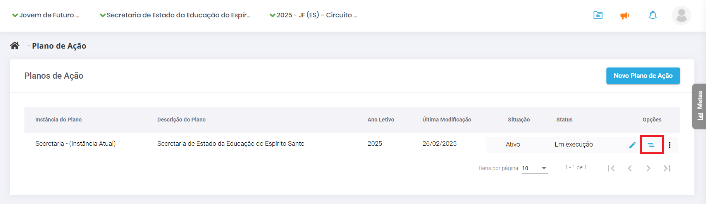

# 4\. Como fazer o registro da Execução do Plano de Ação

Para registrar a execução do Plano de Ação da escola, comece fazendo login no sistema. No Painel de Controle, na tela inicial, vá ao menu lateral, clique no item “**Plano de Ação”**. A tela vai exibir os Planos da escola, da GRE e da Secretaria, sendo os das instâncias superiores somente para consulta.

A partir da primeira atualização de execução, o Plano muda do status “Elaborado” para o status “Em execução”. Para atualizar, clique nos três risquinhos, na coluna “**Opções**”, referentes à execução e hierarquia. Nesse momento, o sistema vai carregar todo o seu Plano com os objetivos, os resultados, as ações e as tarefas planejadas.

34-Execução Plano de Ação

Na coluna de status, a sinaleira indica: vermelho para uma tarefa que já deveria ter começado e ainda não começou, cinza para uma tarefa que ainda vai começar, amarelo para uma tarefa atrasada e verde escuro para uma tarefa concluída ou verde claro para concluída com atraso. Para consultar o significado de cada cor, é só passar o mouse sobre ela. As ações sempre terão a cor que demonstra a média do status das tarefas à qual elas estão vinculadas.

Para atualizar o status de uma tarefa, clique no lápis para exibir seus dados. Um quadro que não está mais disponível para edição vai mostrar o que foi previsto. Outro quadro estará disponível para registrar o que e quando efetivamente foi feito. Clique em “**Salvar**” para alterar o status da ação, veja a mensagem de confirmação do sistema e clique no X para fechar. A coluna de status estará atualizada.

35–Execução Plano de Ação Salvar

Lembre-se de manter o registro da execução do Plano de Ação sempre atualizado. No momento da avaliação dos resultados, o sistema irá exibir o quanto já foi realizado e se os objetivos estão sendo alcançados. Crie uma rotina de atualização do seu Plano de Ação e o hábito de entrar no sistema esporadicamente para registrar tudo o que foi executado. Assim, você evita correrias na semana da data de corte.
