---
hide:
  - navigation
---

# SIGAE

## 1. A importância do SIGAE

O Sistema de Gestão para o Avanço Contínuo da Educação (SIGAE) é uma plataforma digital criada pelo Instituto Unibanco para apoiar a implementação do Circuito de Gestão (CdG) nas redes de ensino parceiras. Com o SIGAE, é possível planejar, monitorar e corrigir, em tempo real, as ações e iniciativas para a melhoria da aprendizagem dos estudantes de forma simples, rápida e atualizada.

O SIGAE permite às escolas, às Coordenadorias Regionais de Educação (CREs) e à equipe central da Secretaria de Educação percorrer digitalmente todos os movimentos do CdG. O sistema disponibiliza painéis e relatórios com dados que podem auxiliar e potencializar a tomada de decisão das gestoras e gestores gaúchos. Isso permite à rede fazer uma gestão mais integrada, compartilhada e corresponsável de sua política educacional em busca de cenários mais equânimes, democráticos e transformadores.

### 1.1. Funcionalidades do SIGAE

O SIGAE permite:

-   Visualizar informações, dados e gráficos;
-   Emitir relatórios sobre a situação atual das escolas, Coordenadorias Regionais de Educação (CREs) e da Secretaria em relação à implementação do Circuito de Gestão (CdG).

Manter os dados atualizados é essencial para apoiar o trabalho dos profissionais envolvidos e alcançar os objetivos estratégicos da Secretaria. Assim, o preenchimento do sistema não é apenas uma formalidade burocrática, mas parte crucial desse processo.

### 1.2. Acesso ao SIGAE

O SIGAE pode ser acessado em qualquer dispositivo (computadores, tablets, notebooks ou smartphones) pelo link: [https://sigae.institutounibanco.org.br](https://sigae.institutounibanco.org.br)

### 1.3. Suporte e Dúvidas

Para ajuda e informações relacionadas ao SIGAE e/ou Programa Jovem de Futuro:

-   **Telefone**: 0800 050 0064
-   **E-mail:** atendimento@jovemdefuturo.org.br

O atendimento é realizado das 8h às 20h de segunda a sexta-feira.

## 2. Funcionalidades gerais

### 2.1. Login e senha

Abra seu navegador e vá para [https://sigae.institutounibanco.org.br/portal/login](https://sigae.institutounibanco.org.br/portal/login). Preencha os campos de login e senha com seus dados cadastrados. Marque a opção que você não é um robô e, depois, em “**Entrar**”.

01-Login e senha

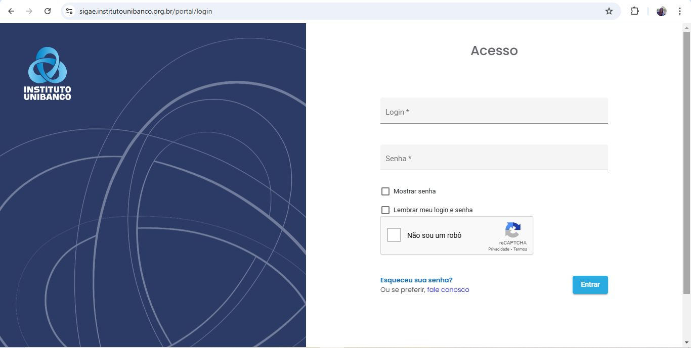

Caso seja o seu primeiro acesso, aguarde o e-mail com o link para criar sua senha.

02-Email primeiro acesso

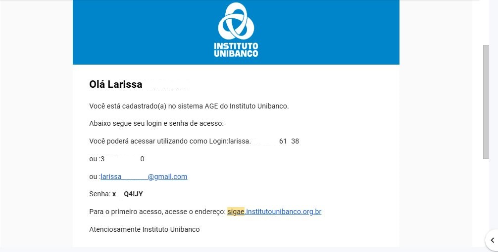

Você pode fazer login da seguinte forma:

1. **CPF:** Digite seu CPF (exemplo: 123.456.789-00);
2. **E-mail:** Digite seu e-mail (exemplo: fulano.ciclano@seduc.rs.gov.br).

| Observação: Se houver outro usuário com o mesmo login, um número será adicionado para diferenciar ou você poderá usar seu CPF ou e-mail cadastrado. |
| :-------------------------------------------------------------------------------------------------------------------------------------------------- |

Se não souber sua senha, clique em "**Esqueceu sua senha?**". Solicite uma nova ou entre em contato com o “Fale Conosco” (ligação gratuita).

**Senha**

Garanta que sua senha atenda aos seguintes critérios:

-   **Comprimento:** Tenha entre 8 e 20 caracteres;
-   **Caracteres especiais:** Inclua pelo menos 1 dos seguintes: `!,@,#,$,%, ̈,&,*,(,),_,-,+,=,’,”`;
-   **Letras minúsculas:** Inclua pelo menos 1 letra minúscula;
-   **Letras maiúsculas:** Inclua pelo menos 1 letra maiúscula;
-   **Números:** Inclua pelo menos 1 número.

O SIGAE trabalha com a confirmação em duas etapas, de modo que, após realizar o acesso com login e senha, você será direcionado para a página de validação do código de acesso. Um código de cinco dígitos será gerado e enviado para o e-mail utilizado em seu cadastro. Cole o token no campo indicado e clique em “**Validar**”. Caso não tenha recebido o código ou o mesmo tenha se perdido, clique em “**Reenviar código de acesso**” para gerar um novo código*.*

**Dica:** Verifique a caixa de spam do seu e-mail caso o código não esteja na caixa de entrada.

03-Validação do código de acesso

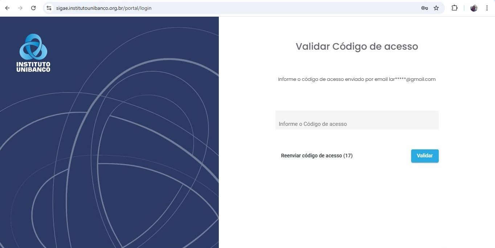

### 2.2. Recuperação de senha

Para recuperar sua senha, clique na opção “**Esqueceu sua senha?**” e informe o login cadastrado para receber um link e cadastrar uma nova senha.

04-Recuperar senha

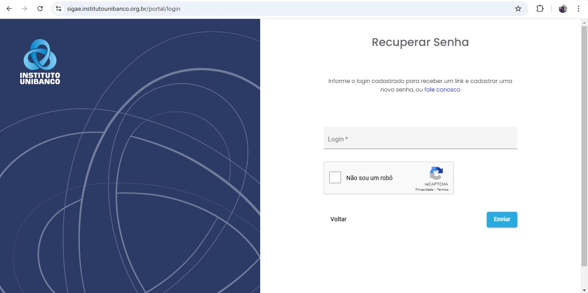

Aguarde o envio de um **link** para o e-mail cadastrado. Abra o e-mail, clique no link recebido e siga as instruções no sistema para criar uma nova senha.

De volta ao sistema, será exibida uma tela para que uma nova senha seja cadastrada. Não há restrição quanto às últimas senhas utilizadas. Portanto, a senha anterior pode ser novamente cadastrada.

05-Cadastrar nova senha

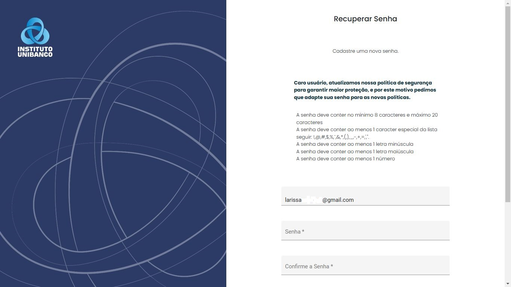

### 2.3. Cadastro de novo usuário

Faça login no SIGAE como responsável pelo cadastro de cada instância. A hierarquia de cadastro funciona da seguinte forma:

-   O coordenador da CRE consegue cadastrar todos os usuários de sua regional (chefia, mentores, diretores, orientadores etc.).
-   A chefia pedagógica da CRE consegue cadastrar todos os usuários de sua regional (chefia, mentores, diretores, orientadores etc.), desde que possua a permissão em seu perfil.
-   O diretor da escola consegue cadastrar todos os usuários de sua escola (vice-diretor, orientador, supervisor, professor etc.).
-   O vice-diretor consegue cadastrar todos os usuários de sua escola (diretor, orientador, supervisor, professor etc.), desde que possua a permissão em seu perfil.
-   O orientador pedagógico consegue cadastrar todos os usuários de sua escola (diretor, supervisor, professor etc.), desde que possua a permissão em seu perfil.
-   O supervisor pedagógico consegue cadastrar todos os usuários de sua escola (diretor, orientador, professor etc.), desde que possua a permissão em seu perfil.
-   Os mentores pedagógicos, professores e demais cargos não possuem, a princípio, credenciais para cadastrar novos usuários no SIGAE.

No Painel de Controle, selecione a estrutura da qual o novo usuário faz parte (SEDUC, CRE ou escola) usando o **filtro master** superior da tela.

06-Selecionar estrutura

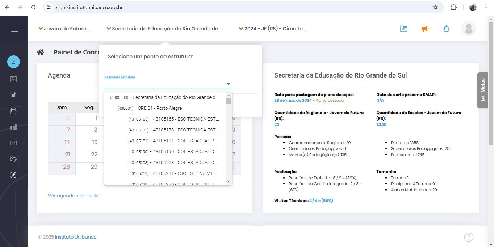

Clique em "**Cadastro**" no menu principal e, em seguida, selecione a opção "**Pessoas**".

07-Cadastro pessoas

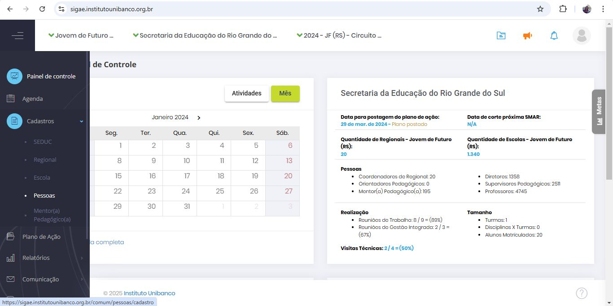

Clique no botão “**Novo**”, em azul no canto superior direito da tela.

08-Novo Cadastro

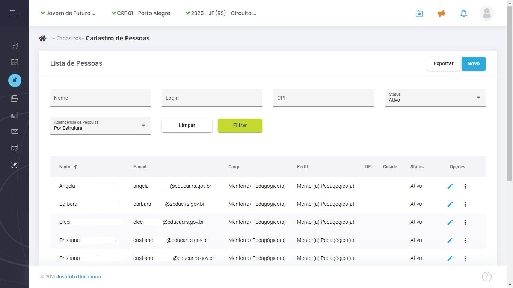

Preencha os campos obrigatórios na tela de cadastro: **nome**, **CPF** e **e-mail**. Comece pelo CPF, pois se o usuário já estiver cadastrado, os demais dados serão preenchidos automaticamente.

09-Preencher cadastro

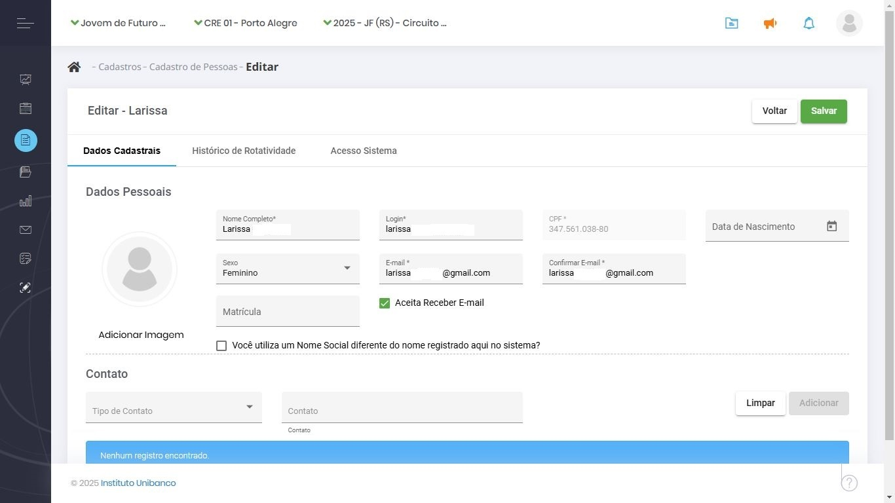

Após preencher os dados obrigatórios, clique em “**Salvar**”. Confirme o vínculo à estrutura associada clicando em “**Sim**” na mensagem de sucesso do cadastro. Selecione o **cargo** da pessoa na nova mensagem exibida. Em seguida, escolha o **perfil de acesso** que ela terá no sistema na mesma tela.

10-Ativar perfil

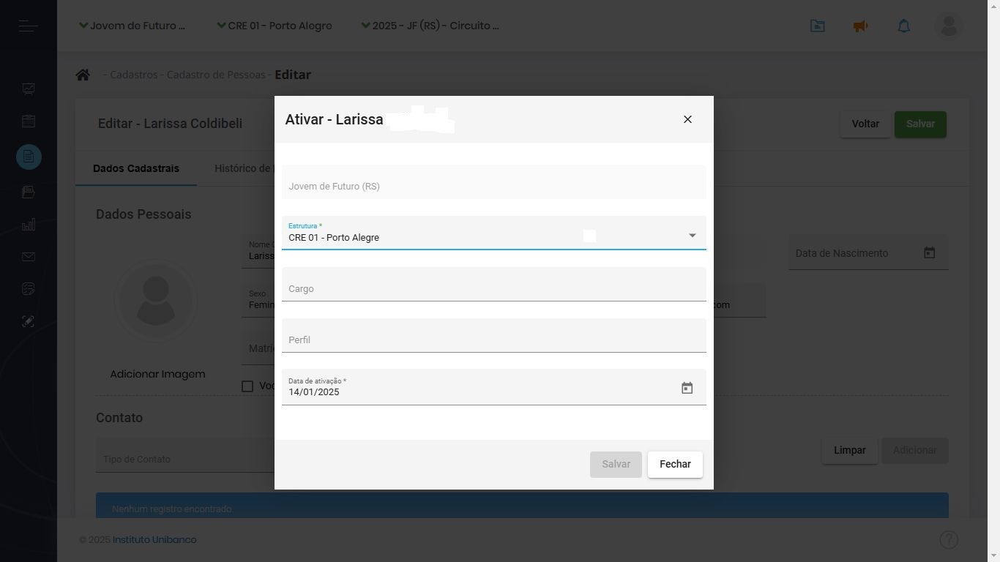

Sobre os perfis de acesso ao SIGAE, temos duas modalidades: consulta e edição. Como os próprios nomes sugerem, o primeiro perfil permite ao usuário apenas consultar as informações exibidas no SIGAE, enquanto o último permite alterá-las. Na instância da Secretaria estes perfis aparecem com os nomes “SEDUC Consulta” e “SEDUC edição”, nas regionais são “Regional Consulta” e “Regional Edição” e na instância das escolas, “Escola sem edição” e “Escola com edição”.

Ao final, será exibida a **data corrente**, com possibilidade de alteração, para que seja possível informar quando a pessoa iniciou seus trabalhos na estrutura a que está associada. Assim que clicar em “**Salvar**”, será enviado um e-mail para o endereço cadastrado no SIGAE, permitindo que o novo usuário crie sua senha.

Após a finalização, a pessoa recém-cadastrada deverá aparecer na listagem da sua instância, podendo ser localizada pelos filtros de nome, login ou CPF.

#### 2.3.1. Como editar o cadastro de um usuário

É provável que ocorram alterações na estrutura da instância, que podem resultar na realocação de cargos ou substituição de pessoas. Nos casos em que é necessário alterar o cargo do gestor, selecione a estrutura da qual o novo usuário faz parte (SEDUC, CRE ou escola) usando o **filtro master** superior da tela. Clique em "**Cadastro**" no menu principal e, em seguida, selecione a opção "**Pessoas**". Localize o cadastro do gestor e clique em “**Editar Pessoa**” identificado pelo ícone de um lápis azul. Nesta janela dividida por três abas é possível alterar todos os dados do gestor, **exceto o** **CPF**.

11-Editar cadastro

Na aba “**Dados Cadastrais**” altere os dados pessoais do gestor. Na aba “**Histórico de Rotatividade**” a alteração é feita por meio da adição do novo cargo e a exclusão do antigo. Para adicionar o novo cargo, basta selecionar as opções “**Estrutura**”, “**Função**”, “**Etapa de Ensino**” e “**Data de Início**”. Para excluir o antigo cargo, clique em “**Editar Rotatividade**”, representado pelo ícone de lápis azul. Ao clicar, o campo “**Data de Término**” ficará disponível para preenchimento. Atribua a data corrente e clique em “**Alterar**”, isto fará com o que o cargo seja encerrado.

12-Historico de rotatividade

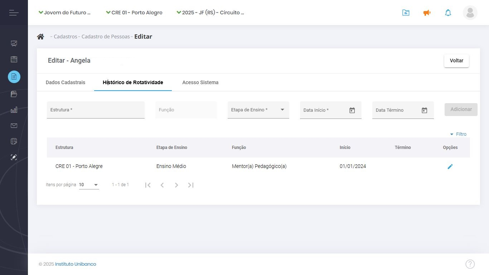

**Atenção\!** Lembre-se sempre de encerrar o antigo cargo do gestor, caso contrário ele aparecerá no SIGAE com dois cargos distintos.

#### 2.3.2. Como eleger a Dupla Gestora/Grupo Gestor

A identificação dos responsáveis pela gestão da instância dentro do SIGAE é um passo importante, principalmente no que se refere aos agendamentos dos eventos componentes do CdG. A Dupla Gestora (Coordenador \+ Chefia Pedagógica) pertence à CRE e o Grupo Gestor (Diretor \+ Supervisor \+ Orientador) pertence à escola. Para selecionar os usuários, clique em "**Cadastro**" no menu principal e, em seguida, selecione a opção "**Pessoas**". Identificada a pessoa, clique nos três pontos no canto direito e selecione a opção “**Grupo Gestor**”.

13-Grupo Gestor

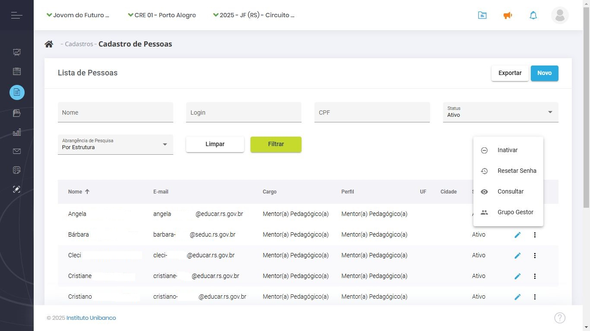

Uma nova janela se abrirá. Selecione a pessoa, o cargo e a data de início e depois clique em “**Adicionar**". Caso você esteja cadastrando uma pessoa na instância da CRE, selecione a opção “**Dupla Gestora**”. Preenchido todos os campos, clique em “**Adicionar**”. Pronto, o participante do Grupo Gestor foi selecionado.

14-Eleger Dupla Gestora

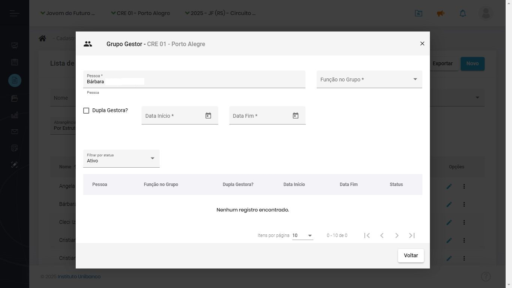

### 2.4. Como realizar ou editar agendamentos

Para fazer o agendamento de eventos como Reunião de Gestão Integrada, Comitê Operacional ou Sessão de Acompanhamento, comece fazendo login no sistema com os seus dados e clicando no reCAPTCHA para assinalar que não é um robô. Clique em “**Entrar**”.

Para iniciar o agendamento, clique em “**Agenda**”, no menu lateral. Aparecerá uma tela de calendário. É possível fazer uma pesquisa por estrutura ou geral. No tipo de evento, há as opções “**Outros**”, “**Particulares**” e “**Circuito de Gestão**”, para centralizar todos os eventos da escola ou da regional em um único calendário, que pode ser visualizado em 3 configurações à sua escolha: mensal, semanal ou diário. Para agendar um novo evento, clique em “**Novo**” e “**Circuito de Gestão**”, no topo.

15-Novo agendamento

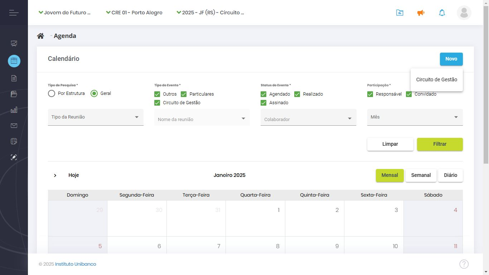

Selecione o tipo de evento. Para o(a) mediador(a) que quer agendar uma Sessão de Acompanhamento com uma de suas escolas, por exemplo, no filtro master, selecione a escola para a qual vai realizar o agendamento. O campo “**Organizador”** será o seu nome de usuário. Em seguida, escolha o **formato** do agendamento: remoto ou presencial. Marque a **etapa** do Circuito de Gestão à qual o evento se refere e o evento em si. Preencha a **data**, o **local**, o **horário** de início e de término.

Role a página para baixo para selecionar os **participantes**. No campo “**Estrutura**”, confirme a seleção da escola. Depois, você pode selecionar um **agrupamento**: Todos, Dupla Gestora da Escola ou Grupo Gestor da Escola. Ao clicar em “**Participante**”, vão aparecer todas as pessoas da escola que estão cadastradas no sistema.

Depois de adicionar os participantes, role a página mais um pouco para cadastrar as **pautas** a serem discutidas. É importante que cada pauta seja cadastrada separadamente. Isso vai facilitar no momento do registro da sessão. Preencha e clique em “**Adicionar**” para cada uma delas. Para finalizar, clique em “**Concluir**” na parte superior da página. O sistema exibirá uma mensagem de que o agendamento foi efetuado com sucesso.

16-Preencher agendamento

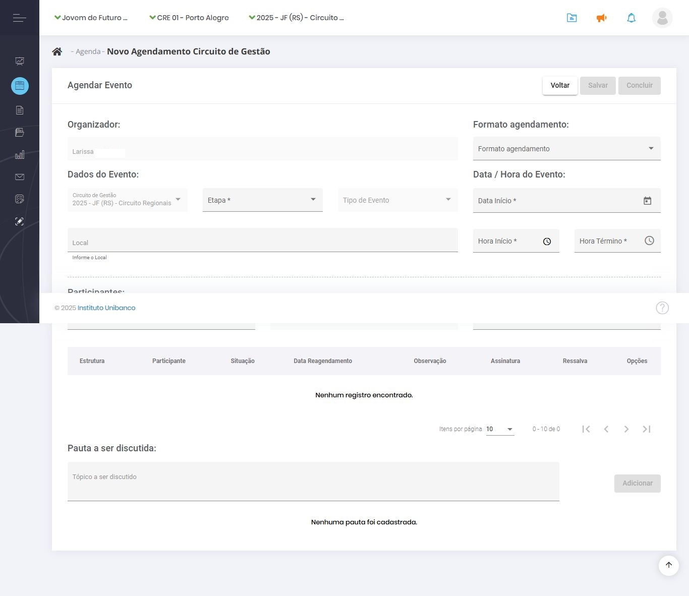

Para **editar um agendamento**, pelo Painel de Controle na página inicial, navegue pelo módulo de agenda, que indica os dias em que há eventos. Ao clicar em um deles, é exibido o nome do evento e, clicando novamente, abre-se uma ficha com todos os detalhes. Na parte superior da página, clique em “**Editar**”, mude as informações necessárias (data, pautas, participantes etc.) e clique em “**Concluir**”. O sistema exibirá uma mensagem de que o agendamento foi efetuado com sucesso.

17-Editar agendamento

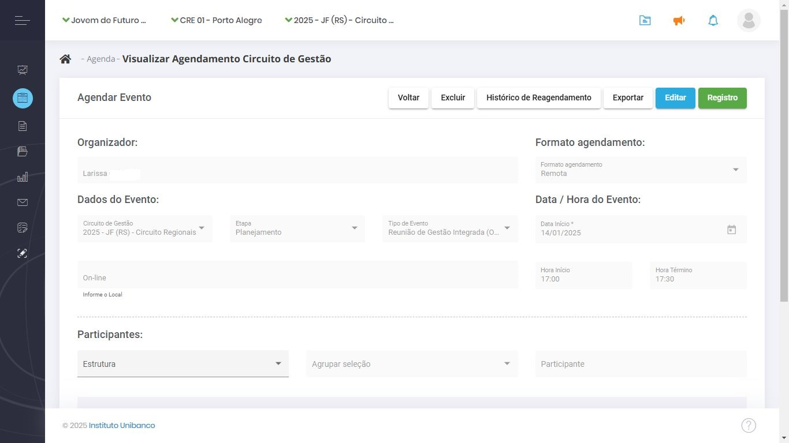

### 2.5. Como incluir o registro de um evento

Após a realização de um evento, é necessário realizar o registro do que foi discutido. Pelo Painel de Controle, navegue no módulo de Agenda e clique no evento para exibir os detalhes. Na parte superior da página, clique em “**Registro**”.

18-Registro

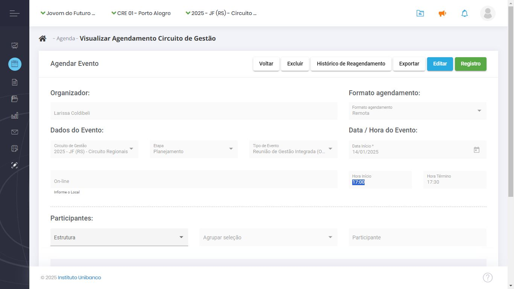

Um novo formulário vai abrir para registrar a presença dos participantes convidados, marcando a opção “Compareceu”. Quem não foi, não deve ser marcado.
Abaixo, é hora de registrar as pautas. Há a opção “**Tópico não discutido**”, caso um assunto não tenha sido abordado. Para as pautas discutidas, faça um breve resumo. Se novos temas tiverem sido abordados, clique em “**Adicionar**” para incluir.

Também é possível anexar arquivos que ilustram o que foi discutido na reunião. Além disso, registre os encaminhamentos, clicando no botão “**Novo Encaminhamento**”. Faça uma breve descrição da atividade relacionada a ele. Selecione o responsável, que deve ser algum dos presentes na reunião, a data de início da atividade e a data de término. Clique em “**Salvar**”.

Após registrar a presença dos profissionais, as pautas discutidas e os encaminhamentos, suba a página e clique em “**Concluir**”. Os encaminhamentos inseridos no registro da Sessão de Acompanhamento ou no registro das Reuniões de Trabalho precisam de apoio das instâncias superiores para serem resolvidos, por isso, registre-os com bastante cuidado.

19-Concluir registro

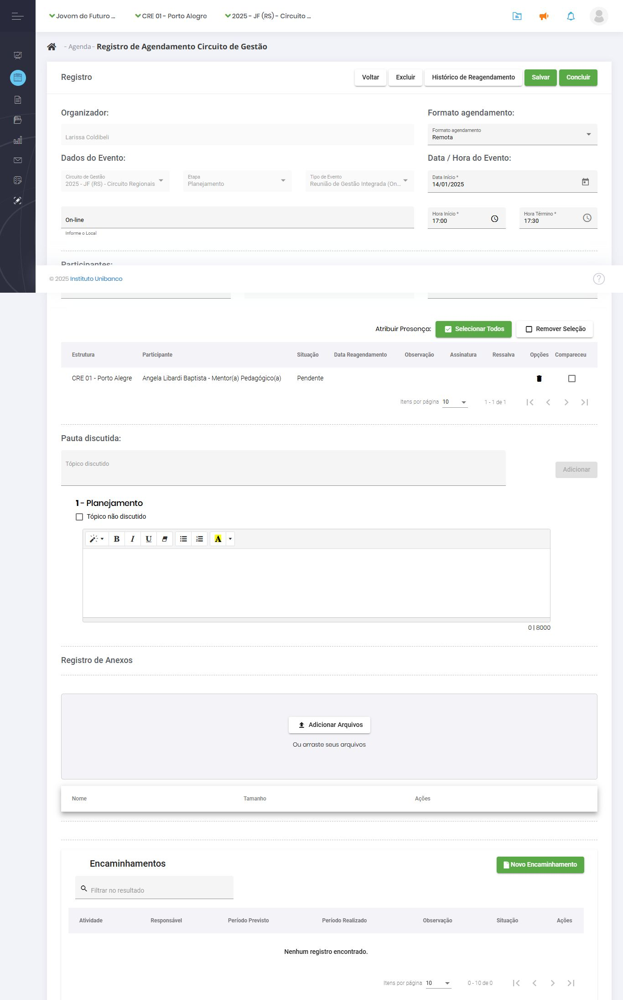

### 2.6. Como assinar o registro de um evento

No Painel de Controle, há uma novidade: no topo, ao lado do perfil do usuário, aparecem três ícones. O primeiro, em formato de pasta, é da **biblioteca**, quando você tiver novos arquivos. O segundo é um megafone, para **comunicados**. E, por fim, um sino para **notificações**, que vai exibir quando houver o registro de um evento.

20-Notificacoes

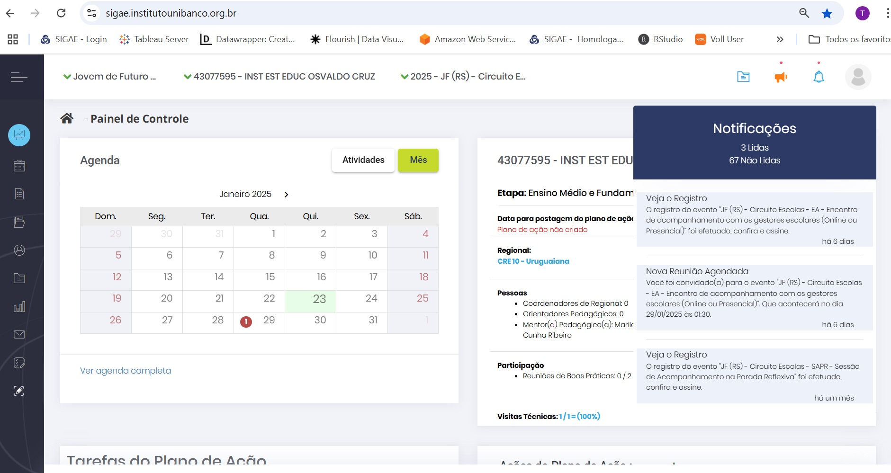

Após a inclusão do registro do evento, todos que estavam presentes e que foram convidados (mesmo se não tiverem comparecido), recebem a notificação de que o registro foi incluído. Você pode clicar direto na notificação para conferir a lista de presença, a pauta discutida e os encaminhamentos. No topo da página, há o botão de “**Assinar**”.

21-Assinar

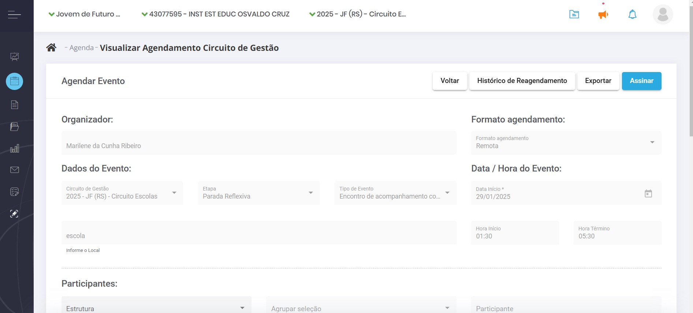

Há outro caminho para encontrar o registro dos eventos. Na página inicial do Painel de Controle, no calendário da agenda, basta encontrar o evento que já foi realizado. Ao passar o mouse sobre ele, são exibidas as informações do tipo de evento, data, horário e status. Para assinar a ata, é só clicar e selecionar o evento para exibir a página com detalhes, conferir todos os dados e clicar em “**Assinar**” no topo da página.

22-Assinar pelo Painel de Controle

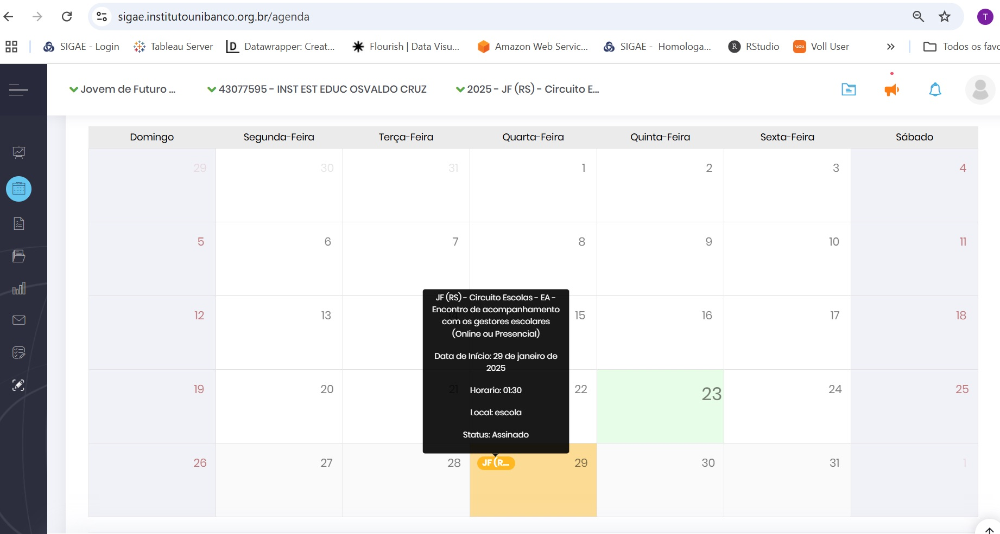

Ao assinar o registro, é exibida uma caixa de mensagem sobre **ressalvas**, onde você pode incluir algum encaminhamento ou algum item de pauta que não foi mencionado. Depois de incluir a sua ressalva, se você tiver alguma, é só clicar em “**Assinar**” e o sistema exibirá a informação de que o registro foi assinado com sucesso.

Voltando para a agenda, o **status** do evento terá mudado. Ao passar o mouse por cima do evento, em vez de mostrar “**Realizado**”, ele mostra “**Assinado**”. Este é o último estágio do evento.

23-Assinar Ressalva

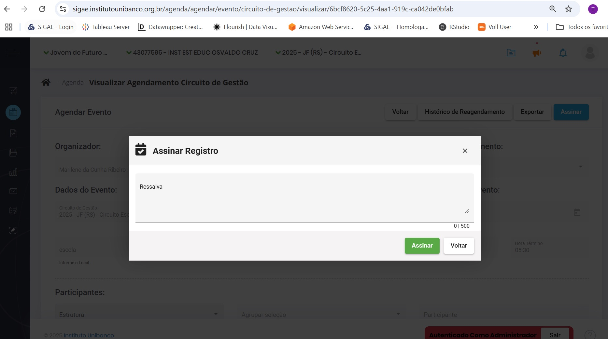

Lembre-se que é possível filtrar os eventos por status (agendado, realizado ou assinado). É só selecionar as opções que deseja no filtro superior e clicar em “**Filtrar**” para ver só os itens que você selecionou.

## 3. Como cadastrar o Plano de Ação

Para cadastrar o seu Plano de Ação, clique em “**Novo Plano de Ação**”. A tela de cadastro do Plano de Ação começa com o campo para descrição e um espaço para anexar arquivos, onde você pode adicionar o projeto político pedagógico da escola. Na descrição, use um título direto, por exemplo, Plano de Ação da Escola Estadual X.

24-Novo Plano de Ação

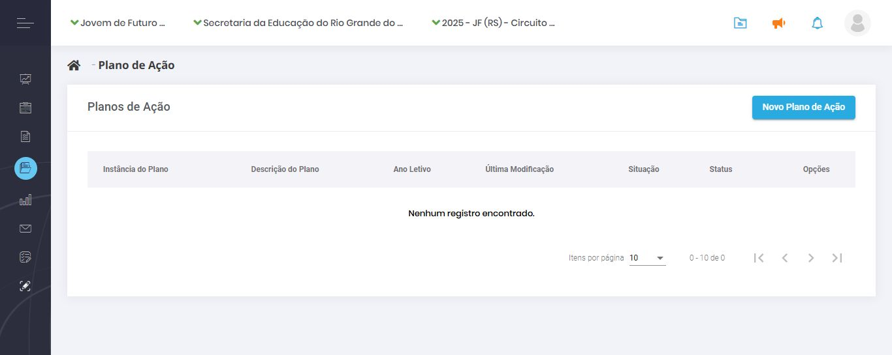

Após descrever o Plano de Ação, clique em “**Próximo**”. Neste momento, o sistema irá exibir a seguinte mensagem: “Você irá alterar o status do Plano de Ação. Deseja continuar?”. Quando você clica em “**Sim**”, você muda o status do seu Plano para “**Em diagnóstico**”.

25-Descrição do Plano de Ação

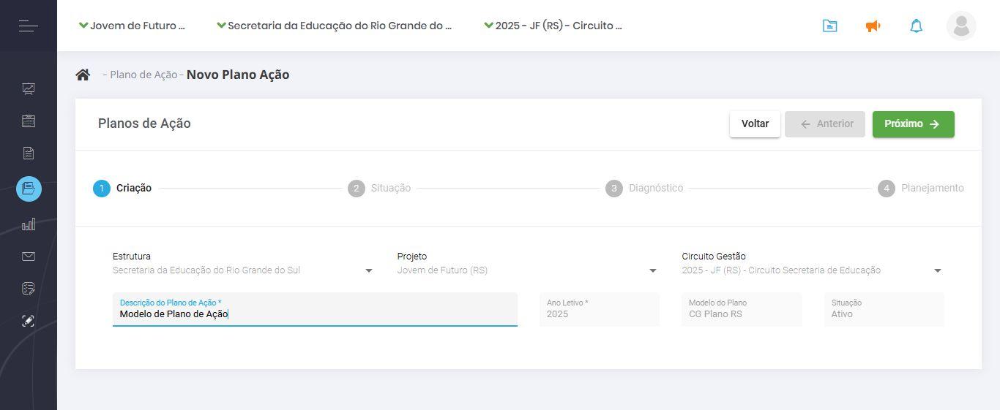

Para começar a elaboração do Plano, escolha os **Objetivos Finalísticos** que serão trabalhados. Após selecioná-los na caixa de seleção lateral, clique em “**Próximo**”.

26-Objetivos Finalísticos

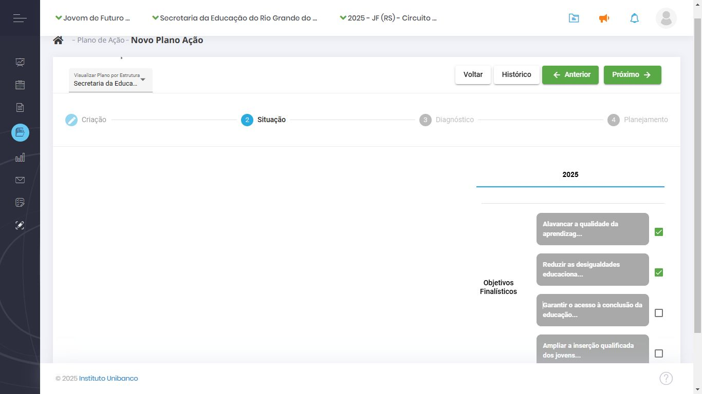

Para cada direcionador, **descreva um problema**, selecione a **etapa** de ensino, responda se o problema é ou não da **governabilidade** da escola e preencha qual o **resultado esperado**. Depois, defina a **prioridade**, de 1 a 5, sendo que 1 é o problema mais prioritário e 5 é menos prioritário. Em seguida, selecione a **categoria** do problema: pedagógico, gestão de pessoas, comunicação e mobilização ou administrativo-financeiro.

Os problemas que não são da governabilidade da escola vão compor o Painel de Riscos da CRE à qual a escola pertence. Não é possível preencher o resultado esperado para eles, mas a prioridade e a categoria, sim. Depois, clique em “**Adicionar**” para incluí-los no seu Plano. O mesmo processo deve ser feito para todos os objetivos selecionados na etapa anterior. Cabe ressaltar que todos os direcionadores devem ter pelo menos um problema de governabilidade da sua instância.

27-Descreva problema

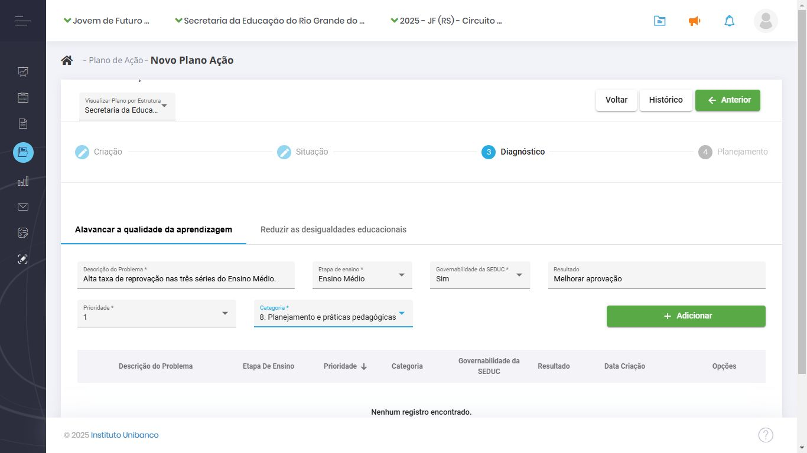

Após o cadastro de um resultado, você pode aproveitá-lo no registro de outro problema.
Ou seja, se a resolução de dois problemas contribui para o alcance de um mesmo resultado, você pode aproveitar um resultado já cadastrado.

Quando você tiver registrado os problemas da sua governabilidade para todos os direcionadores selecionados, o sistema exibirá o botão “**Próximo**” para passar para a etapa seguinte do seu Plano de Ação.

28-Plano de Ação Próximo

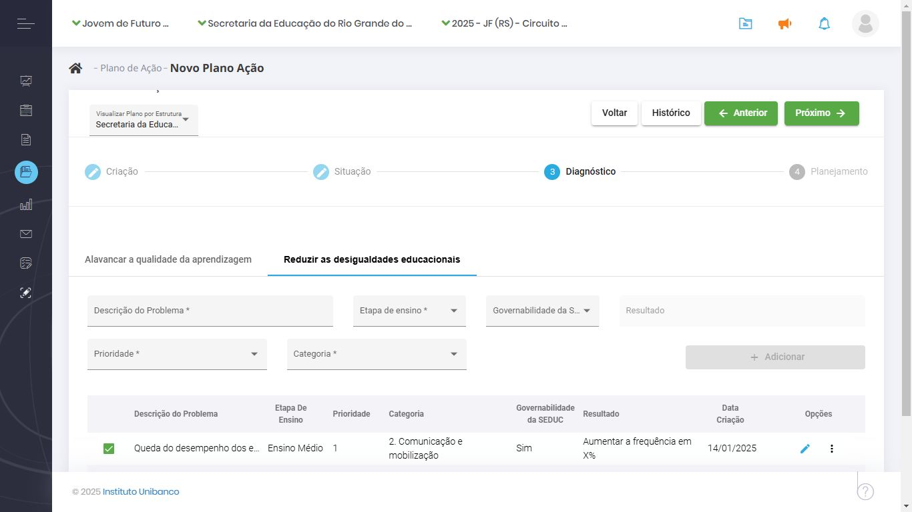

Na tela a seguir, o sistema exibirá todos os direcionadores e os resultados que você quer alcançar, registrados na etapa anterior. Se for uma escola multinível, será exibida uma coluna a respeito da etapa de ensino (Fundamental ou Médio). Clique nos três pontinhos na coluna de “Opções” e em “**Adicionar ação**”.

29-Adicionar ação

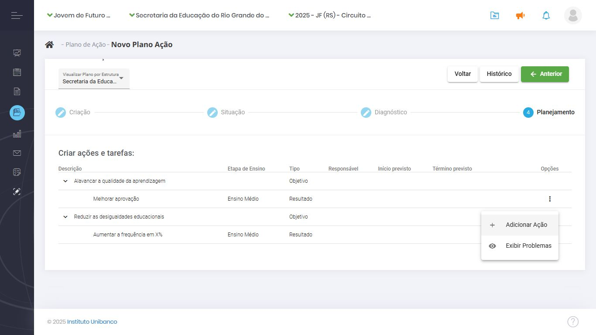

Na tela de cadastro da ação, preencha o nome da ação, uma breve descrição e escolha os colaboradores envolvidos. Na lista de pessoas da escola ou da regional cadastradas no sistema, selecione uma delas para ser o responsável – todas as ações devem ter um responsável. Clique em “**Adicionar**” e, na sequência, em “**Salvar**”. O sistema exibirá a mensagem de ação cadastrada com sucesso.

30-Salvar ação

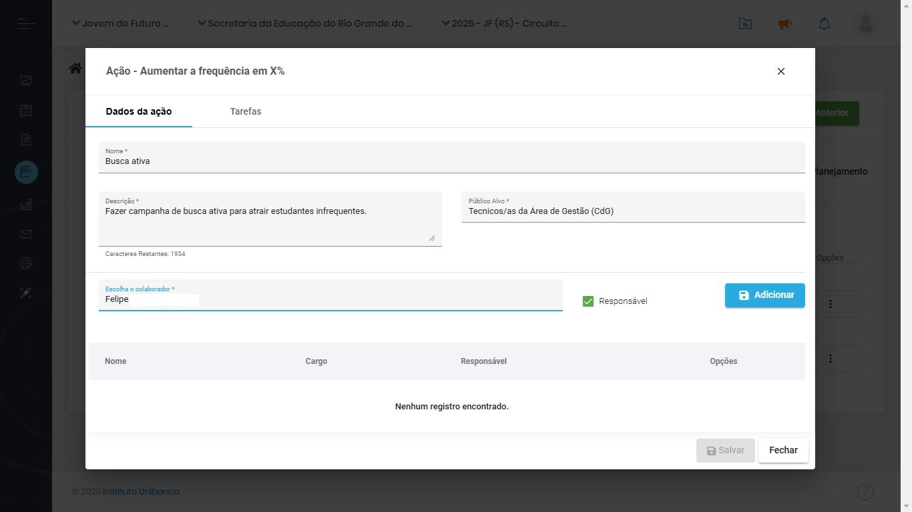

Toda ação deve ser desmembrada em pedaços menores, que são as tarefas. Após cadastrar e salvar a ação, clique na aba ao lado, “**Tarefas**”. Preencha o nome da tarefa,
a data na qual ela se inicia e a data de término. Se houver algum custo relacionado a ela, preencha o campo do valor previsto e clique em “**Salva**r”.

31-Inserir tarefa

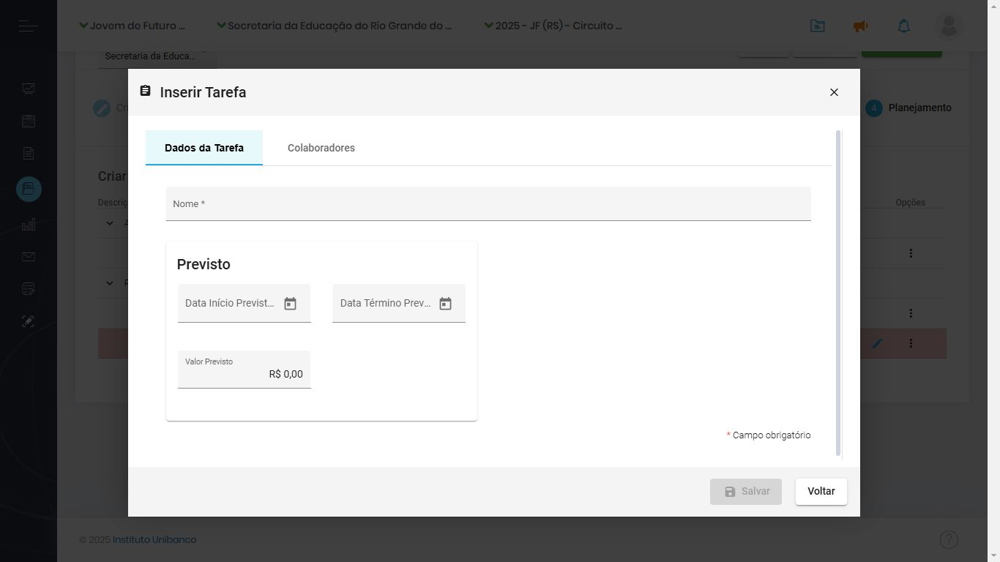

Após salvar a tarefa, o sistema pedirá para cadastrar um responsável por aquela tarefa em específico. Escolha a partir dos usuários cadastrados na sua instância: regional, secretaria ou escola. Após a tarefa descrita e o responsável definido, clique em “**Fechar**”.

32-Responsavel tarefa

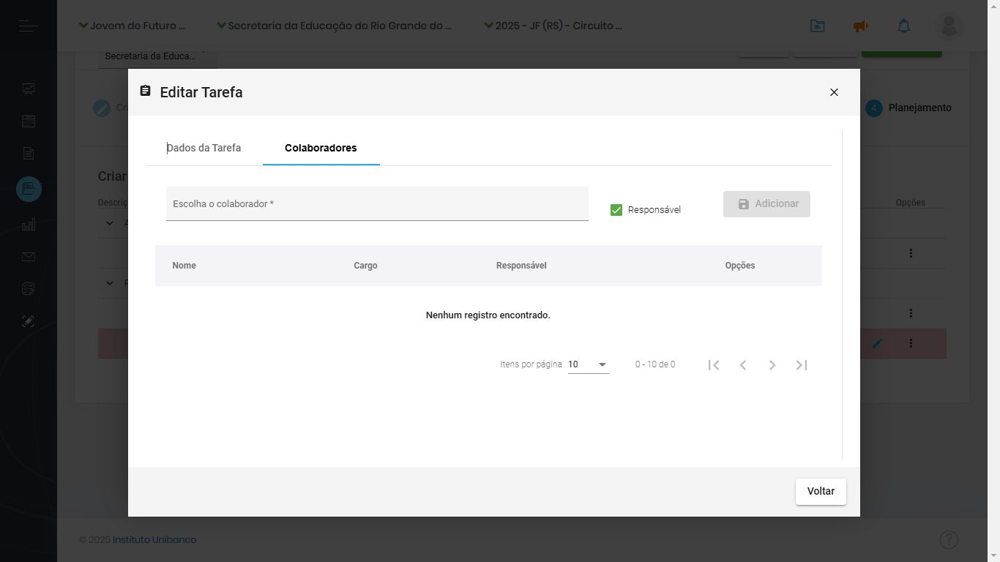

Depois de cadastrar as ações e as tarefas, o sistema volta para a tela dos resultados, agora com uma lista das ações e tarefas vinculadas. Se houver falha no preenchimento de alguma informação, como falta do responsável, a tarefa aparecerá em uma linha vermelha. Para corrigir ou para editar qualquer outra informação relacionada, como data de início e de término, clique no lápis à direita. Corrija, clique em “**Salvar**” e no X para fechar.

33-Painel acoes e tarefas

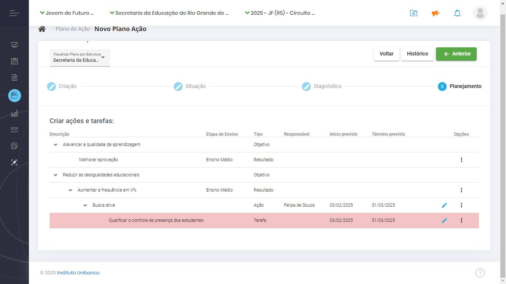

O cadastro de ação e tarefas deve ser feito para todos os resultados que foram registrados. Lembre-se: um resultado pode ter mais de uma ação e uma ação pode ter mais de uma tarefa.

Com ações e tarefas cadastradas para todos os resultados informados, o sistema exibirá o botão “**Concluir Planejamento**”. Após clicar, confirme com “**Sim**”.

34-Concluir Planejamento

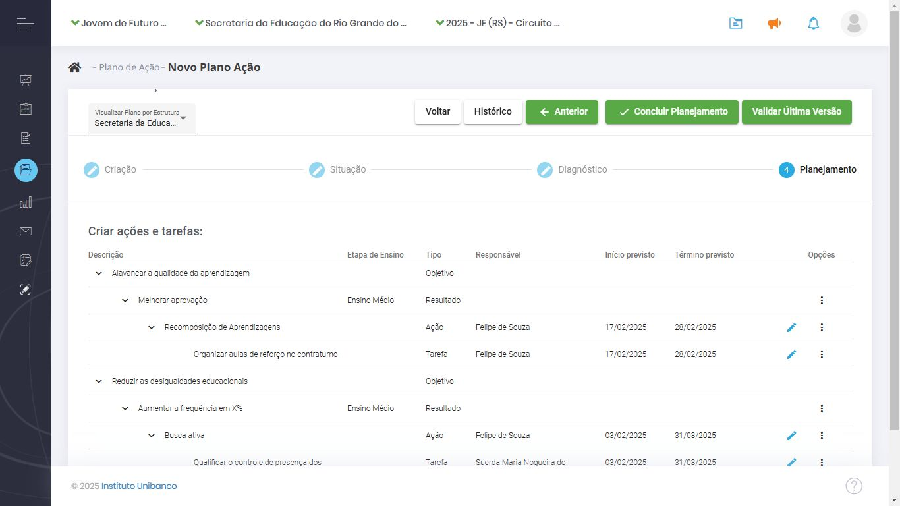

Depois do registro das tarefas, o Plano de Ação fica com o status de “**Elaborado**”. Se não houver alterações, o processo de planejamento está terminado.

35-Plano de Ação elaborado

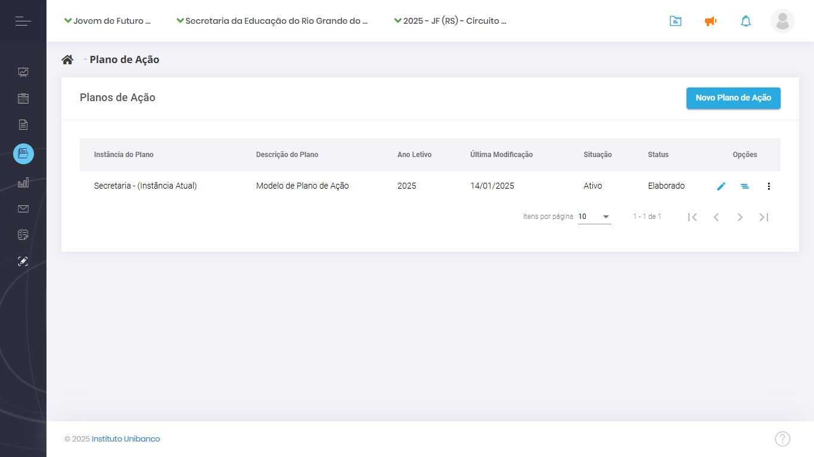

## 4. Como fazer o registro da Execução do Plano de Ação

Para registrar a execução do Plano de Ação da escola, comece fazendo login no sistema. No Painel de Controle, na tela inicial, vá ao menu lateral, clique no item “**Plano de Ação”**. A tela vai exibir os Planos da escola, da CRE e da Secretaria, sendo os das instâncias superiores somente para consulta.

A partir da primeira atualização de execução, o Plano muda do status “Elaborado” para o status “Em execução”. Para atualizar, clique nos três risquinhos, na coluna “**Opções**”, referentes à execução e hierarquia. Nesse momento, o sistema vai carregar todo o seu Plano com os objetivos, os resultados, as ações e as tarefas planejadas.

36-Plano de Ação em execução

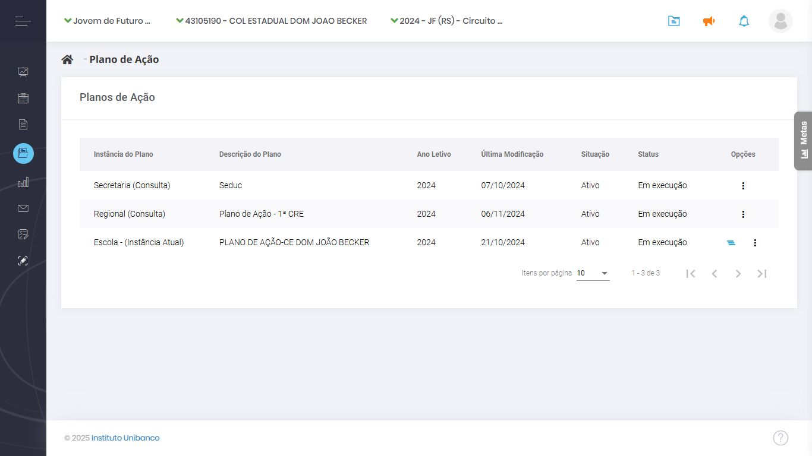

Na coluna de status, a sinaleira indica: vermelho para uma tarefa que já deveria ter começado e ainda não começou, cinza para uma tarefa que ainda vai começar, amarelo para uma tarefa atrasada e verde escuro para uma tarefa concluída ou verde claro para concluída com atraso. Para consultar o significado de cada cor, é só passar o mouse
sobre ela. As ações sempre terão a cor que demonstra a média do status das tarefas à qual elas estão vinculadas.

37-Plano de Ação status

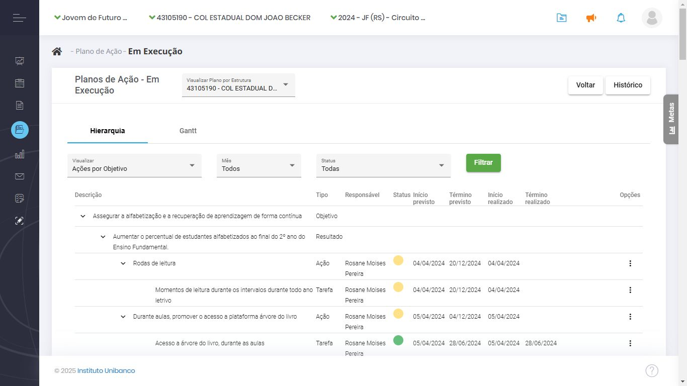

Para atualizar o status de uma tarefa, clique no lápis para exibir seus dados. Um quadro que não está mais disponível para edição vai mostrar o que foi previsto. Outro quadro estará disponível para registrar o que e quando efetivamente foi feito. Clique em “**Salvar**” para alterar o status da ação, veja a mensagem de confirmação do sistema e clique no X para fechar. A coluna de status estará atualizada.

38-Editar tarefa

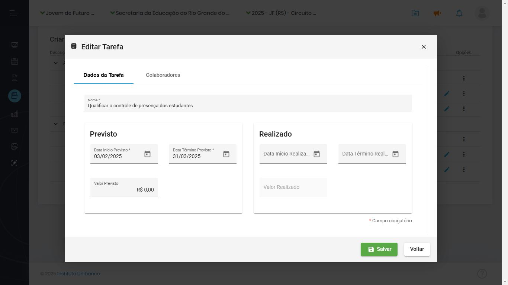

Lembre-se de manter o registro da execução do Plano de Ação sempre atualizado. No momento da avaliação dos resultados, o sistema irá exibir o quanto já foi realizado e se os objetivos estão sendo alcançados. Crie uma rotina de atualização do seu Plano de Ação e o hábito de entrar no sistema esporadicamente para registrar tudo o que foi executado. Assim, você evita correrias na semana da data de corte.

## 5. Painel de Metas

Para acessar o Painel de Metas das escolas ou regionais, comece fazendo login no sistema com os seus dados. Ao carregar a página inicial do Painel de Controle, procure a aba “**Metas**”, do lado direito da página. Clique nela para exibir as informações: o resultado do ano anterior e a meta vigente do Ensino Fundamental \- Anos Finais, assim como o resultado do ano anterior e a meta vigente do Ensino Médio. Se for uma escola exclusiva de Ensino Médio, as informações do Ensino Fundamental não estarão disponíveis.

39-Metas

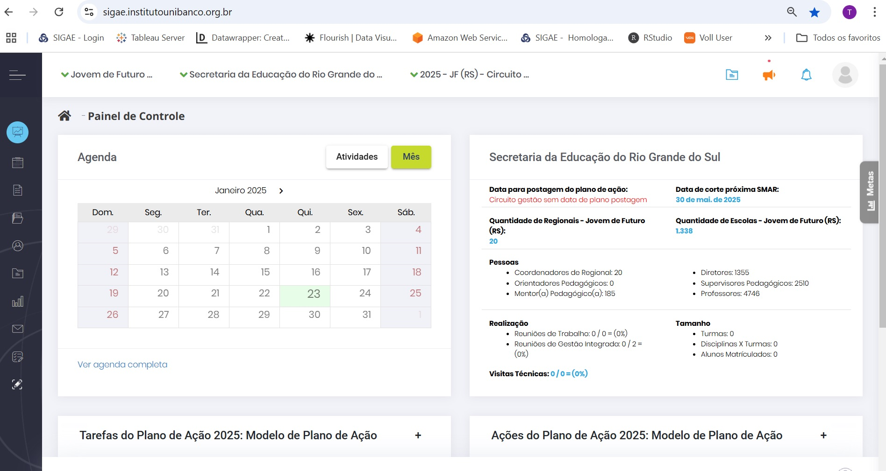

Abaixo, é exibido um gráfico com o histórico da rede, da escola ou da regional. No gráfico, para ter mais detalhes das informações, passe o mouse sobre os pontos e linhas, que uma caixinha com todas as informações será exibida. A aba de “**Metas**” está disponível na lateral de todas as telas do SIGAE.

40-Painel de Metas

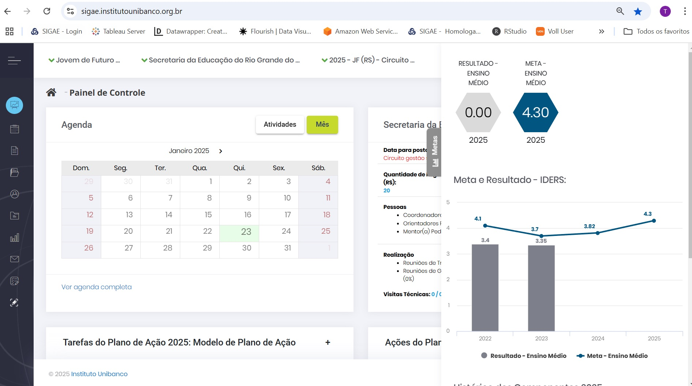

Após a conclusão dos cálculos, as metas ficam disponíveis no sistema ao longo de todo o ano. Não se preocupe: antes de subirem no sistema, a rede promoverá um diálogo sobre elas e o que significam do ponto de vista da melhoria da educação do Rio Grande do Sul.

## 6. Painel de Riscos

Para acessar o Painel de Riscos, vá ao menu lateral, clique em “**Relatórios**”, em seguida, clique em “**Planejamento**” e em “**Painel de Riscos**”.

41-Painel de riscos

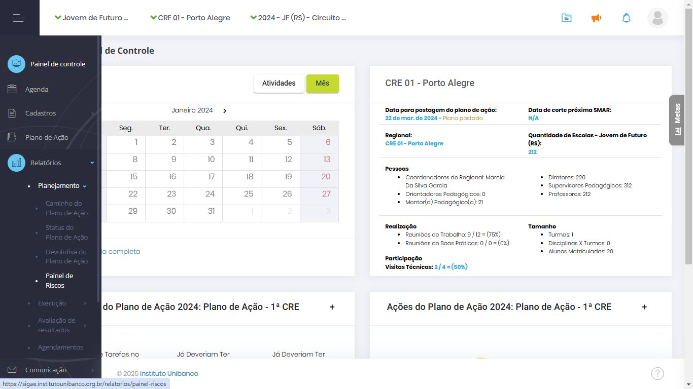

O Painel de Riscos do **ponto de vista da regional** exibe uma tabela com nome dos mentores, código INEP, escolas sob sua jurisdição, etapa de ensino, objetivos estratégicos e problemas apontados pelas escolas no Planejamento que não estão sob a sua governabilidade.

42-Painel de riscos regional

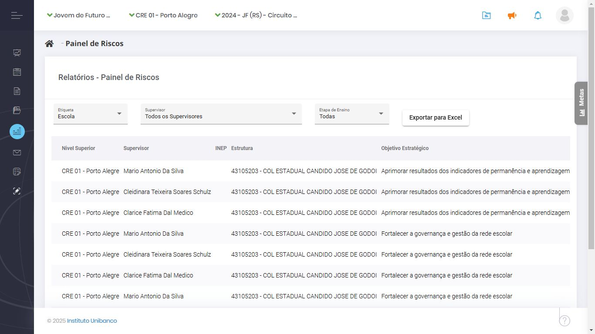

Na **visão da escola**, o Painel de Riscos exibe apenas os riscos que ela apontou.

43-Painel de riscos escola

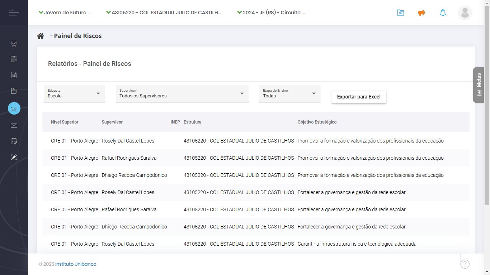

Por sua vez, a **Secretaria tem a visão geral** da rede, inclusive os riscos direcionados a ela pelas regionais.

44-Painel de Riscos Secretaria

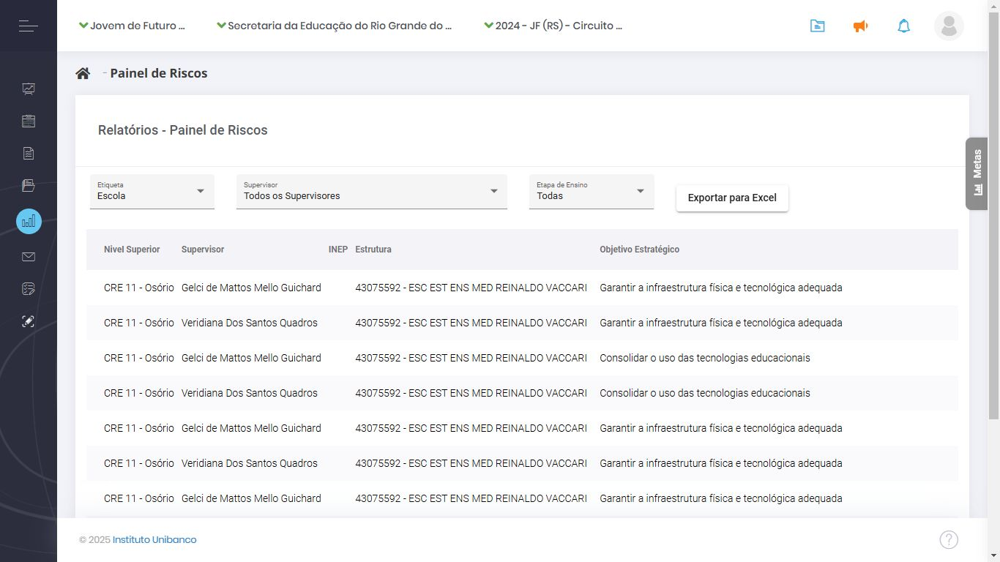

O Painel de Riscos pode ser exportado em Excel para facilitar o trabalho de indexação e de filtragem dos riscos. É muito importante que as equipes das regionais e da Secretaria estejam atentas aos riscos apontados no painel para possibilitar o apoio adequado para as escolas realizarem suas ações.

## 7. Etapa de Avaliação de Resultados

Na etapa de Avaliação de Resultados nas escolas, vamos olhar para os indicadores estruturantes (aulas dadas, frequência e nota dos estudantes) e monitorar como anda a execução do Plano de Ação.

Para acessar o painel da etapa de Avaliação de Resultados, comece fazendo login no sistema com os seus dados. Ao carregar a página inicial do Painel de Controle, vá ao menu lateral, clique em “**Relatórios**”, selecione a etapa “**Avaliação de Resultados**” e clique em “**Gráficos da Avaliação de Resultados**”.

45-Avaliação de resultados

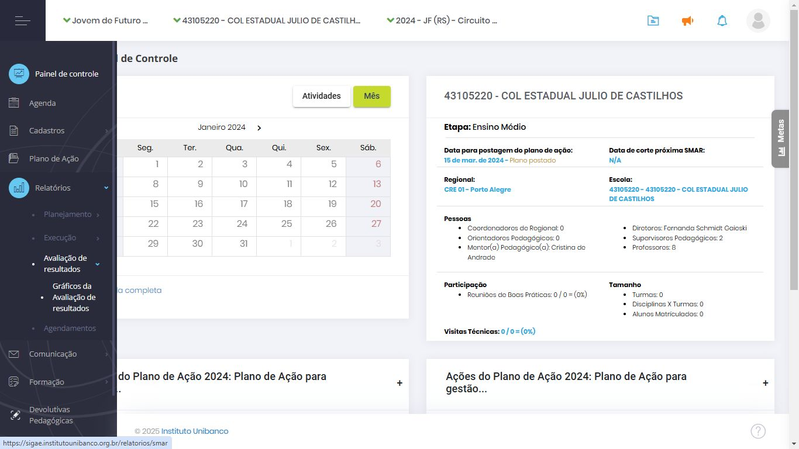

A página carrega com os filtros selecionados para todos, mas é possível filtrar por etapa de ensino (no caso das escolas multiníveis), por turno, por turma e por componente curricular.

No primeiro grupo de gráficos, é exibida a porcentagem de **aulas dadas** por série. No canto superior, há um indicador de aula. Logo abaixo dos gráficos, é possível selecionar para ver o gráfico de uma série específica. Também estão disponíveis os botões de “**Download Gráfico**” e “**Exportar para Excel**”.

46-Download gráfico e Exportar para Excel

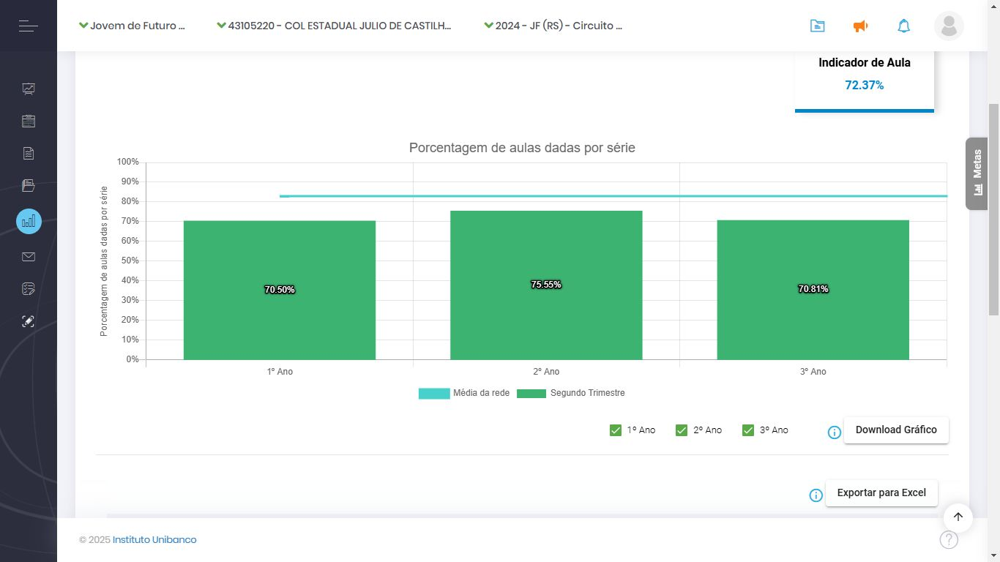

Sob o ponto de vista da Secretaria, também é exibida uma tabela com o percentual de aulas dadas por cada uma das regionais, seguida da média de aulas dadas por toda a rede de ensino.

47-Gráfico aulas dadas Secretaria

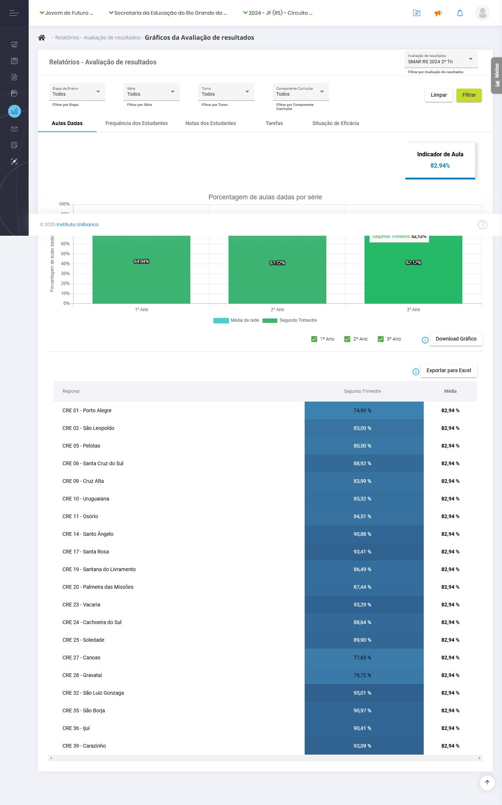

No caso das regionais, a mesma tabela é exibida, porém com o percentual de aulas dadas de suas escolas.

48-Gráfico aulas dadas regional

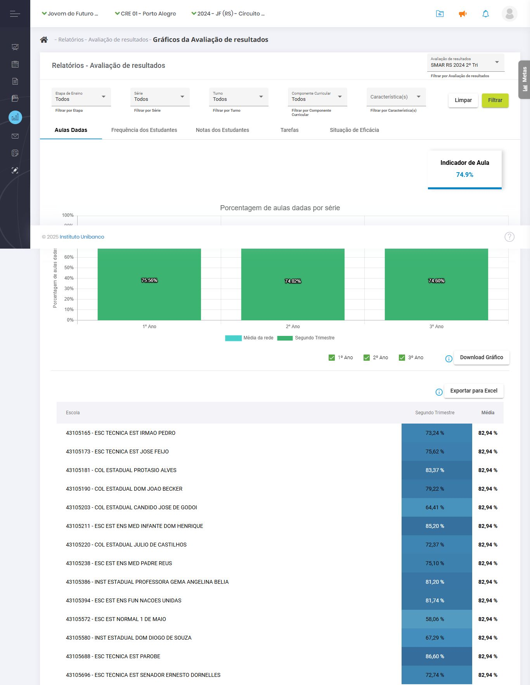

Já sob o ponto de vista da escola é exibida uma tabela com o percentual de aulas dadas segundo o componente curricular.

49-Gráfico aulas dadas

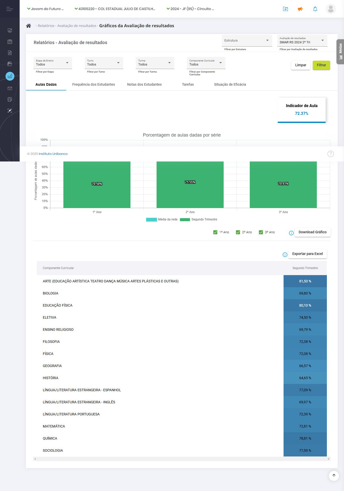

Subindo a página, na aba “**Frequência dos Estudantes**”, é exibido o Indicador de Frequência. A tela vai exibir um grupo de gráficos da frequência dos estudantes por série e por trimestre, com a opção de filtros por etapa de ensino, série, turno e componente curricular. No ponto de vista das escolas, a frequência é apresentada com o recorte de raça e gênero para cada série.

50-Frequência dos estudantes escola

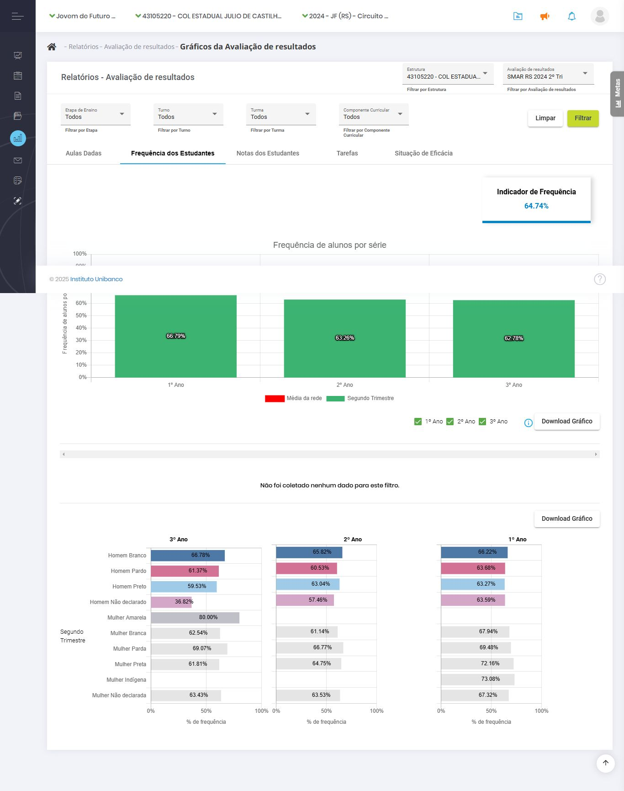

No ponto de vista da Secretaria, é exibida uma tabela com a frequência registrada pelas regionais.

51-Frequência dos estudantes Secretaria

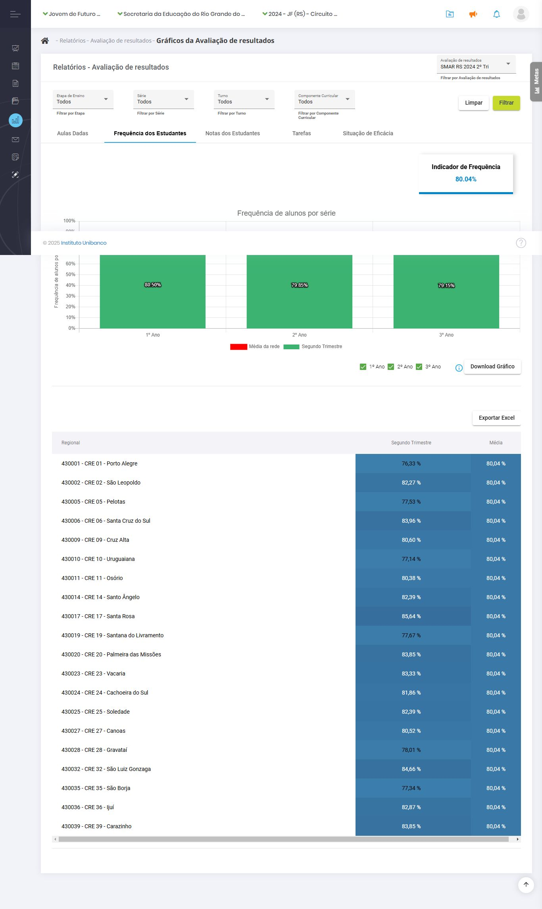

Para as regionais, é exibida a frequência de suas escolas.

52-Frequência dos estudantes regional

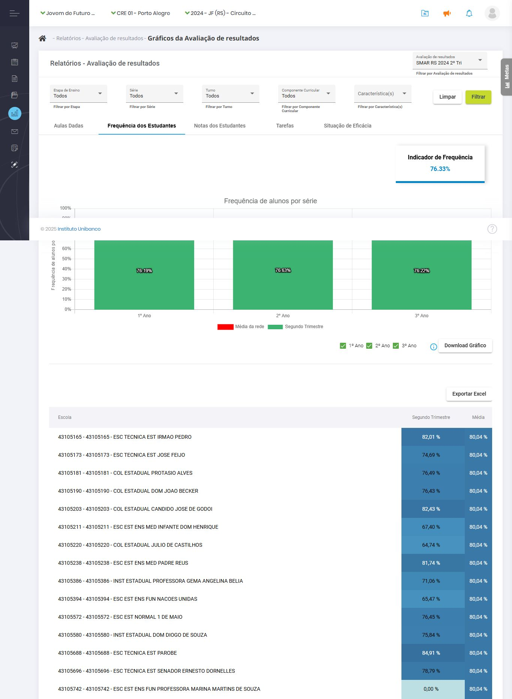

Voltando à parte superior da tela, há a aba “**Notas dos Estudantes**”. Ao clicar, são exibidos os gráficos de nota por série e por trimestre, com as cores explicadas na legenda. No caso das escolas, as informações de notas são apresentadas com o recorte de raça e gênero por componente curricular. Passe o mouse por cima da barra para visualizar o componente curricular do seu interesse. É possível fazer o download do gráfico para outras análises.

53-Gráfico de notas dos estudantes

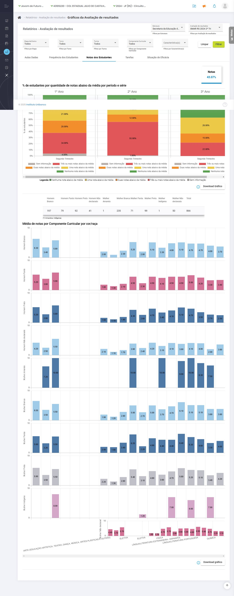

Nos pontos de vista da Secretaria e das regionais, abaixo do gráfico é exibida uma tabela com o percentual de notas das regionais ou escolas de acordo com a sua categoria.

54-Gráfico notas dos estudantes regional

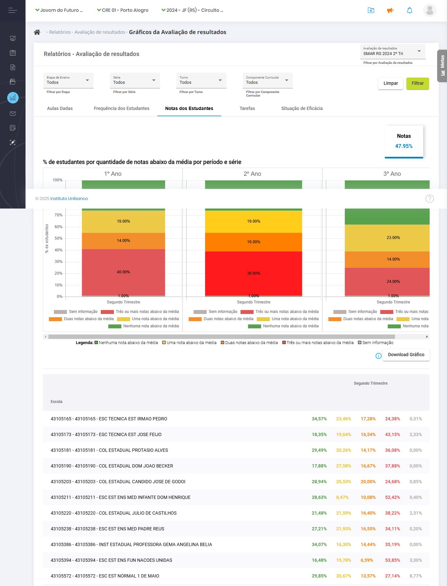

Depois de olhar para os indicadores estruturantes (aulas dadas, frequência e notas dos estudantes), é hora de **monitorar a execução do Plano de Ação** da escola. Para isso, clique na aba “**Tarefas**”, na parte superior da página. No canto superior, está o Indicador de Tarefas, com a média das tarefas cumpridas da escola. O gráfico exibe o total de tarefas para o período, as tarefas que já deveriam ter sido iniciadas e as tarefas que já deveriam estar finalizadas. Na parte superior estão os filtros para selecionar a etapa de ensino e a instância de interesse.

55-Gráfico de tarefas

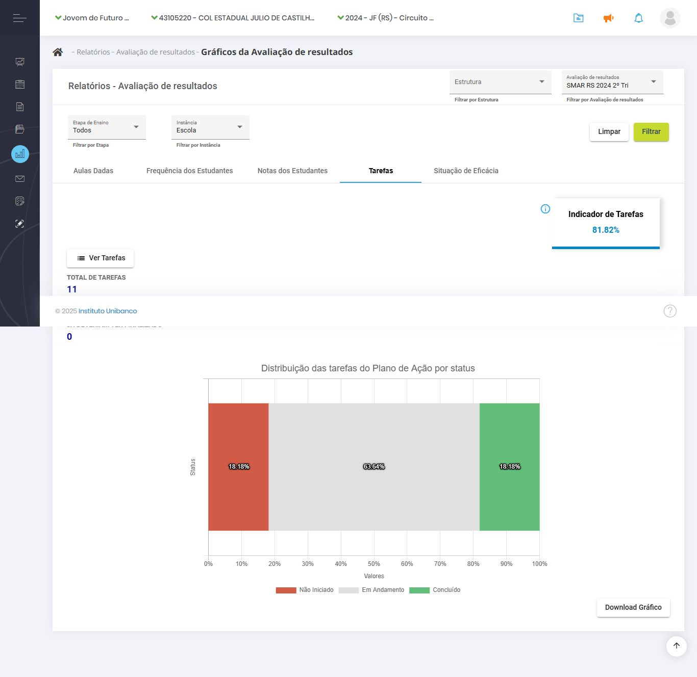

Na sequência, subindo para a parte superior da página, clique na aba “**Entregas da Ação**” para ver o total de ações previstas para o período e quantas já deveriam ter sido finalizadas.

56-Entregas da acao

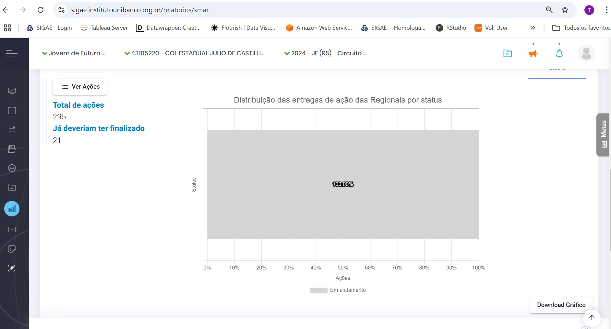

É com base nessas informações que a eficácia do Plano de Ação é avaliada, última aba dos gráficos da avaliação de resultados. O primeiro gráfico traz o cruzamento do percentual de execução (ações e tarefas entregues) e o percentual de resultado (aulas dadas, frequência e notas). Dependendo do ponto em que a regional ou a escola se localizar, ela será categorizada como “**Em Destaque**”, “**Em atenção para a execução**”, “**Em atenção para o resultado**” ou “**Em apoio intensivo**”.

57-Grafico de quadrante secretaria regional

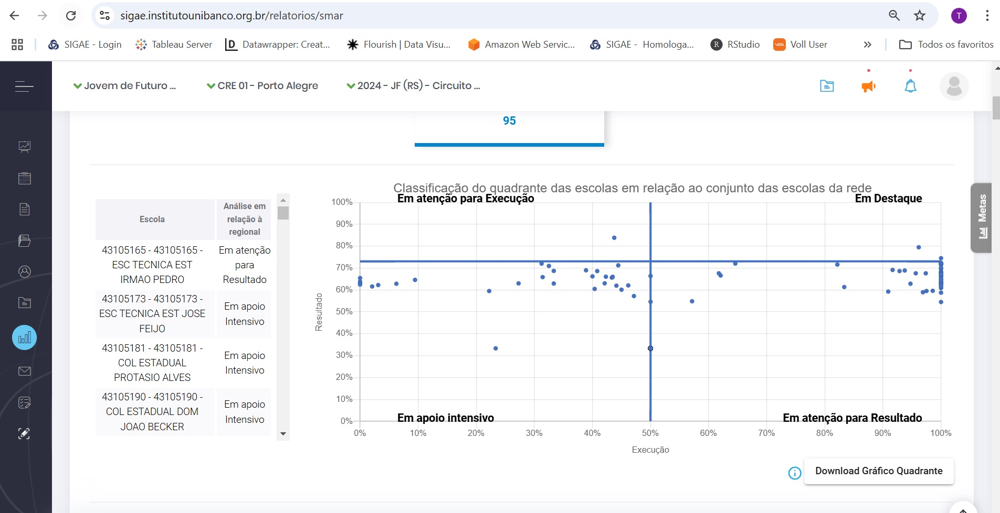

É hora de refletir: a escola está dando conta de realizar as ações planejadas? Se sim elas estão tendo o impacto esperado, aumentando a quantidade de aulas dadas, a frequência e a nota dos estudantes? A partir dessa reflexão e desse diagnóstico, tem início a próxima etapa do Circuito de Gestão (CdG), que é a Correção de Rotas, quando os Planos de Ação são ajustados à luz das evidências.

58-Gráfico de situação de eficácia

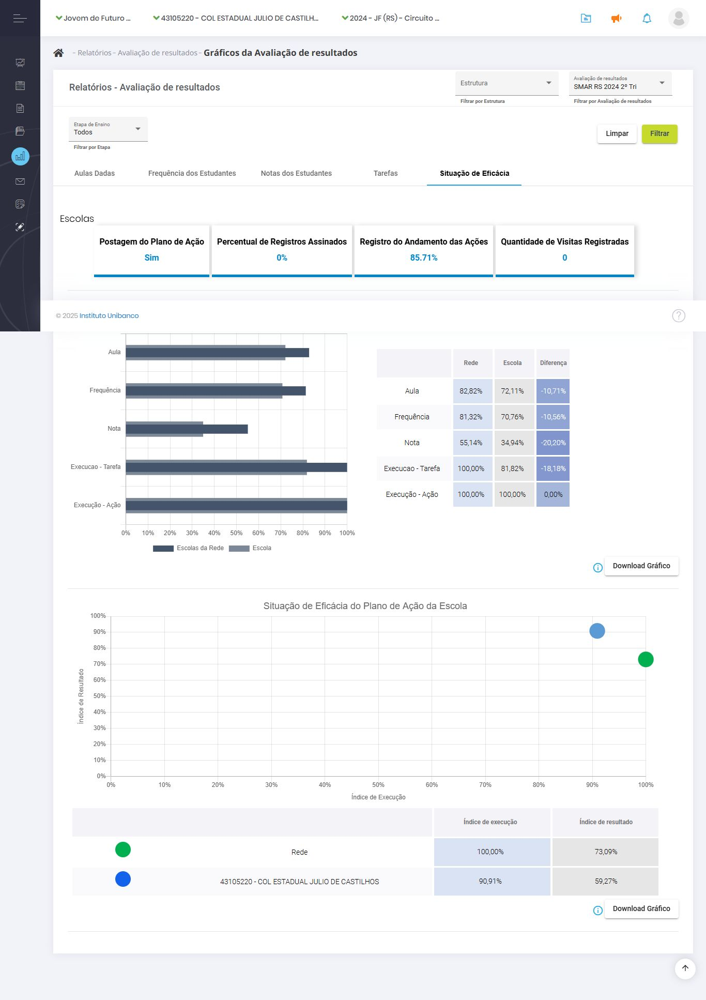
